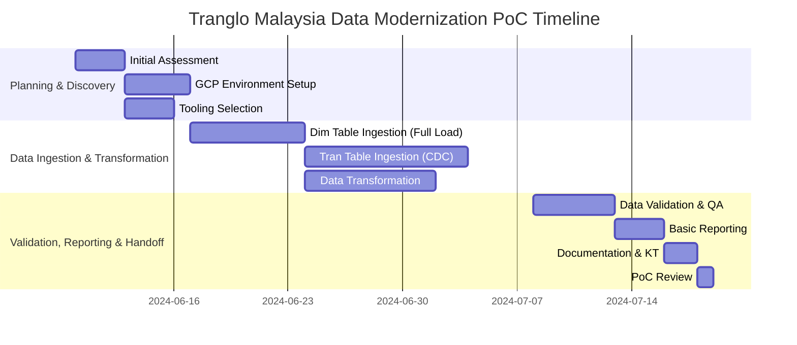

## 4. Scope of Work

This Proof of Concept (PoC) for Tranglo Malaysia's data modernization initiative is designed to be completed within a 1-month timeframe. The scope focuses on demonstrating the feasibility and effectiveness of migrating a subset of the on-premise SQL Server data warehouse to GCP, specifically addressing the unique challenges of dimension and transaction table ingestion.

The PoC will encompass the following key phases and activities:

### Phase 1: Planning and Discovery (Week 1)
*   **Initial Assessment & Requirements Refinement**: Detailed understanding of selected source SQL Server tables (dimensions and transactions), data volumes, and current processes.
*   **GCP Environment Setup**: Provisioning of necessary GCP resources (VPC, Cloud SQL for SQL Server connectivity if needed, Cloud Storage buckets, BigQuery datasets, IAM roles).
*   **Tooling Selection & Configuration**: Finalize specific GCP services and tools for data ingestion (e.g., Data Migration Service, Dataflow, Pub/Sub, Cloud Storage) and orchestration (Cloud Composer/Airflow).

### Phase 2: Data Ingestion and Transformation (Weeks 2-3)
*   **Dimension Table Ingestion Pipeline Development**:
    *   Design and implement a daily full load and truncate/drop mechanism for selected dimension tables from on-prem SQL Server to BigQuery via Cloud Storage.
    *   Develop data validation checks for the full load process.
*   **Transaction Table Ingestion Pipeline Development (CDC Append Mode)**:
    *   Design and implement a Change Data Capture (CDC) pipeline for selected transaction tables. This will likely involve a combination of on-prem CDC tooling (e.g., SQL Server CDC features, Debezium) feeding into a messaging service like Pub/Sub, then to Dataflow for processing and append to BigQuery.
    *   Ensure data consistency and exactly-once processing where required.
*   **Data Transformation**:
    *   Develop basic transformations in BigQuery to prepare ingested data for consumption (e.g., schema adjustments, basic aggregations).
    *   Utilize Dataform for version-controlled and orchestrated SQL transformations.

### Phase 3: Validation, Reporting & Handoff (Week 4)
*   **Data Validation and Quality Assurance**: Comprehensive testing of ingested data against source to ensure accuracy, completeness, and freshness.
*   **Basic Reporting & Analytics**: Create sample dashboards or reports using BigQuery data in a tool like Looker Studio (formerly Google Data Studio) to demonstrate data accessibility and utility.
*   **Documentation & Knowledge Transfer**: Provide documentation of the implemented pipelines, architecture, and operational procedures. Conduct a knowledge transfer session with Tranglo Malaysia's team.
*   **PoC Review & Next Steps**: Present PoC findings, discuss scalability, performance, cost implications, and outline recommendations for a full-scale implementation.

### Gantt Chart

