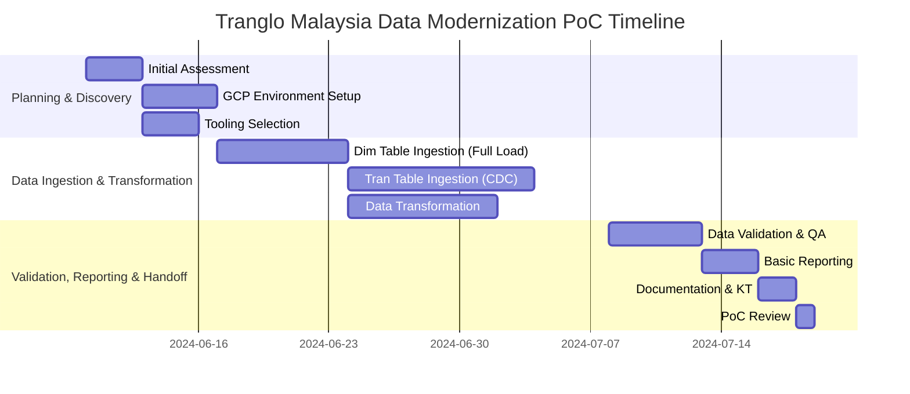

# Executive Summary: Data Modernization Proof of Concept for Tranglo Malaysia

This Executive Summary outlines a critical Proof of Concept (PoC) for Tranglo Malaysia, focused on modernizing its data infrastructure by migrating from an on-premise SQL Server environment to a robust, scalable, and intelligent Google Cloud Platform (GCP) ecosystem. This strategic initiative is designed to be completed within a focused one-month timeframe, demonstrating the tangible benefits and feasibility of a full-scale data transformation.

Tranglo Malaysia currently faces significant data management challenges that impede agile analytics and real-time decision-making. Specifically, the PoC will address two key technical hurdles: the efficient ingestion and processing of dimension tables that lack explicit timestamps, necessitating daily full loads for accurate data reflection, and the seamless integration of high-volume transaction tables utilizing a Change Data Capture (CDC) append mode. These challenges are representative of the complexities involved in transitioning legacy data systems to a modern cloud paradigm.

The successful execution of this PoC is paramount for Tranglo Malaysia's long-term strategic objectives. By leveraging GCP's advanced data capabilities, including BigQuery for scalable warehousing, Dataform for data transformation, Dataproc for big data processing, and Pub/Sub for real-time data ingestion, this modernization effort will unlock enhanced data accessibility, improve data quality, and significantly reduce operational overheads. It will enable Tranglo to move beyond traditional batch processing limitations, fostering a data-driven culture that can react swiftly to market changes, optimize operational efficiency, and drive informed business growth. This PoC will not only validate the technical architecture and processes but also lay the foundational groundwork for a future-proof data platform that supports advanced analytics, machine learning initiatives, and greater business intelligence, positioning Tranglo Malaysia at the forefront of financial technology innovation.

---

## Business Requirements

This document outlines the critical business requirements for Tranglo Malaysia's Data Modernization Proof of Concept (PoC). The primary objective of this PoC is to demonstrate the feasibility and value of migrating and transforming key data assets onto a scalable, efficient, and robust data warehouse solution within Google Cloud Platform (GCP). The current data infrastructure faces significant challenges in handling increasing data volumes, ensuring data freshness, and providing timely insights, particularly concerning the management of dimension and transaction tables.

Tranglo Malaysia currently grapples with data management inefficiencies that impede agile decision-making and operational effectiveness. A key challenge lies in the handling of dimension tables, which currently necessitate full daily reloads. This approach is resource-intensive, time-consuming, and increases the risk of data inconsistencies or delays in data availability. As data volumes grow, this full-load strategy becomes unsustainable, impacting the performance of downstream analytics and reporting. Concurrently, the management of transaction tables presents its own set of complexities. The existing methods for ingesting transactional data often lack the efficiency and real-time capabilities required for modern financial services, leading to delays in financial reporting, fraud detection, and customer insights. The absence of a robust Change Data Capture (CDC) append mode for these high-volume tables means that updates and new records are not integrated efficiently, creating a gap between operational systems and analytical platforms.

The proposed PoC aims to directly address these challenges by establishing a modernized data platform on GCP. This initiative will specifically focus on demonstrating a highly scalable and efficient data warehouse architecture capable of managing diverse data types with varying ingestion patterns. For dimension tables, the PoC will showcase an optimized approach that moves beyond full daily reloads, exploring strategies for incremental updates or Type 2 Slowly Changing Dimensions (SCD) where applicable, leveraging GCP services to manage these updates effectively and ensure data accuracy while minimizing processing overhead. For transaction tables, the PoC will implement a robust CDC append mode, utilizing GCP’s streaming and batch processing capabilities to ingest and integrate transactional data efficiently and near real-time into the data warehouse, ensuring data freshness and supporting immediate analytical needs.

Key business requirements for this PoC include:

*   **Scalability**: The new data platform must seamlessly scale to accommodate Tranglo Malaysia's growing data volumes, projected to reach several terabytes, without compromising performance or increasing operational overhead. This is crucial for both historical data retention and future growth.
*   **Efficiency in Data Ingestion**:
    *   **Dimension Tables**: Demonstrate an efficient mechanism for handling dimension table updates that significantly reduces the processing time and resource consumption compared to current full daily loads. This includes validating strategies for incremental updates while maintaining historical context.
    *   **Transaction Tables**: Establish a reliable and performant CDC append mode for high-volume transaction tables, ensuring that new and changed data records are captured and ingested into the data warehouse with minimal latency, supporting near real-time analytics.
*   **Data Freshness**: Ensure that analytical data, especially from transaction tables, is sufficiently fresh to support timely business decisions and operational monitoring.
*   **Data Accuracy & Consistency**: The data ingested and transformed within the GCP data warehouse must maintain high levels of accuracy and consistency, providing a single source of truth for business intelligence.
*   **Performance for Analytics**: The data warehouse must provide high-performance query capabilities to support various analytical workloads, including complex reporting, ad-hoc analysis, and potential machine learning initiatives.
*   **Cost Optimization**: The solution architecture should be designed with cost-efficiency in mind, leveraging GCP’s serverless and managed services to optimize infrastructure and operational expenses.

This one-month PoC will specifically demonstrate the implementation of these capabilities using Google Cloud products such as BigQuery for the core data warehouse, Dataform for data transformation and orchestration, Cloud Storage for landing and staging data, and Pub/Sub for messaging to facilitate CDC pipelines. The PoC will focus on a selected subset of dimension and transaction tables to prove the concept of efficient ingestion, transformation, and storage, thereby validating the architectural approach for a full-scale data modernization effort. Upon successful completion, Tranglo Malaysia will have a clear blueprint and validated architecture for a data platform that supports its strategic business objectives for enhanced data-driven decision-making.

---

## High-Level Architecture for Data Modernization PoC

The proposed architecture outlines a robust, scalable, and secure data modernization platform on Google Cloud Platform (GCP) for Tranglo Malaysia. This high-level design focuses on ingesting diverse data types from on-premise SQL Server databases, transforming them, and making them available for advanced analytics and business intelligence. The architecture is built with a strong emphasis on automation, governance, and future scalability, leveraging key GCP services to ensure an efficient and reliable data pipeline.

### Data Ingestion Layer

The initial phase involves establishing secure and efficient data ingestion from on-premise SQL Server. For **dimension tables**, which typically undergo daily full loads, a batch-oriented approach will be employed. Data will be extracted from the SQL Server, potentially using existing ETL tools or custom scripts, and landed securely into **Cloud Storage**. From Cloud Storage, **Dataflow** (or **Data Fusion** for a more visual, managed ETL experience) will be utilized to process these batch loads, performing initial cleansing and schema enforcement before ingesting them into a raw layer within **BigQuery**.

For **transaction tables**, which require near real-time updates and are sensitive to data freshness, a Change Data Capture (CDC) strategy will be implemented. An on-premise CDC mechanism (e.g., Debezium, a commercial CDC solution, or SQL Server’s native CDC capabilities) will capture data changes (inserts, updates, deletes). These events will be published to **Pub/Sub**, acting as a highly scalable message queuing service. A streaming **Dataflow** pipeline will subscribe to these Pub/Sub topics, process the incoming events in an append-only mode, and land them into a raw transaction table in **BigQuery**. This ensures that transactional data is available for analysis with minimal latency, supporting operational reporting and timely insights. Cloud Storage will also serve as a durable landing zone for raw CDC streams before processing by Dataflow, offering cost-effective storage and disaster recovery capabilities.

### Data Processing and Storage Layer

Once raw data resides in BigQuery and Cloud Storage, the next step involves transformation and curation. **BigQuery** serves as the central analytical data warehouse, designed for petabyte-scale data analysis with unparalleled speed and efficiency. Raw data, whether from batch or streaming ingestion, will first land in dedicated raw datasets within BigQuery.

Data transformation pipelines will be orchestrated using **Cloud Composer** (managed Apache Airflow) to define, schedule, and monitor complex workflows. These workflows will trigger **Dataform** jobs, allowing for SQL-based data transformation directly within BigQuery. Dataform promotes software engineering best practices for data teams, enabling version control, testing, and documentation of data transformations. This ensures data quality, consistency, and traceability as data is refined from raw to curated layers within BigQuery. Datasets will be structured into raw, staging, and curated layers, with the curated layer optimized for business intelligence and advanced analytics. For extremely large-scale, complex transformations or machine learning feature engineering that might require custom code execution beyond SQL, **Dataproc** clusters can be spun up on demand to process data stored in Cloud Storage or BigQuery.

### Analytics and Visualization Layer

The curated data in BigQuery becomes the single source of truth for analytics. **BigQuery ML (BQML)** will be leveraged to build and deploy machine learning models directly within BigQuery using standard SQL queries, enabling predictive analytics without moving data to separate ML platforms. This simplifies the ML workflow and accelerates time-to-insight for use cases like fraud detection, customer churn prediction, or demand forecasting.

For business intelligence and data visualization, **Looker** will connect directly to BigQuery. Looker provides a modern, intuitive platform for exploring data, creating interactive dashboards, and delivering actionable insights to business users. Its semantic modeling layer (LookML) ensures consistent metrics and definitions across the organization, fostering data literacy and self-service analytics.

### Architecture Diagram

```mermaid
graph LR
    subgraph On-Premise
        A[SQL Server Databases]
        B_cdc(CDC Mechanism)
    end

    subgraph Secure Connectivity
        C(Cloud VPN / Interconnect)
    end

    subgraph Ingestion & Landing
        D[Cloud Storage (Raw Landing)]
        E[Pub/Sub]
        F[BigQuery (Raw Layer)]
        G[Dataflow (Streaming)]
        H[Cloud Storage (Raw CDC Streams)]
    end

    subgraph Transformation & Orchestration
        I[Dataform]
        J[BigQuery (Curated Layer)]
        K[Cloud Composer (Orchestration)]
        L[Dataproc (Optional)]
    end

    subgraph Analytics & Visualization
        M[BQML]
        N[Looker Dashboards]
    end

    %% Connections
    A -- Daily Full Load (Dimension Tables) --> C
    A -- Transactional Data (CDC) --> B_cdc
    B_cdc -- Real-time Events --> E

    C -- Batch Extract --> D
    D -- Dataflow (Batch) / Data Fusion --> F

    E -- Streaming --> G
    G -- Append Mode --> H
    H -- Real-time Ingestion --> F

    F -- Data Transformation (SQL) --> I
    I -- Curated Datasets --> J

    K -- Triggers --> I
    K -- Manages --> G
    K -- Manages --> D

    J -- ML Models --> M
    J -- Business Intelligence --> N
    L -- Advanced Analytics --> N
    M -- Insights --> N
    J -- Complex Processing / Feature Engineering --> L

    style A fill:#f9f,stroke:#333,stroke-width:2px
    style B fill:#f9f,stroke:#333,stroke-width:2px
    style C fill:#ccf,stroke:#333,stroke-width:2px
    style D fill:#bbf,stroke:#333,stroke-width:2px
    style E fill:#fcf,stroke:#333,stroke-width:2px
    style F fill:#88f,stroke:#333,stroke-width:2px
    style G fill:#fcf,stroke:#333,stroke-width:2px
    style H fill:#bbf,stroke:#333,stroke-width:2px
    style I fill:#cdf,stroke:#333,stroke-width:2px
    style J fill:#88f,stroke:#333,stroke-width:2px
    style K fill:#ccf,stroke:#333,stroke-width:2px
    style L fill:#fcf,stroke:#333,stroke-width:2px
    style M fill:#fcf,stroke:#333,stroke-width:2px
    style N fill:#afa,stroke:#333,stroke-width:2px
```

---

## 4. Scope of Work

This Proof of Concept (PoC) for Tranglo Malaysia's data modernization initiative is designed to be completed within a 1-month timeframe. The scope focuses on demonstrating the feasibility and effectiveness of migrating a subset of the on-premise SQL Server data warehouse to GCP, specifically addressing the unique challenges of dimension and transaction table ingestion.

The PoC will encompass the following key phases and activities:

### Phase 1: Planning and Discovery (Week 1)
*   **Initial Assessment & Requirements Refinement**: Detailed understanding of selected source SQL Server tables (dimensions and transactions), data volumes, and current processes.
*   **GCP Environment Setup**: Provisioning of necessary GCP resources (VPC, Cloud SQL for SQL Server connectivity if needed, Cloud Storage buckets, BigQuery datasets, IAM roles).
*   **Tooling Selection & Configuration**: Finalize specific GCP services and tools for data ingestion (e.g., Data Migration Service, Dataflow, Pub/Sub, Cloud Storage) and orchestration (Cloud Composer/Airflow).

### Phase 2: Data Ingestion and Transformation (Weeks 2-3)
*   **Dimension Table Ingestion Pipeline Development**:
    *   Design and implement a daily full load and truncate/drop mechanism for selected dimension tables from on-prem SQL Server to BigQuery via Cloud Storage.
    *   Develop data validation checks for the full load process.
*   **Transaction Table Ingestion Pipeline Development (CDC Append Mode)**:
    *   Design and implement a Change Data Capture (CDC) pipeline for selected transaction tables. This will likely involve a combination of on-prem CDC tooling (e.g., SQL Server CDC features, Debezium) feeding into a messaging service like Pub/Sub, then to Dataflow for processing and append to BigQuery.
    *   Ensure data consistency and exactly-once processing where required.
*   **Data Transformation**:
    *   Develop basic transformations in BigQuery to prepare ingested data for consumption (e.g., schema adjustments, basic aggregations).
    *   Utilize Dataform for version-controlled and orchestrated SQL transformations.

### Phase 3: Validation, Reporting & Handoff (Week 4)
*   **Data Validation and Quality Assurance**: Comprehensive testing of ingested data against source to ensure accuracy, completeness, and freshness.
*   **Basic Reporting & Analytics**: Create sample dashboards or reports using BigQuery data in a tool like Looker Studio (formerly Google Data Studio) to demonstrate data accessibility and utility.
*   **Documentation & Knowledge Transfer**: Provide documentation of the implemented pipelines, architecture, and operational procedures. Conduct a knowledge transfer session with Tranglo Malaysia's team.
*   **PoC Review & Next Steps**: Present PoC findings, discuss scalability, performance, cost implications, and outline recommendations for a full-scale implementation.

### Gantt Chart



---

## 5. Assumptions

The successful execution and outcome of this 1-month Data Modernization Proof of Concept (PoC) for Tranglo Malaysia are predicated on the following key assumptions:

*   **Client Data Access**:
    *   Unrestricted and timely access to the on-premise SQL Server data warehouse, including necessary database credentials, schema information, and sample data for selected tables.
    *   Client will provide network connectivity (e.g., VPN tunnel, Cloud Interconnect) between their on-premise environment and GCP for secure data transfer.
*   **GCP Resources and Credentials**:
    *   Tranglo Malaysia will provide the necessary GCP project with appropriate billing setup and IAM permissions for CloudMile to provision and manage required GCP services (e.g., BigQuery, Cloud Storage, Dataflow, Pub/Sub, Cloud Composer).
    *   All required GCP APIs will be enabled within the designated project.
*   **Client Personnel Availability**:
    *   Key Tranglo Malaysia stakeholders, including data architects, database administrators, and business users, will be available for regular meetings, data validation, feedback, and knowledge transfer sessions as per the PoC timeline.
    *   Prompt responses to queries and requests for information will be provided by the client team to avoid delays.
*   **Scope of Data for PoC**:
    *   The PoC will focus on a clearly defined, limited set of dimension and transaction tables. The specific tables will be jointly agreed upon during the planning phase.
    *   The chosen tables are representative of the larger data estate and present the technical challenges (e.g., lack of timestamps for dimensions, high volume for transactions) that the PoC aims to address.
*   **Data Characteristics**:
    *   The data quality of the source SQL Server tables is assumed to be sufficient for the PoC; extensive data cleansing is out of scope for this PoC.
    *   Schema stability for the selected source tables during the PoC duration. Any changes would require re-evaluation and may impact the PoC timeline.
*   **Data Ingestion Approaches**:
    *   The daily full load approach for dimension tables (due to the absence of `timestamp` or `createdAt` columns) is an acceptable and agreed-upon strategy for the PoC.
    *   The Change Data Capture (CDC) append mode for transaction tables is technically feasible and supported by the existing on-prem SQL Server environment (e.g., SQL Server CDC features enabled) or a mutually agreed-upon third-party tool.
*   **Tooling and Technology**:
    *   The PoC will primarily utilize CloudMile's recommended GCP services and best practices. Any deviation requested by the client may impact the scope and timeline.
*   **Review and Approval**:
    *   Timely review and approval of deliverables (e.g., architecture design, pipeline implementations, validation reports) by Tranglo Malaysia stakeholders.

---

## 6. Success Criteria

The success of this 1-month Data Modernization Proof of Concept (PoC) for Tranglo Malaysia will be measured against the following criteria, ensuring that the proposed solution effectively addresses the stated business requirements and technical challenges:

*   **Successful Data Migration and Ingestion**:
    *   **Dimension Tables**:
        *   At least [X number, e.g., 3-5] agreed-upon dimension tables are successfully migrated from on-prem SQL Server to BigQuery using the daily full load and truncate/drop mechanism.
        *   The daily load process completes within [Y hours, e.g., 2-4 hours] during the designated batch window.
        *   Data integrity checks confirm 100% row count and data value matching between source and target for the migrated dimension tables.
    *   **Transaction Tables**:
        *   At least [A number, e.g., 1-2] agreed-upon high-volume transaction tables are successfully ingested into BigQuery using the CDC append mode.
        *   Near real-time data latency for transaction tables (e.g., data available in BigQuery within [B minutes, e.g., 5-10 minutes] of being committed in the source SQL Server).
        *   Data integrity checks confirm all changes (inserts, updates, deletes as appropriate for append mode) are accurately reflected in BigQuery.
*   **Data Accuracy and Completeness**:
    *   Validation of transformed data in BigQuery against source data and business rules, achieving a data accuracy rate of [e.g., >99.5%].
    *   No significant data loss or corruption observed during the ingestion and transformation processes for the selected PoC tables.
*   **Demonstrated GCP Architecture Viability**:
    *   The proposed GCP architecture (including BigQuery as DWH, Cloud Storage for landing, and Dataflow/Data Fusion for processing) is proven to be stable and operational throughout the PoC duration.
    *   Scalability of the architecture is implicitly demonstrated by handling the selected data volumes and meeting performance targets.
*   **Performance for Analytical Workloads**:
    *   Execution of predefined analytical queries on the migrated data in BigQuery completes within acceptable performance thresholds (e.g., [C seconds, e.g., <10 seconds] for complex queries on PoC data).
    *   Basic reporting tools (e.g., Looker Studio) are successfully connected to BigQuery and can visualize the migrated data.
*   **Operational Efficiency**:
    *   The implemented data pipelines demonstrate automation and operational stability, requiring minimal manual intervention.
    *   Monitoring and logging are successfully configured to provide visibility into pipeline health and data flow.
*   **Knowledge Transfer and Documentation**:
    *   Comprehensive documentation of the PoC architecture, data pipelines, and operational procedures is provided.
    *   Successful knowledge transfer session conducted with Tranglo Malaysia’s technical team, enabling them to understand and potentially manage the implemented components.

Achieving these criteria will confirm the technical and operational viability of a GCP-based data modernization strategy for Tranglo Malaysia, providing a solid foundation for a full-scale implementation.

---

## 7. Commercials

This section outlines the estimated commercial aspects for the 1-month Data Modernization Proof of Concept (PoC) for Tranglo Malaysia. This is a high-level estimate, and final costs will be subject to a detailed statement of work (SOW) based on refined scope and client-specific requirements.

### CloudMile Service Fees

CloudMile's professional services for the 1-month PoC are estimated based on the dedicated effort required for planning, architecture design, implementation, testing, knowledge transfer, and project management.

*   **Consulting & Architecture Design**: Covers initial assessment, solution design, and architectural guidance.
*   **Implementation & Development**: Covers pipeline development for data ingestion (both full load for dimensions and CDC for transactions), transformation, and basic reporting setup.
*   **Testing & Validation**: Covers data quality checks, performance testing, and bug fixing within the PoC scope.
*   **Project Management & Knowledge Transfer**: Covers overall PoC coordination, client communication, documentation, and training.

**Estimated CloudMile Service Fees for PoC**: [e.g., RM 50,000 - RM 80,000]

### Estimated GCP Infrastructure Costs

The GCP infrastructure costs during the 1-month PoC are estimates and will vary based on actual usage, data volumes processed, and specific service configurations. CloudMile will assist in optimizing these costs throughout the PoC.

*   **BigQuery**: Storage for migrated data, query processing (on-demand or flat-rate, PoC likely on-demand). Costs depend on data stored and queries executed.
*   **Cloud Storage**: Landing zone for data ingestion, staging area. Costs depend on data stored and network egress.
*   **Dataflow / Data Fusion**: For ETL/ELT pipelines, especially for CDC and complex transformations. Costs are based on processing time and resource usage (CPU, memory).
*   **Cloud Composer**: For orchestration of data pipelines (if used). Costs based on environment size and uptime.
*   **Networking**: Data transfer costs between on-prem and GCP, and within GCP services.
*   **Other Services**: Minor costs for logging, monitoring, and potentially Cloud SQL if used for specific connectors.

**Estimated GCP Infrastructure Costs for PoC**: [e.g., RM 5,000 - RM 15,000]

*Note: These GCP costs are estimates. Actual costs depend heavily on the selected data subsets, processing frequency, and resource configurations. CloudMile will work with Tranglo Malaysia to monitor and manage these costs.*

### Total Estimated PoC Cost

**Total Estimated PoC Cost (CloudMile Services + GCP Infrastructure)**: [e.g., RM 55,000 - RM 95,000]

### Commercial Terms

*   **Payment Schedule**: To be mutually agreed upon, typically involving an upfront payment and a final payment upon PoC completion and sign-off.
*   **Invoicing**: CloudMile will invoice Tranglo Malaysia directly for its services. GCP costs will be billed directly by Google Cloud to Tranglo Malaysia's linked billing account.
*   **Out of Scope**: Costs for any additional software licenses not explicitly mentioned, extensive data cleansing activities, and full-scale migration beyond the PoC scope are not included in this estimate.
*   **Validity**: This commercial estimate is valid for [e.g., 30 days] from the date of issuance.

This PoC represents an investment to de-risk a larger data modernization initiative, providing a clear path and validated architecture for future phases.

---
