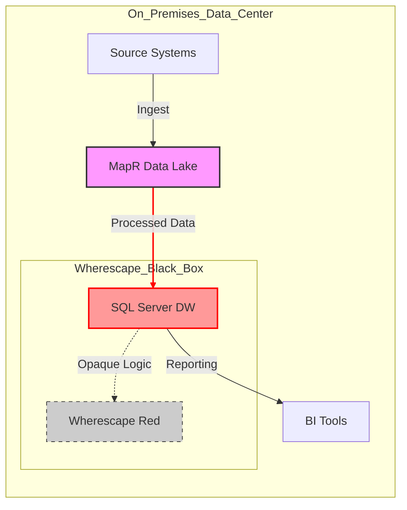

## 2. Business Requirements & Current State Analysis

### 2.1 Executive Summary of Business Context
The client is currently operating a mission-critical data analytics platform that serves key regulatory and business reporting functions. As the volume of data grows and regulatory landscapes evolve, the existing on-premises and legacy infrastructure is facing significant scalability, maintainability, and compliance challenges. The primary objective of this engagement is to modernize the data estate by migrating from a legacy MapR ecosystem and an opaque SQL Server/Wherescape environment to a cloud-native solution on Google Cloud Platform (GCP). This modernization is not merely a "lift-and-shift" but a strategic transformation to unlock agility, reduce technical debt, and ensure strict adherence to financial services regulations.

### 2.2 Current State Analysis ('As-Is' Landscape)

The existing data architecture is characterized by a high-complexity, high-latency environment that is increasingly difficult to support. The "As-Is" landscape is defined by the following core components and constraints:

*   **Legacy Data Lake (MapR):** The foundation of the current data lake is built on MapR, hosting a substantial data volume of approximately **150TB**. This system serves as the initial landing zone and processing layer for raw data ingestion. However, as a legacy Hadoop-based ecosystem, it lacks the elasticity of modern cloud object storage (like Cloud Storage) and requires significant administrative overhead to manage compute and storage scaling independently.
*   **The 'Black Box' Transformation Layer (SQL Server & Wherescape):** A critical bottleneck in the current architecture is the data warehousing layer, running on Microsoft SQL Server and managed via Wherescape. This component has effectively become a "Black Box." Over years of operation, the automated code generation and stored procedure logic managed by Wherescape have become opaque, making it extremely difficult for internal IT teams to debug, optimize, or extend data pipelines. The lack of visibility into transformation logic poses a severe risk to business continuity and agility.
*   **Performance Bottlenecks:** The tight coupling of compute and storage in the current on-premises setup has led to severe performance degradation. The end-to-end batch processing window currently extends to **14 hours**. This excessive duration threatens Service Level Agreements (SLAs) for daily reporting, leaving little buffer for re-runs in the event of job failures and delaying time-to-insight for business stakeholders.

#### Current State Architecture Diagram

### 2.3 Regulatory & Compliance Requirements

As a financial institution operating within Malaysia and utilizing infrastructure in Singapore, strict adherence to regulatory standards is non-negotiable. The proposed Google Cloud solution is designed to meet the following specific regulatory mandates:

*   **Bank Negara Malaysia (BNM) RMiT Compliance:** The architecture must strictly adhere to the *Risk Management in Technology (RMiT)* guidelines issued by Bank Negara Malaysia. This includes requirements for high availability, disaster recovery, and robust access controls. CloudMile will configure the landing zone to meet these stringent operational resilience standards.
*   **Data Sovereignty & Region Strategy:**
    *   **Phase 1 (Singapore Region):** Due to current infrastructure readiness and latency considerations, the initial deployment will reside in the **Google Cloud Singapore (asia-southeast1)** region. This region offers the full maturity of GCP services required for the migration.
    *   **Future Repatriation to Malaysia:** The architecture must be "repatriation-ready." With the upcoming launch of the Google Cloud region in Malaysia, the solution is designed to facilitate a seamless future migration of data and workloads back to Malaysia to satisfy data localization preferences.
*   **Security & Encryption (CMEK):** To ensure the client retains full control over data access, all data at rest—within Cloud Storage, BigQuery, and persistent disks attached to Dataproc—must be encrypted using **Customer-Managed Encryption Keys (CMEK)** via Cloud Key Management Service (KMS). This ensures that Google does not have access to the encryption keys, adding an essential layer of security required for banking-grade compliance.

### 2.4 Technical Objectives

To resolve the challenges identified in the 'As-Is' analysis, the modernization project targets the following technical outcomes:
1.  **Deconstruct the Black Box:** Reverse engineer and migrate Wherescape logic into transparent, version-controlled **BigQuery SQL** and **Dataform** pipelines.
2.  **Reduce Batch Window:** Leverage the massive parallelism of **BigQuery** and ephemeral **Dataproc** clusters to reduce the 14-hour processing window to under 4 hours.
3.  **Modernize Storage:** Migrate 150TB of MapR data to **Cloud Storage**, decoupling storage from compute to lower costs and increase durability.
