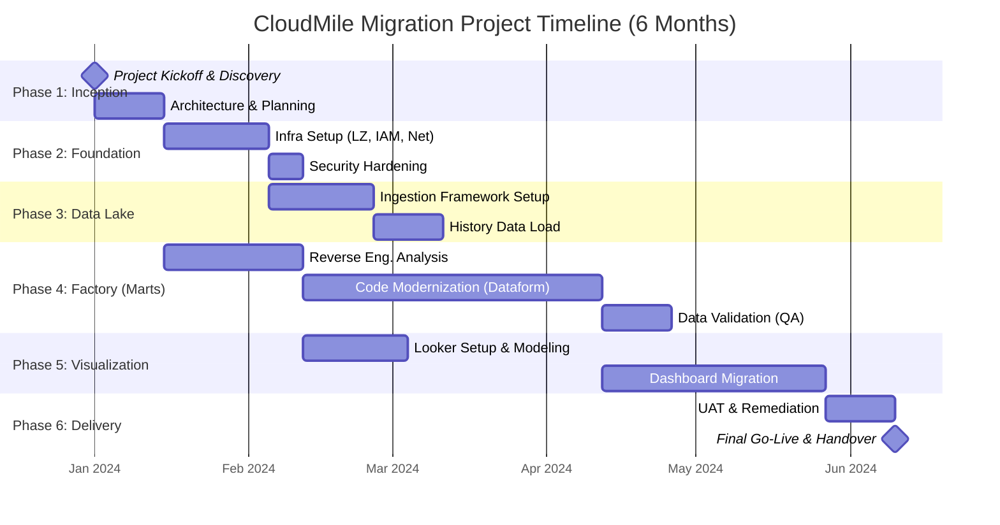

## 4. Scope of Work & Implementation Plan

### 4.1. Implementation Strategy

CloudMile proposes a structured, agile-based delivery approach to migrate the existing data estate from Wherescape to Google Cloud Platform. This engagement is divided into four distinct workstreams designed to ensure platform stability, data integrity, and seamless transition of business intelligence capabilities. Our "Reverse Engineering Factory" methodology minimizes risk by systematically decoding existing logic before modernization.

### 4.2. Detailed Workstreams

#### Workstream 1: Infrastructure & Security Foundation
This workstream focuses on establishing a production-ready Google Cloud environment aligned with the Google Cloud Architecture Framework.
*   **Landing Zone Deployment**: Configuration of Organization policies, Folder hierarchy, and Project structure (Dev, UAT, Prod).
*   **Networking**: Implementation of Shared VPC, Cloud VPN/Interconnect for on-premise connectivity, and firewall rules.
*   **Security & IAM**: Implementation of granular Identity and Access Management (IAM) roles, Service Accounts, and Cloud KMS for key management.
*   **Observability**: Setup of Cloud Operations Suite (Monitoring & Logging) for audit trails and system health checks.

#### Workstream 2: Data Lake & Ingestion Layer
Building a scalable repository for raw data ingestion.
*   **Batch Ingestion**: Deployment of Cloud Storage buckets for file-based landing and **BigQuery** Data Transfer Service for SaaS applications.
*   **Streaming Ingestion**: Configuration of **Pub/Sub** and **Dataflow** for real-time data capture where applicable.
*   **Raw Data Layer**: Definition of BigQuery datasets for raw data, ensuring 1:1 schema mapping with source systems to preserve data fidelity.

#### Workstream 3: Data Mart & Modernization (The Reverse Engineering Factory)
This is the core transformation phase where legacy Wherescape logic is modernized into a cloud-native ELT pattern using **BigQuery** and **Dataform**.

**The Reverse Engineering Factory Approach:**
To handle the complexity of Wherescape-generated logic, CloudMile employs a factory model:
1.  **Metadata Extraction**: We analyze the Wherescape metadata repository to map lineage, dependencies, and transformation logic.
2.  **Logic Decoding**: Automated parsing of stored procedures and Wherescape RED generated SQL to understand business rules.
3.  **Modernization**:
    *   Conversion of proprietary logic into standard ANSI SQL compliant with BigQuery.
    *   Implementation of **Dataform** for managing SQL transformation pipelines, version control, and dependency management.
    *   Optimization of data models (Star/Snowflake schemas) to leverage BigQuery's columnar architecture (Partitioning/Clustering).

#### Workstream 4: Visualization & Business Intelligence
Ensuring business continuity for end-users.
*   **Semantic Layer**: Configuration of **Looker** (or Looker Studio) models to provide a governed metric layer.
*   **Dashboard Migration**: Recreating priority reports and dashboards, validating numbers against the legacy system.
*   **User Acceptance Testing (UAT)**: Facilitated sessions with business stakeholders to verify data accuracy and report usability.

---

### 4.3. Work Breakdown Structure (WBS)

The following table outlines the key tasks and estimated effort for the 6-month engagement.

| WBS ID | Workstream | Task Name | Description | Duration (Days) | Dependencies |
| :--- | :--- | :--- | :--- | :--- | :--- |
| **1.0** | **Initiation** | **Project Kickoff** | Team onboarding, access provisioning, workshop planning | **10** | - |
| 1.1 | Initiation | Architecture Review | Finalize high-level design and security specs | 5 | 1.0 |
| **2.0** | **Infrastructure** | **GCP Foundation** | Terraform deployment of Landing Zone, VPC, IAM | **20** | 1.1 |
| 2.1 | Infrastructure | Connectivity | VPN/Interconnect setup to on-premise sources | 10 | 2.0 |
| **3.0** | **Data Lake** | **Ingestion Pipelines** | Setup GCS, Transfer Service, and initial loads | **30** | 2.1 |
| 3.1 | Data Lake | Raw Layer Validation | Verify row counts and schema accuracy in BigQuery | 10 | 3.0 |
| **4.0** | **Data Mart** | **Reverse Eng. Factory** | Analysis of Wherescape metadata and logic mapping | **25** | 1.1 |
| 4.1 | Data Mart | SQL Modernization | Rewrite logic in Dataform/BigQuery SQL | 60 | 3.1, 4.0 |
| 4.2 | Data Mart | Data Quality Framework | Implement assertion tests in Dataform | 15 | 4.1 |
| **5.0** | **Visualization** | **BI Setup** | Looker instance config and semantic model design | **20** | 2.0 |
| 5.1 | Visualization | Report Migration | Rebuild critical dashboards and reports | 40 | 4.1, 5.0 |
| **6.0** | **Closure** | **UAT & Training** | User testing, bug fixing, and admin training | **20** | 5.1 |
| 6.1 | Closure | Go-Live | Cutover and final handover | 5 | 6.0 |

*Note: Duration estimates are approximate and run in parallel where dependencies allow.*

---

### 4.4. Project Timeline (Gantt Chart)

The following timeline illustrates the 6-month (approx. 26 weeks) implementation plan.

---

### 4.5. RACI Matrix

The Roles and Responsibilities matrix defines the involvement of CloudMile and Client stakeholders throughout the project lifecycle.

| Activity | CloudMile | Client IT | Client Business |
| :--- | :---: | :---: | :---: |
| **Project Management** | | | |
| Project Plan & Schedule | R, A | C | I |
| Status Reporting | R | I | I |
| **Infrastructure & Security** | | | |
| GCP Org & Project Setup | R, A | C | I |
| Network/Firewall Config | C | R, A | I |
| IAM Policy Approval | C | R, A | I |
| **Data Implementation** | | | |
| Wherescape Logic Extraction | R | C | I |
| Pipeline Development (Dataform) | R, A | C | I |
| Data Validation / QA | R | C | A |
| **Visualization** | | | |
| Dashboard Requirements | C | C | R, A |
| Report Development | R | I | C |
| User Acceptance Testing (UAT) | C | I | R, A |
| **Training & Support** | | | |
| Admin Training | R | A | I |
| End-User Training Materials | R | I | C |

**Legend:**
*   **R** = Responsible (Doer)
*   **A** = Accountable (Approver)
*   **C** = Consulted (Contributor)
*   **I** = Informed (In the loop)
