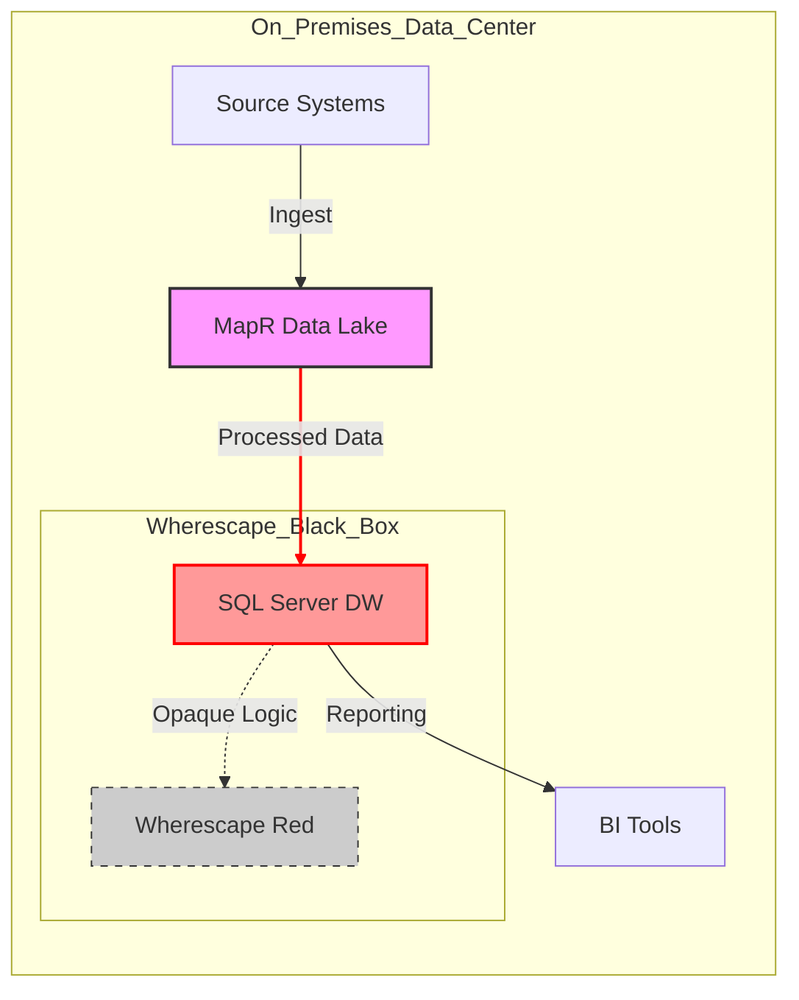
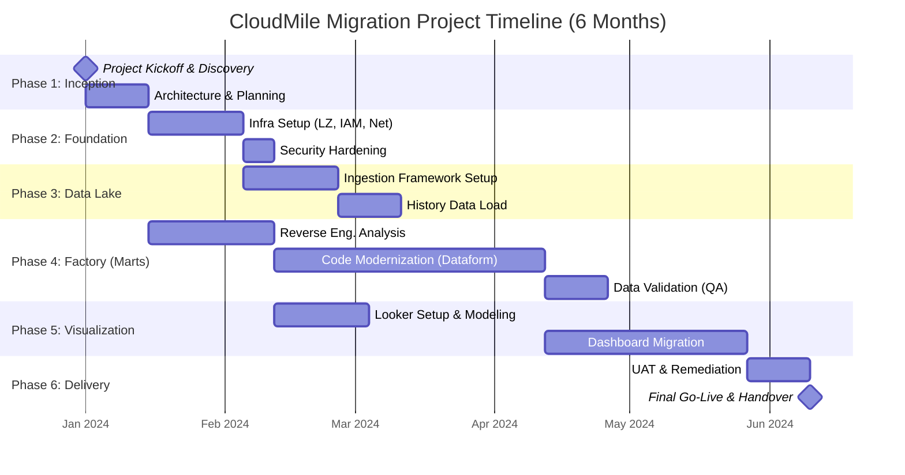

## Section 1: Executive Summary

### 1.1 Strategic Alignment with RISE26+

Bank Muamalat Malaysia Berhad (BMMB) stands at a pivotal juncture in its digital transformation journey. To realize the ambitious goals of the **RISE26+ strategy**, specifically the pillars of Digitalization and Operational Resilience, the bank requires a robust, scalable, and intelligent data infrastructure. **Project AWAN** represents not merely a technical migration, but a strategic leap forward, transitioning BMMB from legacy constraints to a cloud-native future on **Google Cloud Platform (GCP)**.

CloudMile is honored to propose a comprehensive "Migrate & Modernize" strategy designed to secure BMMB’s data assets while unlocking new value through advanced analytics and AI. This proposal outlines our approach to retiring the legacy MapR ecosystem and SQL Server operational data stores (ODS) in favor of a unified, **RMiT-compliant** Data Cloud foundation.

### 1.2 The Critical Urgency: Mitigating MapR End-of-Life Risks

The immediate driver for Project AWAN is the critical End-of-Life (EOL) status of the existing MapR platform, which creates a significant operational risk within the next **six months**. Continued reliance on unsupported infrastructure threatens system stability, security posture, and regulatory compliance.

Our proposal addresses this urgency head-on with a rapid, phased migration plan. We prioritize the stabilization of critical data workloads by migrating them to **Google Cloud Storage** and **Dataproc**, ensuring business continuity. Simultaneously, we lay the groundwork for modernizing these workloads into **BigQuery**, Google’s serverless enterprise data warehouse, to eliminate future infrastructure management overhead and reduce total cost of ownership (TCO).

### 1.3 The Solution: A Secure, Intelligent Data Cloud

CloudMile proposes a dual-track architecture that balances speed of migration with long-term modernization:

1.  **Secure Data Lake Foundation:** Leveraging **Cloud Storage** for durable, low-cost object storage and **Dataproc** to replicate existing Hadoop/Spark workloads with minimal code changes. This ensures a seamless transition away from MapR.
2.  **Modern Data Warehouse:** Establishing **BigQuery** as the central source of truth. BigQuery’s separation of compute and storage, combined with its high-speed in-memory BI Engine, will drastically reduce query times for end-users.
3.  **Advanced Analytics & AI:** Enabling BMMB to move beyond descriptive reporting. With **BigQuery Machine Learning (BQML)**, data teams can build and execute machine learning models directly within the database using standard SQL, accelerating the time-to-insight for credit scoring, fraud detection, and customer segmentation. **Looker** (or Looker Studio) will serve as the visualization layer, democratizing data access across the bank.

### 1.4 Addressing the 'Black Box': Wherescape Modernization

A key complexity in BMMB's current environment is the reliance on Wherescape for data automation, often operating as a "Black Box" with opaque logic and dependencies. Our approach involves a meticulous reverse-engineering and modernization phase. We will:
*   Decouple data logic from proprietary Wherescape metadata.
*   Re-implement transformation pipelines using **Dataform** or **Cloud Composer** (Airflow), providing BMMB with open, version-controlled, and transparent data lineages.
*   Ensure that the migration of these automated jobs maintains data integrity and meets the stringent SLAs required for daily reporting.

### 1.5 Security and Compliance (RMiT)

Adhering to Bank Negara Malaysia’s **Risk Management in Technology (RMiT)** guidelines is paramount. Our solution utilizes a "Security by Design" framework, incorporating:
*   **Identity and Access Management (IAM)** with least-privilege principles.
*   **Data Encryption** at rest and in transit (using Cloud KMS).
*   **VPC Service Controls** to define security perimeters around sensitive data resources.
*   Detailed audit logging via **Cloud Logging** and **Cloud Monitoring** to ensure full traceability of data access and modifications.

### 1.6 Conclusion

CloudMile’s proposal for Project AWAN offers BMMB a definitive path to mitigate the immediate risks of the MapR EOL while establishing a future-proof data ecosystem. By partnering with CloudMile, BMMB will not only secure its current operations but also empower its workforce with the cloud-native tools necessary to drive innovation, personalize customer experiences, and achieve the strategic milestones of RISE26+.

We are committed to delivering this transformation within the 6-month timeline, ensuring a seamless transition with zero disruption to the bank’s critical services.

---

## 2. Business Requirements & Current State Analysis

### 2.1 Executive Summary of Business Context
The client is currently operating a mission-critical data analytics platform that serves key regulatory and business reporting functions. As the volume of data grows and regulatory landscapes evolve, the existing on-premises and legacy infrastructure is facing significant scalability, maintainability, and compliance challenges. The primary objective of this engagement is to modernize the data estate by migrating from a legacy MapR ecosystem and an opaque SQL Server/Wherescape environment to a cloud-native solution on Google Cloud Platform (GCP). This modernization is not merely a "lift-and-shift" but a strategic transformation to unlock agility, reduce technical debt, and ensure strict adherence to financial services regulations.

### 2.2 Current State Analysis ('As-Is' Landscape)

The existing data architecture is characterized by a high-complexity, high-latency environment that is increasingly difficult to support. The "As-Is" landscape is defined by the following core components and constraints:

*   **Legacy Data Lake (MapR):** The foundation of the current data lake is built on MapR, hosting a substantial data volume of approximately **150TB**. This system serves as the initial landing zone and processing layer for raw data ingestion. However, as a legacy Hadoop-based ecosystem, it lacks the elasticity of modern cloud object storage (like Cloud Storage) and requires significant administrative overhead to manage compute and storage scaling independently.
*   **The 'Black Box' Transformation Layer (SQL Server & Wherescape):** A critical bottleneck in the current architecture is the data warehousing layer, running on Microsoft SQL Server and managed via Wherescape. This component has effectively become a "Black Box." Over years of operation, the automated code generation and stored procedure logic managed by Wherescape have become opaque, making it extremely difficult for internal IT teams to debug, optimize, or extend data pipelines. The lack of visibility into transformation logic poses a severe risk to business continuity and agility.
*   **Performance Bottlenecks:** The tight coupling of compute and storage in the current on-premises setup has led to severe performance degradation. The end-to-end batch processing window currently extends to **14 hours**. This excessive duration threatens Service Level Agreements (SLAs) for daily reporting, leaving little buffer for re-runs in the event of job failures and delaying time-to-insight for business stakeholders.

#### Current State Architecture Diagram



### 2.3 Regulatory & Compliance Requirements

As a financial institution operating within Malaysia and utilizing infrastructure in Singapore, strict adherence to regulatory standards is non-negotiable. The proposed Google Cloud solution is designed to meet the following specific regulatory mandates:

*   **Bank Negara Malaysia (BNM) RMiT Compliance:** The architecture must strictly adhere to the *Risk Management in Technology (RMiT)* guidelines issued by Bank Negara Malaysia. This includes requirements for high availability, disaster recovery, and robust access controls. CloudMile will configure the landing zone to meet these stringent operational resilience standards.
*   **Data Sovereignty & Region Strategy:**
    *   **Phase 1 (Singapore Region):** Due to current infrastructure readiness and latency considerations, the initial deployment will reside in the **Google Cloud Singapore (asia-southeast1)** region. This region offers the full maturity of GCP services required for the migration.
    *   **Future Repatriation to Malaysia:** The architecture must be "repatriation-ready." With the upcoming launch of the Google Cloud region in Malaysia, the solution is designed to facilitate a seamless future migration of data and workloads back to Malaysia to satisfy data localization preferences.
*   **Security & Encryption (CMEK):** To ensure the client retains full control over data access, all data at rest—within Cloud Storage, BigQuery, and persistent disks attached to Dataproc—must be encrypted using **Customer-Managed Encryption Keys (CMEK)** via Cloud Key Management Service (KMS). This ensures that Google does not have access to the encryption keys, adding an essential layer of security required for banking-grade compliance.

### 2.4 Technical Objectives

To resolve the challenges identified in the 'As-Is' analysis, the modernization project targets the following technical outcomes:
1.  **Deconstruct the Black Box:** Reverse engineer and migrate Wherescape logic into transparent, version-controlled **BigQuery SQL** and **Dataform** pipelines.
2.  **Reduce Batch Window:** Leverage the massive parallelism of **BigQuery** and ephemeral **Dataproc** clusters to reduce the 14-hour processing window to under 4 hours.
3.  **Modernize Storage:** Migrate 150TB of MapR data to **Cloud Storage**, decoupling storage from compute to lower costs and increase durability.

---

## 3. Proposed Target Architecture

### 3.1 Architecture Overview

CloudMile proposes a modern, scalable, and serverless data platform architecture on Google Cloud Platform (GCP) designed to address the challenges of the current on-premises environment. This "To-Be" architecture leverages the power of the Data Cloud to decouple storage from compute, enabling elastic scaling and cost optimization while providing a unified view of data across the enterprise.

The architecture follows a Lakehouse paradigm, utilizing **Cloud Storage** as the scalable data lake for raw ingestion and **BigQuery** as the highly performant serverless data warehouse. This approach allows for the migration of legacy MapR workloads and SQL Server data into a centralized, governed environment.

### 3.2 Architectural Diagram

The following diagram illustrates the high-level data flow from on-premises source systems through the GCP ingestion, processing, and serving layers.

```mermaid
graph TD
    subgraph "On-Premises Data Sources"
        MapR[MapR Hadoop Cluster]
        SQL[SQL Server]
    end

    subgraph "Hybrid Connectivity"
        Interconnect[Cloud Interconnect]
    end

    subgraph "Google Cloud Platform"
        subgraph "Ingestion & Data Lake"
            GCS[Cloud Storage (GCS)<br/>Raw Landing Zone]
        end

        subgraph "Processing & Transformation"
            Dataproc[Dataproc<br/>Spark Migrations]
            Dataform[Dataform<br/>SQL Pipelines]
            BQ[BigQuery<br/>Enterprise Data Warehouse]
            BQML[BigQuery ML<br/>Predictive Models]
        end

        subgraph "Serving & Analytics"
        Looker[Looker<br/>Business Intelligence]
        end
    end

    %% Flows
    MapR -->|Batch/Streaming| Interconnect
    SQL -->|CDC/Batch| Interconnect
    Interconnect --> GCS
    
    GCS -->|Load| BQ
    GCS -->|Process| Dataproc
    Dataproc -->|Write| BQ
    
    BQ <-->|Transform| Dataform
    BQ -->|Train/Predict| BQML
    
    BQ -->|Query| Looker
    
    classDef cloud fill:#e8f0fe,stroke:#4285f4,stroke-width:2px;
    classDef onprem fill:#fce8e6,stroke:#ea4335,stroke-width:2px;
    classDef network fill:#e6f4ea,stroke:#34a853,stroke-width:2px;
    
    class GCS,Dataproc,Dataform,BQ,BQML,Looker cloud;
    class MapR,SQL onprem;
    class Interconnect network;
```

### 3.3 Component Detail

#### 3.3.1 Ingestion Layer
To ensure secure and high-throughput connectivity between the on-premises data center and GCP, **Cloud Interconnect** (Dedicated or Partner) will serve as the backbone network. This establishes a private, low-latency connection essential for transferring large volumes of historical data from MapR and continuous updates from SQL Server.
*   **Batch Ingestion:** Historical data and periodic snapshots will be transferred directly to **Cloud Storage (GCS)** buckets.
*   **Streaming Ingestion:** For real-time requirements, **Pub/Sub** can be introduced to capture event streams, acting as a buffer before downstream processing.

#### 3.3.2 Storage Layer
The architecture employs a multi-tiered storage strategy:
*   **Cloud Storage (GCS):** Acts as the immutable Raw Landing Zone (Data Lake). It stores data in its native format (Parquet, Avro, CSV) effectively replacing the HDFS storage component of MapR. GCS offers high durability and cost-effective lifecycle management.
*   **BigQuery:** Serves as the central Enterprise Data Warehouse. It separates storage from compute, allowing the client to store petabytes of data without provisioning resources. BigQuery's columnar storage format is optimized for analytical queries.

#### 3.3.3 Processing & Transformation Layer
Processing is handled by fit-for-purpose compute engines:
*   **Dataproc:** A fully managed Spark and Hadoop service used to lift-and-shift existing complex Spark jobs from the MapR cluster. This minimizes code refactoring during the initial migration phase. Dataproc clusters are ephemeral, spun up for specific jobs and terminated afterwards to save costs.
*   **BigQuery & Dataform:** For ELT (Extract, Load, Transform) workflows, we utilize BigQuery's native SQL capabilities managed by **Dataform**. Dataform allows data engineers to build reliable, version-controlled SQL pipelines, handling dependency management and testing directly within the warehouse.
*   **BigQuery ML (BQML):** Machine learning models are developed and executed directly within BigQuery using standard SQL. This eliminates the need to move data out of the warehouse for training, significantly reducing complexity and latency for predictive analytics use cases.

#### 3.3.4 Serving Layer
The serving layer democratizes access to insights:
*   **Looker:** As the primary enterprise BI platform, Looker connects directly to BigQuery. Unlike traditional BI tools that require data extraction (cubes or extracts), Looker leverages BigQuery’s processing power to query live data. It provides a semantic modeling layer (LookML) ensuring consistent metric definitions (single source of truth) across all dashboards and reports.

#### 3.3.5 Security & Governance
Security is woven into every layer of the architecture, adhering to the principle of least privilege:
*   **Identity & Access Management (IAM):** Granular access control for all GCP resources.
*   **Encryption:** Data is encrypted by default at rest (AES-256) and in transit.
*   **VPC Service Controls:** Defines a security perimeter around Google Cloud resources to mitigate data exfiltration risks.
*   **BigQuery Security:** Implements column-level and row-level security to restrict access to sensitive PII data based on user roles.

This architecture ensures scalability to handle future data growth, agility to accelerate time-to-insight through serverless technologies, and robust security to meet enterprise compliance standards.

---

## 4. Scope of Work & Implementation Plan

### 4.1. Implementation Strategy

CloudMile proposes a structured, agile-based delivery approach to migrate the existing data estate from Wherescape to Google Cloud Platform. This engagement is divided into four distinct workstreams designed to ensure platform stability, data integrity, and seamless transition of business intelligence capabilities. Our "Reverse Engineering Factory" methodology minimizes risk by systematically decoding existing logic before modernization.

### 4.2. Detailed Workstreams

#### Workstream 1: Infrastructure & Security Foundation
This workstream focuses on establishing a production-ready Google Cloud environment aligned with the Google Cloud Architecture Framework.
*   **Landing Zone Deployment**: Configuration of Organization policies, Folder hierarchy, and Project structure (Dev, UAT, Prod).
*   **Networking**: Implementation of Shared VPC, Cloud VPN/Interconnect for on-premise connectivity, and firewall rules.
*   **Security & IAM**: Implementation of granular Identity and Access Management (IAM) roles, Service Accounts, and Cloud KMS for key management.
*   **Observability**: Setup of Cloud Operations Suite (Monitoring & Logging) for audit trails and system health checks.

#### Workstream 2: Data Lake & Ingestion Layer
Building a scalable repository for raw data ingestion.
*   **Batch Ingestion**: Deployment of Cloud Storage buckets for file-based landing and **BigQuery** Data Transfer Service for SaaS applications.
*   **Streaming Ingestion**: Configuration of **Pub/Sub** and **Dataflow** for real-time data capture where applicable.
*   **Raw Data Layer**: Definition of BigQuery datasets for raw data, ensuring 1:1 schema mapping with source systems to preserve data fidelity.

#### Workstream 3: Data Mart & Modernization (The Reverse Engineering Factory)
This is the core transformation phase where legacy Wherescape logic is modernized into a cloud-native ELT pattern using **BigQuery** and **Dataform**.

**The Reverse Engineering Factory Approach:**
To handle the complexity of Wherescape-generated logic, CloudMile employs a factory model:
1.  **Metadata Extraction**: We analyze the Wherescape metadata repository to map lineage, dependencies, and transformation logic.
2.  **Logic Decoding**: Automated parsing of stored procedures and Wherescape RED generated SQL to understand business rules.
3.  **Modernization**:
    *   Conversion of proprietary logic into standard ANSI SQL compliant with BigQuery.
    *   Implementation of **Dataform** for managing SQL transformation pipelines, version control, and dependency management.
    *   Optimization of data models (Star/Snowflake schemas) to leverage BigQuery's columnar architecture (Partitioning/Clustering).

#### Workstream 4: Visualization & Business Intelligence
Ensuring business continuity for end-users.
*   **Semantic Layer**: Configuration of **Looker** (or Looker Studio) models to provide a governed metric layer.
*   **Dashboard Migration**: Recreating priority reports and dashboards, validating numbers against the legacy system.
*   **User Acceptance Testing (UAT)**: Facilitated sessions with business stakeholders to verify data accuracy and report usability.

---

### 4.3. Work Breakdown Structure (WBS)

The following table outlines the key tasks and estimated effort for the 6-month engagement.

| WBS ID | Workstream | Task Name | Description | Duration (Days) | Dependencies |
| :--- | :--- | :--- | :--- | :--- | :--- |
| **1.0** | **Initiation** | **Project Kickoff** | Team onboarding, access provisioning, workshop planning | **10** | - |
| 1.1 | Initiation | Architecture Review | Finalize high-level design and security specs | 5 | 1.0 |
| **2.0** | **Infrastructure** | **GCP Foundation** | Terraform deployment of Landing Zone, VPC, IAM | **20** | 1.1 |
| 2.1 | Infrastructure | Connectivity | VPN/Interconnect setup to on-premise sources | 10 | 2.0 |
| **3.0** | **Data Lake** | **Ingestion Pipelines** | Setup GCS, Transfer Service, and initial loads | **30** | 2.1 |
| 3.1 | Data Lake | Raw Layer Validation | Verify row counts and schema accuracy in BigQuery | 10 | 3.0 |
| **4.0** | **Data Mart** | **Reverse Eng. Factory** | Analysis of Wherescape metadata and logic mapping | **25** | 1.1 |
| 4.1 | Data Mart | SQL Modernization | Rewrite logic in Dataform/BigQuery SQL | 60 | 3.1, 4.0 |
| 4.2 | Data Mart | Data Quality Framework | Implement assertion tests in Dataform | 15 | 4.1 |
| **5.0** | **Visualization** | **BI Setup** | Looker instance config and semantic model design | **20** | 2.0 |
| 5.1 | Visualization | Report Migration | Rebuild critical dashboards and reports | 40 | 4.1, 5.0 |
| **6.0** | **Closure** | **UAT & Training** | User testing, bug fixing, and admin training | **20** | 5.1 |
| 6.1 | Closure | Go-Live | Cutover and final handover | 5 | 6.0 |

*Note: Duration estimates are approximate and run in parallel where dependencies allow.*

---

### 4.4. Project Timeline (Gantt Chart)

The following timeline illustrates the 6-month (approx. 26 weeks) implementation plan.



---

### 4.5. RACI Matrix

The Roles and Responsibilities matrix defines the involvement of CloudMile and Client stakeholders throughout the project lifecycle.

| Activity | CloudMile | Client IT | Client Business |
| :--- | :---: | :---: | :---: |
| **Project Management** | | | |
| Project Plan & Schedule | R, A | C | I |
| Status Reporting | R | I | I |
| **Infrastructure & Security** | | | |
| GCP Org & Project Setup | R, A | C | I |
| Network/Firewall Config | C | R, A | I |
| IAM Policy Approval | C | R, A | I |
| **Data Implementation** | | | |
| Wherescape Logic Extraction | R | C | I |
| Pipeline Development (Dataform) | R, A | C | I |
| Data Validation / QA | R | C | A |
| **Visualization** | | | |
| Dashboard Requirements | C | C | R, A |
| Report Development | R | I | C |
| User Acceptance Testing (UAT) | C | I | R, A |
| **Training & Support** | | | |
| Admin Training | R | A | I |
| End-User Training Materials | R | I | C |

**Legend:**
*   **R** = Responsible (Doer)
*   **A** = Accountable (Approver)
*   **C** = Consulted (Contributor)
*   **I** = Informed (In the loop)

---

## 5. Assumptions & Out of Scope

This section outlines the critical assumptions and boundaries that define the scope of this Proof of Concept (PoC) engagement. Clear alignment on these items is essential for the successful and timely delivery of the data modernization project. These parameters ensure that CloudMile and the Client share a unified understanding of responsibilities, technical prerequisites, and project limitations.

### 5.1 Project Assumptions

The successful delivery of the solution described in this proposal is predicated on the following assumptions. Deviations from these assumptions may impact the project timeline, resource allocation, or cost.

#### 5.1.1 Technical & Connectivity Assumptions
*   **Wherescape Metadata Access:** A critical success factor for this migration PoC is the ability to programmatically access the existing Wherescape RED metadata repository. It is assumed that the Client will provide CloudMile with Read-Only access (via ODBC/JDBC) to the underlying metadata database. This allows CloudMile to utilize automated parsers to extract lineage, transformation logic, and table structures, thereby accelerating the conversion to BigQuery and Dataform.
*   **Interim VPN Connectivity:** To ensure immediate project kickoff while permanent networking solutions (such as Google Cloud Interconnect) are being procured or provisioned, the Client agrees to establish a Site-to-Site Cloud VPN connection. This interim solution will be used for the duration of the PoC to facilitate data transfer and system access. It is assumed this VPN will provide sufficient bandwidth for the agreed-upon PoC data volumes.
*   **Google Cloud Platform Environment:** The Client will provide a dedicated GCP Project with the necessary quotas and permissions enabled. CloudMile assumes the "Owner" or "Editor" role within this specific PoC project to configure BigQuery, Dataform, Dataproc, and IAM roles without administrative delays.
*   **Data Volume:** The data volume for this PoC is assumed to be within the standard range for a pilot phase (e.g., under 1TB) to ensure that data transfer times via VPN do not become a bottleneck.

#### 5.1.2 Stakeholder & Timing Assumptions
*   **Telco Operational Timing:** Recognizing the Client's operation within the Telecommunications sector, we assume the project schedule will need to align with specific maintenance windows and network freeze periods. The timeline proposed assumes that the Client will proactively communicate any "Blackout Dates" or restricted access periods related to Telco critical infrastructure updates so they can be factored into the project plan.
*   **Resource Availability:** The Client will identify a dedicated Technical Point of Contact (SPOC) who can facilitate access to source systems, approve architectural decisions, and participate in weekly status meetings.
*   **Source System Availability:** The on-premise SQL Server and Wherescape environments will be available during working hours for data extraction and analysis.

### 5.2 Out of Scope

To focus resources on the primary objectives of migrating the data warehouse to Google Cloud BigQuery and validating the modern data stack, the following items are explicitly excluded from the scope of this engagement.

#### 5.2.1 Application & Functional Exclusions
*   **Application Modernization:** This engagement focuses strictly on the Data Warehouse migration. The refactoring, re-architecting, or modernization of upstream operational applications or downstream consumption applications (e.g., custom web portals, legacy reporting tools) is out of scope. These applications will continue to function as-is, or will need to be repointed to BigQuery by the Client's team.
*   **Deep Data Cleansing:** The migration strategy is primarily a logical "lift-and-shift" with modernization of the transformation engine. We will migrate existing logic "as-is." Comprehensive data quality audits, deep historical data cleansing, or fixing inherent data anomalies present in the source system are out of scope unless they prevent the pipeline from running.
*   **BI Report Migration:** While we will enable the data layer for reporting, the actual migration or re-creation of dashboards and reports in visualization tools (e.g., migrating Tableau workbooks or SSRS reports to Looker) is not included in this PoC scope.

#### 5.2.2 Operational & Infrastructure Exclusions
*   **Production Deployment:** This is a Proof of Concept engagement. While the environment will be built following best practices, the formal "Go-Live" activities, production cutover, and decommissioning of the legacy hardware are reserved for a subsequent implementation phase.
*   **End-User Training:** Formal classroom training for broad end-user groups is out of scope. Knowledge transfer will be limited to the core technical team responsible for maintaining the new BigQuery and Dataform environment.
*   **Third-Party Licensing:** The procurement of licenses for any third-party tools (outside of Google Cloud native services) is the responsibility of the Client.
*   **Network Hardware:** CloudMile is not responsible for the procurement, installation, or configuration of physical networking hardware (routers, switches) at the Client's on-premise data center.

### 5.3 Risk Management
Any items identified during the discovery phase that fall into the "Out of Scope" category but are deemed critical for success will be raised immediately via a Change Request (CR) process to evaluate the impact on timeline and budget.

---

## 6. Success Criteria & Acceptance Testing

This section outlines the definitive metrics and validation procedures required to declare the Proof of Concept (PoC) and subsequent implementation phases successful. By establishing quantitative targets and rigorous acceptance protocols, CloudMile ensures that the delivered solution not only meets technical specifications but also drives tangible business value for the client.

The success of this engagement will be measured against four primary pillars: System Performance, Data Integrity, User Adoption, and Formal Governance.

### 6.1 Key Success Indicators (KSIs)

The following metrics serve as the baseline for evaluating the effectiveness of the Google Cloud Platform (GCP) data ecosystem. These targets have been calibrated based on the architectural design utilizing BigQuery, Dataform, and Looker.

#### 6.1.1 Performance Optimization
The transition to Cloud-native architecture must demonstrate significant improvements in processing windows to support timely decision-making.

| Metric | Current Baseline | Target Threshold | Validation Method |
|--------|------------------|------------------|-------------------|
| **Daily Batch Processing** | > 6 hours | **< 3 hours** | System logs from Cloud Composer/Airflow DAGs measuring end-to-end runtime from ingestion to mart availability. |
| **Query Performance** | > 30 seconds avg | **< 5 seconds avg** | BigQuery Information Schema analysis for standard reporting queries used in Looker. |
| **Data Availability** | T+1 Day | **T+4 Hours** | Timestamp comparison between source transaction creation and BigQuery availability. |

*Technical Context:* The < 3-hour batch window target will be achieved by leveraging **BigQuery's** distributed compute capability and **Dataform's** incremental table updates, eliminating the need for full-load processing where unnecessary.

#### 6.1.2 Data Integrity & Parity
Ensuring trust in the new platform is paramount. We will utilize **Datafold** to automate cross-database verification, ensuring the GCP environment mirrors the legacy source of truth with absolute precision.

*   **100% Data Parity:** Validation of row counts, schema consistency, and column-level value distributions between the source system and BigQuery raw layer.
*   **Statistical Consistency:** Validation that aggregated metrics (e.g., Total Revenue, Daily Active Users) in Looker match existing legacy reports within a 0.01% margin of error.
*   **Schema Fidelity:** All critical data types and structures must be correctly mapped and preserved during the ingestion via Datastream or Dataflow.

#### 6.1.3 Looker Adoption & Usability
Success is ultimately defined by user engagement. The Modern BI stack must provide a superior user experience that encourages migration from legacy tools.

*   **Adoption Rate:** > 80% of identified power users successfully migrating their primary reporting workflows to Looker within the first 4 weeks of UAT.
*   **Self-Service Capability:** Technical verification that designated business users can create custom Explores in Looker without writing SQL.
*   **Dashboard Latency:** All executive dashboards must render visualization elements in under 5 seconds.

#### 6.1.4 Governance & Sign-off (RMiT)
Strict adherence to compliance and risk management standards is required for production deployment.

*   **RMiT Sign-off:** Formal approval from the Risk Management and IT (RMiT) department, verifying that the solution meets all security, access control (IAM), and audit logging requirements (Cloud Audit Logs).
*   **Security Validation:** Successful completion of vulnerability scanning on the deployment pipeline and verification of Column-Level Encryption for PII data in BigQuery.

### 6.2 Acceptance Testing Plan

The Acceptance Testing phase verifies that the delivered solution meets the agreed-upon scope and quality standards. This process is divided into two distinct stages: System Integration Testing (SIT) and User Acceptance Testing (UAT).

#### 6.2.1 System Integration Testing (SIT)
*Conducted by CloudMile Engineering Team*

Before handing over to business users, CloudMile will perform rigorous technical testing:
1.  **Pipeline Stress Testing:** Simulating peak data volumes (2x historical average) in **Dataflow** and **Pub/Sub** to ensure system stability and auto-scaling behavior.
2.  **Failure Recovery:** Intentionally failing specific Airflow tasks to verify retry logic, alerting mechanisms via Cloud Monitoring, and data consistency upon recovery.
3.  **Datafold Automated Regression:** Running Datafold diffs across all migrated tables to identify and rectify discrepancies immediately.

#### 6.2.2 User Acceptance Testing (UAT)
*Conducted by Client Business Users & IT*

This phase allows key stakeholders to validate the functional requirements:
*   **Duration:** 2 Weeks (10 Business Days).
*   **Participants:** Data Analysts, Business Unit Managers, RMiT Representatives.
*   **Entry Criteria:** Successful completion of SIT and zero critical bugs.

**UAT Scenarios:**
*   **Report Verification:** Users generate key monthly reports in Looker and compare results with legacy outputs.
*   **Ad-Hoc Analysis:** Analysts test BigQuery performance by running complex joins on the data warehouse.
*   **Access Control Test:** Users verify they cannot access unauthorized data segments (Row-level security validation).

### 6.3 Final Sign-off Criteria

The project will be deemed complete upon the execution of the Project Acceptance Document, contingent on the following conditions:

1.  All "Critical" and "High" severity defects identified during UAT have been resolved.
2.  Data parity reports from Datafold show a 100% match for agreed-upon scope.
3.  Batch processing performance reliably meets the < 3-hour SLA over a 5-day observation period.
4.  RMiT provides written confirmation of security compliance.
5.  Knowledge transfer sessions are completed, and documentation (Architecture Design, Operations Manual) is handed over.

Upon meeting these criteria, the solution will be approved for production deployment, marking the successful conclusion of the engagement.

---

## 7. Commercial Model & Total Cost of Ownership (TCO)

### 7.1 Executive Summary of Commercial Value
Transitioning from a legacy on-premises architecture—anchored by capital-intensive MapR clusters and Microsoft SQL Server licensing—to a cloud-native Google Cloud Platform (GCP) environment represents a fundamental shift in the organization's financial and operational model. This proposal outlines the commercial benefits of adopting a serverless, consumption-based model, highlighting the move from Capital Expenditure (CapEx) to Operational Expenditure (OpEx).

By leveraging Google Cloud’s fully managed services, specifically BigQuery, Dataflow, and Cloud Storage, the client will eliminate the rigid costs associated with hardware procurement, maintenance contracts, and over-provisioned infrastructure. The projected Total Cost of Ownership (TCO) reduction is driven not only by lower direct infrastructure costs but also by significant gains in engineering productivity and the elimination of "undifferentiated heavy lifting" associated with managing physical data centers.

### 7.2 Shifting from CapEx to OpEx
The traditional on-premises model requires substantial upfront investment in hardware and software licenses to handle peak capacity, often resulting in underutilized resources during non-peak periods. The proposed GCP solution shifts this paradigm to a flexible OpEx model.

| Cost Category | Legacy On-Premises (MapR / SQL Server) | Google Cloud Platform (BigQuery / Dataflow) |
|---------------|----------------------------------------|---------------------------------------------|
| **Investment Model** | **CapEx**: Upfront purchase of servers, storage arrays, and multi-year software licenses. | **OpEx**: Pay-as-you-go pricing based on actual consumption (storage GBs, compute slots/seconds). |
| **Scalability Cost** | Step-function costs; adding capacity requires purchasing new hardware nodes and licenses. | Linear scaling; costs align perfectly with data volume and query complexity. |
| **Utilization** | Paid capacity often sits idle (over-provisioned for peaks). | Zero cost for idle compute; auto-scaling ensures payment only for active processing. |
| **Licensing** | Expensive enterprise cores for SQL Server and MapR subscriptions. | No licensing fees; cost includes fully managed service capabilities. |

### 7.3 TCO Savings Breakdown

#### 7.3.1 Elimination of Licensing Costs
A significant portion of the current TCO is attributed to enterprise software licensing. SQL Server Enterprise Edition and MapR enterprise subscriptions carry heavy annual renewal costs.
*   **BigQuery:** operates on a serverless model where there are no license fees. The client pays for data storage (active and long-term) and query processing (analysis). This eliminates the "software tax" and frees up budget for innovation.
*   **Dataproc:** For workloads migrating from MapR, Dataproc offers managed Hadoop/Spark clusters that can be ephemeral (spun up for a job and shut down immediately), drastically reducing the compute hours compared to an always-on on-prem cluster.

#### 7.3.2 Reduction in Administrative Overhead
The hidden costs of on-premises infrastructure include the engineering hours spent on patching, upgrades, backups, and hardware replacement cycles.
*   **Fully Managed Services:** BigQuery and Dataflow are serverless. Google handles all backend infrastructure, security patches, and upgrades. This allows the client's IT team to pivot from "keeping the lights on" to delivering business value through data engineering and analytics.
*   **High Availability & DR:** Disaster recovery in an on-prem world requires duplicate hardware and complex replication setup. In GCP, geo-redundant Cloud Storage and BigQuery's inherent replication provide high availability by default, removing the cost of maintaining a secondary physical DR site.

#### 7.3.3 Infrastructure Optimization
*   **Storage Efficiency:** Cloud Storage offers different tiers (Standard, Nearline, Coldline, Archive). Rarely accessed data from the legacy SQL Server archives can be moved to Coldline storage at a fraction of the cost of high-performance on-prem SAN/NAS storage.
*   **Compute efficiency:** With BigQuery's separation of compute and storage, the client is not forced to buy compute power just to store more data.

### 7.4 BigQuery Pricing Strategy
To optimize the commercial model further, CloudMile recommends a hybrid pricing approach for BigQuery:

1.  **On-Demand Pricing (Start):** For the initial phase and ad-hoc analytics, the client pays per TB of data processed. This is ideal for variable workloads and ensures zero waste during low-usage periods.
2.  **Capacity Pricing (Editions):** As workloads mature and become predictable (e.g., daily scheduled ETL jobs from Dataflow), we can switch to BigQuery Editions (Standard, Enterprise, Enterprise Plus). This allows the purchase of committed "slots" (virtual CPUs) for flat-rate predictability, preventing cost spikes.

### 7.5 Conclusion
The migration to Google Cloud Platform offers a compelling ROI. By retiring aging hardware and expiring licenses associated with MapR and SQL Server, the client effectively converts fixed, depreciating assets into a flexible, optimized operational expense. CloudMile estimates that this modernization will result in a **30% to 45% reduction in 3-year TCO**, primarily driven by the elimination of licensing fees, reduction in administrative labor, and the efficiency of autoscaling cloud infrastructure.

---
