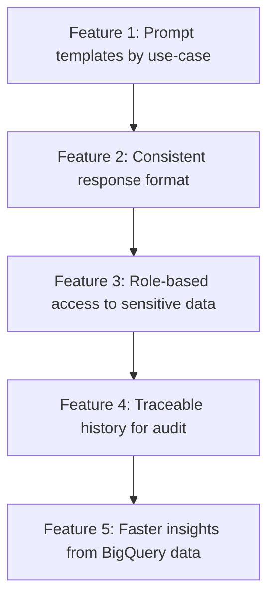
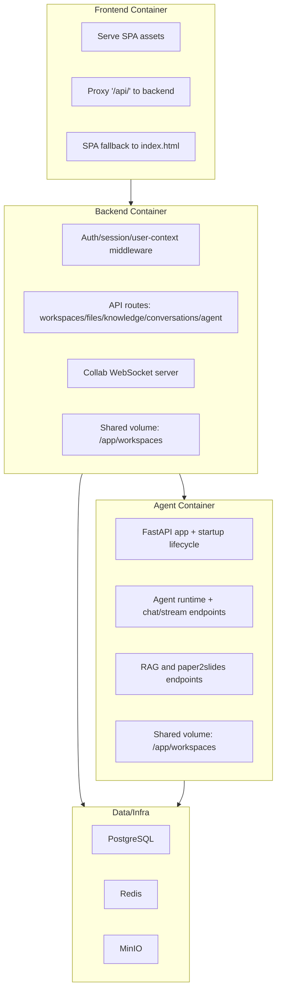
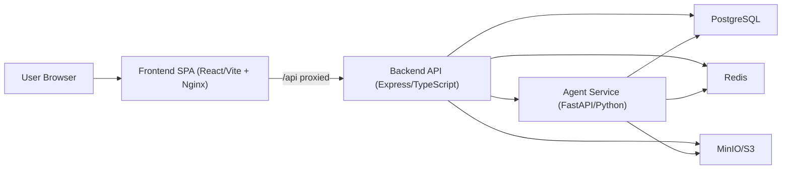

# CCOB GenAI Consumption Layer Proposal

## 1) Executive Summary
CCOB is already running an enterprise data warehouse initiative with us using **BigQuery** as the core platform. This proposal extends that foundation into a secure **GenAI data consumption layer**.

The proposed architecture is:
- **Skill-first prompt management** for controlled, reusable, and auditable prompt workflows.
- **MCP servers for tools/data actions** to separate tool execution from prompt logic and enforce strict access controls.

For a financial institution context, this design is optimized for:
- **Least privilege access** at user/group and connection level.
- **Strong identity and access management** (OIDC, RBAC, deny-overrides).
- **Data protection by design** (ephemeral credentials, no long-lived secrets in agents).
- **Auditability and governance** across prompts, tools, and data access.

---

## 2) Objective
Deliver a production-ready GenAI enablement layer for CCOB that:
1. Enables governed natural-language access to curated BigQuery data products.
2. Preserves enterprise security posture expected by a financial institution.
3. Reuses existing DW architecture investments while minimizing duplication.
4. Scales from pilot use-cases to broader domain onboarding.

### 2.1 End-User Feature View (Non-Technical)

### 2.2 End-User Pointers (What This Means for Teams)
- Users ask business questions in natural language without writing SQL.
- Teams reuse approved skill templates, reducing manual prompt drafting.
- Outputs are standardized, so management reports are easier to compare.
- Access is aligned to user role, reducing risk of unauthorized data exposure.
- Every interaction is traceable, improving audit and compliance confidence.
- The solution builds on current BigQuery DW investments instead of creating a separate data stack.

---

## 3) Proposed Architecture

### 3.1 Logical Components
- **User Channels / UI**
  - Enterprise UI for prompt execution and result consumption.
- **AI Engine + Skill Runtime**
  - Executes approved skills (prompt templates + orchestration logic).
- **Skill Registry (Prompt Management Layer)**
  - Versioned skill definitions and metadata.
  - Approval/governance workflow for skill changes.
- **MCP Tool Layer**
  - MCP server definitions (non-secret endpoint configuration).
  - MCP connections (credential bindings, RBAC, policy context).
- **Security & Access Control Layer**
  - OIDC-based authentication.
  - User/group RBAC with explicit allow/deny and default-access policies.
  - Credential broker for short-lived tokens.
- **Enterprise Data Platform (BigQuery DW)**
  - Existing curated/semantic datasets.
  - Authorized views, policy tags, and service boundaries.
- **Observability & Audit**
  - Prompt/run logs, tool invocation logs, identity linkage, and access traces.

### 3.2 High-Level Data Flow
1. User authenticates via enterprise identity provider (OIDC).
2. User invokes an approved skill from UI.
3. Runtime checks skill-level RBAC and policy.
4. If data/tool action is needed, runtime calls MCP via approved connection.
5. Backend credential broker injects short-lived auth material.
6. MCP tool executes against BigQuery or approved systems under enforced policy.
7. Response is returned to user with logging/audit metadata.

### 3.3 Architecture Diagrams

---

## 4) Why This Design Is Security-Optimized for CCOB

### 4.1 Separation of Responsibilities (Reduces Blast Radius)
- Prompt logic (skills), tool execution (MCP), and credentials (broker/backend) are separated.
- Compromise or misuse in one layer does not automatically expose all data/tool capabilities.

### 4.2 Skill-First Governance (Prompt Risk Control)
- Prompts are not free-form ad hoc artifacts; they are governed skill assets.
- Each skill can be versioned, approved, restricted, and audited.
- This is critical for regulated use-cases where prompt behavior must be controlled.

### 4.3 Connection-Level RBAC (Access Precision)
- Access is enforced at **MCP connection level**, not only at endpoint level.
- Supports one endpoint with multiple trust contexts (workspace token, user-delegated OAuth, federated identity).
- Enables tighter segmentation by team, role, or dataset sensitivity.

### 4.4 Least Privilege + Deny-Override Enforcement
- Default access can be allow/deny per resource.
- Explicit deny overrides allow.
- Group and user grants provide practical governance without manual per-user operations.

### 4.5 No Long-Lived Secrets in Agent Runtime
- Agent receives only short-lived/ephemeral auth artifacts.
- Refresh tokens and static secrets stay in backend secret storage.
- Significantly lowers credential leakage risk.

### 4.6 BigQuery-Aligned Enterprise Controls
- Uses existing BigQuery governance patterns:
  - Authorized views / curated semantic layer.
  - Policy tags and column-level protections.
  - Identity-aware access through delegated/federated models.
- GenAI becomes a consumption interface over governed data, not a bypass.

### 4.7 Auditability and Compliance Readiness
- Every run can capture: user identity, skill used, tool invoked, data domain touched, and decision traces.
- Supports internal audit, security operations, and regulatory review requirements.

---

## 5) Scope

### 5.1 In Scope
- MCP client/UI aligned to agreed CCOB demo scope.
- Skill registry and prompt lifecycle management.
- MCP server registry and connection management.
- RBAC for skills and MCP connections (user/group based).
- Secure BigQuery consumption path for agreed pilot datasets.
- Initial observability and audit logging baseline.

### 5.2 Out of Scope (This Phase)
- Full VAPT execution.
- Full-scale performance and load testing.
- Enterprise-wide model risk framework rollout.
- Non-priority integrations not required by pilot use-cases.

---

## 6) Initial Use-Case Delivery Plan
- **AI engine + MCP client**: 4 use-cases.
- **iSentia + Complaints datasets**: 1 use-case.
- **CORE dataset**: 1 use-case.

This phased approach validates governance and security controls first, then scales coverage.

---

## 7) Technology Stack (Target)
- **Data Warehouse**: BigQuery (existing enterprise DW foundation).
- **GenAI Runtime**: Skill-based orchestration + policy-aware execution.
- **Tool Integration**: MCP servers + connection broker pattern.
- **Identity**: Enterprise OIDC/OAuth federation.
- **Authorization**: RBAC (users/groups), deny-override model.
- **Secrets**: Backend-managed encrypted secrets + short-lived token issuance.
- **Audit/Observability**: Centralized logs and traceability.

---

## 8) Success Criteria
1. AI output follows business-defined output contracts for each use-case.
2. MCP client/UI meets approved UX and governance requirements.
3. Only authorized users/groups can invoke restricted skills/tools.
4. BigQuery data access is enforceable via approved identity and policy controls.
5. Full run-level traceability exists for audit (who, what, when, which skill/tool/data domain).
6. Pilot use-cases complete with no critical security-control gaps.

---

## 9) Key Risks and Mitigations
- **Risk: Over-privileged access during early rollout**
  - Mitigation: default-deny for sensitive connections, explicit allow grants, periodic access review.
- **Risk: Prompt drift / uncontrolled prompt edits**
  - Mitigation: skill versioning + approval workflow + immutable run references.
- **Risk: Credential exposure**
  - Mitigation: no long-lived secrets in agent, backend vault/encryption, token TTL controls.
- **Risk: Data leakage in outputs**
  - Mitigation: curated datasets/views, response guardrails, sensitive-field controls, audit review.

---

## 10) Conclusion
This proposal extends the current CCOB BigQuery data warehouse program into a secure, governed GenAI consumption layer. The **skill-first + MCP** architecture is not only scalable for delivery, but specifically suited to financial-institution requirements around security, access management, and auditability.
