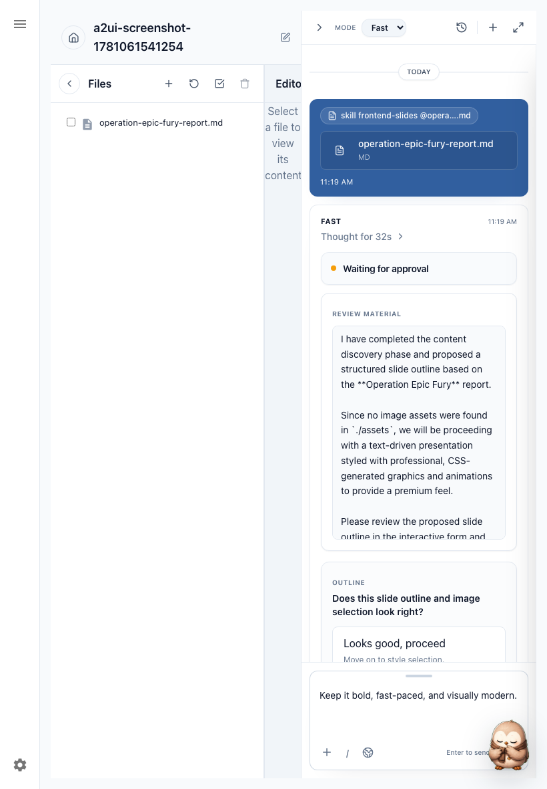
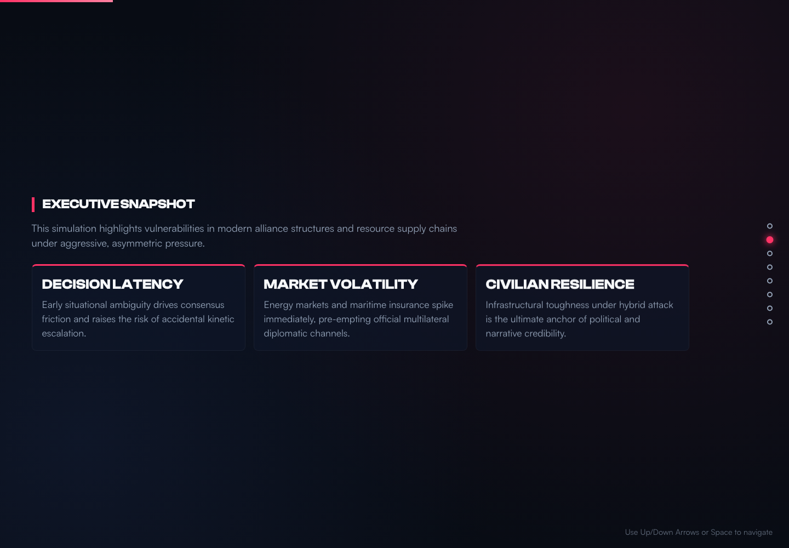

# A2UI Input Gates QC Wrap-Up

Date: 2026-06-10

## Status

The local Docker deployment now completes the `frontend-slides` A2UI flow end to end:

- starts `/skill frontend-slides @operation-epic-fury-report.md`
- renders native A2UI for all required gates
- resumes the same run/thread after each user answer
- prevents completed gates from being surfaced again
- generates a final HTML slide deck artifact

## Completed Run

- Run ID: `3b1b9e7e-7455-4865-85d5-899d6106de92`
- Workspace ID: `9aea1865-e197-4782-8033-2af2ec64e9e8`
- Final artifact: `operation-epic-fury-deck.html`
- Completed gates: `presentation_context`, `outline_confirmation`, `style_path_selection`, `mood_or_preset_selection`, `style_preview_selection`

Deck assertions:

- `sectionCount`: 8
- `slideClassCount`: 16
- `hasScrollSnap`: true
- `hasKeyboardNav`: true
- `dataAnalysisReportCount`: 0
- `summaryInTitle`: false

## Screenshots

Native A2UI outline gate:

Generated deck:

## What Was Fixed

- Synthetic frontend-slides fallback resumes now re-enter the skill with `/skill frontend-slides`, so the agent runtime keeps the frontend-slides contract active after a fallback gate.
- Backend stream handling now skips A2UI interrupts for gates already marked completed in the ledger, preventing stale repeated gates from becoming pending UI.
- Final frontend-slides continuation prompts now require a real `-deck.html` slide deck, not a generic report or summary page.
- The `frontend-slides` skill now states that final output must be a deck with slide sections, keyboard navigation, and a `-deck.html` filename.
- Workspace file sync now resolves text MIME types, including `text/html`, and repairs existing local records with null MIME type.
- Existing A2UI validation remains in place: outline confirmation must include outline content, and the frontend renders that review material inside the native A2UI form.

## Verification

Local Docker stack:

- Frontend: `http://localhost:5173`
- Backend: `http://localhost:3000`
- Agent: `http://localhost:8001`

Checks run:

- `python3 -m pytest -q tests/test_a2ui_contract_middleware.py agent/tests/test_workflow_action_tool.py`
- `RUN_A2UI_E2E=1 npm test -- --test-name-pattern "A2UI flow reaches final slide generation|buildSyntheticClarificationFollowupPrompt"` in `backend`
- Rebuilt/restarted local Docker `backend` and `agent`
- Full deployed run driven through all five gates against `http://localhost:5173`

## Notes

The earlier screenshot run `224c924f-3737-431d-aa4c-96c322145180` proved the native outline gate rendered, but it was only halfway through the workflow and later produced a summary-shaped HTML page. The completed run above is the acceptance run: all gates completed, stale repeated gates were suppressed, and the generated artifact is an actual slide deck.
