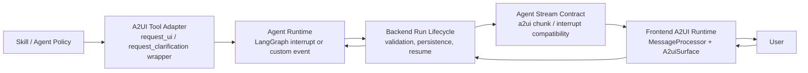

# A2UI Native Migration Plan

## Goal

Move HelpUDoc human-in-the-loop UI from skill-specific interrupt rendering to a native Agent-to-User Interface contract.

In the target architecture, A2UI is the agent/tool UI layer. Agents and skills request user input, approvals, choices, previews, and guided workflows by emitting structured A2UI payloads. The frontend renders those payloads through the A2UI runtime, not by reconstructing forms from assistant prose, skill names, legacy interrupt kinds, or ad hoc display payloads.

The migration should preserve existing runs during rollout while making new A2UI-capable skills deterministic and testable.

## Target Outcomes

- A2UI is the source of truth for interactive UI, including clarification forms, approvals, plan review, style selection, and future tool-specific UI.
- `request_clarification` becomes a compatibility wrapper over a more general A2UI UI request tool.
- HITL approval cards become A2UI surfaces instead of bespoke frontend interrupt cards.
- The backend streams native A2UI messages or surface events as first-class stream chunks.
- The frontend uses `@a2ui/react` and `@a2ui/web_core` to process and render A2UI surfaces.
- Skills opt into A2UI by declaring required gates and emitting typed A2UI tool calls.
- Regex-based implicit input detection remains as rescue telemetry only, not as the architecture.

## Non-Goals

- Do not migrate every skill in one step.
- Do not remove legacy interrupt support until active runs and older skills have a compatibility path.
- Do not let A2UI rendering depend on assistant prose.
- Do not make `frontend-slides` the only hardcoded UI path. It should be the first migrated skill, not a permanent special case.

## Current State

HelpUDoc already has partial A2UI-shaped contracts:

- `packages/contracts/src/types.ts` defines `UIRequest`.
- `packages/contracts/src/agentStream.ts` can carry `uiRequest` on interrupt chunks.
- `agent/helpudoc_agent/interrupt_payloads.py` normalizes display payloads into `uiRequest`.
- `backend/src/services/agent-runs/lifecycle.ts` validates `frontend-slides` A2UI gates.
- `frontend/src/components/chat/ChatMessageBubble.tsx` renders `clarification_form` and `style_preview_chooser` only from `pendingInterrupt.uiRequest`.
- `frontend/src/features/workspace/WorkspacePage.tsx` passes stream interrupt metadata into chat messages.

This is contract-driven, but not yet A2UI-native. The frontend still owns custom form renderers, and the agent still speaks through `request_clarification` rather than a general A2UI UI primitive.

## Current Hardening Status

As of the latest hardening pass, the `frontend-slides` path has a verified backend lifecycle that can progress from prompt to final deck generation:

1. User starts a run with `/skill frontend-slides`.
2. The run pauses at `presentation_context` with a structured A2UI clarification form.
3. The user submits presentation context.
4. The run advances to `outline_confirmation`.
5. The user confirms the outline.
6. The run advances to `style_path_selection`.
7. The user chooses the style selection path.
8. The run advances to `mood_or_preset_selection`.
9. The user chooses mood or preset guidance.
10. The run advances to `style_preview_selection` with a style/template chooser.
11. The user selects a template.
12. The run generates the final HTML slide deck artifact and completes.

The Redis-backed lifecycle test for this is:

```bash
cd backend
RUN_A2UI_E2E=1 REDIS_URL=redis://127.0.0.1:6379 \
  node -r ts-node/register/transpile-only \
  -r tsconfig-paths/register \
  --test-name-pattern 'frontend-slides A2UI' \
  --test tests/agentRunService.test.ts
```

The test intentionally covers the run/resume state machine, gate completion metadata, template review, and final completion. It is not a browser-click test through the chat UI.

Important fixes captured in the current implementation:

- Synthetic A2UI clarification resumes use `forceReset: true` so the backend does not re-enter the same paused agent checkpoint and loop on the same form.
- Synthetic continuation prompts unwrap previous continuation wrappers to avoid prompt accumulation after retries.
- Native `request_ui(component="style.previewChooser")` payloads project to compatibility `uiRequest.component === "style_preview_chooser"` so backend validation and legacy status paths see the expected component.
- A2UI surfaces use stable frontend surface ids and avoid deleting/recreating identical surfaces, preventing multi-question forms from jumping back to the first question during refreshes or status updates.
- Docker frontend builds default native A2UI on unless explicitly disabled with `VITE_A2UI_NATIVE_ENABLED=false`.

## Deployment Runbook

This section exists because the frontend A2UI flag is a build-time Vite value. If the Docker image is built without it, the deployed UI can silently compile out the native A2UI rendering path and fall back to legacy behavior.

### Required Flag

Native A2UI must be enabled at frontend build time:

```bash
VITE_A2UI_NATIVE_ENABLED=true
```

The local Docker stack should carry this through:

- `env/local/stack.env`
- `env/local/stack.env.example`
- `infra/docker-compose.yml` frontend build args
- `frontend/Dockerfile`
- `frontend/Dockerfile.gke`

Current expected wiring:

```yaml
frontend:
  build:
    args:
      VITE_A2UI_NATIVE_ENABLED: ${VITE_A2UI_NATIVE_ENABLED:-true}
```

```dockerfile
ARG VITE_A2UI_NATIVE_ENABLED=true
ENV VITE_A2UI_NATIVE_ENABLED=${VITE_A2UI_NATIVE_ENABLED}
```

The runtime code treats native A2UI as enabled unless explicitly disabled:

```ts
const isA2UINativeEnabled = import.meta.env.VITE_A2UI_NATIVE_ENABLED !== 'false';
```

### Local Docker Deployment

Use a fresh rebuild for the services touched by A2UI:

```bash
docker compose -f infra/docker-compose.yml \
  --env-file env/local/stack.env \
  up -d --build frontend backend agent
```

If only backend lifecycle code changed:

```bash
docker compose -f infra/docker-compose.yml \
  --env-file env/local/stack.env \
  up -d --build backend
```

If only agent interrupt normalization or tools changed:

```bash
docker compose -f infra/docker-compose.yml \
  --env-file env/local/stack.env \
  up -d --build agent
```

If frontend A2UI renderer, feature flags, or Docker build args changed, rebuild the frontend image. Do not rely on restarting the container:

```bash
docker compose -f infra/docker-compose.yml \
  --env-file env/local/stack.env \
  up -d --build frontend
```

### Post-Deploy Checks

Check service health:

```bash
docker compose -f infra/docker-compose.yml --env-file env/local/stack.env ps backend frontend agent
curl -fsS http://localhost:3000/api/health
curl -fsSI http://localhost:5173 | head -n 5
```

Check the backend resume-loop fix is present:

```bash
docker compose -f infra/docker-compose.yml --env-file env/local/stack.env \
  exec -T backend sh -lc \
  "grep -R \"forceReset: true\" -n /app/src/services/agent-runs/lifecycle.ts"
```

Check the agent native style chooser projection is present:

```bash
docker compose -f infra/docker-compose.yml --env-file env/local/stack.env \
  exec -T agent sh -lc \
  "grep -R \"style.previewChooser\" -n /app/agent/helpudoc_agent/interrupt_payloads.py"
```

Check the frontend bundle includes the native A2UI path. The exact minified symbols can change, but these strings should be present when native A2UI is bundled:

```bash
docker compose -f infra/docker-compose.yml --env-file env/local/stack.env \
  exec -T frontend sh -lc \
  "grep -R \"a2ui-surface-wrapper\" -n /usr/share/nginx/html/assets/*.js | head"

docker compose -f infra/docker-compose.yml --env-file env/local/stack.env \
  exec -T frontend sh -lc \
  "grep -R \"clarification.form\" -n /usr/share/nginx/html/assets/*.js | head"
```

If the bundle contains a compiled flag equivalent to `false` and does not include the A2UI surface strings, rebuild `frontend` with `VITE_A2UI_NATIVE_ENABLED=true`.

### Manual Smoke Test

After deployment, use a fresh browser refresh and start a new run. Old looped runs may already contain repeated continuation prompts in Redis and should not be used as validation targets.

Expected manual flow:

1. Send `/skill frontend-slides @final-research-report.md`.
2. Confirm a structured Presentation Setup form renders.
3. Fill the form and submit.
4. Confirm the run advances, not back to Presentation Setup.
5. Continue through outline, style path, mood or preset, and template chooser.
6. Confirm final slide deck generation starts only after the template/style selection is submitted.

Failure signals:

- Only prose appears and no form renders: check A2UI payload emission and frontend native flag.
- Form submits but the same form returns: check backend `forceReset: true` and gate state metadata.
- Form jumps back to question 1 while filling later questions: check stable surface id and duplicate request reload handling.
- Style/template chooser appears as a plain clarification form: check native `style.previewChooser` projection to `style_preview_chooser`.

## Target Architecture



## Contract Model

### A2UI Request

Introduce a single normalized request shape in `packages/contracts`:

```ts
export type A2UIRequest = {
  contract: 'a2ui';
  version: '0.9';
  surfaceId: string;
  component: string;
  props: Record<string, unknown>;
  gateId?: string;
  skill?: string;
  required?: boolean;
  resumeAction?: {
    endpoint: 'respond' | 'decision' | 'act';
    actionId?: string;
  };
  metadata?: Record<string, unknown>;
};
```

`UIRequest` can either become this type or be deprecated in favor of it.

### A2UI Response

Unify user resume payloads around an action response:

```ts
export type A2UIResponse = {
  surfaceId: string;
  actionId: string;
  values?: Record<string, unknown>;
  decision?: 'approve' | 'edit' | 'reject' | 'submit' | 'cancel';
  message?: string;
  metadata?: Record<string, unknown>;
};
```

The backend can translate this response into existing `/respond`, `/decision`, and `/act` payloads during the compatibility phase.

### Initial Component Catalog

- `clarification.form`: replaces `clarification_form`.
- `approval.card`: replaces bespoke approval interrupt cards.
- `style.previewChooser`: replaces `style_preview_chooser`.
- `plan.review`: structured plan preview with approve, edit, reject actions.
- `file.picker`: future file or asset selection UI.
- `dashboard.config`: future dashboard setup UI.

Component names should use one naming convention before implementation. Prefer dotted catalog names for native A2UI and keep snake_case aliases only for compatibility.

## Migration Phases

## Phase 0: Stabilize Current Bridge

Purpose: make the existing A2UI-shaped bridge reliable before native rendering.

Tasks:

- Keep `pendingInterrupt.uiRequest` as the only source for clarification and style preview rendering.
- Ensure every interrupt chunk preserves `uiRequest` from agent to backend to frontend.
- Keep deterministic gate tracking for `frontend-slides`.
- Add telemetry for `awaitingImplicitInput` and prose-only UI requests.
- Document that regex implicit input detection is rescue telemetry only.

Files:

- `packages/contracts/src/types.ts`
- `packages/contracts/src/agentStream.ts`
- `backend/src/services/agent-runs/interrupts.ts`
- `backend/src/services/agent-runs/lifecycle.ts`
- `frontend/src/features/workspace/WorkspacePage.tsx`
- `frontend/src/components/chat/ChatMessageBubble.tsx`
- `agent/helpudoc_agent/implicit_input_detection.py`
- `agent/helpudoc_agent/middleware/implicit_input_guard.py`

Exit criteria:

- Prose-only clarification requests never render forms.
- Valid `uiRequest` payloads render reliably.
- `frontend-slides` cannot complete required gates through prose alone.

## Phase 1: Add Native A2UI Dependencies and Runtime Boundary

Purpose: add A2UI runtime support without removing the existing custom interrupt UI.

Tasks:

- Add pinned A2UI dependencies to `frontend/package.json`.
  - `@a2ui/react`
  - `@a2ui/web_core`
- Create a frontend A2UI runtime module that owns:
  - `MessageProcessor`
  - component catalog registration
  - action dispatch back to HelpUDoc resume endpoints
  - surface lifecycle state
- Add `A2UISurfaceRenderer` as a new component.
- Keep existing `ChatMessageBubble` custom renderers behind the compatibility path.
- Add feature flag:
  - `VITE_A2UI_NATIVE_ENABLED=true`

Files:

- `frontend/package.json`
- `frontend/package-lock.json` or the active lockfile
- `frontend/src/a2ui/catalog.tsx`
- `frontend/src/a2ui/A2UISurfaceRenderer.tsx`
- `frontend/src/a2ui/useA2UIRuntime.ts`
- `frontend/src/features/workspace/WorkspacePage.tsx`
- `frontend/src/components/chat/ChatMessageBubble.tsx`

Exit criteria:

- Frontend can render a static test A2UI surface in development.
- Existing clarification forms still work with the flag off.
- No production behavior changes until the flag is enabled.

## Phase 2: Introduce Agent-Side A2UI Tool Primitive

Purpose: make A2UI a tool-level contract instead of a `request_clarification` special case.

Tasks:

- Add a new agent tool, tentatively named `request_ui`.
- Tool parameters:
  - `component`
  - `props_json`
  - `context_json`
  - `gate_id`
  - `required`
  - `resume_mode`
- Make `request_clarification` call `request_ui` internally.
- Add specialized wrappers only where they improve skill ergonomics:
  - `request_approval`
  - `request_plan_review`
  - `request_style_preview_selection`
- Normalize all tool output into `A2UIRequest`.
- Persist `surfaceId`, `gateId`, `skill`, and `component` in run metadata.

Files:

- `agent/helpudoc_agent/tools/workspace/builtins/human_interrupts.py`
- `agent/helpudoc_agent/interrupt_payloads.py`
- `agent/helpudoc_agent/tools/workspace/builtins/a2ui.py` if split into a new module
- `tests/test_interrupt_tools.py`
- `tests/test_interrupt_payload_parsing.py`

Exit criteria:

- `request_clarification` remains backward-compatible.
- New skills can call `request_ui` directly.
- Native A2UI payloads no longer require display-payload shape guessing.

## Phase 3: Bridge Native A2UI Events

Purpose: move from interrupt-with-uiRequest to first-class A2UI stream chunks.

Tasks:

- Extend `AgentStreamChunk` with an A2UI chunk:

```ts
export type A2UIStreamChunk = {
  type: 'a2ui';
  message: unknown;
  surfaceId?: string;
  runId?: string;
};
```

- Backend lifecycle emits `a2ui` chunks when the agent produces `A2UIRequest`.
- Keep `interrupt` chunks for pause/resume state during compatibility.
- Optionally project A2UI chunks into LangChain-compatible `custom.a2ui` events.
- Ensure reconnect/resume can restore the latest active surfaces from run metadata.

Files:

- `packages/contracts/src/agentStream.ts`
- `backend/src/services/agent-runs/lifecycle.ts`
- `backend/src/services/agent-runs/interrupts.ts`
- `backend/src/services/agent-runs/types.ts`
- `backend/tests/detectImplicitInput.test.ts`
- `frontend/src/services/agentApi.ts`
- `frontend/src/features/workspace/WorkspacePage.tsx`

Exit criteria:

- Stream consumers can observe native `a2ui` chunks.
- Frontend can render from native A2UI chunks with the feature flag enabled.
- Legacy interrupt chunks still allow old clients to function.

## Phase 4: Migrate HITL Approval UI to A2UI

Purpose: retire bespoke approval cards into the same A2UI surface pipeline.

Tasks:

- Define `approval.card` component props.
- Define `plan.review` component props for structured plan approval.
- Update backend approval interrupt normalization to emit `A2UIRequest`.
- Replace custom approval card rendering with A2UI rendering under feature flag.
- Keep `/decision` endpoint semantics, but allow `A2UIResponse` as the frontend payload.
- Allow natural-language edit feedback as a first-class response field.

Files:

- `packages/contracts/src/types.ts`
- `backend/src/api/agent/index.ts`
- `backend/src/services/agent-runs/interrupts.ts`
- `frontend/src/a2ui/catalog.tsx`
- `frontend/src/components/chat/ChatMessageBubble.tsx`
- `frontend/src/features/workspace/WorkspacePage.tsx`
- `docs/hitl-plan-feedback-guidance.md`
- `docs/hitl-improvement-plan.md`

Exit criteria:

- Approval, edit, and reject actions work through A2UI.
- Plan details render as structured UI, not raw JSON.
- Existing approval interrupts continue to work during rollout.

## Phase 5: Migrate `frontend-slides` Gates

Purpose: make the most UI-heavy skill fully native A2UI.

Tasks:

- Convert all five required gates to `request_ui` or typed A2UI wrappers.
- Gate order:
  - `presentation_context`
  - `outline_confirmation`
  - `style_path_selection`
  - `mood_or_preset_selection`
  - `style_preview_selection`
- Replace `clarification_form` with `clarification.form`.
- Replace `style_preview_chooser` with `style.previewChooser`.
- Move gate schemas out of long prompt prose where practical and into reusable tool/schema definitions.
- Keep the skill text focused on when to call the tool, not how to hand-write UI payload internals.

Files:

- `skills/frontend-slides/SKILL.md`
- `agent/helpudoc_agent/tools/workspace/builtins/human_interrupts.py`
- `agent/helpudoc_agent/tools/workspace/builtins/a2ui.py`
- `agent/helpudoc_agent/middleware/implicit_input_guard.py`
- `backend/src/services/agent-runs/lifecycle.ts`
- `frontend/src/a2ui/catalog.tsx`
- `tests/test_clarification_prompt_contract.py`
- `agent/tests/test_implicit_input_guard.py`

Exit criteria:

- `frontend-slides` gates render through native A2UI when the flag is enabled.
- Required gate completion is tracked from A2UI response metadata.
- Final deck generation is blocked until required gates complete.
- Prose-only gate attempts fail deterministically.

## Phase 6: Deprecate Legacy Clarification and Bespoke HITL UI

Purpose: remove duplicate UI paths after native A2UI is proven.

Tasks:

- Mark `request_clarification` as deprecated in docs, but keep it as an alias for one release window.
- Remove frontend synthetic fallback renderers.
- Remove skill-specific form reconstruction from frontend.
- Remove `frontend-slides` special cases from frontend UI code.
- Keep backend validation and gate enforcement.
- Update integration docs to describe A2UI request and response flows.

Files:

- `docs/api/agent-runtime-guide.md`
- `docs/api/integration-guide.md`
- `docs/api/reference.md`
- `docs/clarification-form-design.md`
- `frontend/src/components/chat/ChatMessageBubble.tsx`
- `frontend/src/features/workspace/WorkspacePage.tsx`
- `agent/helpudoc_agent/tools/workspace/builtins/human_interrupts.py`
- `skills/*/SKILL.md`

Exit criteria:

- New skills use A2UI-native tools.
- Old skills using `request_clarification` still work through the wrapper.
- No frontend UI is created from assistant prose, skill name, or legacy display payload alone.

## Validation Plan

### Contract Tests

- `A2UIRequest` requires `contract`, `version`, `surfaceId`, `component`, and `props`.
- Unknown A2UI components fail validation unless explicitly allowed as experimental.
- Invalid `gateId` fails for skills with declared gate schemas.
- `request_clarification` output matches the same normalized `A2UIRequest` shape as `request_ui`.
- `A2UIResponse` can resume clarification, approval, and action interrupts.

Suggested files:

- `tests/test_interrupt_payload_parsing.py`
- `tests/test_interrupt_tools.py`
- `backend/tests/detectImplicitInput.test.ts`
- `packages/contracts/src/*.test.ts` if package-level tests are added

### Backend Tests

- Native `a2ui` stream chunks are emitted for A2UI requests.
- Interrupt metadata persists `surfaceId`, `component`, `gateId`, and `skill`.
- Approval interrupts allow non-gate approval flows.
- A2UI gate interrupts reject missing or mismatched components.
- Final completion fails when required gates are incomplete.
- Reconnect restores active A2UI surfaces from run metadata.

Suggested command:

```bash
npm test --prefix backend
```

### Agent Tests

- `request_ui` produces a LangGraph interrupt with A2UI metadata.
- `request_clarification` delegates to `request_ui`.
- `frontend-slides` first-run completion without `presentation_context` fails.
- Prose-only gate requests fail due to unmet deterministic gate state, not regex wording.
- Each resumed gate records the correct `gateId`.
- Stale resume payloads do not create infinite interrupt loops.

Suggested command:

```bash
.venv/bin/python -m pytest \
  agent/tests/test_implicit_input_guard.py \
  tests/test_interrupt_payload_parsing.py \
  tests/test_clarification_prompt_contract.py \
  tests/test_interrupt_tools.py
```

### Frontend Tests

- Prose-only assistant messages never render forms.
- Valid `clarification.form` A2UI surfaces render through `A2uiSurface`.
- Valid `style.previewChooser` surfaces render previews and submit the selected value.
- `approval.card` supports approve, edit, and reject.
- Feature flag off uses compatibility renderers.
- Feature flag on uses native A2UI renderer.
- A2UI actions call the correct resume endpoint with `A2UIResponse`.

Suggested command:

```bash
npm test
npm run build --prefix frontend
```

### End-to-End Scenarios

- New `frontend-slides` run pauses at `presentation_context` with native A2UI form.
- User submits presentation context and run advances to outline generation.
- Outline confirmation pauses with native A2UI.
- Style path, mood or preset, and preview selection gates complete in order.
- Final deck generation only starts after all required gates complete.
- Approval-based research plan review renders through A2UI and accepts natural-language edit feedback.
- Refreshing the browser during an active interrupt restores the A2UI surface.

## Rollout Strategy

1. Ship bridge stabilization with `uiRequest` preserved end to end.
2. Add native A2UI dependencies and renderer behind `VITE_A2UI_NATIVE_ENABLED`.
3. Enable native A2UI only for local development and staging.
4. Migrate approval UI behind the flag.
5. Migrate `frontend-slides` gates behind the flag.
6. Run side-by-side telemetry comparing legacy interrupt render and native A2UI render.
7. Enable native A2UI in production for `frontend-slides`.
8. Expand to other skills.
9. Deprecate `request_clarification` as a public skill primitive after compatibility coverage is proven.

## Observability

Track these events:

- `a2ui.request.emitted`
- `a2ui.request.validated`
- `a2ui.surface.rendered`
- `a2ui.action.submitted`
- `a2ui.resume.succeeded`
- `a2ui.resume.failed`
- `a2ui.gate.completed`
- `a2ui.gate.blocked_completion`
- `legacy.implicit_input_detected`
- `legacy.request_clarification.used`

Each event should include `runId`, `workspaceId`, `skill`, `component`, `gateId`, `surfaceId`, and contract version when available.

## Risks and Mitigations

| Risk | Mitigation |
| --- | --- |
| Native A2UI package API changes | Pin exact versions and isolate all runtime usage in `frontend/src/a2ui/*`. |
| Active legacy runs lose UI | Keep interrupt compatibility until run metadata migration is complete. |
| Skills keep writing prose instead of tool calls | Enforce deterministic gate state in backend and agent middleware. |
| Duplicate frontend render paths drift | Feature flag native A2UI, then remove legacy paths after rollout. |
| A2UI actions do not map cleanly to existing endpoints | Introduce `A2UIResponse` and backend translation layer. |
| Prompt files become overloaded with UI schema details | Move reusable gate schemas into code and keep skills focused on workflow decisions. |

## Definition of Done

- A2UI-native rendering is available in the frontend through `A2uiSurface`.
- Agent tools can emit A2UI requests without using `request_clarification`.
- `request_clarification` remains as a wrapper for backward compatibility.
- HITL approvals and clarification forms share the same A2UI pipeline.
- `frontend-slides` required gates are enforced and rendered natively.
- No frontend form or approval UI is reconstructed from assistant prose.
- Full backend, agent, frontend, and graphify verification passes.

## Final Verification Commands

```bash
.venv/bin/python -m pytest \
  agent/tests/test_implicit_input_guard.py \
  tests/test_interrupt_payload_parsing.py \
  tests/test_clarification_prompt_contract.py \
  tests/test_interrupt_tools.py

npm test --prefix backend

cd backend
RUN_A2UI_E2E=1 REDIS_URL=redis://127.0.0.1:6379 \
  node -r ts-node/register/transpile-only \
  -r tsconfig-paths/register \
  --test-name-pattern 'frontend-slides A2UI' \
  --test tests/agentRunService.test.ts
cd ..

npm test
npm run build --prefix frontend
graphify update .
```
