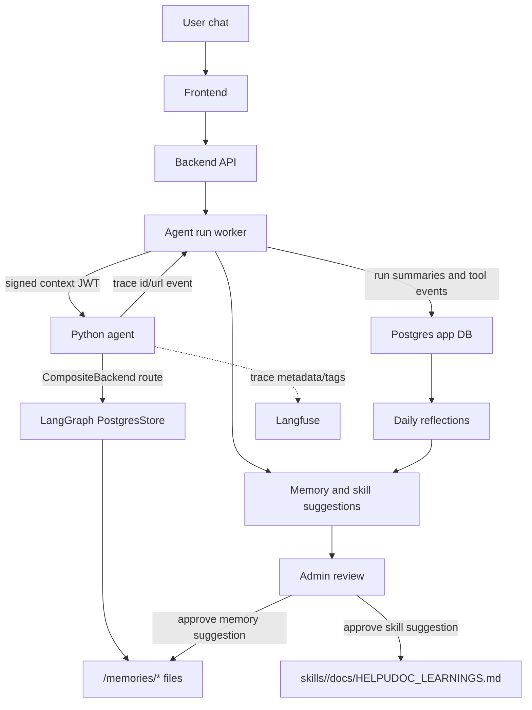

# Agent Self-Evolution, Memory, Reflection, and Langfuse

This document describes the HelpUDoc agent self-evolution feature set:

- user-owned long-term memory backed by DeepAgents native `/memories/*` files
- immutable run telemetry for daily admin reflection
- approval-gated skill evolution suggestions
- shared skill learnings in `HELPUDOC_LEARNINGS.md`
- Langfuse trace metadata for runs, users, conversations, workspaces, and skills

The goal is not to let the agent silently rewrite itself. The goal is a controlled learning loop: HelpUDoc observes completed runs, proposes durable improvements, and waits for user or admin approval before writing anything persistent.

## Goals

1. Capture immutable facts about agent runs and tool events.
2. Reflect on agent performance daily using those immutable facts.
3. Persist user-owned memory as native DeepAgents file memory instead of mutable conversation rows.
4. Learn routing preferences from user conversations and store them in approved memory files.
5. Learn shared skill improvements and store them in approved per-skill documentation.
6. Connect backend run metadata to Langfuse traces for user/session debugging.
7. Keep all long-term writes approval-gated.

## Non-Goals

- No autonomous memory mutation during normal chat runs.
- No row-based `user_memories` table as the agent-visible source of truth.
- No Mem0, LangSmith Deployment dependency, or Langfuse dependency for memory storage.
- No automatic editing of `SKILL.md` in v1. Shared improvements go to `docs/HELPUDOC_LEARNINGS.md`.
- No public API exposure of DeepAgents store internals or stripped memory paths.

## System Overview



There are two durable learning surfaces:

- User-owned memory files under `/memories/*`.
- Shared skill learning files under `skills/<skill_id>/docs/HELPUDOC_LEARNINGS.md`.

Normal workspace files still use the real filesystem backend. Only `/memories/*` is routed through the LangGraph store.

## Memory Model

HelpUDoc uses DeepAgents native long-term memory via a `CompositeBackend`:

```python
CompositeBackend(
    default=FilesystemBackend(...),
    routes={
        "/memories/": UserScopedStoreBackend(runtime),
    },
)
```

The default filesystem backend continues to handle regular workspace artifacts. The `/memories/` route uses `StoreBackend` semantics backed by the shared LangGraph store.

### Store Backend

The Python agent initializes one long-term store at startup:

- `AGENT_STORE_DATABASE_URL` when set
- otherwise `DATABASE_URL`
- otherwise the app Postgres connection pieces

`AGENT_STORE_USE_IN_MEMORY=true` is reserved for explicit dev/test fallback only.

Each user gets a stable namespace:

```text
(user_id, "helpudoc-memory")
```

The backend passes `user_id` and `workspace_id` through the agent runtime context and config so the store backend can resolve the namespace without relying on conversation text or JWT payload content as memory.

### Canonical Memory Files

The app-level contract is the full `/memories/...` path:

```text
/memories/global/preferences.md
/memories/global/context.md
/memories/global/skill-routing.md
/memories/workspaces/<workspace_id>/preferences.md
/memories/workspaces/<workspace_id>/context.md
/memories/workspaces/<workspace_id>/skill-routing.md
```

The internal `StoreBackend` may strip `/memories`, but no public backend or frontend API should expose stripped paths.

### Normal Run Behavior

On a fresh run, the agent receives a hidden memory preamble listing relevant existing memory files. The preamble includes clipped content for quick context and tells the agent:

- consult memory only when relevant
- treat it as approved long-term user memory
- do not modify `/memories/*` during normal chat runs

A mutation guard blocks `write_file`, `edit_file`, and similar mutation tools from writing under `/memories/*` unless the context explicitly enables backend-managed memory writes.

## User Memory APIs

User-facing memory is managed by the backend. The frontend never calls the Python store directly.

```text
GET /api/me/memory?workspaceId=<id>
PATCH /api/me/memory
GET /api/me/memory/suggestions?workspaceId=<id>
POST /api/me/memory/suggestions/:id/decision
```

`GET /api/me/memory` returns:

```ts
type UserMemoryView = {
  globalPreferences: string;
  globalContext: string;
  globalSkillRouting: string;
  workspacePreferences: string;
  workspaceContext: string;
  workspaceSkillRouting: string;
};
```

`PATCH /api/me/memory` accepts:

```json
{
  "scope": "global",
  "section": "skill-routing",
  "workspaceId": "optional-for-workspace-scope",
  "content": "full markdown replacement"
}
```

Valid sections are:

- `preferences`
- `context`
- `skill-routing`

## Agent Internal Memory APIs

The backend talks to private Python agent endpoints for memory I/O:

```text
GET /internal/memories?path=/memories/...
PUT /internal/memories
DELETE /internal/memories
```

These endpoints require the signed agent context token. They accept full `/memories/...` paths and hide store route-prefix handling.

## Daily Reflection

Daily reflection remains an admin feature. It uses immutable telemetry rather than reconstructing performance from mutable final conversation state.

### Immutable Inputs

The backend records:

- `agent_run_summaries`
- `agent_run_tool_events`

Run summaries include:

- run, turn, user, workspace, and conversation identifiers
- persona
- status
- detected `skillId`
- interrupt and tool-error counts
- queued, started, and completed timestamps
- metadata such as Langfuse trace ids

Tool events include:

- tool name
- event type
- event index
- summary
- output files
- raw event payload

### Reflection Snapshots

The daily job writes snapshot tables:

- `agent_daily_reflections`
- `agent_daily_reflection_breakdowns`

Snapshots are intentionally persisted. Regenerating a day replaces that dated snapshot rather than making the UI depend on live aggregation.

### Reflection APIs

```text
GET /api/settings/reflections/daily?date=YYYY-MM-DD
GET /api/settings/reflections/trends?days=N
POST /api/settings/reflections/generate
```

All reflection APIs are admin-only.

### Cron Job

The backend job is `backend/src/jobs/generateDailyReflection.ts`. GKE should run it once per day. Day boundaries use `ANALYTICS_TIMEZONE`, defaulting to `UTC`.

## Skill Evolution

Skill evolution is the admin-controlled shared learning loop for skills and routing.

### Inputs

Skill evolution can be triggered:

- automatically after completed or failed runs
- during daily reflection generation
- manually from the admin settings UI

The analysis prompt includes:

- run summary
- tool event timeline
- conversation excerpt
- current global and workspace `skill-routing.md`
- current candidate skill `HELPUDOC_LEARNINGS.md`

The analyzer returns strict JSON suggestions. The backend validates and stores only supported target kinds.

### Suggestion Targets

There are two target kinds:

```ts
type SkillEvolutionTargetKind =
  | "memory_skill_routing"
  | "skill_learnings";
```

`memory_skill_routing` updates one of:

```text
/memories/global/skill-routing.md
/memories/workspaces/<workspace_id>/skill-routing.md
```

`skill_learnings` updates:

```text
skills/<skill_id>/docs/HELPUDOC_LEARNINGS.md
```

The backend validates `skillId` with a conservative path-safe pattern before resolving any file path.

### Database Table

Skill evolution suggestions are stored in `skill_evolution_suggestions`.

Important columns:

- `targetKind`
- `memoryUserId`
- `memoryTargetPath`
- `targetSkillId`
- `workspaceId`
- `evidence`
- `rationale`
- `baseContentHash`
- `baseContentSnapshot`
- `proposedContent`
- `status`
- `reviewedContent`
- `reviewedAt`
- `reviewedByUserId`

`baseContentHash` protects approval from overwriting changed files. `baseContentSnapshot` lets admins compare the proposal with the content seen at proposal time.

### Staleness Semantics

There is at most one pending suggestion per target:

- memory skill routing: one pending row per user and target memory path
- skill learnings: one pending row per shared skill learning file

When a newer suggestion is created for the same target, older pending rows become `stale`.

Accepting or rejecting a non-pending row returns `409 Conflict`. If the target file hash no longer matches `baseContentHash`, approval also returns `409 Conflict` and marks the suggestion stale.

### Admin APIs

```text
GET /api/settings/skill-evolution/suggestions?status=pending|accepted|rejected|stale|all
POST /api/settings/skill-evolution/suggestions/:id/decision
POST /api/settings/skill-evolution/generate
```

Decision payload:

```json
{
  "decision": "accept",
  "editedContent": "optional full markdown replacement"
}
```

Manual generation payload:

```json
{
  "limit": 40
}
```

### Admin UI

The settings UI has a `Skill evolution` tab. It shows:

- pending suggestions
- target kind and target path
- rationale
- source run and conversation evidence
- read-only base content snapshot
- editable proposed content
- approve and reject actions
- manual generation from recent runs

Approving writes the full proposed or edited markdown content to the target.

## Shared Skill Learnings

The agent never edits `SKILL.md` directly in this v1 flow. Approved shared skill improvements are written to:

```text
skills/<skill_id>/docs/HELPUDOC_LEARNINGS.md
```

When skills are listed, the agent may include a short routing hint derived from this file. When a skill is loaded, the agent appends the approved learnings to the skill content under:

```markdown
## HelpUDoc approved learnings (docs/HELPUDOC_LEARNINGS.md)
```

This makes approved operational learning visible to the agent without changing the original skill instructions.

## Langfuse Tracing

Langfuse is optional and disabled by default.

Enable it in the Python agent environment:

```text
LANGFUSE_ENABLED=true
LANGFUSE_PUBLIC_KEY=...
LANGFUSE_SECRET_KEY=...
LANGFUSE_BASE_URL=https://cloud.langfuse.com
```

`LANGFUSE_TRACING_ENABLED=true` is still honored as a legacy opt-in.

### Metadata and Tags

The backend passes an `AgentTraceContext` into agent HTTP calls:

- `runId`
- `turnId`
- `userId`
- `workspaceId`
- `persona`
- `conversationId`
- `skillId` when known

The Python agent builds Langfuse metadata and tags from that context:

- session id prefers `conversationId`
- user id from `userId`
- workspace tag
- agent/persona tag
- environment tag
- run tag
- skill tag when known

If a skill is only discovered after `load_skill`, the agent patches the current trace metadata with `helpudoc_skill_id`.

At stream finalization, the Python agent emits:

```json
{
  "type": "langfuse",
  "traceId": "...",
  "traceUrl": "..."
}
```

`traceUrl` is resolved through the Langfuse SDK helper when available. If the SDK cannot resolve a project-scoped URL, the agent emits `traceId` without inventing a URL.

The backend merges `langfuseTraceId` and `langfuseTraceUrl` into run summary metadata.

## Configuration

Important environment variables:

```text
AGENT_STORE_DATABASE_URL
AGENT_STORE_USE_IN_MEMORY
DATABASE_URL
POSTGRES_HOST
POSTGRES_PORT
POSTGRES_DB
POSTGRES_USER
POSTGRES_PASSWORD
ANALYTICS_TIMEZONE
LANGFUSE_ENABLED
LANGFUSE_PUBLIC_KEY
LANGFUSE_SECRET_KEY
LANGFUSE_BASE_URL
LANGFUSE_HOST
SKILLS_ROOT
```

Model defaults:

```yaml
model:
  name: gemini-3-flash-preview
  fast_name: gemini-3-flash-preview
  lite_name: gemini-3.1-flash-lite-preview
```

`SKILLS_ROOT` must point to the shared skills directory visible to both the backend and Python agent. In deployment, approved `HELPUDOC_LEARNINGS.md` writes must land on the same mounted skills storage the agent reads.

## Data Ownership and Safety

User memory is user-owned:

- global memory is scoped to the user
- workspace memory is scoped by user namespace plus workspace path
- normal chat runs can read relevant memory but cannot mutate it
- memory suggestions require user approval

Shared skill learnings are admin-owned:

- suggestions are generated from user/run evidence
- admins must approve before writes happen
- accepted writes are full-file replacements
- stale-hash conflicts prevent overwriting changed files

Langfuse traces are observability artifacts:

- the app stores only trace id and URL metadata on run summaries
- raw memory is not injected through JWT payload fields
- JWT is used for identity/context, namespacing, and auth

## Key Files

Backend:

- `backend/src/services/agentRunService.ts`
- `backend/src/services/runTelemetryService.ts`
- `backend/src/services/dailyReflectionService.ts`
- `backend/src/services/userMemoryService.ts`
- `backend/src/services/userMemoryPaths.ts`
- `backend/src/services/skillEvolutionService.ts`
- `backend/src/services/databaseService.ts`
- `backend/src/api/meMemory.ts`
- `backend/src/api/settingsReflections.ts`
- `backend/src/api/settingsSkillEvolution.ts`
- `backend/src/services/agentService.ts`

Python agent:

- `agent/helpudoc_agent/app.py`
- `agent/helpudoc_agent/graph.py`
- `agent/helpudoc_agent/memory_store.py`
- `agent/helpudoc_agent/tool_guard.py`
- `agent/helpudoc_agent/langfuse_callbacks.py`
- `agent/helpudoc_agent/skills_registry.py`
- `agent/helpudoc_agent/tools_and_schemas.py`

Frontend:

- `frontend/src/components/chat/UserMemorySheet.tsx`
- `frontend/src/components/settings/SkillEvolutionTab.tsx`
- `frontend/src/components/settings/AgentSettingsTabs.tsx`
- `frontend/src/services/memoryApi.ts`
- `frontend/src/services/settingsApi.ts`
- `packages/contracts/src/types.ts`

Deployment/config:

- `agent/config/runtime.yaml`
- `backend/.env.example`
- `env/local/dev.env.example`
- `env/local/stack.env.example`
- `env/prod/config.env.example`
- `infra/docker-compose.yml`
- `infra/gke/templates/20-configmap.yaml`
- `infra/gke/bootstrap/20-configmap.demo.yaml`

## Operational Checks

Memory:

1. Add content to global or workspace memory from the user memory sheet.
2. Start a new thread for the same user.
3. Verify the hidden preamble lists the expected memory file.
4. Verify another user does not see that memory.
5. Verify `write_file` or `edit_file` cannot modify `/memories/*` in a normal run.

Skill evolution:

1. Complete a run with skill routing friction, tool errors, or explicit corrections.
2. Open `Settings -> Skill evolution`.
3. Generate suggestions manually if needed.
4. Review base content versus proposed content.
5. Approve a memory routing suggestion and confirm the relevant `/memories/.../skill-routing.md` changes.
6. Approve a skill learning suggestion and confirm `docs/HELPUDOC_LEARNINGS.md` appears under the skill.
7. Load that skill in a new run and confirm approved learnings are appended.

Reflection:

1. Run `POST /api/settings/reflections/generate`.
2. Confirm `agent_daily_reflections` and breakdown rows are written.
3. Confirm trend APIs return the regenerated day.

Langfuse:

1. Set `LANGFUSE_ENABLED=true` and Langfuse keys/URL.
2. Run a chat turn.
3. Confirm Langfuse receives trace metadata with user/session/workspace/run fields.
4. Confirm backend run summary metadata includes `langfuseTraceId`.
5. Confirm `langfuseTraceUrl` is present only when the SDK resolved a valid URL.

## Testing

Recommended coverage:

- run summary capture
- tool event capture
- daily rollups and trend windows
- idempotent regenerate/backfill behavior
- memory persistence across threads for the same user
- memory isolation across users
- workspace-vs-global memory resolution
- `FilesystemBackend` for workspace files and `StoreBackend` for `/memories/*`
- mutation guard for `/memories/*`
- skill evolution approval/rejection
- stale-hash conflict handling
- stale/non-pending decision conflicts
- writing approved skill learnings to the correct `HELPUDOC_LEARNINGS.md`
- Langfuse trace metadata extraction from stream events

Useful commands:

```bash
cd backend && npx tsc --noEmit
cd frontend && npx tsc -b --noEmit
python3 -m py_compile agent/helpudoc_agent/app.py agent/helpudoc_agent/langfuse_callbacks.py agent/helpudoc_agent/memory_store.py
python3 -m pytest tests/test_mcp_binding.py -q
python3 -m pytest tests/test_data_skill_family.py -q
```
