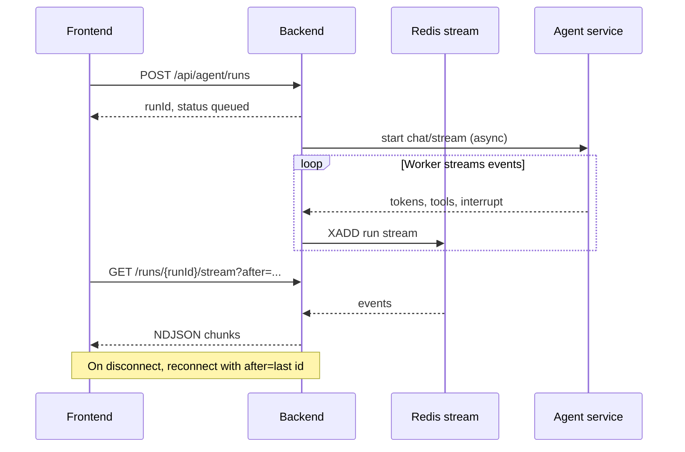
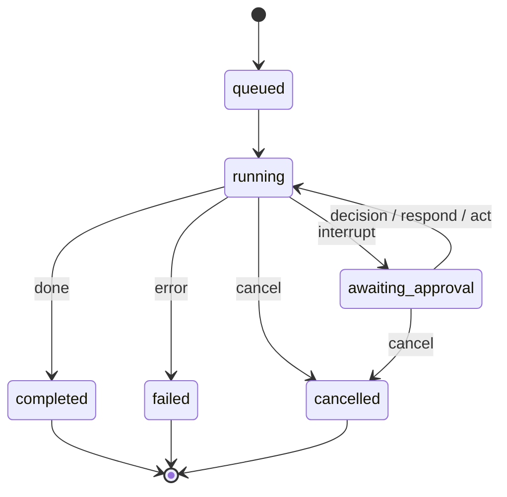
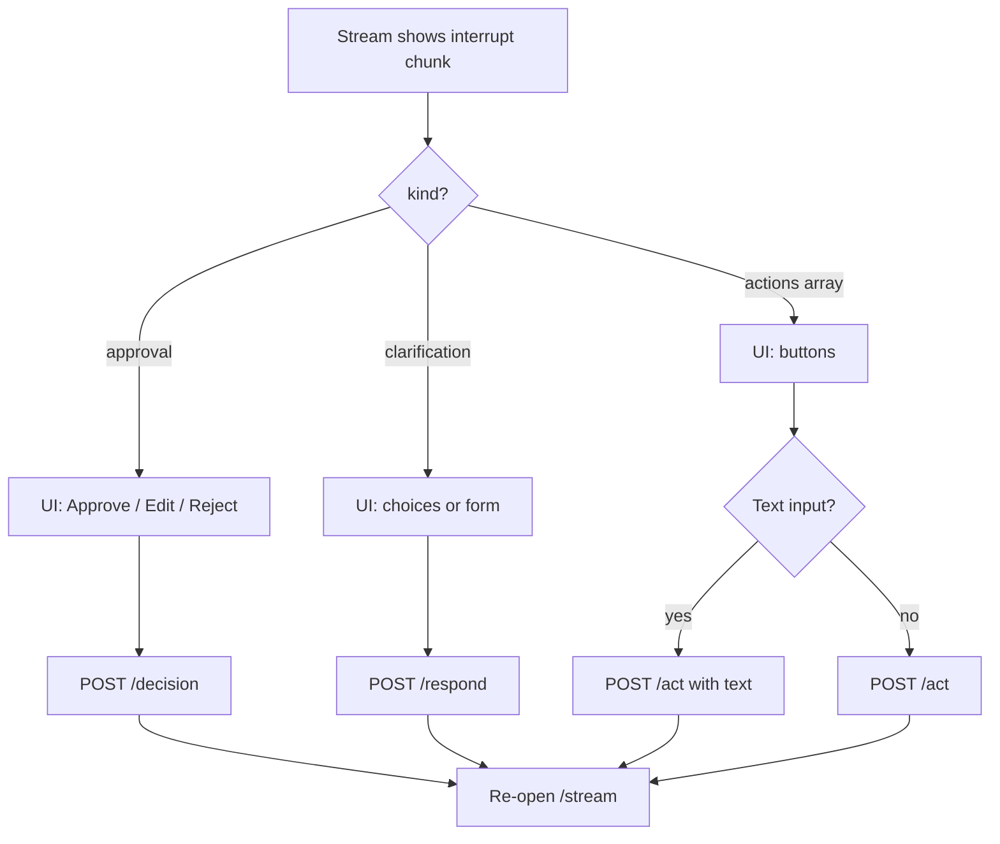

# Agent runtime guide

How HelpUDoc runs the assistant: which HTTP endpoints to use, how streaming works, and how human-in-the-loop (HITL) fits together.

The **workspace chat UI uses durable runs** (`POST /api/agent/runs`). Legacy endpoints still exist for scripts and older code paths but are not what new features should build on.

---

## Three ways to run the agent (backend)

All of these hit the **backend** at `/api/agent/*`. The backend forwards work to the Python agent service and (for durable runs) stores progress in Redis.

| Endpoint | Style | Connection | Resumable? | Used by product UI? |
| -------- | ----- | ------------ | ---------- | ------------------- |
| `POST /api/agent/run` | **Legacy synchronous** | Client holds one HTTP request until the full reply returns | No | No |
| `POST /api/agent/run-stream` | **Legacy streaming** | Client holds one HTTP request; body is JSONL chunks | No | Rarely (see `runAgentStream` in `agentApi.ts`) |
| `POST /api/agent/runs` | **Durable queued run** | Start returns immediately; client streams via `GET .../runs/:id/stream` | Yes | **Yes** (main chat) |

### Legacy synchronous — `POST /api/agent/run`

- **What happens:** Backend calls the agent and waits for the complete response, then returns JSON.
- **Good for:** One-off scripts, quick experiments, tests.
- **Bad for:** Browser chat — long requests time out, no partial UI, no HITL resume across disconnects, no conversation persistence integration.
- **You do not get:** `runId`, Redis stream, or `/decision` / `/respond` / `/act`.

### Legacy streaming — `POST /api/agent/run-stream`

- **What happens:** Same single long-lived POST as `/run`, but the response body is **newline-delimited JSON** (`application/jsonl`) as the agent produces chunks.
- **Good for:** Simple prototypes that need tokens on the wire without Redis.
- **Bad for:** Production chat — if the tab closes or the network blips, the stream is gone. HITL resume is awkward because there is no stable `runId` in the durable-run sense.
- **Frontend:** `frontend/src/services/agentApi.ts` → `runAgentStream()`. Prefer durable runs for new work.

### Durable runs — `POST /api/agent/runs` (recommended)

- **What happens:**
  1. Backend enqueues work, writes metadata (status, workspace, conversation, `turnId`), and returns `{ runId, status }` quickly.
  2. A worker talks to the agent and appends events to a **Redis stream** keyed by `runId`.
  3. The client opens **`GET /api/agent/runs/:runId/stream`** and reads NDJSON lines until the run reaches a terminal or waiting state.
- **Good for:** Workspace chat, Skill Builder, anything that needs cancel, reconnect, or HITL.
- **Frontend:** `startAgentRun()` → `streamAgentRun()` (wraps `streamAgentRunWithReconnect` from `@helpudoc/contracts`).



---

## Run status lifecycle

`GET /api/agent/runs/:runId` returns metadata including `status` and optional `pendingInterrupt`.

| Status | Meaning | Client should |
| ------ | ------- | ------------- |
| `queued` | Accepted, not yet executing | Stream or poll until `running` |
| `running` | Agent is working | Consume `/stream`; update UI from chunks |
| `awaiting_approval` | Paused for human input | Show interrupt UI; call **one** of `/decision`, `/respond`, or `/act` |
| `completed` | Turn finished successfully | Stop stream; persist final message |
| `failed` | Error | Show `error`; allow retry |
| `cancelled` | User or system cancelled | Stop stream |

After you submit HITL input, status usually goes back to `running` until the next interrupt or terminal state.



---

## Streaming durable runs

### `GET /api/agent/runs/:runId/stream`

- **Format:** `application/x-ndjson` — one JSON object per line.
- **Query:** `after` — Redis stream ID to resume after (e.g. `0-0` from the start, or last seen `id` on the chunk).
- **Keepalive:** `{"type":"keepalive"}` when no new events (client should not treat as terminal).
- **Chunk types:** See `AgentStreamChunk` in `packages/contracts/src/agentStream.ts` (`token`, `tool_start`, `tool_end`, `interrupt`, `done`, `error`, …).

### Reconnect

`streamAgentRunWithReconnect` in contracts:

1. Tracks the last chunk `id` from the stream.
2. On connection drop, reconnects with `?after=<lastId>` (up to 5 attempts).
3. Workspace UI stores `lastStreamId` per active run for tab refresh scenarios.

---

## HITL: three continuation endpoints

When `status === 'awaiting_approval'`, the run is paused. The stream may end until you resume. Check `pendingInterrupt.kind` and the UI you rendered from the `interrupt` chunk.

| Endpoint | Use when | Typical `pendingInterrupt.kind` |
| -------- | -------- | --------------------------------- |
| `POST .../runs/:runId/decision` | Plan/tool **approval** (approve / edit / reject) | `approval` (or missing kind with approval actions) |
| `POST .../runs/:runId/respond` | **Clarification** (free text, choices, structured Q&A) | `clarification` |
| `POST .../runs/:runId/act` | User tapped a structured **button** from `pendingInterrupt.actions` | Either; action-driven |

Calling the wrong endpoint returns **`409`** (e.g. clarification run + `/decision`).

### `/decision` — approval flow

```json
{
  "decision": "approve",
  "editedAction": { "name": "request_plan_approval", "args": {} },
  "message": "optional note when rejecting"
}
```

- `approve` — continue as proposed.
- `edit` — send modified tool name/args (often plan approval).
- `reject` — stop or revise with `message`.

Maps to agent `chat/stream/resume` with LangGraph decisions.

### `/respond` — clarification flow

```json
{
  "message": "optional prose answer",
  "selectedChoiceIds": ["choice-a"],
  "selectedValues": ["value-a"],
  "answersByQuestionId": { "q1": "answer", "q2": ["a", "b"] }
}
```

At least one field must be present. Used for multi-question forms and slash-skill discovery prompts.

Maps to agent `chat/stream/respond`.

### `/act` — button actions

```json
{
  "actionId": "submit-discovery",
  "text": "required if that action has inputMode text"
}
```

`actionId` must match an entry in `pendingInterrupt.actions` from run metadata or the interrupt chunk.

Maps to agent `chat/stream/act`.



After any continuation, **open the stream again** (same `runId`) to receive further tokens/tools until `completed` / `failed` / next interrupt.

---

## Other run endpoints

| Endpoint | Purpose |
| -------- | ------- |
| `GET /api/agent/runs/:runId` | Poll metadata, `pendingInterrupt`, errors |
| `POST /api/agent/runs/:runId/cancel` | Cancel in-flight work |

---

## Request body shared by all run modes

`POST /run`, `/run-stream`, and `/runs` accept the same core body (see [reference — Agent run request body](reference.md#agent-run-request-body)).

Important fields for chat:

| Field | Role |
| ----- | ---- |
| `persona` | `fast`, `pro`, or skill-routed persona |
| `prompt` | User message (backend may enrich `@file` tags) |
| `workspaceId` | Required |
| `conversationId` | Ties run to persisted thread (durable runs) |
| `turnId` | Correlates user + agent messages for one turn |
| `history` | Prior turns for the agent |
| `fileContextRefs` | Derived-artifact refs from `/files/context` |
| `currentTurnFileIds` | Inline multimodal attachments for this turn |
| `taggedFiles` | Explicit `@path` hints |
| `internetSearchEnabled` | Toggle web search tools |

---

## Agent service (direct)

Browsers should **not** call `http://localhost:8001` in production. The backend proxies chat and signs JWTs.

For debugging, FastAPI exposes the same concepts under `/agents/{name}/workspace/{id}/chat/...` — see [reference — Agent service API](reference.md#agent-service-api).

Skill Builder admin UI uses the same durable pattern under `/api/settings/skill-builder/runs/*` (no `conversationId` in the same way; dedicated workspace per admin user).

---

## Frontend map

| Concern | Module |
| ------- | ------ |
| Start / stream / HITL | `frontend/src/services/agentApi.ts` |
| Stream types + reconnect | `packages/contracts/src/agentStream.ts` |
| Chat orchestration | `frontend/src/features/workspace/WorkspacePage.tsx` |
| Interrupt UI | `frontend/src/components/chat/ChatMessageBubble.tsx` |

---

## Related

- [Integration guide](integration-guide.md) — end-to-end client flow  
- [File & attachment flow](file-attachment-flow.md) — `fileContextRefs` and uploads  
- [API reference](reference.md) — exact paths and schemas  
