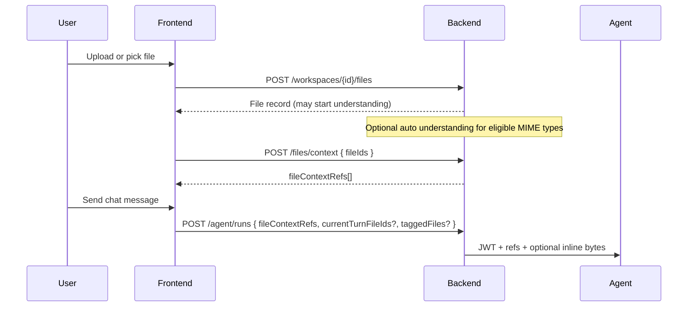

# File & attachment flow guide

How workspace files become **agent context**: upload, optional “understanding” (derived artifacts), context refs, attachment prep jobs, and what to pass into `POST /api/agent/runs`.

Frontend orchestration lives mainly in `WorkspacePage.tsx`, `fileApi.ts`, and `attachmentPrepApi.ts`.

---

## Concepts

| Concept | What it is |
| ------- | ---------- |
| **Workspace file** | Row in DB + blob in object storage / workspace root (`GET/POST .../files`) |
| **Understanding** | Background derivation of markdown/summary for large docs (`understandingStatus` on file list) |
| **File context ref** | Stable handle tying a source file to a derived artifact version (`FileContextRef` in contracts) |
| **Attachment prep job** | Async import + ref build for Drive or workspace files before send |
| **Current-turn multimodal** | PDF/image bytes inlined in the agent request via `currentTurnFileIds` |

---

## End-to-end flow (happy path)



---

## Step 1 — Upload or create files

### Binary upload

```http
POST /api/workspaces/:workspaceId/files
Content-Type: multipart/form-data
```

| Field | Description |
| ----- | ----------- |
| `file` | File bytes (required) |
| `path` | Optional relative path / filename |

**Response `201`:** file object with `id`, `name`, `mimeType`, `publicUrl`, etc.

### Text file

```http
POST /api/workspaces/:workspaceId/files/text
Body: { "name", "content", "mimeType?" }
```

### Google Drive import

1. `GET .../files/drive/search?query=&scope=&pageToken=`
2. `POST .../files/drive/import` with `{ fileIds: ["driveId", ...] }` (requires user Google OAuth token)

---

## Step 2 — Understanding (derived artifacts)

For eligible types (PDF, Office, etc.), upload may **automatically enqueue understanding**. Poll via file list:

```http
GET /api/workspaces/:workspaceId/files
```

Check per file:

- `understandingStatus` — `pending` | `partial` | `ready` | `failed` | `superseded`
- `understandingMode` — `part` | `parser` | `hybrid`
- `derivedArtifactFileId` — linked derived file when ready

The agent service can also run understanding on demand:

```http
POST http://localhost:8001/attachments/understand
```

(Backend-internal; not for browser clients.)

---

## Step 3 — Build context refs

Before starting a run (or when user attaches files to the composer), resolve refs:

```http
POST /api/workspaces/:workspaceId/files/context
Body: { "fileIds": [1, 2, 3] }
```

**Response `201`:**

```json
{ "fileContextRefs": [ { "sourceFileId", "artifactId", "status", "effectiveMode", ... } ] }
```

Store refs on the **agent message metadata** and pass the same array in `POST /api/agent/runs`.

Refs encode which derived artifact version the agent should read. If the source file changes, fingerprint/version changes and refs may need refresh.

---

## Step 4 — Attachment prep jobs (Drive + multi-file)

When the composer attaches Google Drive files or needs async prep before send:

```http
POST /api/workspaces/:workspaceId/attachments/jobs
Body: {
  "conversationId": "...",
  "turnId": "...",
  "driveFileIds": ["..."],
  "sourceFileIds": [1, 2]
}
```

Poll:

```http
GET /api/workspaces/:workspaceId/attachments/jobs/:jobId
```

When `status === 'ready'`, use `result.fileContextRefs` (or fall back to calling `/files/context` on imported workspace file ids).

Workspace UI merges prep refs with mention-based refs before `startAgentRun`.

---

## Step 5 — Start agent run

```http
POST /api/agent/runs
```

| Field | When to use |
| ----- | ----------- |
| `fileContextRefs` | After `/files/context` or attachment job — primary document context |
| `currentTurnFileIds` | Small PDF/images for **this turn only** — backend inlines base64 if under size cap (~8MB default) |
| `taggedFiles` | Paths user typed with `@filename` — backend enriches prompt + image URLs |

You can combine all three. Prefer refs for large documents; use `currentTurnFileIds` for “look at this screenshot now.”

### RAG indexing status (optional UI)

```http
POST /api/workspaces/:workspaceId/files/rag-status
Body: { "files": ["path/a.pdf", "path/b.md"] }
```

Shows whether workspace RAG has indexed each path (does not replace `fileContextRefs`).

---

## Preview and editing (non-agent)

| Need | Endpoint |
| ---- | -------- |
| List + folders | `GET .../files`, `GET .../files/folders` |
| Read content | `GET .../files/:fileId/content` |
| Save | `PUT .../files/:fileId/content` |
| Preview in UI | `GET .../files/preview?path=` or `.../preview/raw?path=` |

Collaborative editing uses the **Yjs WebSocket** (`COLLAB_PORT`), not these REST routes.

---

## Tagging files in prompts

Users type `@notes.md` in the composer. Backend `injectTaggedFileUrls`:

- Adds a “tagged files” section to the prompt for RAG/tool routing
- Adds public HTTP URLs for tagged **images** so the model can embed them in HTML/Markdown

Explicit `taggedFiles` in the run body skips parsing the prompt for `@` mentions.

---

## Failure modes

| Symptom | Check |
| ------- | ----- |
| Agent ignores large PDF | `fileContextRefs` missing or `status` not `ready` |
| Upload OK but no understanding | MIME not eligible; check `understandingError` |
| Drive attach fails | User lacks Google token (`400` from drive routes) |
| Multimodal skipped | File over `CURRENT_TURN_MULTIMODAL_MAX_BYTES`; use refs instead |
| Stale context after edit | Re-POST `/files/context` after content change |

---

## Types

`File`, `FileContextRef`, `AttachmentPrepStatus` — `@helpudoc/contracts` (`packages/contracts/src/types.ts`).

---

## Related

- [Agent runtime guide](agent-runtime-guide.md) — run + stream after context is ready  
- [Integration guide](integration-guide.md) — conversation + message persistence  
- [API reference](reference.md) — file route details  
