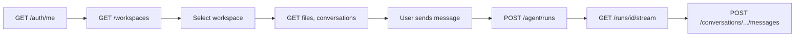

# Integration guide

How **frontend and other clients** should call HelpUDoc. This guide describes patterns, not every endpoint (see [API reference](reference.md)).

## Golden rules

1. **Call the backend only** — base path `/api` (e.g. `http://localhost:3000/api` or `/api` behind the Vite/nginx proxy). Do not call the agent service (`:8001`) from the browser.
2. **Use durable agent runs for chat** — `POST /api/agent/runs` + `GET .../stream`. See [Agent runtime guide](agent-runtime-guide.md).
3. **Send credentials** — `fetch(..., { credentials: 'include' })` so session cookies work in OIDC/hybrid mode.
4. **Reuse `@helpudoc/contracts`** — types for workspaces, files, stream chunks, interrupts.

---

## Configuration

| Variable | Typical value | Purpose |
| -------- | ------------- | ------- |
| `VITE_API_URL` | `/api` or `http://localhost:3000/api` | API base (see `frontend/src/config/env.ts`) |
| `VITE_AUTH_MODE` | `auto` / `headers` / `oidc` | Whether to send header identity |

Implementation: `frontend/src/services/apiClient.ts` exports `API_URL` and `apiFetch()`.

---

## Authentication

### Check session

```http
GET /api/auth/me
```

Use response `authenticated` and `user` to gate the app. `authMode` tells you whether Google sign-in is expected.

### Sign in (production)

1. Redirect user to `GET /api/auth/google/start?returnTo=/workspace/...`
2. Google redirects to backend callback; backend sets session cookie.
3. Frontend loads with cookie; `GET /api/auth/me` returns `user`.

### Local development (`AUTH_MODE=headers`)

`apiFetch` attaches when the stored auth user is “local”:

- `X-User-Id` (required)
- `X-User-Name`
- `X-User-Email`

See root [README](../../README.md) for `VITE_AUTH_MODE=headers` and seeding `localStorage` for Playwright.

### Sign out

```http
POST /api/auth/logout
```

---

## Typical workspace session flow



### 1. Load workspaces

```http
GET /api/workspaces
```

### 2. Open workspace

```http
GET /api/workspaces/:workspaceId
GET /api/workspaces/:workspaceId/files
GET /api/workspaces/:workspaceId/conversations?limit=5
```

### 3. Create or resume conversation

```http
POST /api/workspaces/:workspaceId/conversations
Body: { "persona": "fast" }
```

```http
GET /api/conversations/:conversationId
```

### 4. Slash commands metadata (optional)

```http
GET /api/agent/slash-metadata
```

Returns skills and MCP servers the user may invoke with `/skill` in the composer.

### 5. Send a chat turn (durable run)

Persist the user message first (or in parallel), then:

```http
POST /api/agent/runs
```

Body (minimal):

```json
{
  "workspaceId": "...",
  "conversationId": "...",
  "persona": "fast",
  "prompt": "Summarize @notes.md",
  "turnId": "uuid-for-this-turn",
  "history": [{ "role": "user", "content": "..." }],
  "taggedFiles": ["notes.md"],
  "fileContextRefs": [],
  "currentTurnFileIds": [],
  "internetSearchEnabled": false
}
```

Response: `{ "runId", "status" }`.

### 6. Stream events

```http
GET /api/agent/runs/:runId/stream?after=0-0
```

Parse each line as JSON. Handle `interrupt` → show HITL UI → call `/decision`, `/respond`, or `/act` → **stream again** with the same `runId`.

Use `streamAgentRun` / `streamAgentRunWithReconnect` from `@helpudoc/contracts` rather than hand-rolling reconnect logic.

### 7. Persist agent message

As chunks arrive, update local UI; when the turn completes, persist via:

```http
POST /api/conversations/:conversationId/messages
```

Include `metadata` (`toolEvents`, `pendingInterrupt`, `runId`, `status`) so refresh restores state. See `ConversationMessageMetadata` in contracts.

### 8. Cancel (optional)

```http
POST /api/agent/runs/:runId/cancel
```

---

## What not to use for new chat features

| Avoid | Use instead |
| ----- | ----------- |
| `POST /api/agent/run` | `POST /api/agent/runs` |
| `POST /api/agent/run-stream` | Durable run + `/stream` |
| Direct agent `:8001` URLs | Backend `/api/agent/*` |

Legacy streaming remains in `agentApi.runAgentStream()` for narrow cases only.

---

## Files and attachments

Uploads and derived context are a multi-step flow. Do not only call `/agent/runs` with raw file IDs without reading:

**[File & attachment flow](file-attachment-flow.md)**

---

## Admin / settings UI

Routes under `/api/settings` and `/api/users` require **system admin**. The settings app uses `frontend/src/services/settingsApi.ts`.

See **[Admin guide](admin-guide.md)**.

---

## Error handling

- Expect `{ "error": "message" }` with 4xx/5xx.
- `401` — missing auth; redirect to login or show header-auth setup.
- `409` on HITL — wrong continuation endpoint for current interrupt type.
- Stream parse errors — log line, continue; reconnect via `after` cursor.

---

## Code references

| Area | Path |
| ---- | ---- |
| HTTP wrapper | `frontend/src/services/apiClient.ts` |
| Agent runs | `frontend/src/services/agentApi.ts` |
| Files | `frontend/src/services/fileApi.ts` |
| Attachment prep | `frontend/src/services/attachmentPrepApi.ts` |
| Workspaces / conversations | `frontend/src/services/workspaceApi.ts`, conversation helpers in workspace feature |
| Shared stream client | `packages/contracts/src/agentStream.ts` |

---

## Related

- [Agent runtime guide](agent-runtime-guide.md)  
- [API reference](reference.md)  
- [Environment setup](../environment.md)  
