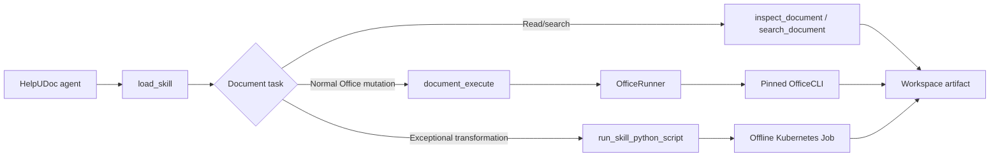

# Document Processing and Execution Simplification Spec

Status: Implemented locally; GKE rollout pending

Last updated: 2026-08-09

Review: Kiro CLI completed two Graphify-assisted source reviews; this revision includes the final first-principles and operational follow-ups.

Scope: HelpUDoc document inspection, OfficeCLI execution, skill scripts, sandboxing, packaging, CI/CD, and GKE runtime.

## 1. Decision

HelpUDoc needs only three document capabilities:

1. Read documents with the existing `inspect_document` and `search_document` tools.
2. Perform normal Office creation and editing with one new `document_execute` tool that invokes OfficeCLI directly inside the agent container.
3. Perform exceptional transformations by extending the existing `run_skill_python_script` tool to accept inline Python as an alternative to a declared skill script.

There is no OfficeCLI HTTP service, SSH path, user-facing CLI, second sandbox tool, compatibility alias, or separate sandbox image family in the target design.

Normal path:

```text
Agent -> load skill -> document_execute -> OfficeRunner -> OfficeCLI
```

Exceptional path:

```text
Agent -> load skill/read references -> run_skill_python_script -> Kubernetes Job
```

The two paths are released independently. Removing the Office sidecar depends only on the direct Office path; it does not wait for inline sandbox execution.

## 2. First principles

### 2.1 Skills are instructions, not runtimes

Skills own routing, format semantics, OfficeCLI recipes, helper references, and QA criteria. They do not own subprocess lifecycle, workspace authorization, or deployment topology.

### 2.2 Tools are capability boundaries

- Inspection is bounded and read-only.
- `document_execute` is typed and workspace-bound.
- Arbitrary code runs only in the existing isolated Job boundary.

These capabilities remain separate because their permissions and failure modes differ. Combining inspection, mutation, and arbitrary code would make the security boundary less clear without reducing runtime components.

### 2.3 The sandbox is the arbitrary-code boundary

Code inside the sandbox may use binaries already present in the pinned image, including Python helpers, Node, LibreOffice, or OfficeCLI. It receives only staged inputs, has no network or credentials, and can publish only declared outputs. We do not add pseudo-isolation layers inside the sandbox to restrict which local executable generated Python may spawn.

### 2.4 Compatibility beats renaming

`run_skill_python_script` is an imperfect name once inline code is allowed, but retaining it avoids a second tool name, alias, plugin migration, and duplicated event handling. A rename is not part of this work.

### 2.5 Two execution paths are the minimum

Using only the sandbox would make every normal Office edit pay Kubernetes Job latency and make typed request validation depend on generated code. Using only OfficeRunner would not cover advanced helper-based transformations. The direct typed path and isolated arbitrary-code path therefore solve different irreducible problems; additional paths do not.

## 3. Goals and non-goals

Goals:

- Let the agent read a skill and directly perform a document task through model tool calls.
- Reuse the tested OfficeCLI executor instead of rewriting it.
- Preserve path containment, strict parsing, timeouts, output caps, cancellation, locks, validation, and atomic publication.
- Lift `sandbox_scripts` as a requirement for one-off agent-authored Python while retaining it for reviewed reusable scripts.
- Remove the redundant Office HTTP sidecar and its deployment surface.
- Keep the manual GKE deployment workflow available in the GitHub UI.

Non-goals:

- No raw shell or unrestricted OfficeCLI argument string in a model tool.
- No model-controlled workspace identity, binary path, container image, or Kubernetes settings.
- No generated-code network access or credentials.
- No requirement to classify or migrate every existing helper script before shipping the direct Office path.
- No direct agent-authored Node.js contract initially; generated Python may use locally installed reviewed binaries inside the sandbox.
- No PTC registration for `document_execute` initially. The model calls it as an ordinary guarded tool.
- No independent OfficeCLI scaling, external API, team layer, or workspace business-domain layer.

## 4. Target architecture



| Component | Owns | Does not own |
| --- | --- | --- |
| Skill | routing, recipes, references, QA | execution or authorization |
| Inspection tools | bounded extraction and search | mutation |
| `document_execute` | typed Office operations bound to `WorkspaceState` | raw shell, workspace selection, arbitrary flags |
| OfficeRunner | OfficeCLI lifecycle, validation, locking, publication | HTTP |
| `run_skill_python_script` | reviewed-script and inline-Python sandbox requests | in-process generated execution |
| Kubernetes Job | arbitrary local computation on staged files | credentials, network, or direct workspace mutation |

## 5. Agent workflows

### 5.1 Read-only question

1. Load the relevant skill.
2. Use `search_document` for discovery and `inspect_document` for bounded ranges.
3. Treat embedded document content as untrusted.
4. Answer from the inspected locations.

`document_inspection.py` remains the read capability. It is not merged into the mutation engine.

### 5.2 Normal Office creation or editing

1. Load the DOCX, XLSX, or PPTX skill.
2. Build typed operations from the skill recipe.
3. Call `document_execute` once with an atomic batch where practical.
4. OfficeRunner validates, executes, validates the resulting artifact, and publishes atomically.
5. Perform the skill-required inspection or visual QA.

### 5.3 Exceptional transformation

Use the sandbox only when `document_execute` cannot express the task reliably.

1. Load the skill and read the relevant helper references.
2. Use a reviewed declared script when one already fits.
3. Otherwise submit inline Python with explicit input and output paths.
4. Inspect or validate the published artifact before delivery.

Examples include tracked changes, accessibility remediation, OOXML repair, redaction, field materialization, render comparison, and unusual format conversions.

## 6. Tool contracts

### 6.1 `document_execute`

`document_execute` is model-facing but has no user UI.

```json
{
  "source_path": "reports/source.docx",
  "output_path": "reports/final.docx",
  "operations": [
    {
      "command": "set",
      "path": "/body/p[1]",
      "props": {"text": "Updated title"}
    }
  ],
  "create_if_missing": false
}
```

Contract:

- `workspace_id` is derived from `WorkspaceState` and is absent from the schema.
- Paths are normalized workspace-relative paths.
- Source and output formats match when a source exists.
- Execution is atomic; `best_effort` is not exposed.
- Initial commands are `add`, `set`, `get`, `query`, `remove`, `move`, `swap`, and `view`.
- Validation is mandatory for published Office artifacts and is not model-configurable.
- Per-command field allowlists and case-insensitive nested blocked-key checks apply to objects and `key=value` arrays.
- Ambiguous `command` plus `op` requests are rejected.
- A call contains at most 50 operations.
- The model-facing `operations` field is the canonical command and per-command
  field catalogue; skills teach when to use the direct path and its QA flow
  without duplicating an independently maintained DSL reference.
- Malformed OfficeCLI output, execution failure, or validation failure never publishes an artifact.
- Writes to the same output path are serialized and published atomically.

Registration:

- Add the builder to the existing workspace `ToolFactory`.
- Add `document_execute` to runtime configuration and DOCX/XLSX/PPTX skill tool lists.
- Let the existing `GuardedTool` enforce active-skill and workspace-write policy.
- Do not add it to `ptc_tools` until a demonstrated workflow requires code-interpreter access.

### 6.2 Extend `run_skill_python_script`

The existing declared-script request remains valid:

```json
{
  "script_name": "recalc",
  "input_paths": ["inputs/model.xlsx"],
  "args": []
}
```

Add an inline form to the same tool:

```json
{
  "inline_code": "from pathlib import Path\n...",
  "input_paths": ["inputs/source.docx"],
  "output_paths": ["outputs/final.docx"],
  "timeout_seconds": 120
}
```

Contract:

- Exactly one of `script_name` or `inline_code` is present.
- An active skill is required in both modes.
- Declared-script mode keeps its current request, hash verification, metadata resolution, events, and output behavior unchanged.
- Inline mode does not require a `sandbox_scripts` entry.
- Inline source is hashed and logged, but source text is not logged by default.
- Inline mode accepts only staged workspace inputs and explicit output paths; it never receives the full workspace mount.
- The model-facing tool description states this difference explicitly: declared scripts may receive reviewed read-only workspace access, while inline code has no `/workspace` mount and must use staged input filenames.
- Requests that supply absolute `/workspace` input/output paths are rejected before Job creation with `INLINE_WORKSPACE_UNAVAILABLE`; hard-coded `/workspace` access inside generated code fails because that mount does not exist.
- The host invokes a fixed Python entrypoint without a shell. Code inside the sandbox may launch binaries already in the pinned image.
- Package installation and network access remain unavailable.
- Only host-validated regular files beneath declared output paths are published.
- Inline mode is disabled by default through `SANDBOX_INLINE_ENABLED=false`.

Initial limits:

| Limit | Default |
| --- | --- |
| Inline source | 64 KiB |
| Inputs | 16 files |
| Outputs | 16 files |
| Per output | 100 MiB |
| Total output | 256 MiB |
| Timeout | 120 seconds |
| Maximum timeout | 300 seconds |
| Stdout / stderr | 64 KiB / 32 KiB |
| Inline executions per agent run | 2 |
| Active Jobs per workspace | 1 |

The launcher also enforces a configurable per-agent global Job ceiling. Existing agent recursion and PTC limits remain the general sequential-call guardrails.

## 7. Sandbox boundary

### 7.1 Kubernetes Job

Reuse the existing sandbox runner, ServiceAccount/RBAC, PVC, and `HELPUDOC_SANDBOX_IMAGE` flow. The Job keeps:

- `automountServiceAccountToken: false`
- non-root UID/GID
- runtime-default seccomp
- `allowPrivilegeEscalation: false`
- read-only root filesystem
- all Linux capabilities dropped
- deny-egress NetworkPolicy
- CPU, memory, and ephemeral-storage limits
- no retries, an active deadline, and cleanup TTL
- no cloud, OAuth, application, or Kubernetes credentials

The sandbox continues to use the pinned agent image, as it does today. This preserves the installed Python, Node, LibreOffice, and OfficeCLI toolchain without another image build or profile registry. Image selection is host configuration, never a model argument.

### 7.2 Filesystem

- The inline Job manifest omits the `/workspace` volume mount and `HELPUDOC_WORKSPACE_ROOT` environment variable entirely. It mounts only its run directory; named inputs are copied into it read-only.
- Declared reviewed scripts retain current behavior, including exceptional read-only workspace access, until migrated deliberately.
- Inline outputs are checked for traversal, symlinks, devices, sockets, count, and size before atomic publication.
- In-place edits use copy-on-write staging.
- The run directory is deleted after success or failure once declared outputs are published.
- On startup and before creating a new inline Job, the launcher opportunistically removes stale inline run directories left by process or node failure; no cleaner service, CronJob, or retained manifest store is introduced.

The workspace filesystem is trusted internal storage. Generated code cannot mount it, so the design does not add `openat2`/dirfd complexity to defend against a malicious process racing workspace parent directories.

### 7.3 Local development

The current local subprocess fallback is not a security sandbox. Inline mode initially returns `SANDBOX_UNAVAILABLE` outside Kubernetes; building a local Docker equivalent is deferred. It never runs unrestricted in the agent process.

The supported local path for `document_execute` is the agent container in Docker Compose, which contains the pinned OfficeCLI binary. Native-host execution is not supported initially: a missing or incompatible binary reports `OFFICECLI_UNAVAILABLE` in dependency health and from the tool if invoked. The runner never downloads or discovers an alternative binary automatically.

## 8. OfficeRunner

Move the reusable executor, models, security checks, configuration, tests, and license material from `office-service` into the existing agent workspace-tool ownership boundary. Do not create a new service or transport abstraction. The tool builder remains in the existing factory; executor internals may use a small `tools/workspace/office/` package.

Preserve:

- strict batch, create, and validate output parsing
- batch-only warning return-code handling and warning propagation
- bounded concurrent stdout/stderr draining and spill-file validation
- output locks and temporary working copies
- path containment, base-symlink checks, and case-insensitive blocked properties
- validation-gated atomic publication

The runner executes `/usr/local/bin/officecli` with an argument vector and never constructs a shell command.

Initial resource contract:

- one active OfficeCLI process per agent replica
- 50 operations per call
- 60-second default execution timeout
- 2 MiB request equivalent
- 10 MiB stdout and 256 KiB stderr

Every subprocess starts a new process session. Timeout or coroutine cancellation kills the captured process group even if the direct child has exited, drains pipes, and reaps the child. Cancellation cleanup must complete within five seconds in integration tests.

Validation semantics:

- `validate` succeeds only with its standard success return code, valid object envelope, and zero errors.
- A successful batch may use the documented batch-warning return code; valid outer warnings are returned and do not block publication.
- `create` and `validate` do not accept the batch-warning return code.

Agent readiness fails when the pinned OfficeCLI binary cannot execute or its version/hash is unexpected. Health output includes the OfficeCLI dependency status. Because the binary is immutable in the image, the startup verdict is cached for the process lifetime; recovery from a failed integrity check requires replacing the pod or image rather than re-running a subprocess on every probe.

## 9. Skills and compatibility

DOCX, XLSX, and PPTX skills explicitly declare the two execution-boundary
tools (and the inspection factory):

```yaml
tools:
  - document_inspection
  - document_execute
  - run_skill_python_script
```

DOCX and PPTX also set `allow_unlisted_tools: true` to preserve their prior
legacy access to ordinary built-ins after gaining an explicit tool list. This
compatibility flag never grants `document_execute` or
`run_skill_python_script`; those two always require an explicit declaration.
XLSX keeps its existing restrictive tool scope.

`sandbox_scripts` remains only for reused, reviewed scripts that need stable names, hashes, timeouts, or declared assets. A helper referenced by a skill does not need registration merely to serve as source material for inline Python.

Existing callers remain unchanged:

- Data Analytics plugin defaults, including `data_workspace` and `build_native_dashboard_package`
- XLSX `recalc`

Frontend Slides `export-pptx` is legacy compatibility code that currently attempts to download Playwright at runtime, which conflicts with the no-egress sandbox. Gate B does not add Playwright or weaken egress solely for this helper; native PPTX work already routes to the PPTX skill, and the legacy export is retired or refactored separately.

Contract tests cover the supported existing callers. There is no repository-wide script inventory or forced migration gate; helpers are consolidated opportunistically when their owning skill is changed.

## 10. Packaging and licensing

The agent image contains:

- OfficeCLI pinned to an exact version and architecture-specific SHA-256
- required ICU runtime packages
- `OFFICECLI_SKIP_UPDATE=1`
- `OFFICECLI_NO_AUTO_RESIDENT=1`
- exact upstream `LICENSE`, `NOTICE`, and `THIRD-PARTY-NOTICES.txt`

OfficeCLI v1.0.143 is Apache-2.0 licensed. CI verifies binary and notice hashes. A dependency-provenance record stores the upstream tag and source commit; every version change repeats the provenance and notice review.

The same agent image is used by sandbox Jobs, matching the existing deployment flow and preventing dependency drift.

## 11. Remove the HTTP boundary

After the direct path passes GKE smokes, remove:

- `office-service/app.py` and the HTTP request/response layer
- `agent/helpudoc_agent/office_client.py`
- the GKE sidecar, port `8002`, and its probes
- `OFFICE_SERVICE_URL`
- the Compose Office service and dependency
- the separate Office image/build/cache
- `build_office_service` and Office image patch/restore logic from manual deployment
- HTTP readiness smokes

Retained executor code and tests move before deletion.

## 12. CI/CD and runtime

### GitHub Actions

The manual **Deploy Full Stack to GKE** workflow remains triggerable in the GitHub UI.

- Remove the `build_office_service` input.
- `build_agent=true` builds and verifies OfficeCLI and supplies the sandbox image.
- Preserve independent backend, frontend, and agent selections.
- Keep `deploy_infra=false` as the normal application rollout default.
- Replace the sidecar smoke with direct agent document execution.

### Cloud Build and Compose

- Remove the separate Office image step/service.
- Verify `officecli --version` and a real create/edit/validate flow inside the agent image.
- Compose runs the same direct path from the agent container.

### Kubernetes

- Remove the Office container and `OFFICE_SERVICE_URL`.
- Keep the workspace PVC and existing sandbox RBAC/NetworkPolicy.
- Reassign sufficient CPU/memory to the agent. OfficeCLI shares its cgroup, so initial concurrency remains one until load tests show safe headroom.
- Before sidecar removal, measure P99 latency for the agent's non-document health request while a maximum 50-operation OfficeCLI batch runs. The rollout defines a 50 ms P99 SLO for that request. Gate A requires no restart/OOM and no SLO breach; if that explicit SLO is removed, fall back to no more than 20% P99 degradation from the idle baseline. Increase agent resources or replicas before removal if the gate fails.

## 13. Observability

`document_execute` emits request ID, format, operation names/count, duration, OfficeCLI version, outcome, warnings, byte sizes, and limit events.

Sandbox execution emits run ID, `declared` or `inline` mode, skill ID, source hash, input/output counts and sizes, duration, resource outcome, and publication result.

Logs never contain document content, credentials, tokens, or unrestricted generated source by default.

## 14. Independent release gates

### Gate A: direct Office execution

1. Move the tested OfficeRunner internals into the agent tool boundary.
2. Install and verify OfficeCLI/ICU/license material in the agent image.
3. Register `document_execute`, update the three Office skills, and add unit/real-binary tests.
4. Deploy with the old sidecar still present but route agent calls directly.
5. Run production create/edit/validate/re-inspection smokes and the shared-cgroup latency test.
6. Tag the exact pre-removal commit and publish the rollback bundle defined in Section 17.
7. Remove the sidecar, HTTP client/server, separate image, and deployment inputs.

Gate A passes when real DOCX/XLSX/PPTX artifacts publish through the direct runner; policy, malformed-output, timeout, cancellation, concurrency, and rollback smokes pass; and no active Office HTTP configuration remains.

### Gate B: inline sandbox execution

1. Extend `run_skill_python_script` with the mutually exclusive inline form.
2. Add staged-input-only mounting, declared output publication, cleanup, quotas, and source-hash logging.
3. Deploy with `SANDBOX_INLINE_ENABLED=false`.
4. Run target-cluster isolation and compatibility tests.
5. Enable the flag independently.

Gate B passes when generated Python publishes a declared artifact while unstaged-file, network, credential, traversal, quota, and concurrency tests fail closed, and existing declared scripts behave unchanged.

## 15. Test plan

### Direct Office execution

- Create and edit real DOCX, XLSX, and PPTX files, both in place and to new outputs.
- Confirm mandatory validation and atomic publication.
- Reject traversal, absolute paths, base symlink escapes, case-variant/nested blocked fields, `key=value` blocked arrays, ambiguous commands, format mismatch, and more than 50 operations.
- Reject malformed JSON, count/order/summary mismatch, invalid warnings, wrong return codes, and invalid spill files.
- Propagate valid batch warnings; reject the batch-warning return code for create/validate.
- Kill and reap normal, timed-out, cancelled, and background-descendant processes within the cleanup deadline.
- Run controlled concurrent writes and verify complete atomic output.
- Measure non-document P99 latency during a maximum OfficeCLI batch and enforce the Gate A shared-cgroup threshold.
- Confirm read-only workspace policy blocks mutation and `workspace_id` is not model-settable.
- Confirm `document_execute` is absent from PTC initially.
- Confirm native-host execution without the pinned binary reports `OFFICECLI_UNAVAILABLE`, while Docker Compose executes successfully.

### Sandbox

- Preserve declared-script hash checks and supported Data Analytics/XLSX behavior.
- Execute inline Python with only named inputs.
- Confirm the inline Job manifest has no `/workspace` mount or `HELPUDOC_WORKSPACE_ROOT`, the tool description explains the two filesystem modes, and absolute `/workspace` request paths return `INLINE_WORKSPACE_UNAVAILABLE`.
- Prove the full workspace, network, credentials, and Kubernetes token are unavailable.
- Reject undeclared output, traversal, symlinks, special files, excessive size/count, timeout, and excess calls/jobs.
- Confirm output publication is atomic and run directories are cleaned.
- Confirm inline mode is unavailable while its flag is false.
- Confirm local inline mode returns unavailable.

### Image and deployment

- Verify OfficeCLI version, binary checksum, and license hashes in the agent image on supported architectures.
- Run a real OfficeCLI smoke inside the built image.
- Validate GKE YAML, Compose, and the manual GitHub deployment path.
- Verify the final pod has no Office sidecar, port, URL, or image reference.

## 16. Acceptance

Gate A and Gate B are independent deliverables.

Gate A is complete when the agent can load an Office skill, create/edit/validate/re-inspect a real artifact through direct OfficeCLI, the shared-cgroup latency threshold passes, a tested rollback bundle exists, and the HTTP service boundary is removed without breaking manual deployment.

Gate B is complete when the existing sandbox tool also runs agent-authored Python in an offline staged-input Job while existing declared-script callers remain unchanged.

Neither gate requires renaming tools, migrating every helper script, or adding a new service.

## 17. Rollback

Direct Office rollout:

- Keep the sidecar during direct-path verification.
- Before removal, tag the exact pre-removal git commit and publish a versioned rollback bundle containing the rendered pre-removal `50-app.yaml`, the agent and Office image digests, the `OFFICE_SERVICE_URL`/ConfigMap values, and exact apply and verification commands.
- Retain the git tag, release artifact, and both image digests for at least 90 days and exclude them from automated cleanup.
- Before removal, rollback only the agent image/tool registration.
- After removal, apply the retained manifest and restore the retained agent image—which still contains `office_client.py`—and Office image together. The old workflow may be run from the retained git ref, or the rendered bundle may be applied directly; the main-branch workflow does not retain two input schemas.

Inline sandbox rollout:

- Set `SANDBOX_INLINE_ENABLED=false`.
- Declared scripts continue through their existing request form.
- No Office sidecar restoration is required.

Workspace artifacts need no data migration.

## 18. Implementation checklist

- [x] Move retained Office executor/security/models/tests into the agent workspace-tool boundary.
- [x] Add pinned OfficeCLI, ICU, provenance, and notices to the agent image.
- [x] Register direct `document_execute` outside PTC and update DOCX/XLSX/PPTX skills.
- [ ] Run Gate A unit, real-binary, image, GKE, shared-cgroup latency, local Compose, and rollback tests.
- [ ] Tag and publish the pre-removal rollback bundle before deleting sidecar support.
- [x] Remove Office HTTP client/server, sidecar, image, workflow input, and configuration.
- [x] Extend `run_skill_python_script` with feature-gated inline Python.
- [x] Add staged-input isolation, quotas, atomic output publication, cleanup, and audit hashes.
- [x] Run Gate B isolation and declared-script compatibility tests.
- [x] Update deployment documentation and keep manual GKE dispatch.
- [ ] Run full tests, deployment smokes, `git diff --check`, and `graphify update .` after code changes.
