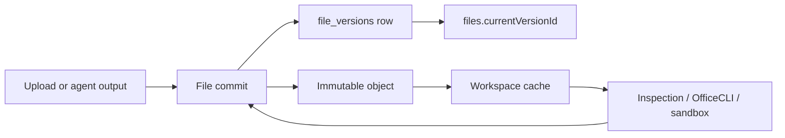

# File lifecycle and document processing

Status: implemented locally; database and GKE rollout pending

Last updated: 2026-08-10

## One model for every format

PDF, DOCX, XLSX, and PPTX are not separate infrastructure paths. Each format
loads its skill for format-specific instructions and QA. Skills do not read or
store files.

The model-facing capability boundary is:

| Intent | Tool path |
| --- | --- |
| Search or bounded structural reading | `search_document` / `inspect_document` |
| Visual PDF or slide question | inspect to find pages/slides, render the selected range, inspect images |
| Normal Office creation or edit | `document_execute` -> in-process OfficeRunner -> pinned OfficeCLI |
| Exceptional transformation | `run_skill_python_script` -> isolated sandbox Job |

PPTX inspection has the same shared interface as the other formats. It covers
deck metadata, bounded slide ranges, shape text, tables, speaker notes, and alt
text. Visual questions still render selected slides because structural XML does
not answer layout questions reliably.

PDFs and images may additionally be attached through the model provider's native
MIME input when supported. Scripts remain necessary for bounded retrieval,
repeatable locators, Office formats the provider cannot natively inspect, and
visual QA without placing an entire large document in model context.

## Stable chat references

The composer sends an authorized reference rather than trusting a path:

```json
{"fileId": 42, "version": 7, "name": "board-pack.pptx"}
```

The backend authorizes the file ID in the requested workspace, ignores the
client name for authority, materializes that exact immutable version, and adds
trusted ID/version/path/MIME metadata to the agent prompt. Legacy path tags are
accepted during migration. Historical tags are materialized under a read-only
`.system/tagged-versions/...` cache path so they never silently resolve to newer
bytes.

## Durable storage and workspace cache

Object storage is canonical. The workspace filesystem is a materialized cache
used by OfficeCLI and sandbox tools.



The provider-neutral `ObjectStore` contract supports streaming reads/writes,
head, delete, signed upload/download requests, provider generations/version IDs,
conditional create, integrity metadata, and normalized errors.

- Local development defaults to MinIO through the S3 adapter.
- Production can select native Google Cloud Storage with
  `OBJECT_STORE_PROVIDER=gcs`, Application Default Credentials, or Workload
  Identity.
- Reads fail closed when a row names a different provider. Switching providers
  therefore requires a checksum-verified object copy before configuration is
  changed; mixed-provider rows are never silently read from the wrong store.
- GCS FUSE is not part of the correctness model. OfficeCLI receives a real local
  file; the backend downloads before work and commits after work.
- Provider versioning is operational protection. HelpUDoc's `file_versions`
  table is the product history and remains portable across providers.

## Application version model

`files` is the stable logical identity and current pointer. `file_versions` is
append-only immutable history containing version number, logical name, MIME,
object key/provider generation, SHA-256, byte size, change kind, creator, source
run, operation ID, and timestamp.

- Create and content edits write a new immutable object and version row.
- Rename and move create metadata versions that reuse the existing object.
- Restore creates a new current version that references the selected old object;
  history is never rewound.
- Delete is a soft delete. Durable objects and version history are retained.
- A partial unique index reserves a path only for live files, so a deleted path
  may be recreated.
- `operationId` makes agent artifact commits idempotent.

All formats use file-ID APIs:

- `GET .../files/:fileId/download?version=N`
- `GET .../files/:fileId/preview?version=N`
- `GET .../files/:fileId/versions`
- `POST .../files/:fileId/versions/:versionId/restore`

## Agent artifact commit

The agent edits only workspace-local materializations. The backend captures a
file ID/version/hash baseline when a run starts. Before a completed, failed, or
interrupted run settles, it considers only paths declared by tool events as
outputs, compares them with that baseline, and commits changed files through
the same optimistic file-version path used by uploads and UI edits. Internal
`.system` and `sandbox-runs` paths are never eligible. The run ID, path, and
content hash form the idempotency key. A concurrent edit becomes a version
conflict, and storage failure fails completion instead of reporting a file that
exists only on one pod's disk.

Only one active agent run may own a workspace cache at a time. A renewable,
token-safe Redis lease serializes runs across pods and is rechecked during
multi-file commits. On lease acquisition, the backend first reconciles all
visible cache files from durable versions and removes orphan cache files. This
recovers safely after cancellation or pod loss without treating abandoned local
bytes as a new version.

## Published workspace versions

New published versions store manifests of immutable object/file-version
references. They no longer copy every file into `.published-versions` on the
workspace PVC. Readers retain a fallback for legacy disk manifests. Applying or
restoring workspace content appends file versions and soft-deletes removed
logical files with a tombstone version instead of erasing history. Files whose
hash and metadata are unchanged do not receive noisy duplicate versions.

## Rollout

1. Deploy the additive schema (`file_versions`, `currentVersionId`, `deletedAt`,
   partial live-path index) while MinIO remains selected.
2. Verify create/edit/tag/download/history/restore and agent artifact commits.
3. Let existing files migrate lazily on first read or mutation; optionally run a
   controlled backfill for cold files.
4. Stop creating disk publication snapshots; retain legacy reads until old
   versions age out.
5. Configure GCS and Workload Identity in staging, copy immutable objects, and
   validate checksums before switching `OBJECT_STORE_PROVIDER`.
6. Keep MinIO for local development. Provider contract tests are the portability
   boundary; application services must not import cloud SDKs directly.
