# Knowledge Ingestion, Semantic Enrichment, and OKF Retrieval Specification

Status: Phases 1-6 implemented — production rollout remains feature-gated

Target: Replace the lightweight page-as-concept Knowledge publisher  
Primary systems: `backend/`, `agent/`, `frontend/`, PostgreSQL, Redis, workspace storage  
Canonical format: Open Knowledge Format (OKF) v0.2

## 1. Executive summary

HelpUDoc must turn an uploaded document into a complete, provenance-backed, semantically organized knowledge source that an agent can query efficiently.

The legacy publisher deterministically extracted PDF or DOCX text and wrote Markdown, but it treated extracted sections such as `Page 1` as concepts, limited generated section files to 50, and performed lexical scans over the resulting Markdown. This was useful as a safe ingestion baseline, but it was not semantic enrichment and did not provide concept-aware retrieval.

The replacement pipeline will:

1. extract the complete source without silent truncation;
2. preserve stable PDF page or DOCX structural locations;
3. build a document hierarchy from headings, chapters, layout, and semantic boundaries;
4. create bounded LLM processing windows without equating windows to concepts;
5. use the configured Gemini Lite model to extract structured entities, events, claims, topics, and relationships;
6. canonicalize duplicate entities and validate cross-document relationships;
7. cluster the canonical graph and generate a linked OKF v0.2 bundle;
8. build lexical and graph indexes for the first retrieval release while retaining rebuildable multimodal embedding hooks;
9. retrieve concepts first, expand through meaningful relationships, and read original evidence before answering;
10. expose completeness, quality, provenance, token usage, cost, and failures in the admin portal.

The OKF bundle is the portable, human-readable knowledge product. PostgreSQL search tables, optional embeddings, and graph adjacency are derived runtime indexes and can be rebuilt from persisted ingestion artifacts. Multimodal vector retrieval and reciprocal-rank fusion (RRF) are a later, evaluation-gated extension; they are not required to publish or query the first enriched bundle.

### 1.1 Implementation progress

Last verified: 2026-08-04 against the current local working tree. `Implemented` means code exists and focused automated tests pass; it does not mean the changes are committed, deployed, or production-smoke-tested. Update this section whenever a phase gate changes.

| Phase/capability | Status | Implemented now | Remaining work |
|---|---|---|---|
| Phase 0: correctness baseline | Implemented | Removed the 50-section publication cap; complete source-unit accounting, stable locators, warnings, and partial status are represented. | Validate the 950-page local QC fixture again after the remaining pipeline changes. |
| Conversion routing | Implemented | MarkItDown is the primary Markdown facade; native provenance sidecars remain authoritative where available; long-tail formats receive explicit coarse structural units; conversion failures are visible. | Expand native locator adapters only where evaluation shows the coarse MarkItDown sidecar is insufficient. |
| Phase 1: extraction, structure, and windows | Implemented | PDF/DOCX and text-like extraction, explicit Gemini Flash Lite OCR (`off|auto|always`), insufficient-text thresholds, page media artifacts, stable locators, usage accounting, deterministic structure, multilingual token estimation, and complete core-window ownership exist. | Extend native layout adapters only where evaluation shows a measurable quality gap. |
| Durable orchestration | Implemented | PostgreSQL job/task tables, leases, retries, cancellation, superseding, cached map tasks, run artifacts, a dedicated restart-safe worker, orchestration heartbeats, expired-lease recovery, and opt-out of process-local scheduling exist. | Exercise container-kill recovery and multi-worker contention against a deployed PostgreSQL environment. |
| Phase 2: Gemini enrichment | Implemented | Gemini Flash Lite structured map extraction and concurrent hierarchical reduction, schema/evidence validation, bounded repair, content-hash resume, cross-window canonicalization inputs, and model/rate-card token-cost capture exist. Raw evidence-bearing map results remain canonicalization inputs so reduction cannot become a lossy gate. | Add model-assisted adjudication for the narrowest entity-resolution uncertainty band after a reviewed corpus exists. |
| Phase 3: graph and OKF publication | Implemented | Canonical concepts, evidence-backed assertions/relationships, deterministic NetworkX Louvain analysis and versioning, graph quality reporting, thin-orphan pruning, immutable snapshots, deterministic OKF v0.2 generation, validation, manifests, and atomic publication exist. | Continue production-scale graph QC and relationship-ontology review. |
| Phase 4: lexical and graph retrieval | Implemented | Current-snapshot PostgreSQL concept/assertion/relationship retrieval, multilingual lexical scoring, confidence-aware bounded graph expansion, bounded evidence reads, optional vector candidates, and RRF exist; portable bundle navigation remains available. | Benchmark p95 latency and retrieval quality on production-sized workspaces. |
| Admin/API visibility | Implemented | Preflight cost/coverage preview, current job/report, cancel/retry, graph communities/orphans, bundle inspection, warnings, usage/cost, snapshots, rollback publication, and progress surfaces exist. | Add richer low-confidence comparison and long-running operational dashboards as usage data accumulates. |
| Phase 5: evaluation and rollout | Implemented locally | Automated extraction/retrieval/graph/OKF tests plus a live 302-page image-only PDF run validate OCR recovery, resumable map processing, hierarchical reduction, deterministic publication, graph retrieval, and evidence locations. | Run Recall@K/MRR and groundedness over the broader golden corpus, plus restart/rollback/backfill drills in a deployed environment. |
| Phase 6: multimodal vector and RRF | Implemented, feature-gated | Optional `pgvector` initialization with JSON fallback, versioned `gemini-embedding-2` text and page-PDF embeddings, 768-dimensional normalized vectors, text/media index persistence, query embeddings, and lexical/vector RRF are implemented behind environment flags. | Keep disabled by default until Section 17.5 quality, latency, and cost gates pass in the deployment environment. |

Verification snapshot:

- Focused agent ingestion and retrieval suites: `19 passed`.
- Full backend suite: `150 passed`, `14 skipped`, `0 failed`; backend TypeScript compilation and the production frontend build also pass.
- Live scanned-PDF evaluation: 302 discovered pages, 301 processed (99.67%), 992 source blocks, 312 processing windows, 1,412 map candidates, 731 assertions, and 661 relationships before canonicalization. The one unresolved page is an effectively blank scan retained as an explicit failure.
- Published smoke bundle: 686 canonical concepts, 725 assertions, 646 relationships, and 690 bundle files; lexical plus graph retrieval returns citable Bo-Peep, Robin Hood, and Ugly Duckling concepts from the current snapshot.
- Live Phase 6 adapter check: `gemini-embedding-2` produced normalized 768-dimensional text-query and single-page PDF vectors.
- Still deployment-gated: dedicated-worker kill/restart recovery, PostgreSQL/pgvector performance under production concurrency, golden-corpus Recall@K/MRR and groundedness, and multimodal/RRF promotion.

## 2. Problem statement

### 2.1 Legacy baseline

Before this implementation work, the path was:

```text
PDF/DOCX
  -> deterministic text extraction
  -> one Markdown heading per page or document heading
  -> first 50 sections copied into concepts/*.md
  -> index.md generated from those files
  -> lexical scan across Markdown at query time
```

In the original 950-page Three-Body PDF QC baseline:

- all 950 pages were preserved in `source.md`;
- only pages 1-50 became `concepts/page-*.md`;
- the other 900 pages were absent from `index.md`;
- page files represented transport boundaries, not semantic concepts;
- every page concept linked only to the source;
- no LLM enrichment, OCR, embeddings, entity resolution, clustering, or semantic relationship extraction occurred; and
- retrieval depended on exact or token-level lexical matches.

### 2.2 Why page indexing is insufficient

A page is a rendering and citation unit. It is not normally a unit of knowledge.

Questions such as the following require semantic organization across distant source spans:

- How does a character's worldview change across the story?
- Which events caused a policy decision?
- What systems depend on a particular API?
- Which clauses define renewal risk?
- How are two concepts related when they never share the same page?

Answering these questions requires canonical concepts, relationships, evidence spans, and multi-stage retrieval. Loading or scanning an entire extracted source on every question is expensive and unreliable.

## 3. Goals

1. **Complete coverage**: process every supported source unit or report the exact units that failed.
2. **No silent caps**: any safety limit must fail visibly or produce a resumable partial status.
3. **Semantic concepts**: generate concepts appropriate to the source domain rather than naming pages as concepts.
4. **Evidence-level provenance**: every generated factual assertion must resolve to one or more source spans.
5. **Portable knowledge**: emit an OKF v0.2 bundle readable without HelpUDoc-specific infrastructure.
6. **Efficient retrieval**: use wiki-first lexical and graph retrieval before reading bounded evidence; add vector recall and RRF only when evaluation demonstrates material lift.
7. **Cost control**: use Gemini Lite for enrichment, cache by content fingerprint, and avoid reprocessing unchanged spans.
8. **Durable processing**: survive API, worker, and container restarts without restarting an entire document.
9. **Observable quality**: show coverage, graph statistics, low-confidence items, token usage, and cost.
10. **Deterministic publishing**: generate identical OKF files from the same finalized enrichment snapshot and generator version.
11. **Access preservation**: derived knowledge must inherit the standalone Knowledge source grants; a workspace never gains access merely because a user opens or creates it.
12. **Multilingual support**: preserve and retrieve Chinese and other non-English content without assuming whitespace tokenization.

## 4. Non-goals

- Treating OKF as a replacement for the original document.
- Guaranteeing that every model inference is correct without evidence or review.
- Requiring Neo4j or another dedicated graph database for the first release.
- Requiring vector search, `pgvector`, or RRF for the first enriched retrieval release.
- Putting raw page windows into the canonical bundle merely so they can be indexed.
- Sending image-only documents to a model when OCR is unavailable or disallowed.
- Generating copyrighted source text beyond the user's authorized workspace boundary.
- Replacing on-demand `inspect_document` for ordinary chat attachments that were not published as Knowledge.
- Making the complete enrichment pipeline bit-for-bit deterministic; model output is a versioned input to the deterministic publisher.

## 5. Terminology

| Term | Meaning |
|---|---|
| Source unit | A PDF page, DOCX paragraph, slide, sheet, table, cell, list item, caption, or equivalent addressable source element |
| Source block | Normalized text and layout metadata for one or more source units |
| Structure node | A detected book, part, chapter, section, subsection, scene, or topic container |
| Processing window | A bounded core span plus optional surrounding context sent to an enrichment model |
| Evidence span | Stable source locations supporting a generated assertion |
| Extraction | Deterministic conversion of the original document into source blocks |
| Enrichment | Model-assisted production of structured concepts, assertions, relationships, and summaries |
| Canonical concept | A deduplicated knowledge node with a stable identifier |
| Relationship | A directed, typed, evidence-backed edge between canonical concepts |
| OKF bundle | The published hierarchy of linked Markdown concept documents and reserved indexes/logs |
| Retrieval index | Rebuildable lexical, graph, and optionally vector data used to find OKF concepts and evidence |
| Enrichment snapshot | The immutable, versioned canonical graph used as input to deterministic OKF generation |

## 6. Product principles

1. **Pages are evidence, not concepts.**
2. **Structure first, token limits second.**
3. **A processing window is not a published knowledge node.**
4. **Models propose; validators and evidence gates decide what is published.**
5. **Concepts are canonical; indexes are derived.**
6. **Progressive disclosure starts with indexes but does not end there.**
7. **Uncertainty is recorded, not hidden.**
8. **Rebuild only what changed.**
9. **Retrieval must end at original evidence.**
10. **Quality and cost are product-visible outcomes.**

## 7. Target architecture

```mermaid
flowchart LR
  U["Browser"] -->|"short-lived signed PUT"| S["Private object storage"]
  U -->|"authenticated finalize"| C0["Verified source + durable job"]
  S --> C0
  C0 --> A["Original supported document"]
  A --> B["Routed conversion + provenance extraction"]
  B --> C["Normalized source blocks"]
  C --> D["Structure and boundary detection"]
  D --> E["Token-budgeted processing windows"]
  E --> F["Gemini Lite map extraction"]
  F --> G["Section and chapter reduction"]
  G --> H["Canonicalization and relationship validation"]
  H --> I["Clustering and hierarchy"]
  I --> J["Immutable enrichment snapshot"]
  J --> K["Deterministic OKF publisher"]
  J --> L["Lexical index (initial)"]
  J -. evaluation-gated .-> M["Multimodal vector index (later)"]
  J --> N["Graph adjacency index (initial)"]
  K --> O["Admin bundle explorer"]
  L --> P["Wiki-first retrieval"]
  N --> P
  M -. RRF after promotion gate .-> P
  P --> Q["Bounded evidence read"]
  Q --> R["Agent answer with source locations"]
```



### 7.1 Control plane

The TypeScript backend owns:

- authorization and workspace boundaries;
- Knowledge source records;
- ingestion job creation and lifecycle;
- durable task claiming and retry policy;
- persisted artifact registration;
- publication state transitions;
- admin APIs and progress streams; and
- final atomic publication of a bundle version.

### 7.2 Processing plane

The Python agent service owns:

- routed document conversion plus native provenance adapters;
- layout and heading analysis;
- dynamic chunk planning;
- Gemini Lite structured extraction and reduction;
- canonicalization candidates;
- graph analysis and community detection;
- validation helpers; and
- query-time reranking or evidence selection where a model is required.

### 7.3 Storage plane

- Original file: private object storage, uploaded directly with a short-lived signed URL and registered only after authenticated size/type verification.
- Durable job and semantic state: PostgreSQL.
- Generated source artifacts and OKF files: the dedicated standalone Knowledge storage namespace. Existing workspace-backed bundles remain readable during migration but are not attached to workspace listings.
- Progress events and short-lived coordination: Redis Streams.
- Embeddings: versioned adapter and artifact contracts are retained initially; PostgreSQL with `pgvector` is enabled only for the later multimodal retrieval phase.
- Graph traversal: relational adjacency tables and recursive queries in the first release.
- Tracing: existing Langfuse deployment, with source-content capture disabled or redacted by policy.

### 7.4 Upload and dispatch boundary

Large source bytes do not traverse or buffer in the TypeScript API process. The browser first creates an authenticated upload session, streams the file to a short-lived same-origin object-storage URL, and then calls the authenticated completion endpoint. Completion verifies object metadata and atomically registers the source and durable ingestion task. Parsing starts only after that task exists.

The completion call is the authoritative event because it carries the user's authorization and Knowledge metadata. Object-created notifications are optional reconciliation signals, not the source of truth. Expired or abandoned sessions are deleted by the Knowledge worker. The UI presents upload progress separately from the subsequent queued/extracting/enriching/publishing lifecycle.

## 8. Pipeline methodology

### 8.1 Stage 0: intake and fingerprinting

Inputs:

- Knowledge source ID;
- workspace ID;
- source file ID;
- source filename and MIME type;
- access policy snapshot;
- requested enrichment profile; and
- configured model and prompt versions.

Processing:

1. Read the source through `FileService` after access validation.
2. Calculate a SHA-256 source fingerprint.
3. Detect file type by content and extension.
4. Reuse a completed extraction when the source fingerprint and extractor version match.
5. Create a durable ingestion job and immutable run configuration.

Required output:

```json
{
  "knowledgeId": 1,
  "sourceFingerprint": "sha256:...",
  "extractorVersion": "helpudoc-extractor/2",
  "enrichmentVersion": "helpudoc-enrichment/1",
  "okfGeneratorVersion": "helpudoc-okf/2",
  "modelProfile": "lite",
  "status": "queued"
}
```

### 8.2 Stage 1: complete deterministic extraction

#### Conversion routing

MarkItDown is the common conversion facade for supported document types and supplies normalized Markdown when conversion succeeds. It does not become the sole provenance extractor. HelpUDoc also runs a native sidecar adapter for formats where MarkItDown output would discard stable page, paragraph, table, cell, bounding-box, or source-unit locations.

Initial routing policy:

| Source type | Markdown representation | Authoritative locator sidecar |
|---|---|---|
| PDF | MarkItDown primary, native rendering fallback | PyMuPDF page/block extraction plus OCR adapter |
| DOCX | MarkItDown primary, native rendering fallback | `python-docx` headings, paragraphs, and tables |
| TXT, Markdown, HTML, CSV/TSV, JSON | MarkItDown where useful, otherwise native normalized text | Native line/section/row-oriented blocks |
| PPTX, XLS/XLSX and other MarkItDown-supported formats | MarkItDown | Structural slide/sheet blocks until a richer native adapter is justified |

Converter mode (`off`, `shadow`, `fallback`, or `primary`), converter version, locator strategy, and warnings are persisted in the extraction manifest. Only local-file conversion is allowed; uploaded content must not cause MarkItDown to fetch arbitrary URLs. A MarkItDown failure may fall back to a successful native extraction, but the fallback remains visible in the manifest.

#### PDF

Use a layout-aware PDF adapter to emit:

- page number;
- ordered text blocks;
- bounding boxes;
- font and style signals;
- images and captions when available;
- PDF outline/bookmarks;
- repeated header/footer candidates; and
- extraction warnings.

PyMuPDF is the preferred primary adapter. PyPDF remains useful for metadata, outlines, compatibility tests, and fallback text extraction.

If a page contains insufficient native text:

1. mark it `needs_ocr`;
2. in `auto` mode, run the configured Gemini vision OCR adapter if policy permits;
3. preserve OCR confidence and coordinates; or
4. publish a visible partial/failed status for that page.

##### OCR activation and converter policy

OCR is explicit pipeline behavior, not an incidental MarkItDown side effect:

- `off`: never send page images to a model; report `needs_ocr` for insufficient pages;
- `auto` (default): OCR only pages whose native extraction is empty, corrupt, or below the configured text-density threshold; and
- `always`: OCR every eligible page for controlled comparison or documents known to require it.

The initial concrete OCR implementation uses Gemini vision through the deployment's authenticated Google/Vertex client and ADC. It is invoked through the provider-neutral OCR adapter so extraction accounting, page identity, retries, cost, and failure state remain controlled by HelpUDoc.

MarkItDown remains a common format-to-Markdown conversion layer where it gives useful normalized output. Its OCR plugin is not automatic merely because an image-only PDF is uploaded: the plugin package, plugin enablement, and a compatible model client must all be configured. HelpUDoc must not rely on its silent fallback when a model client is absent. If the plugin is added later, it is wrapped behind the same OCR adapter and reporting contract.

OCR and multimodal embeddings have different responsibilities. OCR creates readable, citable source blocks used by enrichment and evidence verification. An image or PDF embedding creates a similarity vector for discovery but does not create assertions, quotations, or source text and therefore cannot replace OCR.

#### DOCX

Use `python-docx` to emit:

- heading styles and outline levels;
- paragraph indexes;
- list structure;
- tables, rows, and cells;
- captions;
- section breaks; and
- embedded media references.

DOCX evidence locators use heading path plus paragraph/table coordinates. Rendered line numbers are not stable and must not be the primary locator.

#### Output contract

```ts
type SourceBlock = {
  id: string;
  ordinal: number;
  text: string;
  blockType: 'heading' | 'paragraph' | 'list' | 'table' | 'caption' | 'image_ocr';
  page?: number;
  paragraph?: number;
  unit?: number;
  unitType?: 'slide' | 'sheet' | 'section' | string;
  table?: number;
  row?: number;
  cell?: number;
  headingLevel?: number;
  headingPath?: string[];
  bbox?: [number, number, number, number];
  extractionMethod: 'native' | 'ocr' | 'fallback';
  extractionConfidence: number;
  contentHash: string;
  mediaArtifactId?: string;
};
```

Acceptance gate:

- `processedSourceUnits + failedSourceUnits = discoveredSourceUnits`;
- no source unit disappears from the accounting; and
- every OCR attempt records mode, provider/model, latency, usage, and outcome without silently falling back; and
- the job cannot report `published` while unacknowledged extraction failures exist.

### 8.3 Stage 2: normalization

Normalization is deterministic and language-aware:

- remove repeated headers and footers while retaining their original block records;
- normalize Unicode to NFC without transliterating content;
- repair line-wrap hyphenation only when confidence is high;
- join PDF blocks when a sentence clearly continues across a page boundary;
- preserve paragraph and table boundaries;
- remove isolated page numbers from semantic text;
- detect likely encoding corruption;
- calculate language distribution; and
- retain a reversible mapping from normalized offsets to source blocks.

The normalized text is an artifact. It is not itself the semantic OKF bundle.

### 8.4 Stage 3: structure detection

Boundary signals are applied in descending confidence:

| Priority | Signal | Typical confidence |
|---|---|---|
| 1 | DOCX native heading/outline style | Very high |
| 2 | PDF outline or table of contents | Very high |
| 3 | Domain heading patterns such as chapter/part numbering | High |
| 4 | Font, whitespace, alignment, and page-break changes | Medium |
| 5 | Repeated lexical heading forms | Medium |
| 6 | Semantic change point between adjacent paragraph groups | Variable |
| 7 | Page boundary | Locator/fallback only |

The detector builds a hierarchy such as:

```text
Document
  -> Book or major division
    -> Part
      -> Chapter or section
        -> Scene, subsection, or topic segment
```

Every structure node records:

- its block range;
- the signals that created it;
- structural confidence;
- detected title;
- parent and child IDs; and
- source location range.

### 8.5 Stage 4: dynamic processing windows

The chunker operates on the hierarchy, not directly on pages.

Default configuration:

| Setting | Initial value | Purpose |
|---|---:|---|
| Target tokens | 2,500 | Efficient map extraction window |
| Soft minimum | 600 | Avoid weak, context-poor windows |
| Hard maximum | 4,000 | Bound cost and output reliability |
| Previous context | Up to 2 paragraphs | Resolve continuation and pronouns |
| Next context | Up to 2 paragraphs | Resolve boundary context |
| Max table size | Configurable | Keep tables atomic when possible |

Values are configuration defaults and must be benchmarked against the deployed Gemini Lite model. Token counting uses a model-specific adapter with a deterministic approximation fallback.

#### Hierarchical splitting algorithm

```text
plan(node):
  if node.core_tokens <= target_tokens:
    emit(node)
  else if node has structural children:
    for child in node.children:
      plan(child)
  else:
    candidates = paragraph_boundaries(node)
    candidates += semantic_change_points(node)
    split with minimum/maximum token constraints

merge adjacent emitted windows when:
  combined tokens <= target_tokens
  and both share the same structural parent
  and their boundary confidence is low

hard split only when:
  a single paragraph/table exceeds hard_max_tokens
```

#### Semantic fallback boundaries

When headings are missing or unreliable:

1. represent consecutive paragraph groups with deterministic lexical vectors or the configured boundary-embedding adapter;
2. calculate cosine distance between adjacent groups;
3. smooth local distance values;
4. nominate peaks above a document-relative threshold;
5. prefer peaks aligned with paragraph, dialogue, scene, or layout boundaries; and
6. enforce minimum and maximum token constraints.

Initial adaptive threshold:

```text
median(adjacent_distance) + 1.5 * median_absolute_deviation(adjacent_distance)
```

Gemini Lite may adjudicate batched low-confidence boundary candidates, but deterministic signals decide high-confidence boundaries without a model call.

The first chunk-planning release must work without a remote embedding dependency. Retrieval embeddings and boundary features share an adapter only when the configured embedding model has passed multilingual boundary benchmarks.

#### Core and context spans

Each window contains:

- a **core span** from which the model may emit evidence-backed assertions;
- optional previous/next **context spans** that the model may read; and
- a rule that an emitted assertion must cite at least one core block.

This reduces boundary errors without extracting the same fact from overlapping windows.

```ts
type ProcessingWindow = {
  id: string;
  structureNodeId: string;
  coreBlockIds: string[];
  contextBeforeBlockIds: string[];
  contextAfterBlockIds: string[];
  tokenCount: number;
  contentHash: string;
  strategy: 'structural' | 'semantic' | 'forced';
};
```

### 8.6 Stage 5: Gemini Lite map extraction

Gemini Lite receives one processing window plus:

- source type and language;
- structural path;
- a compact domain profile;
- previously known canonical names relevant to that section;
- explicit prompt-injection isolation instructions; and
- a strict structured-output schema.

It returns candidate:

- entities;
- aliases;
- events or processes;
- claims and facts;
- topics and themes;
- relationships;
- local section summary;
- unresolved references; and
- evidence spans with confidence.

The model must not emit hidden reasoning. It returns only the validated structured result and short user-facing rationales where required for audit.

Example candidate:

```json
{
  "candidateId": "window-0042:event-01",
  "kind": "Event",
  "name": "First contact with Trisolaris",
  "description": "A concise source-grounded description.",
  "aliases": [],
  "assertions": [
    {
      "text": "The event occurs after ...",
      "confidence": 0.94,
      "evidence": [
        {
          "blockIds": ["pdf-p284-b3", "pdf-p287-b1"],
          "pageStart": 284,
          "pageEnd": 287
        }
      ]
    }
  ],
  "relationships": [
    {
      "targetCandidate": "character:ye-wenjie",
      "type": "initiated_by",
      "confidence": 0.91,
      "evidenceBlockIds": ["pdf-p286-b2"]
    }
  ]
}
```

Validation rejects:

- missing or out-of-window block IDs;
- assertions without evidence;
- malformed types;
- unsupported relationship directions;
- invalid confidence values; and
- excessive verbatim copying beyond configured evidence limits.

Rejected tasks are retryable with validation feedback and capped attempts.

### 8.7 Stage 6: hierarchical reduction

Leaf results are reduced without rereading the entire raw document:

```text
Processing windows
  -> section/chapter synthesis
  -> part/domain synthesis
  -> document-level synthesis
```

Each reducer consumes structured child outputs and requests original evidence only to resolve:

- contradictory assertions;
- ambiguous aliases;
- broken event ordering;
- uncertain relationship direction; or
- low-confidence cross-section matches.

For narrative sources, the reducer additionally tracks:

- character state by chapter;
- event chronology;
- organizations and affiliations;
- locations and technologies;
- character relationships and their changes; and
- recurring themes with supporting events.

For business and technical sources, the domain profile substitutes appropriate concept types such as Policy, Requirement, API, System, Data Asset, Decision, Risk, Control, and Procedure.

### 8.8 Stage 7: canonicalization and relationship validation

Canonicalization combines deterministic and model-assisted signals:

- exact normalized name and known aliases;
- type compatibility;
- optional embedding similarity when the embedding adapter is enabled;
- shared evidence context;
- neighboring entities;
- structural and temporal compatibility; and
- an LLM adjudication only inside an uncertainty band.

Every merge decision records:

- candidate IDs;
- resulting canonical ID;
- decision method;
- confidence;
- prompt/model version when applicable; and
- reversible provenance.

Potential matches below the merge threshold remain separate and are flagged for review. The system must not force a merge simply to reduce node count.

Relationship validation requires:

- valid source and target concepts;
- a controlled or producer-versioned relationship type;
- at least one evidence span for extracted relationships;
- a confidence class of `EXTRACTED`, `INFERRED`, or `AMBIGUOUS`;
- a numeric confidence score; and
- explicit direction.

Inferred relationships must remain distinguishable from relationships explicitly stated by the source.

### 8.9 Stage 8: clustering and hierarchy

Build an in-memory graph from canonical concepts and validated relationships. Use NetworkX initially for:

- weakly connected components;
- degree and centrality diagnostics;
- orphan detection;
- Louvain community detection;
- shortest paths; and
- graph quality metrics.

Community labels may be proposed by Gemini Lite from node names and summaries, but membership is computed deterministically from the graph and recorded with the algorithm/version.

The resulting hierarchy controls OKF directory organization but does not replace semantic cross-links.

### 8.10 Stage 9: immutable enrichment snapshot

Before publishing, persist an immutable snapshot containing:

- source and extractor fingerprints;
- processing-window manifest;
- canonical concepts;
- assertions;
- relationships;
- evidence spans;
- communities and hierarchy;
- model IDs and prompt/schema versions;
- token usage and cost records;
- validation results; and
- human review decisions, if any.

The snapshot receives a content hash and becomes the sole input to OKF generation.

### 8.11 Stage 10: deterministic OKF publication

Given one enrichment snapshot and generator version, the publisher must deterministically generate:

- stable concept paths and slugs;
- OKF v0.2 frontmatter;
- evidence-backed Markdown bodies;
- directed concept links expressed in explanatory prose;
- directory `index.md` files;
- root `index.md`;
- `log.md`; and
- a manifest with checksums.

Publication writes to a staging path, validates the complete bundle, and atomically switches the Knowledge source to the new bundle version. Readers must see either the previous complete version or the new complete version, never a partially written tree.

## 9. Output contracts

### 9.1 Artifact layout

```text
.system/knowledge/<knowledge-id>/
  runs/
    <run-id>/
      manifest.json
      extraction/
        document.json
        blocks.jsonl
        warnings.json
      structure/
        hierarchy.json
        windows.jsonl
      enrichment/
        map-results.jsonl
        reductions.jsonl
        canonical-graph.json
        validation-report.json
        cost.json
      snapshot.json
  bundles/
    <snapshot-hash>/
      index.md
      log.md
      concepts/
        works/
        chapters/
        characters/
        events/
        organizations/
        themes/
      manifest.json
  current.json
```

Only the directory identified by `current.json` is the published OKF bundle. Run artifacts are admin-only internal data and are not normal Knowledge concepts.

### 9.2 Required outputs

| Output | Producer | Consumer | Expectation |
|---|---|---|---|
| Extraction manifest | Extractor | Chunk planner, admin QC | Accounts for every discovered source unit |
| Source blocks | Extractor | Structure detector, evidence reader | Stable IDs and reversible source locations |
| Hierarchy | Structure detector | Chunk planner, reducers | Confidence-scored logical document tree |
| Processing windows | Chunk planner | Gemini Lite map stage | Bounded, complete, hash-addressed core spans |
| Map results | Enrichment model | Reducers, validators | Structured candidates with evidence |
| Canonical graph | Canonicalizer | Clustering, publisher, retrieval | Deduplicated concepts and typed edges |
| Validation report | Validators | Publication gate, admin QC | No hidden failures; actionable warnings |
| Enrichment snapshot | Orchestrator | Publisher, index builders | Immutable and content-addressed |
| OKF bundle | Deterministic publisher | Humans and agents | Portable, linked, valid OKF v0.2 |
| Lexical index | Index builder | Retriever | Multilingual exact/fuzzy candidate recall |
| Vector index (deferred) | Index builder | Retriever | Optional multimodal semantic recall after the evaluation gate |
| Graph index | Index builder | Retriever | Relationship and neighborhood expansion |
| Cost report | Usage collector | Admin, finance | Tokens, calls, retries, model, rate-card version, estimated cost |

### 9.3 Example OKF concept

```markdown
---
type: Character
title: Ye Wenjie
description: A central character whose experiences and decisions shape humanity's contact with Trisolaris.
resource: workspace-file://<workspace>/<source-file>#concept=character:ye-wenjie
tags: [character, red-coast]
status: active
generated:
  by: helpudoc-enrichment/gemini-lite
  at: 2026-08-03T00:00:00Z
sources:
  - id: source-span-001
    resource: workspace-file://<workspace>/<source-file>#page=284
    title: Original PDF, pages 284-287
    locator:
      kind: pdf_page_range
      start: 284
      end: 287
      block_ids: [pdf-p284-b3, pdf-p287-b1]
---

# Ye Wenjie

Ye Wenjie is associated with [Red Coast Base](../organizations/red-coast-base.md), where her actions contribute to [First Contact](../events/first-contact.md).

## Development

Evidence-backed synthesis of the character's development, with source-page references.
```

Page ranges support verification. They do not determine the concept filename or graph identity.

## 10. Retrieval methodology

### 10.1 Initial indexes

#### Lexical

Store normalized concept fields, assertions, aliases, tags, and evidence text. PostgreSQL `pg_trgm` and exact phrase search provide the initial multilingual baseline. PostgreSQL full-text search may supplement languages with supported tokenization.

#### Graph

Persist directed adjacency with relationship type, confidence, evidence, and snapshot ID. PostgreSQL recursive CTEs support bounded one- or two-hop traversal in the first release.

The initial retriever searches canonical wiki concepts and assertions lexically, expands only meaningful graph relationships, and then reads the supporting source blocks. The generated wiki is the coherent context layer; original evidence remains the authority.

### 10.2 Initial query flow: wiki-first lexical and graph retrieval


Rules:

1. `index.md` is used for discovery and progressive navigation, not as the sole search index.
2. Lexical retrieval searches titles, aliases, descriptions, assertions, tags, relationship descriptions, and bounded evidence text.
3. Graph expansion is bounded and relation-aware; it must not flood context with all neighbors.
4. Low-confidence or ambiguous edges are excluded by default unless the question asks about uncertainty.
5. A final answer must read the selected evidence rather than cite only a generated summary.
6. If evidence is absent or contradictory, the agent says so.

### 10.3 Deferred multimodal vector retrieval and RRF

The ingestion contracts retain optional embedding inputs and index metadata, but the initial retrieval path does not depend on vectors. A later phase may embed:

- concept titles, aliases, descriptions, and assertions;
- relationship descriptions and bounded evidence segments;
- OCR page images, diagrams, screenshots, and other useful visual regions; and
- short text-plus-image representations when the selected model supports a shared modality space.

`gemini-embedding-2` is the initial candidate because it can place text, images, and short PDFs in a unified embedding space. Page-level image/PDF artifacts remain linked to source locators because an embedding is not evidence. Model limits, dimensionality, cost, and multilingual/multimodal quality are versioned configuration rather than assumptions embedded in the OKF bundle.

When vector retrieval is promoted, lexical and vector candidate lists run in parallel and are combined with RRF before graph expansion. RRF is used because the raw scores from lexical and vector systems are not directly comparable. It preserves strong exact matches while adding paraphrase, vocabulary-mismatch, OCR-noise, and visual-page recall.

Promotion requires a representative evaluation set to show measurable Recall@K or MRR improvement without unacceptable groundedness, latency, cost, or access-control regressions. Vector-only retrieval is not an intended production mode.

### 10.4 Retrieval result contract

```json
{
  "query": "How does Ye Wenjie's view of humanity evolve?",
  "snapshotId": "...",
  "concepts": [
    {
      "id": "character:ye-wenjie",
      "score": 0.92,
      "reasons": ["alias", "graph"],
      "path": "concepts/characters/ye-wenjie.md"
    }
  ],
  "relationships": [],
  "evidence": [
    {
      "sourceFileId": 123,
      "pageStart": 12,
      "pageEnd": 14,
      "blockIds": ["pdf-p12-b2"]
    }
  ]
}
```

## 11. Persistence model

New tables are namespaced around an ingestion run and immutable snapshot.

| Table | Purpose |
|---|---|
| `knowledge_ingestion_jobs` | Durable top-level lifecycle, configuration, progress, and failure state |
| `knowledge_ingestion_tasks` | Resumable extraction, map, reduce, validation, and publication tasks |
| `knowledge_source_blocks` | Normalized block metadata and source locations |
| `knowledge_structure_nodes` | Detected hierarchy and confidence |
| `knowledge_processing_windows` | Core/context spans, token count, hash, status |
| `knowledge_candidate_concepts` | Raw map-stage candidate output |
| `knowledge_concepts` | Canonical snapshot concepts |
| `knowledge_assertions` | Evidence-backed factual statements |
| `knowledge_relationships` | Directed typed edges and confidence |
| `knowledge_evidence_spans` | PDF/DOCX source locators |
| `knowledge_embeddings` (deferred/optional) | Versioned text and media vectors, populated only when vector retrieval is enabled |
| `knowledge_communities` | Cluster membership and label metadata |
| `knowledge_snapshots` | Immutable publishable enrichment snapshots |
| `knowledge_usage_events` | Model calls, tokens, retries, latency, and cost |

Large raw block text and model responses may remain in workspace artifacts with hashes and database references when storing them directly in PostgreSQL would be wasteful. Metadata needed for recovery and querying remains transactional.

### 11.1 Job states

```text
queued
  -> extracting
  -> structuring
  -> chunking
  -> enriching
  -> reducing
  -> validating
  -> indexing
  -> publishing
  -> published
```

Terminal alternatives:

- `partial`: completed with explicitly acknowledged source-unit failures;
- `failed`: cannot produce a trustworthy snapshot;
- `cancelled`: user or administrator stopped the job; and
- `superseded`: a newer source version replaced the run.

Progress is derived from durable task counts, not only an in-memory percentage.

The dedicated TypeScript Knowledge worker claims PostgreSQL tasks with `FOR UPDATE SKIP LOCKED`, writes a renewable lease and heartbeat, and calls idempotent internal processing endpoints. Expired leases return to the queue after their retry delay. Redis carries live progress events but is not required to recover a job.

## 12. APIs and service boundaries

### 12.1 Admin APIs

| Method | Route | Purpose |
|---|---|---|
| `POST` | `/api/knowledge/uploads` | Create an expiring signed object-storage upload session |
| `PUT` | signed object URL | Stream source bytes directly from the browser to private storage |
| `POST` | `/api/knowledge/uploads/:uploadId/complete` | Verify the object and create the source plus durable job |
| `DELETE` | `/api/knowledge/uploads/:uploadId` | Cancel an incomplete upload and remove its staged object |
| `POST` | `/api/knowledge/:id/ingestions` | Start or resume enrichment |
| `GET` | `/api/knowledge/:id/ingestions/current` | Current job, stage, coverage, cost, and warnings |
| `GET` | `/api/knowledge/:id/ingestions/:runId/report` | Full QC report |
| `POST` | `/api/knowledge/:id/ingestions/:runId/cancel` | Cancel future tasks safely |
| `POST` | `/api/knowledge/:id/ingestions/:runId/retry` | Retry failed tasks or stages |
| `GET` | `/api/knowledge/:id/bundle` | Published OKF manifest |
| `GET` | `/api/knowledge/:id/bundle/file` | Read one allowed bundle file |
| `GET` | `/api/knowledge/:id/graph` | Admin graph and community summary |

Existing bundle routes remain compatible while their backing path moves to the current immutable bundle.

The routes above show the global admin form. `/api/knowledge-catalog` lists the caller's granted, standalone bundles for the `@` picker. Legacy workspace-scoped Knowledge routes remain for non-global records only and never inherit global sources.

### 12.2 Internal processing APIs

The backend calls authenticated internal agent endpoints for:

- extraction planning and execution;
- structure detection;
- chunk planning;
- map extraction;
- reduce/canonicalization;
- graph analysis; and
- optional query reranking.

Each call is idempotent by task ID and content hash. Internal endpoints return structured results or artifact references, never publication side effects.

### 12.3 Agent tools

Replace the Markdown tree scan behind `knowledge_search` with a Knowledge retrieval service while retaining the public tool names:

- `knowledge_search`: wiki-first lexical candidate retrieval plus bounded graph expansion across authorized snapshots;
- `knowledge_read`: read a selected OKF concept or bounded evidence span;
- optional `knowledge_neighbors`: inspect typed graph neighbors when deliberate traversal is useful; and
- legacy `rag_query`: delegate to the active retriever and stop discarding its mode silently.

Tool responses include snapshot ID, retrieval reasons, confidence, and source locations.

The public tool contract does not change when vector/RRF is enabled later; only the internal candidate-generation and fusion strategy changes.

## 13. Technology stack

### 13.1 Reuse

| Layer | Technology | Role |
|---|---|---|
| Frontend | React, TypeScript, Astryx components | Admin QC, explorer, progress, graph/list views |
| API/orchestration | Node.js, Express, TypeScript, Zod | Authorization, routes, lifecycle, validation |
| Persistence | PostgreSQL, Knex | Jobs, concepts, evidence, graph adjacency, snapshots |
| Progress | Redis Streams | Live stage and progress updates |
| Agent processing | Python, FastAPI, Pydantic | Extraction, chunking, enrichment, graph analysis |
| LLM | Existing Gemini Lite model profile through `ChatGoogleGenerativeAI` | Map, reduce, uncertain merge/boundary adjudication |
| Tracing | Langfuse | Model latency, usage, failures, and evaluation traces |
| File storage | Existing workspace storage/FileService | Originals, artifacts, snapshots, OKF bundles |

### 13.2 Add

| Technology | Reason |
|---|---|
| PyMuPDF | Layout-aware PDF block extraction and coordinates |
| OCR adapter interface with Gemini implementation | Scanned-document recovery with explicit activation, accounting, and provider isolation |
| PostgreSQL `pg_trgm` | Multilingual lexical/fuzzy baseline, including Chinese text |
| NetworkX | Initial graph analysis, clustering, diagnostics, and paths |
| JSON Schema/Pydantic structured outputs | Strict Gemini Lite map/reduce contracts |

The initial release does not require a pgvector-enabled database. Before multimodal vector retrieval is promoted, local and production PostgreSQL must verify compatible `pgvector` availability and apply the optional embedding migrations/index builders.

`pg_trgm` is an initial low-operations baseline, not an assumption that PostgreSQL tokenization is optimal for every language. Retrieval evaluation determines whether a later lexical adapter such as OpenSearch or Tantivy is justified.

### 13.3 Do not require initially

- Neo4j;
- Elasticsearch/OpenSearch;
- a separate vector database;
- `pgvector` before the multimodal retrieval promotion gate;
- Kafka; or
- a new agent framework.

Adapters must keep these future options possible if scale or operational evidence justifies them.

## 14. Model and prompt methodology

### 14.1 Model roles

Gemini Lite is used for:

- leaf semantic extraction;
- section and document reductions;
- low-confidence alias adjudication;
- low-confidence structural boundary adjudication;
- community naming; and
- optional top-candidate reranking.

It is not used for:

- hashing and cache decisions;
- source-unit accounting;
- high-confidence heading detection;
- token/window safety limits;
- bundle path generation;
- access control;
- OKF index generation; or
- validation of whether cited block IDs exist.

### 14.2 Versioning

Every model-assisted output records:

- provider;
- model ID;
- model profile;
- prompt version;
- schema version;
- temperature and relevant generation settings;
- input/output token usage;
- retry count;
- latency; and
- content hash.

Changing the prompt, schema, canonicalization policy, or model creates a new enrichment version and must not silently mutate an existing snapshot.

### 14.3 Safety against document instructions

Uploaded content is untrusted data. Enrichment prompts must state that instructions found inside the document are evidence to analyze, not instructions for the model to execute. Processing endpoints expose no mutation or external-action tools to the enrichment model.

## 15. Cost and performance methodology

### 15.1 Caching

Cache at four levels:

1. source extraction by source fingerprint and extractor version;
2. processing window by ordered block hashes and chunker version;
3. model map result by window hash, model, prompt, and schema version; and
4. optional embedding by normalized content/media hash and embedding model version when vector indexing is enabled.

An unchanged page or paragraph must not be re-enriched merely because a different section elsewhere changed.

### 15.2 Concurrency

- Map tasks are parallel within configured workspace and global quotas.
- Reduce tasks wait for their structural children.
- Publication is serialized per Knowledge source.
- Provider rate limits trigger backoff with jitter.
- Failed tasks retain successful sibling results.

### 15.3 Usage report

Every run reports:

- number of model calls by stage;
- input, cached-input, and output tokens when provided;
- retries and validation-repair calls;
- embedding units when enabled;
- OCR units;
- elapsed time by stage;
- configured rate-card version;
- estimated cost by stage; and
- total estimated cost.

The rate card is versioned configuration because provider pricing changes independently of stored usage.

## 16. Security, privacy, and governance

1. Knowledge jobs inherit the source workspace and Knowledge grants.
2. Internal artifacts are never exposed by normal workspace file listing.
3. Admin explorer endpoints remain scoped to the exact selected Knowledge source.
4. Paths are normalized and traversal-safe.
5. Deleting a Knowledge source removes or tombstones its snapshots and derived indexes according to retention policy.
6. Source text must not be stored in application logs.
7. Langfuse tracing must default to metadata-only or redacted content for private documents.
8. Provider calls must follow the deployment's data-residency and model-use policy.
9. Original source permissions are rechecked at query time, not only at ingestion time.
10. Generated assertions remain marked by origin and confidence; human verification is stored separately.

## 17. Quality gates and acceptance criteria

### 17.1 Completeness

- The Three-Body QC PDF reports `950/950` PDF pages accounted for.
- No hard-coded 50-section cap remains.
- Empty or failed pages are listed with extraction method and reason.
- Image-only pages are OCRed automatically only when OCR mode is `auto` or `always`, policy permits model processing, and a configured client is available.
- Missing OCR credentials/client configuration produces a visible page and job warning; it never silently claims native extraction success.
- DOCX reports discovered/processed paragraphs and tables.

### 17.2 Chunking

- Chapter/heading boundaries are preferred over page boundaries.
- No normal window exceeds the configured hard token maximum.
- Every eligible core block appears in exactly one core span.
- Context overlap does not create duplicate core ownership.
- Large tables or paragraphs forced across windows are explicitly marked.

### 17.3 Enrichment

- Every published assertion has at least one valid evidence span.
- Every evidence block belongs to the source and enrichment run.
- No candidate outside the core span is accepted solely from context overlap.
- Duplicate canonical concepts remain below the agreed evaluation threshold.
- Ambiguous merges and inferred relationships remain visibly classified.
- No page file is emitted as a primary concept unless a domain profile explicitly defines Page as a meaningful concept type.

### 17.4 OKF

- Bundle validates against the supported OKF v0.2 rules.
- All non-reserved Markdown files contain required frontmatter.
- All internal Markdown links resolve.
- All source locators resolve to the original file and valid source units.
- The same enrichment snapshot and generator version produce identical concept/index bytes.
- Atomic publication prevents partial bundles.

### 17.5 Retrieval

Evaluation set must include:

1. an exact quote from an early page;
2. an exact quote after page 50;
3. a paraphrased semantic question;
4. a character/entity alias question;
5. a multi-hop relationship question;
6. a whole-document evolution or timeline question;
7. a question whose answer is absent; and
8. a contradictory-evidence case.

Acceptance expectations:

- exact evidence after page 50 is retrievable;
- conceptual questions retrieve canonical concepts, not arbitrary page files;
- relationship questions include graph-derived candidates;
- answers cite PDF page ranges or DOCX structural locations;
- unavailable answers are not fabricated; and
- candidate retrieval p95 is under two seconds for the 950-page QC source, excluding answer-generation latency, after indexes are warm.

The initial lexical-plus-graph release must pass exact, alias, graph, absent-answer, and evidence-location cases. The paraphrase case is measured and reported but does not by itself block the initial release when the answer remains reachable through aliases, assertions, or graph relationships.

Before multimodal vector/RRF retrieval is enabled by default, add evaluation cases for:

- paraphrases with no meaningful lexical overlap;
- multilingual vocabulary mismatch;
- OCR-corrupted text;
- a query whose relevant evidence is primarily a diagram or image; and
- an exact-match distractor that is semantically wrong.

The promoted vector/RRF configuration must improve Recall@K or MRR over lexical-plus-graph retrieval on the agreed evaluation set while preserving answer groundedness and access filtering. The measured threshold is recorded in the release configuration rather than hard-coded in this specification.

### 17.6 Admin experience

The Knowledge source card and explorer display:

- stage and resumable progress;
- processed/total source units;
- extraction warnings;
- structure tree and processing-window counts;
- concept and relationship counts;
- graph communities and orphan count;
- low-confidence/ambiguous items;
- bundle version and snapshot hash;
- token usage and estimated cost; and
- published, partial, failed, cancelled, or superseded state.

## 18. Testing strategy

### 18.1 Unit tests

- PDF/DOCX source locator stability;
- header/footer detection;
- heading hierarchy construction;
- semantic boundary thresholding;
- token packing and forced-split behavior;
- core/context ownership;
- map schema validation;
- canonicalization thresholds;
- relationship direction and evidence validation;
- OKF slug/link/index generation;
- path safety; and
- graph expansion limits; and
- reciprocal-rank fusion behavior when the deferred vector feature is enabled.

### 18.2 Integration tests

- restart during every job stage and resume;
- source updated during ingestion;
- partial OCR failure;
- provider timeout and rate limiting;
- invalid structured model output followed by repair;
- unchanged rebuild cache hit;
- one changed chapter reprocesses only affected windows/reducers;
- atomic switch between bundle versions;
- access revoked after publication; and
- deletion cleans derived search rows.

### 18.3 Golden corpora

Maintain small committed or license-safe fixtures for:

- headed DOCX;
- unheaded DOCX;
- text PDF with outline;
- text PDF without outline;
- scanned PDF;
- mixed native-text and scanned-page PDF;
- image/diagram-heavy PDF for the later multimodal retrieval gate;
- multilingual Chinese/English PDF;
- tables and captions; and
- deliberate ambiguous aliases.

The 950-page novel remains a local performance/QC fixture and must not be committed.

### 18.4 Evaluation metrics

- extraction coverage;
- boundary precision/recall against labeled headings;
- concept precision and duplicate rate;
- relationship precision by confidence class;
- evidence validity rate;
- retrieval Recall@K and MRR;
- answer groundedness;
- orphan concept rate;
- tokens and cost per source unit; and
- end-to-end processing time.

## 19. Implementation plan

### Phase 0: correctness and observability baseline

Deliverables:

- remove the 50-section truncation;
- record discovered and processed source-unit counts;
- preserve all page/paragraph locators;
- fix uploaded filename encoding in generated provenance;
- record explicit `deterministic` enrichment mode for existing bundles; and
- add admin coverage and warning fields.

Expected result:

The existing publisher remains semantically weak but can no longer silently present a partial document as complete.

### Phase 1: durable extraction, Gemini OCR, and dynamic chunk planning

Backend:

- add ingestion job/task/snapshot migrations;
- replace the in-memory ingestion promise map with durable task orchestration;
- add progress/report APIs; and
- stage artifacts by run ID.

Agent:

- create `helpudoc_agent/knowledge_ingestion/` modules for extractors, normalization, structure detection, token counting, and chunk planning;
- add PyMuPDF and OCR adapter contracts;
- implement `off|auto|always` OCR policy with `auto` as the default;
- implement Gemini vision OCR through the authenticated Google/Vertex client and ADC;
- retain rendered page/media artifacts and stable locators for later optional multimodal embedding; and
- implement source-specific test fixtures.

Frontend:

- show source coverage, hierarchy, windows, and stage progress in the existing explorer.

Exit criteria:

- 950/950 pages accounted for;
- scanned and mixed PDFs either produce citable OCR blocks or explicit per-page failures;
- complete non-overlapping core-window coverage; and
- restart-safe extraction/chunking.

### Phase 2: Gemini Lite map/reduce enrichment

Deliverables:

- versioned Pydantic schemas and prompts;
- structured map extraction;
- chapter/section reducers;
- canonical entity registry;
- relationship and evidence validation;
- usage/cost capture; and
- model-result caching.

Exit criteria:

- domain concepts replace page-as-concept output;
- every assertion has valid evidence; and
- rerunning unchanged windows uses cached map results.

### Phase 3: canonical graph and deterministic OKF v0.2

Deliverables:

- canonical concept/assertion/relationship tables;
- immutable enrichment snapshots;
- NetworkX clustering and graph audit;
- deterministic OKF publisher and manifest;
- atomic current-bundle pointer; and
- bundle validation and link checking.

Exit criteria:

- valid linked concept hierarchy;
- stable output from a fixed snapshot; and
- admin explorer can inspect concepts, communities, relationships, and provenance.

### Phase 4: wiki-first lexical and graph retrieval

Deliverables:

- lexical and adjacency index builders;
- wiki-first retrieval service over canonical concepts, assertions, aliases, relationships, and evidence text;
- bounded graph expansion;
- optional Gemini Lite reranking;
- evidence-span read support; and
- updated `knowledge_search`, `knowledge_read`, and legacy `rag_query` behavior;
- stable embedding adapter, media-artifact locator, index-version, and retrieval-reason hooks that remain inactive by default.

Exit criteria:

- exact retrieval beyond page 50;
- alias and multi-hop graph evaluation targets pass;
- answers expose original PDF/DOCX locations.

### Phase 5: backfill, evaluation, and controlled rollout

Deliverables:

- feature flags for deterministic-only, enriched, lexical-graph, and experimental vector/RRF modes;
- re-enrichment action for existing Knowledge sources;
- source-size and estimated-cost preview;
- workspace/global concurrency quotas;
- evaluation dashboard and release gates; and
- rollback to the previous published snapshot.

Exit criteria:

- existing Knowledge sources can be upgraded without losing the previous bundle;
- administrators can compare old/new coverage and cost; and
- retrieval can roll back independently of ingestion.

### Phase 6: optional multimodal vector retrieval and RRF

This phase begins only after Phase 5 evaluation identifies meaningful semantic or visual recall misses.

Deliverables:

- versioned `gemini-embedding-2` adapter for text and eligible page/image artifacts;
- optional pgvector migrations and index builders;
- parallel lexical and vector candidate retrieval;
- reciprocal-rank fusion before bounded graph expansion;
- multimodal and no-lexical-overlap evaluation fixtures;
- embedding cost, latency, cache, and model-limit reporting; and
- independent feature flag and rollback path.

Exit criteria:

- the promotion gate in Section 17.5 is met;
- every visual/vector result resolves to a permitted source locator and evidence-read path;
- disabling vector retrieval leaves lexical-plus-graph behavior intact; and
- re-embedding is versioned and does not mutate the OKF bundle or enrichment snapshot.

## 20. Expected file-level changes

### Backend

- Refactor `backend/src/services/knowledgeService.ts` into orchestration and deterministic publishing responsibilities.
- Add `knowledgeIngestionService.ts`, `knowledgeSnapshotService.ts`, `knowledgeRetrievalService.ts`, and a dedicated worker entrypoint.
- Extend `backend/src/api/knowledge.ts` with job/report/graph routes.
- Add Knex-backed schema creation/migrations in the existing database setup path.
- Add Redis progress publication without treating Redis as the durable source of truth.

### Agent

- Add `agent/helpudoc_agent/knowledge_ingestion/`.
- Move reusable PDF/DOCX extraction out of `api/lightweight_extract.py` into versioned adapters.
- Add internal ingestion routes under `agent/helpudoc_agent/api/routes/`.
- The agent host must pass backend-validated structured `knowledgeRefs` for the current turn. `knowledge_search` and `knowledge_read` are restricted to those selected bundle roots and return no Knowledge when the turn contains no `@` selection. A future service-backed retrieval transport may replace the bounded bundle reader without changing this contract.
- Reuse the existing Gemini Lite model profile through the agent configuration layer.

### Frontend

- Extend `KnowledgeBundleExplorer.tsx` with hierarchy, graph, evidence, processing, and cost tabs.
- Extend `KnowledgePage.tsx` with state-specific progress and retry/rebuild actions.
- Add typed API contracts in `frontend/src/services/knowledgeApi.ts`.

### Infrastructure

- add a dedicated Knowledge worker deployment/process;
- enable `pg_trgm` for the initial retrieval release;
- make `pgvector` an optional Phase 6 infrastructure capability;
- configure worker concurrency and provider rate limits;
- configure artifact retention; and
- add model usage/cost dashboards through existing observability.

## 21. Rollout and compatibility

1. Existing OKF v0.2 bundles remain readable.
2. Existing Knowledge IDs and grants remain stable.
3. A Knowledge source may retain multiple immutable bundle versions.
4. The published `current` pointer selects one version atomically.
5. Old Markdown file-scan navigation remains behind a fallback flag until lexical-plus-graph retrieval passes evaluation.
6. Re-enrichment never overwrites the previous snapshot.
7. Rollback changes the published pointer and rebuilds/activates the corresponding derived indexes.

## 22. Decisions and open questions

### Decided

- Page boundaries are provenance anchors, not default concepts.
- Dynamic chunking is structure-aware, token-bounded, and semantically assisted only when needed.
- Gemini Lite performs enrichment.
- OKF v0.2 is the portable published format.
- Deterministic publication begins after an immutable enrichment snapshot.
- Initial retrieval combines lexical discovery, bounded graph expansion, and original evidence reads.
- Multimodal vector retrieval and RRF are deferred until evaluation demonstrates material recall improvement.
- Gemini vision through the provider-neutral OCR adapter is the initial scanned-page recovery path; OCR activation is explicit and observable.
- OCR text is evidence; multimodal embeddings are optional discovery indexes and cannot replace OCR.
- PostgreSQL remains the first-release source of truth for semantic state and graph adjacency.
- A dedicated graph database is deferred until evidence shows it is necessary.

### To resolve before Phase 2

- Initial controlled concept and relationship vocabularies by document profile.
- Exact Gemini Lite generation settings and concurrency quota.
- Gemini OCR model/version, per-page threshold, production quota, and Chinese-language scan benchmark.
- Human review workflow for ambiguous canonical merges.
- Maximum accepted verbatim evidence stored in model traces and artifacts.
- Retention period for failed run artifacts and superseded embeddings.
- Whether global Knowledge requires an explicit external-model processing consent flag.

### To resolve before Phase 6

- Confirm `gemini-embedding-2` model limits, dimensionality, rate card, and deployment-region availability at implementation time.
- Define the Recall@K/MRR improvement required for promotion from lexical-plus-graph retrieval.
- Decide which page images, diagrams, or regions justify embedding rather than text-only indexing.
- Verify pgvector extension availability and index strategy at expected corpus scale.

## 23. Definition of done

This initiative is complete when:

1. a 950-page PDF is ingested with all pages accounted for;
2. logical structure and dynamic windows are visible and auditable;
3. Gemini Lite produces evidence-backed domain concepts across the entire source;
4. aliases and relationships are canonicalized with uncertainty retained;
5. a valid, linked OKF v0.2 bundle is deterministically emitted from an immutable snapshot;
6. lexical-plus-graph retrieval answers exact, alias, and multi-hop questions using bounded context, with semantic misses measured for the optional vector phase;
7. answers can return to original PDF pages or DOCX structural locations;
8. the admin portal reports coverage, graph quality, failures, tokens, and cost;
9. unchanged inputs reuse cached work; and
10. the system survives restart, supports rollback, and never exposes a partial bundle as published.

Phase 6 multimodal vector/RRF retrieval is considered complete separately when it meets the promotion gate in Section 17.5. It is not a prerequisite for the initial enriched Knowledge release.

## 24. References

- [Open Knowledge Format v0.2 specification](https://github.com/GoogleCloudPlatform/knowledge-catalog/blob/main/okf/SPEC.md)
- [OpenWiki](https://github.com/langchain-ai/openwiki)
- [MarkItDown OCR plugin behavior](https://github.com/microsoft/markitdown/blob/main/packages/markitdown-ocr/README.md)
- [Gemini multimodal embeddings](https://ai.google.dev/gemini-api/docs/embeddings)
- [Current HelpUDoc file and Knowledge context flow](../api/file-attachment-flow.md)
- [Current HelpUDoc architecture](../current-architecture.md)
