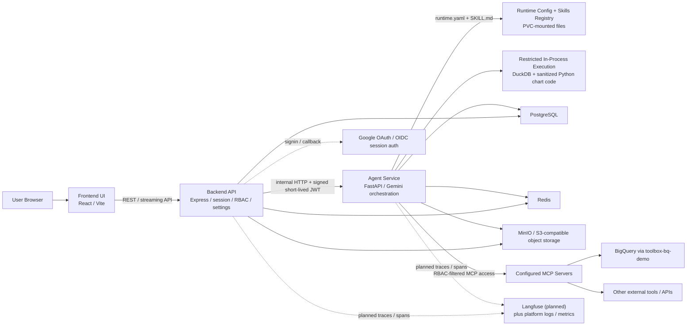
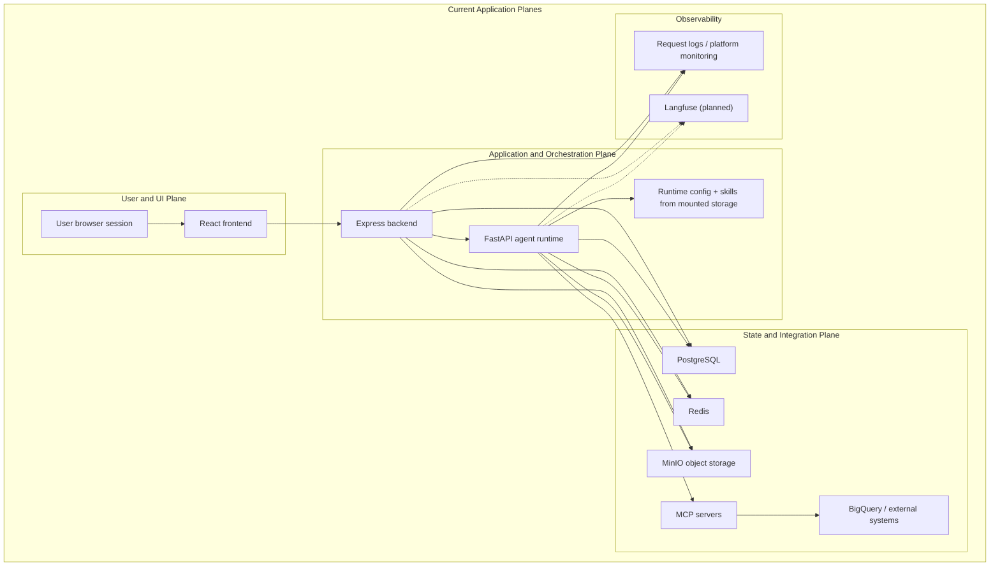
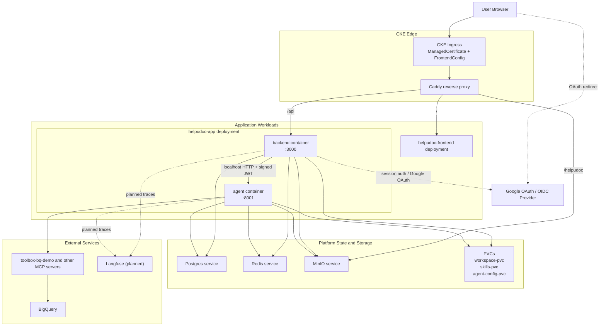

# Current HelpUDoc Architecture

This document captures the current HelpUDoc architecture as implemented in this repository and deployed via the GKE manifests under `infra/gke/k8s/`.

It is intentionally different from a target-state enterprise reference architecture. In particular, the current app does not have:

- a separate skill registry service
- a separate MCP auth broker service
- a separate sandbox enclave or gVisor execution tier
- a separate API gateway distinct from ingress plus Caddy
- Langfuse wired into the runtime yet

## 3.4 Architecture Diagrams

## 3.5 Infrastructure Architecture Diagram

## Notes

- The frontend is a separate Kubernetes deployment and service.
- Caddy is the runtime reverse proxy. It routes `/api` to the backend, `/helpudoc` to MinIO, and other paths to the frontend.
- The backend and agent are co-located in the same `helpudoc-app` pod today. Backend-to-agent traffic uses `http://localhost:8001`.
- Delegated MCP auth is not a standalone service. The backend signs a short-lived context JWT for the agent and can embed per-server `mcpAuth` headers for delegated access.
- Code execution is currently restricted in process for specific tools, not isolated in a dedicated sandbox enclave.
- Langfuse should be shown as a planned observability sink until instrumentation is actually added to the backend and agent services.

## Repo Sources

- `infra/gke/k8s/50-app.yaml`
- `infra/gke/k8s/60-frontend.yaml`
- `infra/gke/k8s/70-caddy.yaml`
- `infra/gke/k8s/71-ingress.yaml`
- `backend/src/api/agent.ts`
- `backend/src/services/agentService.ts`
- `backend/src/middleware/userContext.ts`
- `agent/helpudoc_agent/mcp_manager.py`
- `agent/helpudoc_agent/data_agent_tools.py`
