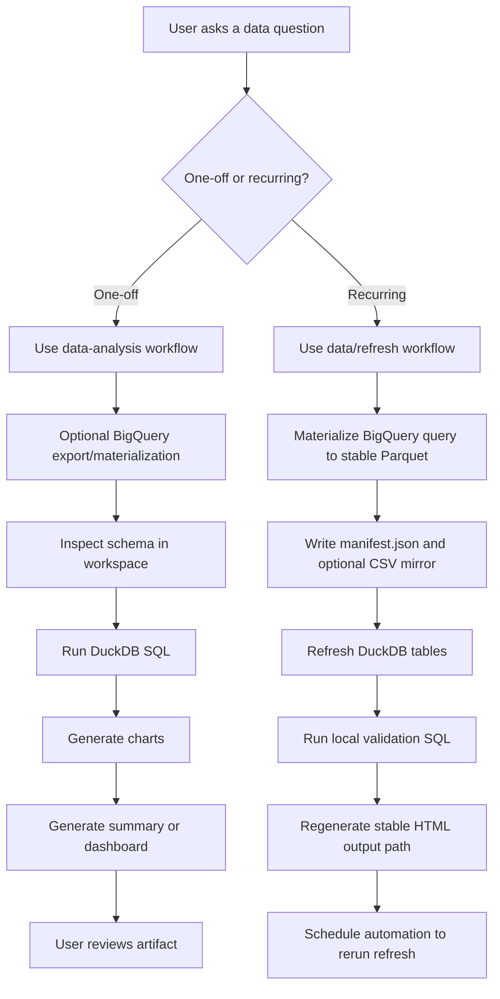
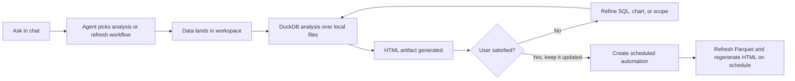

# HelpUDoc as a Data Analytics Platform

This document explains how a user would use HelpUDoc as a data analytics platform after the snapshot-refresh workflow changes.

The short version:

- BigQuery remains the system of record.
- Workspace-local Parquet becomes the serving layer for iterative analysis.
- DuckDB is the local analytics engine.
- HTML dashboards and reports are generated artifacts, not live warehouse apps.
- Automation re-runs the same refresh recipe on a schedule so the artifact stays current.

## Core Mental Model

Think about the platform in five layers:

1. **Source of truth**
   - BigQuery holds the authoritative data.
2. **Snapshot layer**
   - A scoped warehouse result is materialized into workspace-local Parquet.
3. **Local query layer**
   - DuckDB queries the workspace snapshot.
4. **Presentation layer**
   - The agent generates an HTML report or HTML dashboard.
5. **Automation layer**
   - A scheduled run refreshes the snapshot and regenerates the artifact.

This is deliberately not a live browser dashboard that queries BigQuery on page load.
It is a scheduled snapshot model that behaves like BI operationally while keeping sharing, auth, and reproducibility simpler.

## User Flow

## End-to-End Experience

### 1. Ask a question

The user starts in chat with a normal request, for example:

- "Analyze cancellation rate by country over the last 90 days."
- "Build a dashboard for weekly sales by region."
- "Refresh this dashboard every morning."

The user does not need to think in terms of BigQuery, DuckDB, or file formats first. The app can decide which path fits.

### 2. Agent selects the working mode

There are two main modes:

- **Ad hoc analysis**
  - Best for questions, investigations, and exploratory work.
- **Recurring refresh**
  - Best when the user wants a stable dataset path and a stable dashboard/report path that should stay updated.

### 3. Data is staged into the workspace

If the source data is in BigQuery, the agent can either:

- export a bounded CSV or Parquet for ad hoc work, or
- materialize a stable Parquet snapshot for recurring workflows

Typical stable dataset layout:

- `datasets/<slug>/latest.parquet`
- `datasets/<slug>/manifest.json`
- optional `datasets/<slug>/latest.csv`

### 4. Analysis happens locally

After the snapshot exists, the agent uses DuckDB against workspace files for:

- schema inspection
- local SQL iteration
- validation queries
- chart generation
- report/dashboard generation

This is the point of the design. The expensive or permission-sensitive warehouse call happens once per refresh cycle, and the rest happens locally.

### 5. Artifact is generated

The user receives one of two main artifact types:

- a report in `reports/`
- a dashboard in `dashboards/`

For recurring workflows, the important detail is that the output path is stable, for example:

- `reports/orders_daily.html`
- `dashboards/orders_overview.html`

That means the user can keep the same link or bookmark while the content gets refreshed by automation.

## Scenario A: Ad Hoc Investigation

### User intent

"Why did cancellations spike last week?"

### Flow

1. User asks the question.
2. Agent uses the analysis workflow.
3. If the data is not already in the workspace, the agent stages a bounded export from BigQuery.
4. Agent inspects the schema with DuckDB.
5. Agent runs several SQL queries locally.
6. Agent generates one or more charts.
7. Agent writes an HTML report or dashboard.

### Example artifact set

- `data_exports/cancellations_last_30d.parquet`
- `charts/Cancellations_By_Day.plotly.json`
- `charts/Cancellations_By_Day.plotly.html`
- `reports/analysis_report_20260321_090000.html`

### What the user gets

- a quick answer
- evidence-backed SQL analysis
- a shareable artifact
- fast follow-up questions without repeated BigQuery roundtrips

## Scenario B: Recurring Executive Dashboard

### User intent

"This dashboard is good. Refresh it every day at 8 AM."

### Flow

1. User first arrives at a dashboard they like.
2. Agent switches to the refresh workflow.
3. Agent materializes a stable snapshot from BigQuery, for example:
   - `datasets/orders/latest.parquet`
4. Agent writes:
   - `datasets/orders/manifest.json`
   - optional `datasets/orders/latest.csv`
5. Agent validates the refreshed snapshot with local DuckDB SQL.
6. Agent regenerates the stable dashboard path:
   - `dashboards/orders_overview.html`
7. Automation reruns the same refresh recipe daily.

### What stays stable

- dataset path
- manifest path
- dashboard path

### What changes each scheduled run

- Parquet contents
- manifest timestamps and row counts
- dashboard HTML contents

### What the user experiences

Operationally, it feels like:

- "my dashboard link stays the same"
- "the data inside is refreshed every morning"

That is the practical BI behavior the workflow is aiming for.

## Scenario C: Multi-Format Delivery

### User intent

"Analytics wants Parquet, operations wants CSV, leadership wants HTML."

### Flow

1. Agent materializes the canonical Parquet snapshot.
2. Agent emits an optional CSV mirror for downstream users.
3. Agent regenerates the HTML dashboard or report from the same Parquet snapshot.

### Example outputs

- `datasets/pipeline/latest.parquet`
- `datasets/pipeline/latest.csv`
- `datasets/pipeline/manifest.json`
- `dashboards/pipeline_health.html`

### Why this matters

One refresh pipeline can serve several consumers without creating separate logic for each one.

## Detailed User Journey

## Example Prompts

### Ad hoc questions

- "Analyze revenue by segment for the last 90 days."
- "Compare weekly sales by region and create a dashboard."
- "Find the biggest drivers of cancellation rate."

### Refresh-oriented prompts

- "Materialize this BigQuery result to `datasets/orders/latest.parquet`."
- "Generate a dashboard at `dashboards/orders_overview.html` from the refreshed snapshot."
- "Create a daily refresh flow for this dataset and dashboard."
- "Also emit a CSV mirror for operations."

### Validation prompts

- "Verify the refreshed snapshot row count before publishing the dashboard."
- "Compare today’s snapshot to the previous run and surface any anomalies."

## Example End-to-End Story

### Request

"Build a weekly sales dashboard by region and keep it updated every morning."

### First run

1. Agent queries BigQuery.
2. Agent materializes:
   - `datasets/sales_weekly/latest.parquet`
3. Agent writes:
   - `datasets/sales_weekly/manifest.json`
4. Agent runs local DuckDB SQL against the snapshot.
5. Agent generates charts.
6. Agent publishes:
   - `dashboards/sales_weekly.html`

### Ongoing runs

Each scheduled run:

1. refreshes `datasets/sales_weekly/latest.parquet`
2. updates `datasets/sales_weekly/manifest.json`
3. optionally updates `datasets/sales_weekly/latest.csv`
4. regenerates `dashboards/sales_weekly.html`

### User-visible result

The user keeps opening the same HTML dashboard path, but the underlying data is refreshed every morning.

## Why This Is Not Live Warehouse HTML

The browser artifact does not query BigQuery directly when someone opens it.

That is intentional.

If the dashboard were live at browser load time, the system would inherit:

- per-view authentication complexity
- browser-to-warehouse connectivity concerns
- higher latency
- harder sharing outside the authoring context
- less reproducible outputs

The snapshot model keeps those concerns out of the presentation layer.

## Operational Tradeoffs

### Strengths

- deterministic artifacts
- stable links
- cheaper follow-up analysis
- easier sharing
- simpler automation model
- clean separation between warehouse access and local analytics

### Limits

- dashboard freshness depends on schedule, not page refresh
- not suited for second-by-second operational monitoring
- changes in business logic still require prompt or workflow updates

## Recommended Product Framing

If this is explained to users, the clean framing is:

> HelpUDoc gives you AI-authored analytics artifacts backed by scheduled warehouse snapshots.
> BigQuery remains your source of truth, DuckDB gives you fast local analysis, and automations keep your reports and dashboards current.

## Recommended Onboarding Sequence

For a new user, the ideal path is:

1. Start with one ad hoc question.
2. Let the agent produce a report or dashboard.
3. Refine until the artifact is acceptable.
4. Convert that artifact into a recurring refresh workflow.
5. Use stable dataset and artifact paths for automation.

That keeps the first experience simple and only introduces automation once the user already trusts the output.

## Implementation References

Relevant implementation files:

- `agent/helpudoc_agent/data_agent_tools.py`
- `agent/helpudoc_agent/skills_registry.py`
- `skills/data-analysis/SKILL.md`
- `skills/data/refresh/SKILL.md`
- `tests/test_data_skill_family.py`
