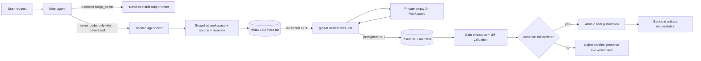

# Inline Python Sandbox: Object-Store Architecture

## Decision

Agent-authored Python may modify a private copy of the current workspace, but it never mounts the application's workspace PVC. Production inline runs use short-lived Kubernetes Jobs in the dedicated `helpudoc-sandbox` namespace, transfer a run-scoped snapshot through presigned MinIO/S3 URLs, and return a filesystem delta for trusted host-side validation and publication.

This preserves a lightweight agent harness: skills may carry scripts and guidance, while the runtime exposes one conditional execution surface instead of a growing collection of narrow code tools.

Inline execution remains feature-gated. When the feature flag or Kubernetes backend is unavailable, `inline_code` is omitted from the tool schema. Declared, reviewed skill scripts continue to work through `script_name`.

## Invocation flow



QuickJS remains a pure orchestration runtime. It has no filesystem or network access; it can only invoke tools exposed by the host. Main-agent file tools remain the canonical route for straightforward authoring.

## Trust boundaries

### Trusted agent process

The agent process:

- holds MinIO/S3 credentials and Kubernetes launcher credentials;
- creates a bounded workspace snapshot and records file hashes/versions;
- uploads `input.tar` and issues one run-scoped GET URL plus one run-scoped PUT URL;
- creates, watches, reads logs from, and deletes only sandbox Jobs;
- safely extracts the result archive;
- validates create, update, and delete operations against the baseline;
- rejects path traversal, symlinks, special files, oversized output, undeclared filters, and concurrent workspace changes;
- publishes only a successful validated delta and then lets the backend reconcile durable artifacts;
- deletes run-scoped transfer objects after completion on a best-effort basis.

### Untrusted sandbox Job

The Job:

- receives no Kubernetes service-account token and no cloud/object-store credentials;
- receives only expiring, object-specific presigned URLs;
- downloads one input bundle into an `emptyDir` workspace;
- runs as UID/GID 1000 with `RuntimeDefault` seccomp, no Linux capabilities, no privilege escalation, and a read-only root filesystem;
- cannot mount the application PVC, host paths, secrets, or arbitrary volumes;
- cannot install packages at runtime; the sandbox image intentionally omits usable `pip`, `setuptools`, and `wheel`;
- has no general network path. NetworkPolicy permits only DNS and MinIO port 9000;
- uploads one bounded result bundle and exits.

The sandbox image is not a security boundary by itself. Isolation depends on the namespace policy, admission policy, network enforcement, non-root container profile, and gVisor RuntimeClass together.

## Why object storage instead of a shared PVC

The object-store transport removes scheduler coupling between the application and sandbox Jobs:

- app and sandbox Pods do not need to run on the same node;
- gVisor is required only on the sandbox node pool;
- the application PVC is never visible inside untrusted code;
- MinIO/S3 is already the durable file plane, so no new file-transfer service is required;
- presigned URLs narrow each Job's authority to one input object and one result object for a short period.

A dedicated gVisor node pool is recommended. The application can remain on normal nodes. If a sandbox Job lands on a gVisor-capable node, the app does not need to colocate there because no shared ReadWriteOnce volume is involved.

## Filesystem contract

Inline code sees:

- `/workspace`: private writable workspace snapshot;
- `/workspace/.helpudoc-inline/inline_main.py`: host-authored entrypoint metadata/control files;
- `/tmp`: bounded writable temporary space;
- read-only container root outside these mounts.

For object-store mode, `input_paths` are optional context hints rather than the only mounted files. `output_paths` are also optional: when omitted, every validated workspace change is considered for publication. When provided, they restrict the publishable delta.

The supervisor computes creates, updates, and deletes. It excludes its control directory and rejects:

- absolute or parent-traversing paths;
- archive members escaping the extraction root;
- symlinks, hard links, devices, FIFOs, and sockets;
- more than 64 output files;
- files over 100 MiB;
- total output over 256 MiB;
- input snapshots over 512 files or 256 MiB;
- stdout over 64 KiB and stderr over 32 KiB.

Before publication, the host compares every touched path with the original baseline. A file created, edited, deleted, or versioned concurrently causes the run to fail rather than overwrite newer user work.

## Execution limits

Each agent run may request at most two inline executions. A process-local guard also allows one active Job per workspace and defaults to four active Jobs per agent process. These guards protect one process but are not cluster-wide concurrency controls.

Cluster enforcement comes from the `helpudoc-sandbox` namespace:

- `ResourceQuota` caps active Pods at four and bounds aggregate requests/limits;
- `LimitRange` supplies bounded defaults;
- each Job uses `backoffLimit: 0`, a maximum 330-second active deadline, and a 300-second post-finish TTL;
- the existing distributed workspace run lease protects publication from simultaneous agent runs.

The quota is intentionally the authoritative global ceiling. For example, three agent replicas each holding a local four-Job counter cannot create twelve running sandbox Pods: Kubernetes refuses creations once the namespace Pod quota reaches four. The process-local counter remains useful for early backpressure, not correctness.

If strict cluster-wide per-workspace execution serialization is later required before Job creation, add a Redis/database semaphore keyed by workspace ID. Publication already fails closed on a stale baseline, so this is an efficiency improvement rather than a data-integrity prerequisite.

## Kubernetes resources

Apply these resources in order:

1. `infra/gke/k8s/02-sandbox-namespace.yaml`
2. the MinIO, storage, and application namespaces/services
3. `infra/gke/k8s/49-skill-sandbox.yaml`
4. `infra/gke/k8s/50-app.yaml`

The sandbox manifest provides:

- a Pod Security Standards `restricted` namespace;
- a tokenless `helpudoc-sandbox-runner` ServiceAccount;
- namespace-scoped cross-namespace launcher RBAC for `helpudoc-agent`;
- default-deny ingress and egress;
- narrow DNS and MinIO egress;
- ResourceQuota and LimitRange;
- a fail-closed ValidatingAdmissionPolicy that requires canonical labels, gVisor, the approved image prefix/command, tokenless identity, `emptyDir`-only volumes, bounded lifetime/resources, and the restricted container security context.

Before rollout, confirm the cluster supports `admissionregistration.k8s.io/v1` ValidatingAdmissionPolicy and the CNI enforces NetworkPolicy. Also confirm a `gvisor` RuntimeClass exists and its eligible nodes can pull the sandbox image and reach MinIO.

## Runtime configuration

Production defaults are intentionally off until the infrastructure is ready.

```text
HELPUDOC_SANDBOX_BACKEND=kubernetes
SANDBOX_INLINE_ENABLED=true
HELPUDOC_INLINE_SANDBOX_NAMESPACE=helpudoc-sandbox
HELPUDOC_INLINE_SANDBOX_SERVICE_ACCOUNT=helpudoc-sandbox-runner
HELPUDOC_INLINE_SANDBOX_TRANSPORT=object_store
HELPUDOC_INLINE_SANDBOX_IMAGE=<immutable approved image tag or digest>
HELPUDOC_SANDBOX_RUNTIME_CLASS=gvisor
HELPUDOC_SANDBOX_S3_ENDPOINT=http://helpudoc-minio:9000
HELPUDOC_SANDBOX_PRESIGN_EXPIRY_SECONDS=600
SANDBOX_INLINE_MAX_GLOBAL_JOBS=4
```

The trusted agent also needs `S3_BUCKET_NAME`, `AWS_ACCESS_KEY_ID`, `AWS_SECRET_ACCESS_KEY`, and the launcher ServiceAccount. Sandbox Jobs receive none of those credentials.

Use an immutable image digest in production. If the ValidatingAdmissionPolicy pins an image repository prefix, update that policy and the deployment configuration together.

## Local development and testing

Docker Compose deliberately uses `HELPUDOC_SANDBOX_BACKEND=local`. Declared skill scripts can run locally, but agent-authored inline Python is not advertised and cannot run as a local subprocess. This avoids presenting local process execution as equivalent to the Kubernetes security boundary.

Local verification is split into three layers:

1. Python unit/integration tests validate snapshot creation, safe archive handling, diff publication, conflict behavior, deletion handling, and dynamic tool-schema exposure.
2. The sandbox container smoke test validates UID 1000, missing package installer, and supervisor contract enforcement.
3. Playwright validates real user workflows against the local application. Those workflows use direct authoring or declared scripts locally; Kubernetes object-store execution remains covered by the runner/supervisor integration tests until tested in a cluster.

Run the model-backed workflow suite explicitly:

```bash
cd frontend
RUN_LIVE_AGENT_E2E=1 E2E_BASE_URL=http://localhost:5173 \
  npx playwright test e2e/live-agent-workflows.spec.ts --project=chromium
```

The suite covers quick research, new HTML slides, image generation, in-place slide editing, and image editing. It verifies artifact content/version changes, browser-decodes images, compares hashes, and attaches evidence files.

## Rollout

1. Publish reviewed governed versions for the changed `frontend-slides` and `research` skill packages, update the intended defaults/pins, and require governed migration parity to report no `manifestMismatches`. Editing repository skill files alone does not upgrade immutable workspace pins.
2. Deploy namespace, RBAC, policies, quota, RuntimeClass/node-pool support, MinIO reachability, and the immutable sandbox image while `SANDBOX_INLINE_ENABLED=false`.
3. Run admission smoke tests: an approved Job must be admitted; a Job with a PVC, service-account token, wrong image, missing gVisor, host namespace, or elevated security context must be denied.
4. Run one synthetic object-store sandbox in a non-production workspace and verify transfer-object cleanup and artifact reconciliation.
5. Enable inline execution for internal users or a small traffic slice.
6. Monitor Job admission failures, quota rejections, duration, transfer sizes, result validation failures, stale-baseline conflicts, and orphaned object keys.
7. Expand gradually. The rollback is setting `SANDBOX_INLINE_ENABLED=false`; declared scripts and direct file authoring continue to operate.

## Deployed GKE state (2026-09-02)

The first production deployment is running on the existing GKE environment:

- project: `my-rd-coe-demo-gen-ai`;
- zonal cluster: `helpudoc-cluster` in `asia-southeast1-a`;
- application namespace: `helpudoc`;
- sandbox namespace: `helpudoc-sandbox`;
- dedicated node pool: `helpudoc-sandbox-pool`, autoscaling from one to two `e2-standard-2` nodes;
- sandbox runtime: gVisor on COS_CONTAINERD with Secure Boot, integrity monitoring, auto-repair, and auto-upgrade;
- production switch: `SANDBOX_INLINE_ENABLED=true`;
- transport: `object_store` through the existing in-cluster MinIO service.

NetworkPolicy enforcement was enabled on the existing cluster. GKE required a same-version rolling recreation of the three-node default pool before Calico enforcement became active. Stateful services remounted successfully and the public backend health endpoint recovered before inline execution was enabled.

The tested release uses these immutable deployment tags:

```text
backend:       gcr.io/my-rd-coe-demo-gen-ai/helpudoc-backend:inline-objectstore-20260902-1
frontend:      gcr.io/my-rd-coe-demo-gen-ai/helpudoc-frontend:inline-objectstore-20260902-1
agent:         gcr.io/my-rd-coe-demo-gen-ai/helpudoc-agent:inline-objectstore-20260902-2
inline runner: gcr.io/my-rd-coe-demo-gen-ai/helpudoc-inline-sandbox:inline-objectstore-20260902-2
```

The same tested digests also carry each repository's `latest` tag for compatibility with the checked-in deployment manifests; the running Pods remain pinned to the immutable tags above.

Cluster validation completed before and after enabling the feature:

- an admission-conformant Job was accepted;
- Jobs were denied for a missing canonical label, PVC volume, service-account token mount, unapproved image, missing gVisor runtime, host networking, privileged execution, privilege escalation, or missing memory limit;
- a normal Pod could reach MinIO while a sandbox-labelled deny probe could not, confirming policy enforcement;
- a full gVisor object-store round trip created, updated, and deleted files while blocking external IP access, the metadata endpoint, package installation, Kubernetes credentials, the application PVC, and writes outside the private mounts;
- a deliberate infinite loop was stopped by the supervisor's requested two-second Python timeout, before the outer Kubernetes Job deadline;
- a real model-backed `frontend-slides` edit invoked `run_skill_python_script`, transformed three existing files, created a marker artifact, and completed. Its first generated script attempted a root-level write and was rejected by the read-only root filesystem; the model retried with `/workspace` and succeeded;
- finished Jobs, Pods, and run-scoped MinIO transfer objects were absent after cleanup.

The targeted local sandbox suite reports 60 passing tests. The broader local model-backed Playwright suite covers research, slide creation, image creation, in-place slide editing, and image editing. Production uses OIDC/hybrid authentication, so spoofed local `X-User-*` headers must not be enabled merely to run a browser smoke test; the deployed sandbox was instead exercised through a correctly signed internal agent context.

The immediate feature rollback is fail-safe and does not require removing the node pool or policies:

```bash
kubectl -n helpudoc patch configmap helpudoc-config \
  --type merge \
  -p '{"data":{"SANDBOX_INLINE_ENABLED":"false"}}'
kubectl -n helpudoc rollout restart deployment/helpudoc-app
kubectl -n helpudoc rollout status deployment/helpudoc-app
```

This removes `inline_code` from the advertised tool schema after the app restart. Direct workspace authoring and reviewed `script_name` execution remain available.

Langfuse web still has its pre-existing dirty ClickHouse migration version 39 and remains outside the sandbox critical path. Agent telemetry export retries are noisy but did not prevent tool execution or artifact publication; repair that migration as a separate backlog item.

## Residual risks and follow-ups

- Presigned URLs may appear in Kubernetes Job specs and API audit logs. Keep expiry short, limit audit-log access, and consider a transfer broker if that exposure is unacceptable.
- DNS egress to cluster DNS is currently required to resolve the MinIO service and can be abused as a low-bandwidth exfiltration channel by deliberately malicious code. NetworkPolicy therefore blocks ordinary external network access but is not a complete data-loss-prevention boundary. For high-assurance untrusted workloads, use a non-recursive allowlisted resolver, a stable numeric transfer endpoint, or a child-level socket-denial boundary so cluster DNS can also be removed.
- DNS plus MinIO-only egress assumes the CNI correctly enforces namespace/pod selectors. Validate this on the actual cluster.
- gVisor reduces kernel attack surface but does not eliminate container or kernel vulnerabilities; patch the node runtime and sandbox base image regularly.
- Namespace Pod quota is a coarse global ceiling. Add queueing/backpressure if quota rejections become user-visible under load.
- The dedicated gVisor pool has a minimum size of one and therefore carries continuous node cost. Lowering it to zero trades cost for cold-start latency if the selected GKE configuration supports scale-to-zero reliably.
- Admission currently pins the approved runner repository prefix while the deployment uses an immutable release tag. Exact digest admission pinning is stronger, but requires updating the policy and runtime image reference atomically for every runner release. Keep registry write IAM narrow until that rollout mechanism is automated.
- Result publication is host-validated but not a substitute for content-level review. Existing artifact and skill contracts remain responsible for format-specific quality checks.
- Object lifecycle rules should delete abandoned `sandbox-runs/` keys in case the trusted host crashes before best-effort cleanup.
