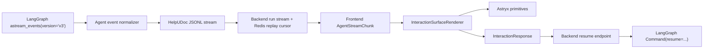

# LangGraph stream v3 + Astryx interaction architecture

## Decision

HelpUDoc owns the interaction protocol. Astryx owns presentation.

LangGraph interrupts and `Command(resume=...)` remain the workflow boundary. The
agent, backend, and persisted run state do not reference Astryx components.
Frontend code maps a semantic interaction presentation to Astryx components.

The previous renderer protocol and compatibility projection have been removed.

## Event flow



The existing token, thought, tool, progress, interrupt, done, and error events
continue to use the same replayable stream. An optional `interaction` event can
arrive immediately before its interrupt envelope; both refer to the same
`interactionId`.

## Product contract

`InteractionRequest` is versioned independently of Astryx:

```ts
type InteractionRequest = {
  contract: 'helpudoc.interaction';
  version: '1';
  interactionId: string;
  presentation:
    | 'questionnaire'
    | 'style_preview'
    | 'action_review'
    | 'plan_review';
  props: Record<string, unknown>;
  gateId?: string;
  skill?: string;
  required?: boolean;
  resumeAction?: {
    endpoint: 'respond' | 'decision' | 'act';
    actionId?: string;
  };
  metadata?: Record<string, unknown>;
};
```

`InteractionResponse` returns the same `interactionId`, an action id, and
structured values or a decision. It contains no renderer state.

## Ownership boundaries

The agent:

- emits semantic interaction requests;
- enforces declared skill gate order;
- records pending/completed/failed gates and correction telemetry;
- retries malformed or prose-only input requests;
- resumes through LangGraph commands.

The backend:

- validates the product contract;
- persists pending interrupts and interaction gate state;
- maintains ordered JSONL streaming and reconnect replay;
- routes `respond`, `decision`, and `act` resumes.

The frontend:

- treats the stream contract as the source of truth;
- maps each semantic presentation to Astryx components;
- submits structured responses without exposing Astryx names upstream;
- uses the Astryx neutral theme at the application root.

Astryx:

- provides layout, typography, composer, list, badge, card, input, and action
  components;
- does not define workflow state, gate identity, stream events, or resume
  payloads.

## Rendering map

| Presentation | Astryx composition |
| --- | --- |
| `questionnaire` | `Card`, `Stack`, `List`, `ListItem`, `Badge`, `TextArea`, `Button` |
| `style_preview` | `Card`, `Stack`, `List`, `ListItem`, `Badge`, `Button` |
| `action_review` | `Card`, `Stack`, `TextArea`, `Button` |
| `plan_review` | `Card`, `Stack`, `Text`, `TextArea`, `Button` |

This map is frontend-only. It can evolve without a contract version bump as
long as response semantics remain unchanged.

## Theme boundary

The root is wrapped in Astryx `Theme` with the built neutral theme. The current
light/dark preference is synchronized to it.

Tailwind remains for unmigrated feature screens:

- Astryx reset and theme CSS load in declared cascade layers;
- Tailwind preflight is isolated in its own layer;
- Tailwind utilities remain unlayered;
- legacy HelpUDoc variables are temporary aliases to Astryx tokens;
- the old selectable global themes and broad utility overrides are removed.

MUI remains as a neutral compatibility provider only where existing screens
still depend on it.

## Invariants

1. No Astryx component or package name appears in an agent or backend payload.
2. Every required interaction has a stable `interactionId`.
3. Every skill gate has a semantic presentation and a structured response.
4. Reconnect replay cannot create a second logical interaction.
5. Gate completion is recorded only after a valid resume.
6. A renderer failure does not silently resume the graph.
7. Synthetic recovery uses the same interaction contract as direct requests.
