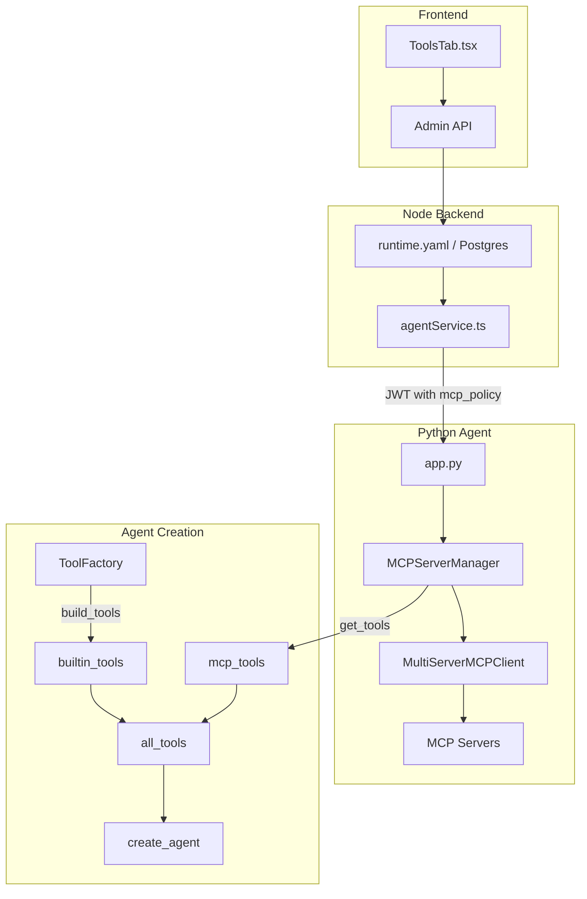

# MCP Server Registry and DeepAgents Integration

## Overview
This document describes how MCP (Model Context Protocol) servers are integrated with the HelpUDoc agent service. The design is inspired by the PTC Agent pattern, which cleanly separates MCP server management from agent creation.

## Current State

### Placeholder Implementation
The current `MCPServerRegistry` in [`agent/helpudoc_agent/tools_and_schemas.py`](../agent/helpudoc_agent/tools_and_schemas.py) is a **placeholder stub** that only stores configs but doesn't connect to MCP servers.

### Frontend UI Exists
The Admin Portal already has UI for configuring MCP servers in [`frontend/src/components/settings/ToolsTab.tsx`](../frontend/src/components/settings/ToolsTab.tsx).

### Configuration Schema
MCP servers are defined in `runtime.yaml` and modeled in [`agent/helpudoc_agent/configuration.py`](../agent/helpudoc_agent/configuration.py).

---

## Proposed Implementation

## Follow-On Plan: Connections + Auth Broker
This document covers the mechanics of registering MCP server endpoints and attaching
their tools to the agent.

For production-grade credential handling (per-workspace tokens, per-user OAuth, and
identity federation), follow the companion plan:
- [`docs/mcp-connections-auth-plan.md`](./mcp-connections-auth-plan.md)

### Architecture



### Key Pattern: Tools via `get_tools()`

Inspired by the PTC Agent, the core pattern is:

```python
# In app.py - agent creation per request

# 1. Initialize MCPServerManager with settings + workspace context (has RBAC policy)
mcp_manager = MCPServerManager(settings, workspace_state)
await mcp_manager.initialize()  # connects to allowed MCP servers only

# 2. Get RBAC-filtered MCP tools
mcp_tools = await mcp_manager.get_tools()

# 3. Combine with other tools from ToolFactory
all_tools = tool_factory.build_tools(workspace_state) + mcp_tools

# 4. Create agent with combined tools
agent = create_agent(
    model=llm,
    system_prompt=system_prompt,
    tools=all_tools,
    ...
)
```

---

## MCPServerManager Class

```python
"""MCP Server Manager - manages connections and provides tools."""

from typing import Any, Dict, List, Optional
from langchain_core.tools import Tool
from langchain_mcp_adapters.client import MultiServerMCPClient

from .configuration import MCPServerConfig, Settings
from .workspace_state import WorkspaceState


class MCPServerManager:
    """Manages MCP server connections and provides RBAC-filtered tools.
    
    Similar to how ToolFactory.build_tools() provides builtin tools,
    MCPServerManager.get_tools() provides MCP tools.
    """
    
    def __init__(self, settings: Settings, workspace_state: WorkspaceState):
        self.settings = settings
        self.workspace_state = workspace_state
        self._client: Optional[MultiServerMCPClient] = None
        self._allowed_servers: Dict[str, MCPServerConfig] = {}
        self._tools_by_server: Dict[str, List[Tool]] = {}
        
    def _filter_by_policy(self) -> Dict[str, MCPServerConfig]:
        """Filter MCP servers based on RBAC policy from workspace context."""
        mcp_policy = self.workspace_state.context.get("mcp_policy", {})
        deny_ids = set(mcp_policy.get("denyIds", []))
        allow_ids = set(mcp_policy.get("allowIds", []))
        is_admin = mcp_policy.get("isAdmin", False)
        
        allowed = {}
        for name, cfg in self.settings.mcp_servers.items():
            # Admin gets all servers
            if is_admin:
                allowed[name] = cfg
                continue
            # Explicit deny always wins
            if name in deny_ids:
                continue
            # For default_access=deny, must have explicit allow
            if cfg.default_access == "deny" and name not in allow_ids:
                continue
            # Otherwise allowed
            allowed[name] = cfg
        return allowed
    
    async def initialize(self) -> None:
        """Initialize MultiServerMCPClient with allowed servers only."""
        self._allowed_servers = self._filter_by_policy()
        if not self._allowed_servers:
            return
        
        # Build config for langchain-mcp-adapters
        config: Dict[str, Dict[str, Any]] = {}
        for name, cfg in self._allowed_servers.items():
            if cfg.transport == "stdio":
                config[name] = {
                    "transport": "stdio",
                    "command": cfg.command,
                    "args": cfg.args or [],
                    "env": cfg.env,
                    "cwd": cfg.cwd,
                }
            elif cfg.transport in ("http", "sse"):
                server_config: Dict[str, Any] = {
                    "transport": "http",
                    "url": cfg.url,
                    "headers": cfg.headers.copy(),
                }
                # Handle bearer token from env var
                if cfg.bearer_token_env_var:
                    import os
                    token = os.environ.get(cfg.bearer_token_env_var, "")
                    if token:
                        server_config["headers"]["Authorization"] = f"Bearer {token}"
                config[name] = server_config
        
        if config:
            self._client = MultiServerMCPClient(config)
    
    async def get_tools(self) -> List[Tool]:
        """Get LangChain tools from all allowed MCP servers.
        
        This is the main API - call this to get tools for agent creation.
        """
        if not self._client:
            return []
        return await self._client.get_tools()
    
    def get_tools_by_server(self) -> Dict[str, List[Tool]]:
        """Get tools organized by server name (for tool summary in prompts)."""
        return self._tools_by_server
    
    def get_allowed_server_names(self) -> List[str]:
        """Get list of allowed server names (for logging/debugging)."""
        return list(self._allowed_servers.keys())
    
    async def cleanup(self) -> None:
        """Clean up MCP connections."""
        # MultiServerMCPClient handles cleanup automatically
        self._client = None
        self._allowed_servers = {}
```

---

## Configuration Extension

Extend `MCPServerConfig` in [`agent/helpudoc_agent/configuration.py`](../agent/helpudoc_agent/configuration.py):

```python
class MCPServerConfig(BaseModel):
    name: str
    transport: str  # "stdio" | "http" | "sse"
    
    # STDIO transport
    command: Optional[str] = None
    args: Optional[List[str]] = None
    env: Dict[str, str] = Field(default_factory=dict)
    env_passthrough: Optional[List[str]] = None
    cwd: Optional[str] = None
    
    # HTTP/SSE transport
    url: Optional[str] = None
    headers: Dict[str, str] = Field(default_factory=dict)
    headers_from_env: Dict[str, str] = Field(default_factory=dict)
    bearer_token_env_var: Optional[str] = None
    
    # Metadata
    description: Optional[str] = None
    default_access: str = "allow"  # "allow" | "deny" for RBAC
```

---

## Integration with app.py

Update [`agent/helpudoc_agent/app.py`](../agent/helpudoc_agent/app.py) to use the new pattern:

```python
from .mcp_manager import MCPServerManager

async def build_agent_for_request(
    settings: Settings,
    workspace_state: WorkspaceState,
    llm: BaseChatModel,
) -> CompiledGraph:
    """Build agent with all tools including MCP tools."""
    
    # 1. Initialize MCP manager with RBAC filtering
    mcp_manager = MCPServerManager(settings, workspace_state)
    await mcp_manager.initialize()
    
    # 2. Get MCP tools (already filtered by policy)
    mcp_tools = await mcp_manager.get_tools()
    
    # 3. Get builtin tools from ToolFactory
    tool_factory = ToolFactory(settings)
    builtin_tools = tool_factory.build_tools(workspace_state)
    
    # 4. Combine all tools
    all_tools = builtin_tools + mcp_tools
    
    # 5. Build system prompt with tool summary
    tool_summary = format_tool_summary(
        mcp_tools_by_server=mcp_manager.get_tools_by_server(),
        builtin_tools=builtin_tools,
    )
    system_prompt = build_system_prompt(tool_summary=tool_summary)
    
    # 6. Create and return agent
    return create_agent(
        model=llm,
        system_prompt=system_prompt,
        tools=all_tools,
    )
```

---

## Proposed Changes Summary

### Python Agent

| File | Change |
|------|--------|
| [`agent/requirements.txt`](../agent/requirements.txt) | Add `langchain-mcp-adapters>=0.1.0` |
| [NEW] [`agent/helpudoc_agent/mcp_manager.py`](../agent/helpudoc_agent/mcp_manager.py) | New `MCPServerManager` class |
| [`agent/helpudoc_agent/configuration.py`](../agent/helpudoc_agent/configuration.py) | Extend `MCPServerConfig` schema |
| [`agent/helpudoc_agent/tools_and_schemas.py`](../agent/helpudoc_agent/tools_and_schemas.py) | Remove placeholder `MCPServerRegistry` |
| [`agent/helpudoc_agent/app.py`](../agent/helpudoc_agent/app.py) | Use `MCPServerManager.get_tools()` pattern |

### Node Backend

| File | Change |
|------|--------|
| [`backend/src/services/agentService.ts`](../backend/src/services/agentService.ts) | Include `mcpServerDenyIds` and `mcpServerAllowIds` in JWT |

### Frontend

| File | Change |
|------|--------|
| [`frontend/src/components/settings/ToolsTab.tsx`](../frontend/src/components/settings/ToolsTab.tsx) | Add `default_access` toggle for RBAC |

---

## RBAC Enforcement

### Policy Flow
1. **Backend** computes effective access from `mcp_server_grants` table
2. **Backend** includes `mcpServerDenyIds` and `mcpServerAllowIds` in JWT
3. **Agent** extracts policy into `workspace_state.context["mcp_policy"]`
4. **MCPServerManager** filters servers in `_filter_by_policy()`
5. **Only allowed servers** are connected and provide tools

### Policy Payload (JWT)
```json
{
  "mcpServerDenyIds": ["internal_admin_fs"],
  "mcpServerAllowIds": ["research_fs"],
  "isAdmin": false
}
```

---

## Comparison to Skills

| Aspect | Skills | MCP Servers |
|--------|--------|-------------|
| Source | `SKILL.md` files on disk | `runtime.yaml` + Postgres |
| Discovery | `load_skills()` → metadata | `settings.mcp_servers` → config |
| Tools | Declared in frontmatter | Fetched via `get_tools()` |
| Attachment | `ToolFactory.build_tools()` | `MCPServerManager.get_tools()` |
| RBAC | `skill_policy` in context | `mcp_policy` in context |

---

## Error Handling

```python
async def initialize(self) -> None:
    """Initialize with graceful error handling per server."""
    for name, cfg in self._allowed_servers.items():
        try:
            # Connect to individual server
            ...
        except Exception as e:
            logger.warning(
                "Failed to connect to MCP server, excluding from available tools",
                server=name,
                error=str(e),
            )
            # Continue with other servers - don't fail entire request
```

---

## Testing Strategy

### Unit Tests
- `_filter_by_policy()` correctly filters based on various policy combinations
- Config parsing handles STDIO and HTTP transports
- `get_tools()` returns empty list when no servers allowed

### Integration Tests
- End-to-end: Backend JWT → Agent filtering → Tools available to LLM
- Test with mock MCP servers for both transport types
