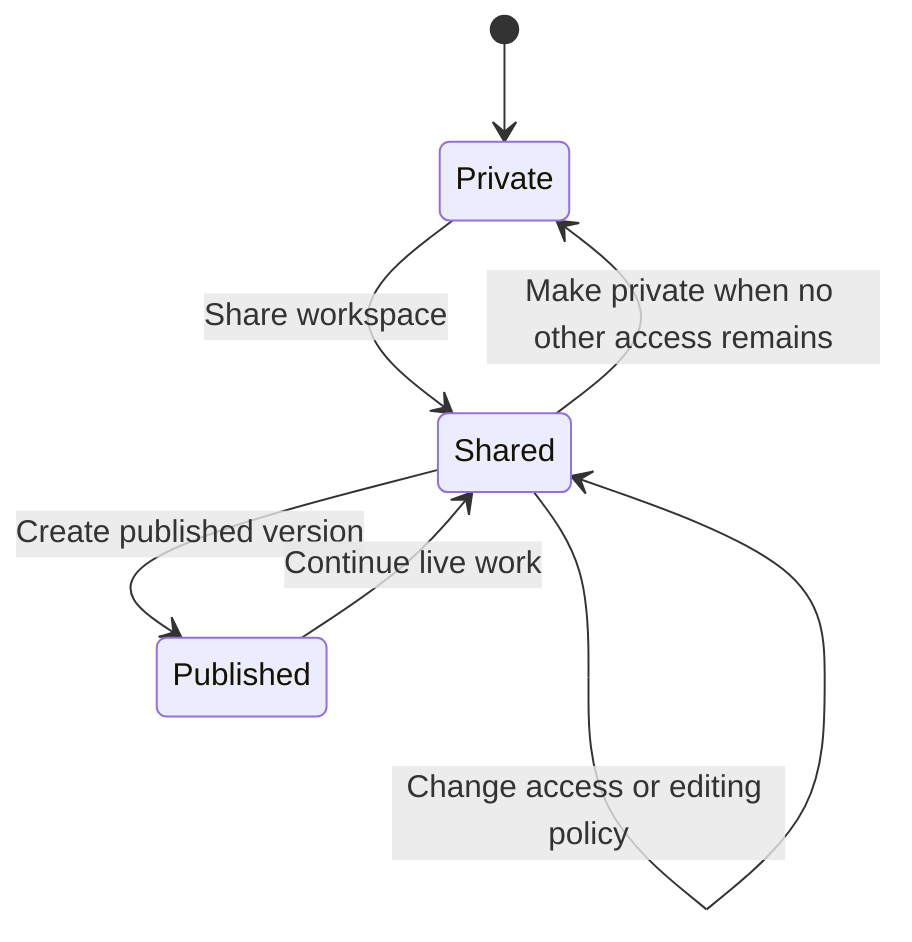

# Private and Shared Workspaces — Product Specification

Status: Implemented baseline with the intended Team Chat and mode-aware Lumo policy

## 1. Summary

HelpUDoc presents two workspace categories:

- **Private workspaces** are visible only to their owner.
- **Shared workspaces** are live, mutable workspaces with explicit people or Team access.

A **published version** is not a third workspace category. It is an immutable snapshot of a Shared workspace's current revision. A Shared workspace can continue changing after a version is published.

A current publication may be **withdrawn** by an Owner or Publisher. Withdrawal removes the current-publication pointer without deleting immutable version history or changing access to the live Shared workspace.

The product therefore separates three independent decisions:

1. **Access** — who can see the workspace;
2. **Editing policy** — how collaborators' changes enter the live workspace; and
3. **Publication** — when the current live revision becomes a stable version.

The workspace pane should expose only the two categories above. Published versions should appear inside a Shared workspace through a `Working version` / `Published versions` view, with optional filters and badges.

## 2. Product principles

1. **Private by default**
   Every newly created workspace starts owner-only.

2. **Sharing is independent from publishing**
   The owner can share a workspace before publishing it and can add or remove people later without creating a content version.

3. **A Shared workspace is live**
   Once shared, collaborators work against one current workspace revision. It is not silently converted into a collection of private copies.

4. **Editing policy is explicit**
   The owner chooses either `Freeflow` or `Review` mode for a Shared workspace.

5. **Publishing is a release action**
   Publishing freezes the current revision into an immutable historical version. It does not make the live workspace read-only.

6. **No corrupting writes or invisible data loss**
   Writes are serialized transactionally, and every accepted change creates recoverable revision history. Freeflow may intentionally use last-successful-save-wins semantics, but it must not lose history silently.

7. **Private runtime state stays private**
   Sharing or publishing never exposes credentials, personal integrations, private activity, unsent prompts, or private agent state.

8. **Team collaboration is independent of publication**
   Authorized Shared workspace members can use Team Chat before or after publication. Publication provides an immutable snapshot; it is not a prerequisite for collaboration.

## 3. Terminology

| Term | User-facing meaning |
|---|---|
| Private workspace | An owner-only workspace that has not been shared |
| Shared workspace | A live workspace with explicit people or Team access |
| Working version | The current mutable state of a Shared workspace |
| Published version | An immutable snapshot of a Shared workspace revision |
| Share workspace | Give selected registered users or Teams access to the live workspace |
| Freeflow | Collaborator changes apply directly to the live workspace |
| Review | Collaborator changes enter a proposal queue before being applied |
| Publisher | A directly named user allowed to create published versions |
| Contributor | A user or Team allowed to modify the live workspace according to its editing policy |
| Viewer | A user or Team allowed to view the workspace but not modify it |

Do not use repository, commit, branch, push, pull, merge, local, remote, or origin in the UI.

Internally, the existing `workspaceType = team` value may remain during migration, but the user-facing term should be `Shared workspace`. A Shared workspace does not need to belong to only one Team.

## 4. Workspace pane and information architecture

The workspace pane has two collapsible top-level sections:

### Private workspaces

- Contains owner-only drafts.
- Contains optional private working copies created from Shared workspaces.
- Provides the primary `New workspace` action.
- Shows `Private` or `Private copy` badges where useful.

### Shared workspaces

- Contains Shared workspaces owned by the user or shared with them.
- Shows the owner's name, access source, editing policy, and latest published-version badge.
- Opens to the current `Working version` by default for collaborators with live access.
- Provides a `Published versions` view inside the workspace rather than another sidebar section.
- Shows `Publication withdrawn` when version history exists but no version is currently published.

The Shared section may have lightweight filters:

- `All shared`
- `Owned by me`
- `Shared with me`
- `Has published version`
- `Needs review`

These are filters, not additional workspace types. Sections should remember their collapsed or expanded state. Search must preserve whether a result is Private or Shared and must not expose owner-only content.

## 5. Workspace lifecycle



`Published` in this diagram is a version state, not a separate workspace type. The Shared workspace remains the durable identity and continues to own the working revision and publication history.

An owner may make a Shared workspace private again only when:

- no other user or Team has access;
- there are no open review proposals that would become inaccessible; and
- the owner acknowledges that other users may already have viewed or copied content.

## 6. Access and roles

### Private workspace

| Role | Permissions |
|---|---|
| Owner | View, edit, rename, delete, and create a Shared workspace by sharing |
| Everyone else | No access |

Private workspaces must not have access-grant rows.

### Shared workspace

| Role | View working version | Read Team Chat | Post / mention Lumo | Edit Freeflow | Submit Review proposal | Create published version | Manage access |
|---|---:|---:|---:|---:|---:|---:|---:|
| Viewer | Yes | Yes | No | No | No | No | No |
| Contributor | Yes | Yes | Yes | Yes | Yes | No | No |
| Publisher | Yes | Yes | Yes | Yes | Yes | Yes | No |
| Owner | Yes | Yes | Yes | Yes | Yes | Yes | Yes |

Publisher is a direct user grant. A Team grant may provide Viewer or Contributor, but must not grant Publisher authority to every Team member.

Effective direct-user access uses:

```text
owner > publisher > contributor > viewer
```

When a user has both a direct grant and a Team-derived grant, the strongest eligible permission applies. Removing one grant must show if another grant still preserves access.

Only active registered users may receive direct grants. There are no anonymous links in this release.

## 7. Editing policies

Every Shared workspace has one editing policy, selected by its owner.

### Freeflow mode

Freeflow is the lightweight, live-collaboration mode.

- Contributors and Publishers edit the current working version directly.
- Each write is processed transactionally against the current workspace revision.
- Writes to different artifacts can proceed independently.
- For the same artifact, the last successful save wins.
- A stale save may replace the current artifact version, but the previous version remains recoverable in history.
- The UI should warn when a save was based on an older revision.
- File and folder operations must be attributed to the actor and timestamped.

Freeflow must not queue an entire workspace behind one slow editor. The server should serialize conflicting writes per workspace/artifact and preserve a complete change history.

### Review mode

- Contributors' changes enter a proposal queue.
- The proposal records its base revision and affected artifacts.
- Owner or Publisher applies, rejects, or requests changes.
- Applying a proposal creates a new current revision atomically.
- A stale proposal returns to review with an explanation rather than silently overwriting newer work.

The proposal queue is a governance mechanism. It is separate from the short-lived technical write queue used to make individual mutations safe.

### Team Chat and Lumo execution

Team Chat is part of the Shared workspace surface and is available to every authorized member, whether or not the workspace has a published version. It is opened from the Shared workspace's Working version view. Published history is a separate read-only view and must not be the gate for Team Chat access.

- Viewers may read Team Chat but cannot post, reply, mention Lumo, or create collaboration items that require write access.
- Contributors, Publishers, and Owners may post, reply, mention Lumo, and use the collaboration actions allowed by their role.
- Team Chat Lumo always uses the current Shared workspace working version as its context. If no publication exists, the UI must identify the context as the Working version rather than implying that a published version exists.
- Lumo inherits the invoking member's effective workspace permission and must never gain more authority than that member.

In **Freeflow**:

- Lumo may apply file and folder changes directly to the current working version when the invoking member has Freeflow edit permission.
- Those changes use the same concurrency, revision history, attribution, and audit rules as a human edit.
- Viewers remain read-only and cannot invoke Lumo from Team Chat.

In **Review**:

- Team Chat Lumo is read-only for every role. It may inspect the current working version and suggest changes, but it must not modify Shared workspace files or apply a proposal directly from the shared channel.
- A member who wants Lumo to make changes works in an authorized Private working copy. The member can then submit or sync those changes through the normal Review proposal flow for Owner or Publisher review.
- Private prompts, agent history, tool calls, credentials, and other runtime state from that working copy remain private.

## 8. Sharing flow

### Share a private workspace

1. The owner selects `Share workspace`.
2. The workspace becomes Shared while retaining the same workspace identity and content.
3. The owner chooses `Freeflow` or `Review` mode.
4. The owner adds registered users or Teams and assigns roles.
5. Invited users immediately see the Shared workspace in their Shared section.

Sharing does not create a published version and does not create a private copy for every recipient.

### Manage access

The owner can add, remove, or change grants at any time. Access changes are separate audit events from content changes and publication events.

When access is revoked:

- future reads and writes are denied immediately;
- the user cannot create new proposals or publish from that workspace;
- any private working copy they already created remains private but becomes detached;
- HelpUDoc cannot recall content the user already viewed or copied.

## 9. Publication flow

### Create a published version

An Owner or Publisher selects `Create published version` from the Shared workspace's Working version view.

The publication dialog shows:

- the exact working revision being published;
- the files and folders included;
- the content excluded from publication;
- the optional publication note; and
- the people and Teams currently eligible to view the Shared workspace.

On confirmation:

1. Pending saves complete.
2. The service locks the current workspace head.
3. It verifies that the requested source revision is still current.
4. It creates an immutable published version and manifest.
5. It advances `currentPublishedVersionId`.
6. It records the publisher, time, note, and audit event.

The live Shared workspace remains open and unchanged. Collaborators may continue editing immediately. The next publication creates another version.

Publication does not add, remove, or alter access grants.

### Published versions view

The view shows:

- current published version;
- publication number, author, time, and note;
- preview of historical versions;
- changes since the previous publication; and
- owner-only restore action.

When no version is current, the latest historical version is marked `Withdrawn` rather than `Current`.

Restoring creates a new publication from the restored content. It does not delete history or rewrite the live workspace without an explicit owner action.

### Withdraw publication

An Owner or Publisher may withdraw the current published version. The operation:

1. clears `currentPublishedVersionId`;
2. preserves every immutable published-version record and manifest;
3. leaves the Shared working version and its audience unchanged;
4. records an audit event containing the withdrawn version ID and number; and
5. allows a later publication, which receives the next version number.

Withdrawal is not deletion. Published history remains reachable from the expandable Shared workspace item and identifies that no version is currently published.

## 10. Publishable content boundary

### Included

- User-visible workspace files.
- Folder structure.
- User-visible dashboards and artifact packages.
- File and folder names, MIME types, and supported workspace metadata.

### Excluded from sharing and publication by default

- Credentials, OAuth tokens, API keys, and secrets.
- Personal integrations and MCP connection credentials.
- Personal activity, recent history, schedules, and preferences.
- Unsent prompts and private conversations.
- Private agent messages, tool calls, run logs, and approval history.
- Hidden runtime files, caches, temporary uploads, and generated previews.

Shared collaboration messages, comments, annotations, and tasks may be visible to Shared workspace members when they are explicitly part of the workspace collaboration surface. They must not expose personal agent state or credentials.

Team Chat messages are part of that Shared collaboration surface. They are governed by the same workspace membership checks as the Working version and remain available when a publication is withdrawn or has not yet been created.

Search indexes and derived previews are rebuilt from authorized content.

## 11. Workspace states and primary actions

| State | Condition | Primary action |
|---|---|---|
| Private draft | Owner-only and never shared | Share workspace |
| Shared, unpublished | Shared workspace has no published version | Create published version |
| Shared, changes since publication | Working revision is newer than current publication | Create published version |
| Shared, up to date | Working revision matches current publication | Continue working |
| Review proposals pending | One or more proposals await action | Review changes |
| Published history available | At least one immutable version exists | View published versions |

These states are badges and actions within the two pane sections. They are not additional workspace categories.

## 12. Conceptual data model

Use one `workspaces` table with a discriminator:

### Workspace

- `workspaceType`: `private` or `team` internally; display as Private or Shared.
- `ownerUserId`: required named user.
- `editingPolicy`: `null` for Private; `review` or `freeflow` for Shared.
- `currentRevisionId`: current mutable working head.
- `currentPublishedVersionId`: latest immutable publication, nullable.
- `contentRevision`: optimistic-concurrency token.
- `lastModifiedByUserId`: attribution only.

### Direct user grants

`workspace_user_grants` contains:

- `workspaceId`;
- `userId`;
- `role`: `publisher`, `contributor`, or `viewer`;
- `grantedByUserId`; and
- timestamps.

### Team grants

`workspace_team_grants` contains:

- `workspaceId`;
- `teamId`;
- `role`: `contributor` or `viewer`;
- `grantedByUserId`; and
- timestamps.

Private workspaces must not have rows in either grant table.

### Change history

Persist immutable:

- workspace revisions;
- workspace changes;
- artifact versions;
- change proposals and proposal items; and
- audit events.

### Published versions

Each published version stores:

- workspace ID;
- sequential version number;
- exact source revision ID;
- publisher user ID;
- publication note and timestamp;
- content manifest hash; and
- immutable artifact manifest rows.

## 13. Security and service requirements

- Every Private workspace read or write verifies ownership.
- Every Shared workspace operation verifies current direct or Team-derived access.
- Normal mutation endpoints reject unauthorized roles.
- Freeflow writes use optimistic concurrency and atomic revision advancement.
- Review merges verify the proposal's base revision and return a clear stale-proposal error.
- Publication verifies Publisher or Owner permission at execution time.
- Published manifests use an explicit allowlist and never copy an entire workspace directory blindly.
- Access changes, live edits, proposals, publications, restores, and revocations are audited.
- Server logs and errors must not expose private paths or content.

## 14. Existing workspace migration

- Workspaces with only their owner become Private workspaces.
- Existing multi-member workspaces become Shared workspaces in `freeflow` mode by default, preserving their current live behavior.
- Existing owners become Owners.
- Existing editors map to direct Publishers unless product owners choose the least-privilege Contributor role.
- Existing viewers remain Viewers.
- Existing direct members retain access without being forced into private copies.
- Existing content becomes the initial current revision.
- If the existing workspace already has a published version, preserve it as publication history.
- If no publication exists, do not imply that the current content was formally approved; an optional baseline snapshot may be recorded separately.

Migration must preserve workspace IDs or provide redirects for saved links.

## 15. MVP delivery slices

### Slice 1 — Two workspace categories

- Make new workspaces Private by default.
- Add collapsible Private and Shared pane sections.
- Enforce owner-only Private access.
- Add Share workspace and direct-user grants.

### Slice 2 — Live Shared workspaces

- Add Shared workspace access checks.
- Add Viewer, Contributor, Publisher, and Owner capabilities.
- Add Freeflow editing.
- Preserve immutable revisions and last-save attribution.

### Slice 3 — Review and publication

- Add Review mode and proposal queue.
- Add Create published version.
- Add the Working version / Published versions workspace views.
- Add publication history and owner-only restore.

### Slice 4 — Migration and recovery

- Backfill existing members and roles.
- Preserve existing workspace IDs.
- Add audit coverage, stale-write warnings, and recovery tools.

## 16. End-to-end acceptance scenario

1. Alice creates `Customer research`; it appears under Private workspaces.
2. Alice selects `Share workspace`, chooses Freeflow, and adds Bob as Contributor.
3. `Customer research` moves to Shared workspaces with a `Freeflow` badge.
4. Bob sees and edits the live working version. Alice can continue adding people later.
5. Bob's changes are visible in the live workspace but do not expose Alice's private prompts, credentials, or agent activity.
6. Alice creates published version 1. The published snapshot is stable while Alice and Bob continue working.
7. Alice changes the workspace to Review mode. Bob's next changes enter the proposal queue.
8. Alice reviews and applies Bob's proposal, producing a new working revision.
9. Bob creates no publication because only Alice and directly granted Publishers may do so.
10. Alice creates published version 2 from the latest working revision.
11. Both versions remain visible under Published versions, while the Shared workspace remains the place for ongoing work.
12. Alice removes Bob's access. Bob loses access to the Shared workspace immediately, but any private copy he previously created remains detached and private.

## 17. Implementation decisions

1. The sidebar has exactly two top-level workspace categories: Private and Shared.
2. Published versions are immutable views and history within Shared workspaces, not a third workspace type.
3. Direct users may be granted access independently of Team membership.
4. Publisher authority is direct-user-only.
5. Shared workspaces default to Freeflow for compatibility with the existing live-sharing behavior.
6. Review mode is available when the owner wants proposals instead of direct edits.
7. Publication does not freeze the live workspace and does not alter access grants.
8. Optional private working copies remain available for users who need isolated work, but they are not required for normal collaboration.
9. Team Chat is available to authorized Shared workspace members independently of publication state.
10. In Freeflow, Team Chat Lumo may write to the Shared working version only within the invoking member's effective edit permission.
11. In Review, Team Chat Lumo is read-only; file changes go through a Private working copy and the Review proposal flow.
12. Lumo execution in Team Chat is attributed to the invoking member and is subject to the same audit, concurrency, and content-boundary rules as other workspace actions.
