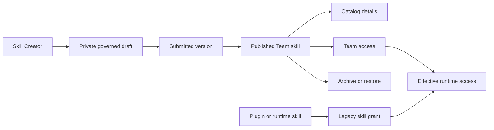

# Skill Governance UX implementation record

Date: 2026-08-02
Branch: `codex/skill-governance-ux`

This document records the product and engineering decisions made during the Skill Governance UX follow-up. The implementation was checked against the unified governance specification, database design, and the dependency graph generated from the repository and supplied screenshots.

## Outcome

The governance area now supports the complete user-facing path from assisted creation through Team review and controlled distribution:

1. A member describes a workflow to Skill Creator and can attach supporting files.
2. Skill Creator asks questions and proposes the files for one skill.
3. The proposal is saved as a private governed draft, then opens in the manual editor for review.
4. The member validates and submits a version to the owning Team Lead.
5. The Team Lead approves and publishes the version.
6. A Platform Admin gives a Team access from User Management.
7. Members can open catalog details, inspect published instructions and dependencies, create an improvement, or view version history.
8. An authorized Team Lead or Platform Admin can archive the skill without deleting its history.

## Decisions made from the dependency graph

### One Team access save, two canonical stores

User Management keeps one atomic `Save access` operation. The backend classifies each selected skill key inside the transaction:

- governed Team skills are written to `team_skill_grants`;
- plugin and runtime skills are written to `skill_grants`;
- a governed key is never duplicated into the legacy table;
- archived or unavailable governed skills may remain assigned for history, but cannot be newly assigned;
- Platform Admin status grants administration authority, not runtime skill access.

This keeps the interface simple while preserving the database model's separation between governed and legacy skills.

### Delete private work; archive shared history

- A private draft with no review history is hard deleted with its editable revisions.
- A draft referenced by a review is archived because the review and audit chain must remain valid.
- A published skill is archived, not deleted. Grants, versions, pins, usage counts, and audit records remain.
- Archiving withdraws the default runtime package. Restoring republishes the active default version.

### Skill Creator is available to members

The existing Skill Creator run endpoint was previously mounted only behind Platform Admin settings. It is now also mounted as an authenticated member endpoint. Run status, cancellation, decisions, and streams verify the run's user, persona, and isolated builder workspace before returning data.

The creator never writes directly into the runtime skills folder. Its structured actions are validated, adapted to one governed draft mutation, and applied through the normal draft revision boundary.

## User-facing changes

### Skill Governance

- `Create skill` opens the guided Skill Creator dialog.
- `Create manually` remains available as a fallback.
- Context files can be uploaded, selected, and removed.
- Proposed file actions are shown before saving.
- Private drafts now have confirmed `Delete draft` or `Archive draft` actions.
- Draft and catalog areas have card, list, and compact views.
- The selected view is saved per signed-in user and area.
- Both areas have search with a dedicated no-results state.
- Catalog cards and rows open a details dialog.
- Details show published instructions, tools and connections, access counts, ownership, availability, and technical metadata.
- Details provide improvement, published-version, archive, and restore actions according to permission.

### Team management

- The skill selector combines the governed catalog with the complete administrator runtime registry instead of deriving choices from the current administrator's effective runtime access.
- Governed and plugin skills with the same key are deduplicated.
- Unavailable skills are visibly labeled and disabled.
- Copy now states that administrators need an explicit grant to use a skill themselves.
- The MCP selector uses an administrator-only capability catalog, so an administrator can create the first Team grant even when they have no personal MCP entitlement.
- MCP assignments are rejected when the server is unknown or no longer installed.
- Plugin bundles remain an assignment shortcut, not an independent permission. Applying one writes its explicit skill and MCP grants; invalid bundles or bundles with missing components fail closed and cannot be applied.
- Bundle cards show applied, partial, and unavailable states together with their skill and connection counts.

### Navigation and language

- `Skills & Tools` is renamed to `Plugins & integrations`.
- The secondary tab is renamed from `Tools & MCP` to `Tools & connections`.
- Governance copy uses `submitted version`, `published version`, `Team skill`, `archive`, and `publish` in normal user flows.
- Hashes, version contents, and other implementation terms remain available where they help with diagnostics or auditability.

## API additions

| Method | Route | Purpose |
|---|---|---|
| `POST` | `/skill-builder/session` and related `/skill-builder/*` routes | Authenticated member access to the isolated Skill Creator |
| `POST` | `/skills/drafts/:draftId/builder-actions` | Apply a validated Skill Creator proposal to a private governed draft |
| `DELETE` | `/skills/drafts/:draftId` | Delete a fresh private draft or archive a review-linked draft |
| `GET` | `/skills/:skillId` | Load catalog details, published files, capabilities, usage, and permissions |
| `POST` | `/skills/:skillId/archive` | Archive a Team skill and withdraw its runtime default |
| `POST` | `/skills/:skillId/restore` | Restore a Team skill and republish its active default |
| `GET` | `/settings/runtime-capabilities` | Load the unfiltered administrator catalog of installed MCP servers and plugin bundles |

All mutations use the existing ownership, role, revision, idempotency, notification, and audit controls where applicable.

## Codebase cleanup

The unused 1,550-line legacy `SkillsRegistryTab` and its re-export were removed. Plugin registry management remains in `PluginsRegistryTab`; governed skill creation and lifecycle management now live only in the Skill Governance feature.

The Skill Creator-to-draft translation is isolated in `skillBuilderDraftAdapter.ts`, keeping agent output parsing and context-file reads out of the main governance service.

The local browser pass also exposed an existing first-login race: several parallel authenticated page requests could try to create the same header-auth user and one would fail with a uniqueness error. User creation now uses conflict-safe insertion and reuses the row created by the winning request.

The runtime smoke pass exposed a pre-runtime skill-directive crash. Initial skill context was trying to read `runtime.workspace_state` before the runtime existed. Directive resolution now uses the signed, seeded request context; a Team-entitled `research` invocation in a private workspace returns a normal skill policy stream instead of HTTP 500.

## Verification

The implementation is covered by:

- TypeScript checks for the backend;
- the full backend Node test suite, including new Skill Creator adapter tests;
- opt-in PostgreSQL lifecycle assertions for fresh draft deletion, Team access table separation, details, archive, and restore;
- a production frontend build;
- rebuilt backend, agent, and frontend Docker images using `env/local/stack.env`;
- a signed private-workspace `/skill research` smoke request returning HTTP 200 with the research policy activated;
- browser smoke and visual checks of the responsive governance flows.

The browser check used temporary local users, a private draft, a Team, and one governed grant. It verified that the Team save produced one `team_skill_grants` row and no `skill_grants` duplicate. All temporary QC data was removed after the check.

The PostgreSQL lifecycle test remains opt-in through `RUN_GOVERNANCE_INTEGRATION=1` because it requires the repository's configured PostgreSQL service.
