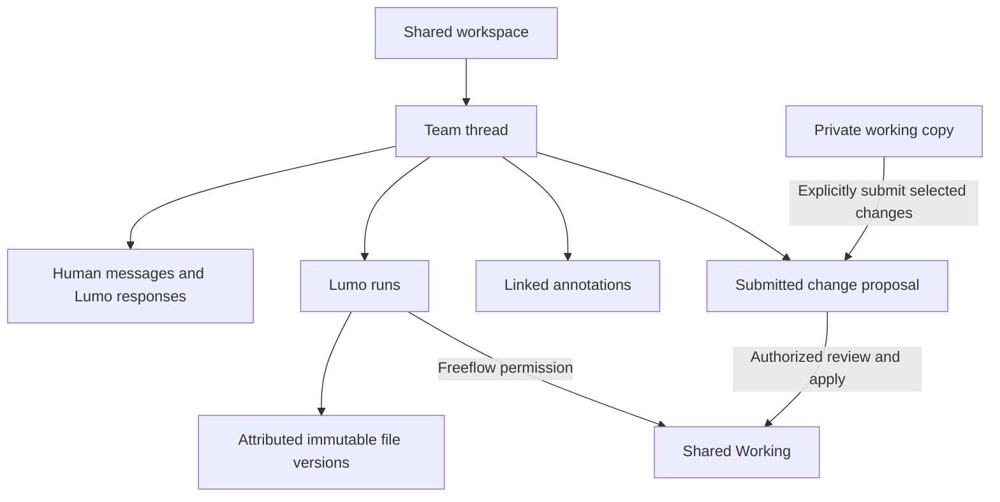

# Team Chat Threads and Work History — Implementation Specification

Status: Proposed implementation specification; no application changes implemented by this document.

Date: 2026-09-19

## 1. Outcome

Make a thread the persistent home for one Shared workspace discussion, its Lumo requests, and the changes and review decisions produced by that discussion. A member must be able to open a discussion, continue typing without repeatedly selecting Reply, and understand what work resulted from it.

Deliver this in two releases:

1. **Release A — usable threads and correct Lumo context:** persistent thread navigation and composer, complete paginated history, thread-scoped agent context, stable links, unread state, and notifications.
2. **Release B — work history:** durable links between threads, runs, file versions, annotations, and explicit proposal snapshots, with a Changes view.

Release A must include both the UI and context isolation. Shipping visual grouping while Lumo still receives workspace-wide chat history does not meet this specification.

## 2. Verified baseline and problem

The baseline below was established by source inspection, not a browser reproduction. References C1–C10 in section 12 identify the implementation entry points.

| Area | Current behavior | Required change |
|---|---|---|
| Reply structure | `workspace_team_messages` stores `replyToMessageId` and `threadRootId`; replies to replies retain the original root. | Promote the group into an addressable thread with its own lifecycle and metadata. |
| Composer | `handleSend` clears `replyTo` after a successful send. | Keep the active thread; clear only message text and optional quoted reply. |
| Presentation | The panel expands loaded replies below loaded root messages. | Show a thread list and a focused conversation view. |
| Pagination | The backend returns the latest 200 workspace messages by default. A specific notification target may cause its root to be included. | Paginate thread summaries separately from thread messages. |
| Missing roots | Rendering iterates loaded roots, so replies whose root is outside the fetched window can be omitted. | Fetch thread metadata/root independently; do not require a root to be in a recent-message page. This defect is inferred from the code and needs a regression reproduction. |
| Lumo context | `listTeamAgentHistory` selects the latest 20 workspace messages without a thread filter. | Construct context from the selected thread and explicitly authorized references. |
| Shared edits | Freeflow accepts last-successful-save-wins on applicable save paths, while retaining immutable file versions. Some agent paths enforce strict versions. | Preserve these concurrency policies; expose attributable changes, not an assertion that old versions were discarded. |
| Private copies | Linked private copies retain a Shared Working manifest and perform whole-file three-way comparison. | Reuse the existing sync model. A thread does not itself create a new private copy. |
| Run attribution | Team source messages hold run IDs in metadata; `file_versions.sourceRunId` already identifies run-produced versions. | Make thread/run provenance durable and queryable. |
| Proposals | A collaboration object can reference a source team message and linked private workspace; application currently consumes the linked private copy. | Require an explicitly submitted, immutable selection of changes for thread-linked proposals. |

The product has three separate concerns: **who can access work**, **which conversation explains work**, and **how changes enter Shared Working**. Thread membership must not conflate them.

## 3. Product model and boundaries

A **workspace** remains the access and content boundary. A **thread** is one conversation inside that boundary. A **quoted reply** targets one message inside the thread; it never starts an implicitly nested thread. A **run** is one invocation of Lumo. A **change set** records exactly which immutable revisions or submitted operations belong to work under review.

All Team threads inherit the Shared workspace audience and current permissions. Following a thread controls notifications only. Copying its link grants no access. Private agent conversations and private working copies remain separate; they are not automatically made visible when a team thread references a proposal.

The existing [Private and Shared Workspaces specification](./private-team-workspaces-spec.md) continues to govern sharing, publication, Freeflow, Review, and private-copy synchronization. This document adds conversation and work-history behavior. Internal roles use the existing capability functions; the UI label Publisher maps to the existing `editor` capability where applicable.

This scope does not introduce per-thread file isolation, nested worktrees, a CRDT, operation-level editing history, arbitrary conversation rollback, or a new Git integration. Independent threads can still edit the same Shared Working files, subject to existing concurrency controls. Thread separation prevents conversation mixing; it does not prevent file conflicts.

## 4. Release A features

### F1. Thread list and focused conversation

**Implement:** replace the expanded workspace message feed with a list of conversations and a focused thread view inside Team Chat.

Each list item shows a title, opening-message preview, latest activity, reply count, participant avatars, unread indicator, open/resolved state, and active Lumo status. Sort by latest message activity, then thread ID for deterministic ties. Metadata edits and streaming chunks must not repeatedly reorder the list.

Provide **New thread**, **Open**, **Resolved**, and **All** controls. New thread opens a composer with an optional title. The first successful send atomically creates the thread and its opening message; an empty composer does not create a database row. Default the title to the first 80 Unicode characters of the first nonempty line, with an ellipsis if shortened. Title generation must not invoke an agent.

Opening a thread shows its title, participants, status, message history, and composer. Use a split view when the existing panel has sufficient width; otherwise replace the list with the thread and a Back control. Browser Back returns to the preceding list/thread location. Preserve the list's scroll position.

Reuse `TeamChatComposer` and the existing message renderer. Extract thread list and thread detail components from `WorkspaceTeamChatPanel`; avoid adding another workspace-wide state singleton. Keep state keyed by workspace and thread IDs, and ignore stale requests after navigation.

**Acceptance:** opening an old thread works even when no root message appears in the latest 200 workspace messages; incoming activity does not unexpectedly switch the current thread.

### F2. Persistent thread composer and optional quoted replies

**Implement:** store `activeThreadId` separately from `replyToMessageId`.

All sends from a thread composer include `threadId`. After success, clear text, mentions/references, and the optional quoted reply; retain `activeThreadId` and keyboard focus. On failure, preserve the complete draft and destination.

The Reply action on any human or Lumo message adds a quote target within the active thread. Cancelling that quote removes only the target. Sending another message without a quote still posts to the same thread. Replies to replies stay at the same visual depth; show a compact author/excerpt link when a precise reply target exists.

Use **Message this thread…** as the placeholder and **New thread** as the explicit route to an independent discussion. Changing threads must never send an old draft to a new destination. Retain unsent drafts in memory keyed by user/workspace/thread while the workspace is open; clear them on sign-out or lost access. Cross-device draft synchronization and reload persistence are outside Release A.

**Acceptance:** send three successive messages after opening one thread; all three belong to it without clicking Reply. Quote a reply, send, then send again; both remain in the original thread.

### F3. Thread-scoped Lumo context and execution

**Implement:** replace the workspace-wide history query used by Team Chat with an explicit context builder taking `{workspaceId, threadId, sourceMessageId, userId}`.

The builder must:

1. Recheck access and verify the source belongs to the requested workspace/thread.
2. Capture the source message's sequence as an immutable context cutoff. Exclude later messages, the source itself from history, pending/partial agent output, and operational status events. The source request is supplied exactly once as the current prompt.
3. Include author attribution, the opening message, an explicitly quoted target if present, and completed conversation messages from this thread in chronological sequence.
4. Prioritize the source, quote, root, and resolved file references within the runtime's input budget; fill remaining space with recent complete messages. Deduplicate IDs. Record omitted ranges and tell the agent history was truncated. If required content exceeds the budget, record any excerpting and expose an authenticated thread-history reader for exact retrieval. Never silently substitute another thread's messages.
5. Resolve explicit document references to the selected immutable version. Preserve the current behavior that outputs target Shared Working; a reference to a published version does not redirect writes into that version.
6. Include current workspace policy and approved knowledge through existing authorized mechanisms. Exclude private transcripts, private runtime state, and unrelated team discussions. Cross-thread context must be an explicit authorized reference, deferred from Release A.
7. Persist the included message IDs, cutoff, reference version IDs, truncation metadata, context-builder version, and effective policy with the run record. Retries use that recorded context selection; they do not pull in later messages.

Keep ordinary messages human-only. Existing explicit invocation through `@Lumo`, the Lumo reference/action, or a selected skill remains supported. Opening a thread, replying to Lumo, resolving a thread, or posting a system event must not independently start a run.

Allow at most one nonterminal Lumo request per thread, including queued and awaiting-input states. Claim this slot transactionally before dispatch. A second invocation returns a typed `409 THREAD_RUN_ACTIVE`; the UI retains its draft. Human-only messages remain allowed during a run. Reuse the workspace run lease for actual file mutation; do not assume different threads can bypass it. Show queued/running/awaiting-input/completed/failed/cancelled status in the originating thread.

Persist an outbox/queued run identity before calling the runner; recovery and retries must use the same dispatch identity. Extend the runner's idempotency contract if necessary so a crash between dispatch and saving its returned ID cannot create two runs. Append/update a single Lumo response for each source request. Recheck current authorization on dispatch, resume, and writes; a saved context snapshot does not preserve revoked permission.

**Acceptance:** interleave unrelated threads A and B, then invoke Lumo in A. Captured agent input contains A's authorized context and no B messages. Restart dispatch after a simulated crash; one request still produces one run and one response.

### F4. Complete history, stable links, and lifecycle

**Implement:** paginate threads and messages independently. A thread response includes its root metadata even when its message page contains only recent replies. Display message pages in ascending sequence; provide Load earlier and fetch-around-target navigation. Merge results by message ID, updating streaming bodies without duplicates.

Use the existing workspace route with query parameters `workspaceId`, `channel=team`, `threadId`, and optional `messageId`. Do not invent a second workspace page. Existing message-only notification links must resolve the owning thread server-side and open the exact message. Validate any supplied message/thread pair.

Thread authors and workspace moderators may rename, resolve, and reopen a thread. Resolved threads remain readable and searchable through the list filters. New human messages automatically reopen a resolved thread in the same transaction; Lumo completion and status events do not. Resolved does not mean proposal approved or changes applied. No thread deletion or shared archival action is introduced in this release.

Maintain per-user read state using the highest sequence actually displayed while the thread is focused. Background polling must not mark messages read. Opening at an old deep link does not mark later unseen messages read. Preserve scroll while reading older messages; show a New messages button instead of forcing the user to the bottom. Reuse the current polling transport initially, with separate list/detail refreshes and cancellation on navigation.

**Acceptance:** a notification to a years-old message loads its surrounding page and root; pagination has no duplicates or missing messages under concurrent inserts; unread markers survive reload and do not advance in a background tab.

### F5. Relevant notifications and access

**Implement:** use existing notification delivery with thread-aware recipient selection and links.

New roots preserve the current workspace-level notification policy. Replies notify followers and directly mentioned members, deduplicated and excluding the sender. Creating or posting in a thread follows it automatically; **Follow/Unfollow** is a personal setting. Unfollow suppresses ordinary reply notifications even if the user previously participated; explicit mentions still notify. Merely reading a thread does not follow it. Lumo's final response notifies followers once; streaming/status updates do not emit notification storms.

Read requires current workspace access. Posting and invoking Lumo require the existing comment capability; write tools still require edit permission and Freeflow. Resolve/rename uses the author-or-moderator rule above. Every mention, quote, file, thread, run, annotation, and proposal lookup must be authorized within its own workspace. User IDs in stored follow state never override revoked access. On access loss clear displayed data/drafts and stop polling.

## 5. Release A data and API contract

### 5.1 Storage

Extend the idempotent schema initialization pattern in `DatabaseService`; use a separately runnable, resumable backfill for existing rows. Do not perform an unbounded backfill on every startup.

| Table | Required fields and constraints |
|---|---|
| New `workspace_team_threads` | `id` UUID PK, `workspaceId`, `rootMessageId`, `title` (max 255), `createdBy`, `status` (`open`/`resolved`), `createdAt`, `updatedAt`, `lastActivityAt`, `lastMessageSeq`, `resolvedAt`, `resolvedBy`. Unique root. Composite unique `(workspaceId,id)` for workspace-scoped relations. |
| Existing `workspace_team_messages` | Add `threadId`, `sequence` bigint, and nullable `clientMessageId`. Unique `(threadId,sequence)`; unique `(workspaceId,authorId,clientMessageId)` for human sends with a nonnull client ID. Retain legacy root/reply fields during compatibility rollout. |
| New `workspace_team_thread_user_state` | Composite PK `(threadId,userId)`; `lastReadSeq`, `following`, `updatedAt`. Read sequence advances monotonically. |
| New `workspace_team_thread_runs` | Durable request ID, `workspaceId`, `threadId`, unique `sourceMessageId`, nullable unique runner `runId`, `status`, `requestedBy`, `contextCutoffSeq`, `contextManifest` JSON, policy snapshot, timestamps, error code. Unique active slot per thread for queued/running/awaiting-input. Persist independently of Redis retention. |

Thread creation, root insertion, and root assignment are one transaction. Permit a temporary nullable `rootMessageId` during that transaction, with a deferred integrity check requiring a root at commit. Validate that it belongs to the same thread/workspace. Lock the thread row to allocate consecutive message sequence numbers and update activity/read-relevant counters; do not derive ordering solely from timestamps.

All foreign keys must respect the workspace boundary, using composite keys where possible and explicit transactional checks otherwise. Index thread lists by `(workspaceId,lastActivityAt,id)`, messages by `(threadId,sequence)`, and legacy message-to-thread resolution. Avoid per-item count/participant queries.

### 5.2 Endpoints

All paths below are relative to the existing `/workspaces/:workspaceId/collaboration` router. Reuse existing error handling and reference validation.

| Method and path | Contract |
|---|---|
| `GET /team-chat/threads?status=open|resolved|all&cursor&limit` | Return `{threads,nextCursor}`. Default limit 30, max 100. Cursor uses activity and ID with a fixed list snapshot cutoff. Each summary includes root preview, reply count, participants, unread state, and run status. |
| `POST /team-chat/threads` | `{title?,body,references?,mentionedUserIds?,clientMessageId}`. Create root/thread atomically; return `{thread,message}`. Repeated identical client ID returns the existing result. |
| `GET /team-chat/threads/:threadId` | Authorized metadata/root retrieval independent of message pagination. |
| `GET /team-chat/threads/:threadId/messages?beforeSeq&afterSeq&aroundMessageId&limit` | Mutually exclusive before/after/around modes; default latest 50, max 100. Return `{thread,messages,olderCursor,newerCursor,hasOlder,hasNewer}` in ascending sequence. Around mode returns the target and bounded neighbors. |
| `POST /team-chat/threads/:threadId/messages` | `{body,replyToMessageId?,references?,mentionedUserIds?,clientMessageId}`. Destination comes from the route. Optional quote must be in the same thread. Return saved message. |
| `PATCH /team-chat/threads/:threadId` | `{title?,status?}` under author/moderator policy. |
| `PUT /team-chat/threads/:threadId/read-state` | `{lastReadSeq}`; server clamps to a valid sequence and uses monotonic update. |
| `PUT /team-chat/threads/:threadId/follow-state` | `{following}` for the authenticated user only. |
| Existing `POST /team-chat/messages/:messageId/lumo` and `/interaction` | Resolve thread from the persisted source message; apply slot, context, idempotency, and permission rules. |
| Existing message lookup/deep-link compatibility | Extend the legacy response or add `GET /team-chat/messages/:messageId` returning the authorized message and owning thread identity. |

Use opaque, validated cursors scoped to the workspace/filter. A list snapshot must order using activity as of its cutoff, not mutable live activity columns; derive that ordering from messages up to the cutoff or materialize the snapshot. Refresh the list from the first page for new activity and deduplicate by thread ID. Message sequences remain stable while message bodies/status metadata update.

Generate `clientMessageId` once per user send attempt and retain it for retries. Reusing a key with a different destination or payload returns `409 IDEMPOTENCY_KEY_REUSED`. Invalid quote/destination/cursor is `400`; unavailable resources return the established non-disclosing access/not-found response. Never silently fall back to creating a new root when thread resolution fails.

## 6. Release B features

### F6. Changes from this discussion

**Implement:** add Conversation and Changes tabs to a thread. Changes is an attributable history of operations, not the difference between the workspace when the thread started and its current state; unrelated threads may have changed the same files in between.

Link each team run through `workspace_team_thread_runs` and existing `file_versions.sourceRunId`. Add nullable `sourceThreadId`/`sourceMessageId` provenance on new file versions where needed, validated server-side from the authorized operation/run. Include creation, modification, rename, restore, and deletion. Do not filter deletion records out as the current terminal artifact summary does.

For each operation show actor, time, source message/run, change kind, exact before/after version IDs, and whether later work superseded that version. Support changes for one run or the whole thread. Human edits are attributed only when the editor explicitly carries an active thread association; unassociated edits remain in workspace history and must not be guessed into a thread. Offer an explicit Associate with thread action for future edits, not retroactive inference from timestamps.

Use immutable version records for preview/diff. For a creation/deletion one side is absent. For supported text formats show a diff; for binary office files use existing version previews side by side and offer downloads if no meaningful diff exists. Display historical name/path from the version record, not only the file's current name. Opening history never modifies Shared Working.

Add `GET /team-chat/threads/:threadId/changes?runId&cursor&limit` with default 50/max 100. Authorize every returned record and return immutable before/after references. Reconcile missed provenance after worker restarts from durable run mappings and version records; use unique operation identities to prevent duplicate history entries. In the UI, distinguish a committed file operation from a failed run: a failed run is not proof that no change was committed.

**Acceptance:** if thread A edits v2→v3 and B edits v3→v4, A shows its own v2→v3 operation and indicates a later version exists; it never claims B's operation. Deletion and failed-run partial changes remain discoverable.

### F7. Thread-linked Review proposals with explicit content selection

**Implement:** allow a thread participant with proposal capability to use **Work privately**, then submit a selected change set back to that thread. Reuse the existing per-user linked private copy and its sync/conflict logic. Record the originating thread on the private activity, but this association grants nobody else access to that activity.

Multiple threads may use the same private copy. Therefore a thread-linked proposal must never implicitly submit all current private changes. The submission screen must show the exact files/operations selected, their comparison base, resulting versions, target Shared workspace, and optional public explanation. Dependencies such as extracted assets must be visible and included explicitly as a group when required for a valid artifact.

On Submit, freeze an immutable manifest with selected paths/file IDs, create/update/delete/rename operations, base Shared revision and base file version IDs, selected proposed file version IDs, author, thread/source message, and submission timestamp. Store shared reviewable content under an authorized proposal snapshot; readers must not need access to the private workspace. Show the user exactly which content becomes shared. Subsequent edits to the private copy do not alter this submission.

Extend collaboration proposals with `sourceThreadId`, `submittedChangeSetId`, and a submission revision. Add durable `workspace_proposal_change_sets` storage for immutable manifests. A shared proposal response must not expose a private workspace ID or private transcript; owner-only navigation data can be returned separately after authorization. Existing private-copy proposals remain recognizable as legacy proposals and must be explicitly resubmitted into a frozen selection before using the new thread-linked apply path.

Provide `POST /objects/:objectId/submissions` for `{expectedSharedRevision,expectedPrivateRevision,selectedOperations,publicExplanation?}` and `GET /objects/:objectId/submissions/:submissionId` for authorized preview. Selected operations must refer to actual authorized immutable versions; the server derives hashes and scope rather than trusting client manifests. Resubmission creates a new snapshot, preserving previous review history.

Reviewers record approval or request-changes against one exact submission using `POST /objects/:objectId/submissions/:submissionId/reviews`. Persist reviewer, verdict, public comment, and time. These records do not themselves edit files. The existing Owner/Publisher apply authority remains authoritative; an authorized Apply action may record approval and apply in one transaction when no verdict exists.

Extend Apply to require `{submissionId,expectedSharedRevision}` for thread-linked proposals. Recheck permissions, policy, selected immutable content, and revision at application time. If Shared Working moved, return a typed conflict and require a refreshed comparison/resubmission; do not silently widen or rebase the approved selection. Apply only selected operations and persist file versions, attribution, proposal status, and the shared decision event transactionally. Immutable object preparation may occur before the transaction; a failed transaction must expose no partial applied state. A submission may be applied only once.

Freeflow runs continue to write directly when permitted. In Review, Team Chat Lumo remains read-only; private work returns through submission and authorized application. Publication still separately creates a stable version. Resolving a thread neither applies a proposal nor publishes anything.

**Acceptance:** a private copy contains unrelated edits from threads A and B. Submitting A shares and applies only the explicitly selected A operations. Changing that private copy after submission leaves the review snapshot unchanged. An old approval never applies a newer submission.

### F8. Link document discussions without duplicating them

**Implement:** add optional `sourceThreadId` and an immutable file-version reference to existing collaboration annotations and proposals. The thread's linked-items panel opens the original object and its discussion; do not copy its replies into independent team messages that can diverge.

Reuse existing selection text, block IDs, offsets, and fingerprints. Record the version containing the anchor. Show the original excerpt/version even if the latest document changed. When mapping to current content is ambiguous or fails, use the existing `anchor_changed` state and request explicit reattachment; never claim arbitrary-edit-stable anchors.

Share only workspace-audience objects in Team Chat. A private annotation requires explicit conversion/sharing of selected content before a team link can expose it. Lumo sees a linked annotation only when explicitly included in the invocation context; linking alone does not invoke it.

Operation-level, continuously surviving anchors like DeltaDB's are a later architectural project. Release B guarantees a durable reference to an immutable version and honest stale-anchor handling.

## 7. Migration and compatibility

1. Add tables, nullable columns, indexes, and feature gates before switching reads. Preserve message IDs, bodies, authors, timestamps, and existing notification links.
2. Deploy server-side dual writes so both old and new clients create canonical thread associations. A legacy root send creates a thread; a legacy reply resolves its target's canonical thread. Continue legacy `threadRootId` values: null on roots, original root message ID on replies. New thread messages without a quote need no `replyToMessageId`.
3. Backfill one thread per existing root and attach replies by stored `threadRootId`. Use the original root UUID as the migrated thread UUID for a stable, idempotent mapping. Sort historical messages by `(createdAt,id)` to assign sequences; document that this is deterministic historical ordering, not proof of causal order for timestamp ties.
4. Handle orphan/cyclic/mismatched roots explicitly. Never drop them. Within a single authorized workspace, recover an independent thread with a visible recovered-history marker when its original root cannot be established; log the anomaly. Quarantine cross-workspace relationships for repair rather than following them. Backfill must be restartable and coordinate a shared per-root transaction/advisory lock with dual writes. Before the first new send into an unmigrated group, migrate that group's existing messages under this lock, then allocate the new sequence. The bulk backfill skips completed groups. Never renumber messages after canonical reads become available or assign sequences twice.
5. Verify every message has exactly one canonical thread and unique sequence, roots belong to their threads, counts match, and no cross-workspace relationships exist. Only then enforce nonnull constraints and enable new reads.
6. Do not infer legacy read state. Start migrated read markers at the migration boundary so the release does not mark all historical chat unread; messages created after that boundary remain unread. Seed following for prior participants using existing notification preferences where available.
7. Backfill run/file provenance only from verifiable stored run IDs and version records. Mark uncertain history unavailable; do not invent associations. Introduce frozen proposal submission separately from the thread migration.
8. Roll out Release A to internal workspaces, then broader cohorts. Release B has its own gate. A UI rollback must retain new data, dual writes, authorization, and thread-scoped agent context. Never re-enable the old workspace-wide Lumo history query as a rollback mechanism.

## 8. Implementation work packages

| Order | Work package | Main implementation targets | Completion gate |
|---|---|---|---|
| A1 | Schema, invariants, dual writes, backfill | `databaseService.ts`, `workspaceCollaborationService.ts`; new resumable backend backfill script | Fresh DB and production-shaped migration fixtures pass integrity checks. |
| A2 | Thread/message APIs, pagination, idempotent sends, access | `workspaceCollaboration.ts`, collaboration service, frontend API types | Endpoint tests cover old/new clients and cross-workspace rejection. |
| A3 | Context builder and durable run dispatch | `workspaceTeamChatAgentService.ts`, collaboration service, managed agent run service | Interleaved-thread context and dispatch recovery tests pass. |
| A4 | Thread list/detail, composer, links, unread/follow state | `WorkspaceTeamChatPanel.tsx`, `TeamChatComposer.tsx`, new focused components and state helpers | Browser tests prove continuous sending, navigation, and old-message access. |
| A5 | Notification targeting and rollout | collaboration/notification services, existing notification navigation | Recipient and old-link tests pass; migration metrics acceptable. |
| B1 | Attributed Changes view | file service, run mappings, collaboration API and thread detail | Exact-version attribution includes deletions and failures. |
| B2 | Frozen proposal selection, review, apply | collaboration/publication services and proposal UI | No unrelated private content; stale or changed submissions cannot apply. |
| B3 | Annotation links and anchor state | `CanvasAnnotations.tsx`, collaboration objects and APIs | Original version is readable; ambiguous remapping is marked changed. |

Implement using the existing design system, API error conventions, capability checks, immutable object storage, and notification infrastructure. Introduce shared DTOs in the existing contracts package when backend/frontend need the same schema. Do not encode authorization solely in React controls or Lumo prompts.

After modifying application code, run `graphify update .` as required by the repository instructions. This specification-only change does not modify application code.

## 9. Required validation

| ID | Test level | Scenario and required result |
|---|---|---|
| A-01 | Browser | Three consecutive sends remain in the selected thread; cancelling a quote does not exit it. |
| A-02 | Browser | A failed send preserves text/references/destination; switching threads cannot misroute its retry. |
| A-03 | Service + browser | More than 500 workspace messages, old root with recent replies: list, thread, and deep link expose the complete paginated discussion. |
| A-04 | Service | Interleaved A/B conversations produce agent history from A only, with root/quote retained and omission metadata when budgeted. |
| A-05 | Service | A message arriving after the invocation cutoff is excluded from that run; a later invocation can include it. |
| A-06 | Integration | Simultaneous/retried sends create one record per idempotency key; changed payload/key reuse fails. |
| A-07 | Integration | Two Lumo invocations in one thread cannot both claim the active slot; crash/recovery does not double-dispatch. |
| A-08 | Authorization | Viewer can read but not post; commenter cannot gain write tools; Review stays read-only; revoked users cannot resume or read. |
| A-09 | Authorization | Forged cross-workspace thread, quote, file, run, and cursor references are rejected. |
| A-10 | Browser + service | Background tabs do not advance read state; focused displayed messages do; state is monotonic across devices. |
| A-11 | Service | Reply notifications reach followers/mentions once; unfollow works; sender, revoked members, and streaming chunks do not generate extra alerts. |
| A-12 | Migration | Re-running interrupted backfill preserves IDs/content and sequence uniqueness; legacy reply-to-reply links resolve correctly. |
| A-13 | Browser | Resolve, automatic human-message reopen, filters, Back, keyboard navigation, focus, and narrow layouts work. |
| B-01 | Service + UI | Interleaved file writes from A and B are attributed correctly with exact before/after versions and no inferred combined diff. |
| B-02 | Integration | Creation, rename, deletion, restore, and committed work from failed runs appear once after recovery. |
| B-03 | Integration | Private A/B edits: submit A only; later private edits cannot change the submitted snapshot or leak through shared responses. |
| B-04 | Integration | Concurrent Shared edits cause stale application failure; no partial operations, duplicate apply, or approval of a different submission. |
| B-05 | UI | Unsupported binary diff presents honest version previews/downloads; changed anchors retain original context and show `anchor_changed`. |

Use the backend Node test runner and frontend tests for service/state invariants, plus Playwright for the specified user flows. Run the relevant existing collaboration, notification, agent-run lease, artifact commit, publication, and Shared Working sync suites. Run the frontend build after UI/type changes. Large-history fixtures must verify bounded query/page sizes and absence of N+1 queries, not merely correct output on tiny datasets.

## 10. Release checks and observability

Record thread/root integrity violations, unmapped legacy messages, duplicate dispatch prevention, context cross-thread validation failures, context truncation frequency, message/list query latency, and proposal-apply conflicts. Log identifiers and counts rather than private transcript content.

Release A is complete when A-01–A-13 pass, backfill invariants hold, legacy deep links work, and no Team Chat path uses workspace-wide conversation history. Release B is complete when B-01–B-05 pass and a reviewer can follow a thread from request to exact changed versions and submitted/applied outcome without accessing private runtime state.

## 11. Delta references and how they inform this design

Official documentation checked on 2026-09-19. These references explain the product inspiration; the requirements above are HelpUDoc design decisions, not claims that Delta exposes a reusable backend/API for them.

| ID | Referenced document | Relevant concept | Application here |
|---|---|---|---|
| D1 | [Delta — Threads](https://delta.dev/docs/agents/threads) | A persistent conversation can carry project work; separate work and collaboration have explicit thread boundaries. | F1–F4 make a discussion durable and resumable. HelpUDoc does not copy Delta's isolated worktree model in this scope. |
| D2 | [Delta — Collaborate in a Thread](https://delta.dev/docs/collaboration/collaborate-thread) | Collaborators share conversation and work context. | F5 and F6 connect team discussion with work. HelpUDoc retains explicit Lumo invocation and private unsent drafts; it does not adopt Delta's shared trailing-draft submission behavior. |
| D3 | [Delta — Comments](https://delta.dev/docs/agents/comments) | Feedback can refer to an exact passage and have linked replies. | F2 separates a quote target from a conversation destination; F8 links existing annotations. |
| D4 | [Delta & Git](https://delta.dev/docs/concepts/delta-and-git) | DeltaDB records conversation and file changes between commits. | F6 preserves provenance using existing immutable file versions and run IDs. This is coarser than DeltaDB's continuous operation history. |
| D5 | [Delta — Reviewing & Syncing Changes](https://delta.dev/docs/agents/review-and-sync) | Review context and the work being reviewed are explicitly associated. | F7 binds a review decision to an exact submitted change set; HelpUDoc continues using its existing Review policy. |
| D6 | [Zed — Replacing Pull Requests with Delta](https://zed.dev/blog/delta-public-beta) | Product rationale and public-beta announcement, September 16, 2026. | Background for combining conversation, changes, and review; not a requirement to replace HelpUDoc publication or permissions. |

## 12. HelpUDoc references and implementation navigation

Links are repository-relative for portability. Symbols are the stable navigation targets; line numbers change during implementation.

| ID | Source/document | Read or modify here |
|---|---|---|
| C1 | [Private and Shared Workspaces spec](./private-team-workspaces-spec.md) | Existing access, editing policy, publication, private-copy sync, and privacy contracts. |
| C2 | [WorkspaceTeamChatPanel.tsx](../frontend/src/components/chat/WorkspaceTeamChatPanel.tsx) | `messageThreads`, `handleSend`, `renderMessage`, polling, notification target handling, and composer state. |
| C3 | [TeamChatComposer.tsx](../frontend/src/components/chat/TeamChatComposer.tsx) and [frontend collaboration API](../frontend/src/services/workspaceCollaborationApi.ts) | Reusable composer, message/reference types, request helpers. |
| C4 | [WorkspaceCollaborationService](../backend/src/services/workspaceCollaborationService.ts) | `createTeamMessage`, `listTeamMessages`, `listTeamAgentHistory`, `appendLumoReply`, `convertToProposal`, `applyProposal`. |
| C5 | [Collaboration API routes](../backend/src/api/workspaceCollaboration.ts) | Zod schemas, team-chat routes, dispatch trigger, objects/proposals endpoints. |
| C6 | [WorkspaceTeamChatAgentService](../backend/src/services/workspaceTeamChatAgentService.ts) | `prepare`, `resolveReferences`, `enqueue`, `refresh`, `respondToInteraction`; current run metadata/artifact recovery. |
| C7 | [DatabaseService](../backend/src/services/databaseService.ts) | Existing table creation/upgrade conventions for team messages, collaboration objects, and file versions. |
| C8 | [FileService](../backend/src/services/fileService.ts) | `commitFileBuffer`, immutable `file_versions`, `sourceRunId`, historical reads, artifact commit and strict-version behavior. |
| C9 | [WorkspacePublicationService](../backend/src/services/workspacePublicationService.ts) | `syncFromSharedWorking`, `createPrivateCopy`, `applyPrivateCopyToShared`, revision checks and manifests. |
| C10 | [Collaboration policy](../backend/src/services/workspaceCollaborationPolicy.ts) and [CanvasAnnotations](../frontend/src/components/CanvasAnnotations.tsx) | Existing role capabilities, moderation rules, selection anchors and fingerprints. |
| C11 | [Workspace run lease](../backend/src/services/agent-runs/workspaceRunLease.ts) and [AgentRunService](../backend/src/services/agentRunService.ts) | Workspace mutation coordination and managed run lifecycle; thread isolation must preserve these controls. |
| C12 | [Graph report](../graphify-out/GRAPH_REPORT.md) | Architecture navigation: `WorkspaceState` is a major hub; communities 14–15 include message metadata and annotation-related behavior. |

Relevant existing test references: [Team Chat agent](../backend/tests/workspaceTeamChatAgentService.test.ts), [chat notifications](../backend/tests/workspaceChatNotifications.test.ts), [collaboration policy](../backend/tests/workspaceCollaborationPolicy.test.ts), [artifact commit](../backend/tests/workspaceArtifactCommit.test.ts), [Shared Working sync](../backend/tests/workspaceSharedWorkingSync.test.ts), and [workspace run lease](../backend/tests/workspaceRunLease.test.ts). Add focused tests for the new contracts rather than changing existing assertions to hide regressions.
