# HelpUDoc Technical Design

Status: describes the system as implemented in this repository, not a target-state proposal.
Audience: engineers, reviewers, and operators working on the system.
Companion documents: [Product Overview](product-overview.md) (what the product does), [Current Architecture](current-architecture.md) (deployed topology summary).

Naming: the product is presented to users as **Lumo Studio**; **HelpUDoc** remains the repository, service, image, namespace, database, and environment-variable identifier. This document uses `HelpUDoc` when referring to those concrete identifiers so names match the code and manifests.

Where behaviour is aspirational, partially rolled out, or deliberately absent, it is marked **Gap** or **Not implemented**. Statements about resource values, ports, and key names are taken from the manifests and source files cited alongside them.

---

## Table of contents

1. [Executive summary and context](#1-executive-summary-and-context)
2. [System architecture and tech stack](#2-system-architecture-and-tech-stack)
3. [Data design](#3-data-design)
4. [Low-level software design](#4-low-level-software-design)
5. [API and interface specifications](#5-api-and-interface-specifications)
6. [Infrastructure and operations](#6-infrastructure-and-operations)
7. [Known gaps and risk register](#7-known-gaps-and-risk-register)

---

## 1. Executive summary and context

### 1.1 System overview

HelpUDoc is a multi-service web application that turns source documents and data into reviewable artifacts using a governed, Gemini-backed agent. A browser client works inside a *workspace* (files, conversations, knowledge references, collaboration state); an Express/TypeScript backend owns identity, authorization, persistence, and durable agent-run orchestration; a FastAPI/Python service runs the agent graph, its tool catalog, and its human-in-the-loop checkpoints.

The distinguishing engineering property is that agent execution is treated as a **durable, resumable, auditable run** rather than a chat request: every run has an identity, a Redis-backed event stream, a workspace mutation lease, human approval checkpoints, and a persisted telemetry row.

### 1.2 Goals

| # | Goal | How it is realized |
|---|---|---|
| G1 | Agent work is grounded in explicitly authorized material | Backend resolves every tagged file and knowledge reference against the caller's access before dispatch (`backend/src/api/agent/runs.ts`) |
| G2 | Runs survive disconnects, restarts, and duplicate submissions | Redis stream replay with an `?after` cursor, `turnId` dedupe via Lua, launch-lease crash recovery (`backend/src/services/agent-runs/lifecycle.ts`) |
| G3 | Humans gate consequential agent actions | Three interrupt families (approval, clarification, action) with contract enforcement that fails the run if a decision was not consumed |
| G4 | File history is immutable and attributable | Append-only `file_versions` with frozen `objectKey` + SHA-256, `changeKind`, and thread/run provenance |
| G5 | Capability access is governed, not ambient | Short-lived signed agent token carries skill allow-lists, exact version pins, MCP allow/deny, delegated OAuth headers |
| G6 | Concurrent writers cannot corrupt a workspace | Per-workspace mutation lease for agent runs, `contentRevision` optimistic concurrency, Postgres advisory locks for the file mirror |
| G7 | Untrusted code executes under hard isolation | Kubernetes Jobs with gVisor, default-deny egress, and an admission policy that rejects non-conforming Jobs |

### 1.3 Non-goals for the current phase

- **Horizontal scale-out of the application tier.** `helpudoc-app` is deliberately `replicas: 1` with `ReadWriteOnce` PVCs and `strategy: Recreate`.
- **Metrics and alerting stack.** No Prometheus, no `/metrics`, no alert policies. Tracing is Langfuse only.
- **A production mobile client.** `mobile/` is an Expo prototype with no authentication or backend calls.
- **Formal regulatory certification.** No GDPR/HIPAA compliance program, DPA tooling, or data-subject-request workflow exists in the repository. Section 6.4 lists the controls that do exist.
- **Multi-region or active-active deployment.** Single GKE cluster, single-replica stateful services.
- **CRDT/real-time co-editing.** `backend/src/collab/` is an empty placeholder; collaboration is HTTP request/response with sequence numbers and optimistic concurrency.
- **A migration tool.** Schema is created in-process at boot; adopting a migration runner is future work.

### 1.4 Assumptions

| Assumption | Consequence if false |
|---|---|
| Gemini (API key or Vertex AI) is reachable and quota-sufficient | Agent runs fail; the deploy pipeline's Gemini smoke test blocks release |
| One agent pod is enough for expected concurrency | Queueing behind the per-workspace lease becomes user-visible latency |
| Workspace corpora fit a 20Gi `workspace-pvc` | Runs fail on write; PVC must be resized manually |
| Operators inject secrets out-of-band via `kubectl` | Missing keys degrade features silently (many env refs are `optional: true`) |
| A deploy window tolerating downtime is acceptable | `Recreate` plus up to a 10-minute agent startup probe is a hard outage window |
| Redis is available for the 24h run-state window | Lost run state is treated as `RUN_STATE_EXPIRED` and never replayed |

### 1.5 Constraints

**Pre-existing infrastructure.** Single GKE cluster (`asia-southeast1`), GCR images, GCE Ingress with Google-managed certificates, Caddy as the in-cluster reverse proxy, MinIO as the S3-compatible object store, self-hosted Langfuse v3 with ClickHouse.

**Technical constraints.**
- `workspace-pvc`, `skills-pvc`, `plugins-pvc`, `agent-config-pvc` are `ReadWriteOnce`, which structurally pins the app to one node and one replica.
- Backend reaches the agent over pod-local loopback (`AGENT_URL=http://localhost:8001`), so the two cannot be scaled or deployed independently.
- LangGraph checkpoints use an in-process `MemorySaver`, so an interrupt can only be resumed by the process that created it.
- The agent image carries LibreOffice and a pinned OfficeCLI, making it large (requests 800m CPU / 4Gi, limits 2 CPU / 9Gi) and slow to start.
- The GCE `BackendConfig` sets `timeoutSec: 3600` because run streams are long-lived HTTP responses.
- Skills and runtime config live on PVCs, seeded from the image only when empty, so image content is not automatically the source of truth.

**Operational constraints.** Production deploys are `workflow_dispatch` only; infrastructure application is opt-in (`deploy_infra`, default `false`) and refuses partial PVC reconciliation.

---

## 2. System architecture and tech stack

### 2.1 Tech stack and rationale

| Layer | Choice | Rationale |
|---|---|---|
| Frontend | React 18 + TypeScript + Vite, MUI + Astryx design system, Lexical/ReactMarkdown/Plotly | Fast HMR; the workspace canvas needs many content renderers |
| Frontend serving | `nginx:1.27-alpine` static build | Build-time `VITE_*` injection; no server runtime needed |
| Backend | Node 20 + Express 5 + TypeScript, executed by `ts-node --transpile-only` | Shares `@helpudoc/contracts` types with the frontend. Running TS directly removes a build step but also removes compile-time type checking at container start (**Gap**) |
| Validation | zod, per route | Schemas double as the API contract; `ZodError` maps to 400 |
| DB access | knex query builder over `pg` | Raw SQL where needed (partial indexes, deferred constraint triggers) without ORM indirection |
| Relational store | PostgreSQL 16 | Transactional integrity for versioning, publication, governance; `pg_trgm` and optional `pgvector` |
| Cache / coordination | Redis 7 | Sessions, run event streams, run metadata, distributed leases, pub/sub. Explicitly *not* the durable queue |
| Object storage | MinIO (S3 API), GCS-pluggable | Immutable file-version bytes; adapter interface allows provider swap |
| Agent runtime | Python 3.12 + FastAPI + uvicorn | Required by the LangChain/LangGraph/DeepAgents ecosystem |
| Agent orchestration | `deepagents` + `langchain.agents.create_agent` + `langgraph` | Middleware composition, tool-call patching, and native interrupt/resume |
| LLM | Google Gemini (`langchain_google_genai`), modes fast/pro/lite | Long context, native search and URL-context tools, multimodal PDF/image input |
| JS sandbox | `langchain_quickjs` `CodeInterpreterMiddleware` | In-process expression evaluation with memory/time caps |
| Data analysis | DuckDB in-memory | Bounded SQL over workspace CSV/Parquet without paging raw rows into model context |
| Office documents | LibreOffice + pinned OfficeCLI `v1.0.143` (SHA-256 verified) | Exact-bytes DOCX/XLSX/PPTX preview and edit |
| Untrusted code | Kubernetes Jobs + gVisor | Strong isolation for skill-declared and model-authored scripts |
| Edge | GCE Ingress + ManagedCertificate + Caddy | Managed TLS; Caddy handles path routing and Host preservation for SigV4 |
| Tracing | Self-hosted Langfuse v3 + ClickHouse | LLM-specific trace/span model; opt-in per environment |
| CI/CD | GitHub Actions (primary), Cloud Build (alternative) | Path-filtered CI; manual-dispatch deploys with post-deploy smokes |

### 2.2 System context (C4 level 1)

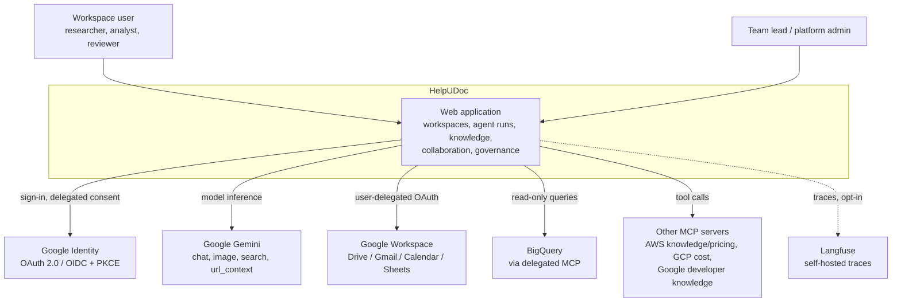

### 2.3 Container view (C4 level 2)

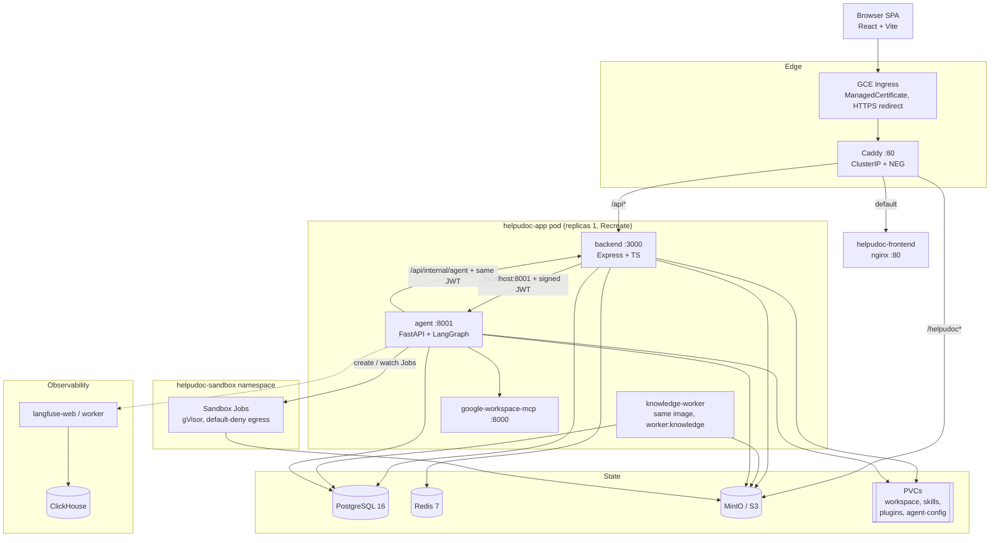

Notable boundary facts:

- Caddy preserves the public `Host` header when proxying `/helpudoc*` to MinIO because SigV4 signs the public hostname.
- `Service/backend` exposes both `3000` and `8001` against the same pod selector, but only `3000` is routed publicly.
- The backend→agent call is loopback; the agent→backend callback uses the in-cluster service name from `BACKEND_INTERNAL_URL`.

### 2.4 Primary runtime flow: one agent turn

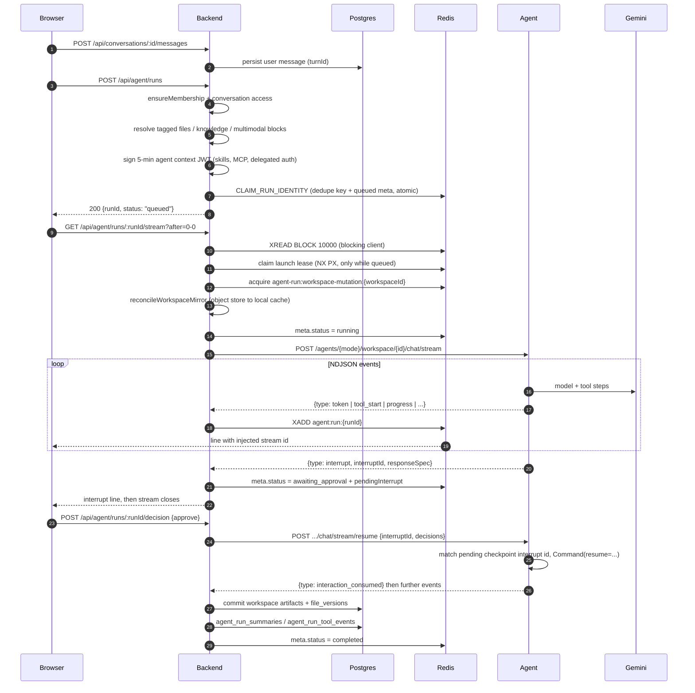

---

## 3. Data design

### 3.1 Store selection

| Store | Role | Why this store |
|---|---|---|
| PostgreSQL 16 | System of record: identity, workspaces, files and versions, conversations, knowledge, collaboration, governance, schedules, audit | Multi-table transactional invariants (publish, submit, apply, version bump) and constraint-level integrity (partial uniques, deferred constraint triggers) |
| Redis 7 | Sessions, run event streams, run metadata, distributed leases, ingestion pub/sub | Streams give replayable ordered events with server-assigned ids; `SET NX PX` + Lua gives fencible leases |
| MinIO / S3 (GCS-pluggable) | Immutable file-version bytes, staged uploads, published snapshots, proposal snapshots | Content bytes do not belong in Postgres; presigned PUT keeps large uploads off the API path |
| Local filesystem (`WORKSPACE_ROOT`, PVC) | Materialized workspace mirror the agent reads and writes | Agent tools need POSIX paths; treated as a revalidated cache, never a source of truth |
| ClickHouse | Langfuse trace storage | Required by Langfuse v3 |

Redis is deliberately **not** the durable work queue. `backend/src/services/redisService.ts` states that Redis is a notification layer for knowledge jobs, not their source of truth. Durable queues are Postgres tables with lease columns (§3.6).

### 3.2 Schema management

There are **no migration files** in the repository — no `migrations/` directory, no `.sql` files, no knex migration scripts. `DatabaseService.initialize()` (`backend/src/services/databaseService.ts`) runs on every boot and executes roughly sixty ordered, idempotent steps in FK-dependency order. Idempotency comes from `hasTable()` guards, an `ensureColumn()` helper, `CREATE INDEX IF NOT EXISTS` via `db.raw`, and `DO $$ ... IF NOT EXISTS ... $$` blocks for functions and triggers.

One-shot **data** migrations are ledgered in `application_migrations` (`key` PK, `appliedAt`); the only recorded key is `2026-08-live-shared-workspaces`. Other backfills are written as idempotent `UPDATE`/`INSERT ... ON CONFLICT DO NOTHING` without a ledger entry.

Concurrency hazard handled explicitly: creating the `workspace_team_threads` root-check function and its constraint trigger is wrapped in a single transaction guarded by `pg_advisory_xact_lock(hashtext('workspace_team_threads_root_trg'))`, because concurrent `CREATE OR REPLACE FUNCTION` raises `tuple concurrently updated` and `CREATE TRIGGER` races on `42710`.

**Gap.** Boot-time DDL means schema changes are coupled to deploys, are not reviewable as versioned artifacts, cannot be dry-run, and have no down path. Adopting knex migrations is the recommended next step.

Connection configuration (`backend/src/config/env.ts`, zod-validated): `DATABASE_URL` preferred, otherwise discrete `POSTGRES_HOST/PORT/DB/USER/PASSWORD`; pool `DB_POOL_MIN` default `0`, `DB_POOL_MAX` default `10`; `DATABASE_SSL` accepts unset/`false` (off), `strict` (`rejectUnauthorized: true`), `allow`/`skip-verify` (`rejectUnauthorized: false`).

A **separate `pg` pool** exists solely for session-scoped `pg_advisory_lock` (`backend/src/services/workspaceMirrorLock.ts`), because holding a session lock on a shared-pool connection while issuing other queries can exhaust the pool and deadlock.

Column naming is camelCase and therefore quoted in all raw SQL (`"workspaceId"`, `"createdAt"`).

### 3.3 Core entity-relationship model

Identity, workspace access, and file versioning:

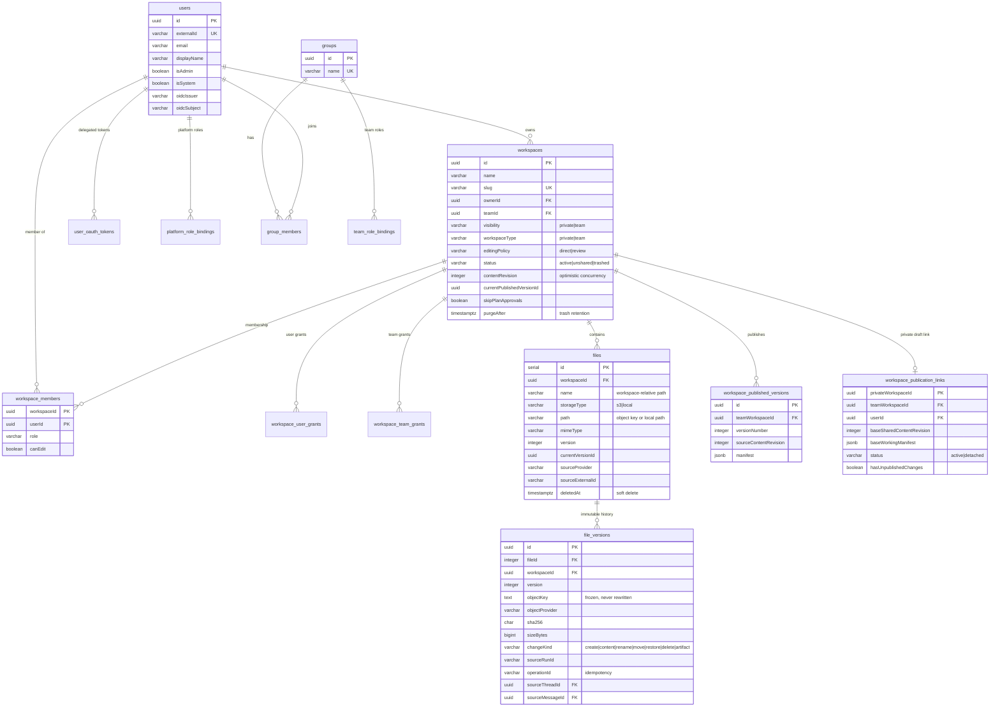

Conversations, runs, collaboration, and team chat:

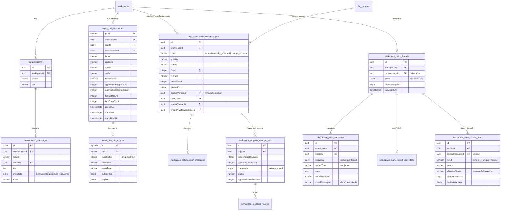

Knowledge and skill governance:

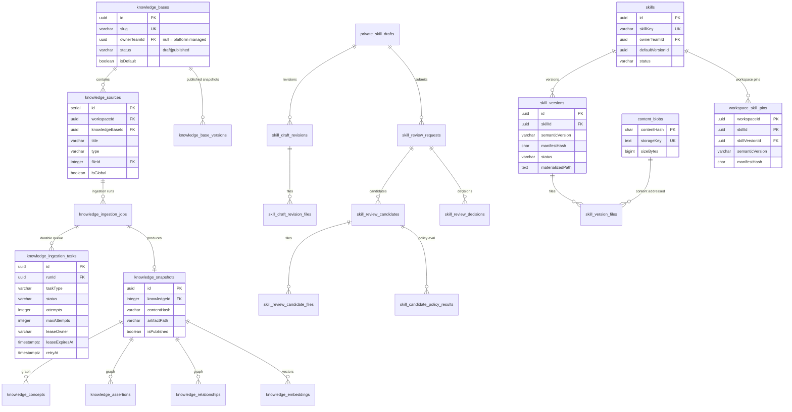

### 3.4 Table inventory by domain

Approximately 85 tables. Full column detail is in `backend/src/services/databaseService.ts`.

| Domain | Tables |
|---|---|
| Identity and roles | `users`, `groups`, `group_members`, `user_oauth_tokens`, `platform_role_bindings`, `team_role_bindings` |
| Workspace and access | `workspaces`, `workspace_members`, `workspace_user_grants`, `workspace_team_grants`, `workspace_private_copy_origins` |
| Publication | `workspace_published_versions`, `workspace_publication_links`, `published_version_skill_pins` |
| Files | `files`, `file_versions`, `workspace_file_revisions`, `content_blobs` |
| Conversations | `conversations`, `conversation_messages` |
| Run telemetry and learning | `agent_run_summaries`, `agent_run_tool_events`, `agent_daily_reflections`, `agent_daily_reflection_breakdowns`, `user_memory_suggestions`, `skill_evolution_suggestions` |
| Knowledge | `knowledge_sources`, `knowledge_source_group_grants`, `knowledge_bases`, `knowledge_base_versions`, `knowledge_base_group_grants`, `knowledge_upload_sessions`, `knowledge_ingestion_jobs`, `knowledge_ingestion_tasks`, `knowledge_source_blocks`, `knowledge_structure_nodes`, `knowledge_processing_windows`, `knowledge_candidate_concepts`, `knowledge_snapshots`, `knowledge_concepts`, `knowledge_evidence_spans`, `knowledge_assertions`, `knowledge_relationships`, `knowledge_embeddings`, `knowledge_communities`, `knowledge_usage_events` |
| Collaboration | `workspace_collaboration_objects`, `workspace_collaboration_messages`, `workspace_collaboration_mentions`, `workspace_proposal_change_sets`, `workspace_proposal_reviews` |
| Team chat | `workspace_team_messages`, `workspace_team_message_mentions`, `workspace_team_threads`, `workspace_team_thread_user_state`, `workspace_team_thread_runs` |
| Skill governance | `private_skill_drafts`, `skill_draft_revisions`, `skill_draft_revision_files`, `skills`, `skill_review_requests`, `skill_review_candidates`, `skill_review_candidate_files`, `skill_candidate_policy_results`, `skill_review_decisions`, `skill_versions`, `skill_version_files`, `skill_grants`, `team_skill_grants`, `user_skill_grants`, `workspace_skill_pins`, `private_workspace_skill_draft_pins`, `skill_execution_blocks` |
| MCP configuration | `mcp_connections`, `mcp_connection_grants`, `mcp_server_grants`, `mcp_server_group_grants` |
| Scheduling | `workspace_schedules`, `workspace_schedule_runs` |
| Platform | `notifications`, `audit_events`, `idempotency_records`, `application_migrations` |

There is **no `folders` table**; folder hierarchy is encoded in `files.name` as a workspace-relative path.

### 3.5 Constraints that encode business rules

These are the integrity rules worth knowing before changing code near them.

| Constraint | Rule enforced |
|---|---|
| `files_workspace_live_name_idx` — partial unique on `("workspaceId","name") WHERE "deletedAt" IS NULL` | A path is unique among live files only; a trashed file does not reserve its path forever. The legacy table-level unique is explicitly dropped |
| `file_versions` unique `(fileId, version)` | Monotonic, gapless version numbering per file |
| `file_versions_operation_idx` — partial unique on `("workspaceId","operationId") WHERE operationId IS NOT NULL` | Agent file writes are idempotent per operation |
| `workspace_team_messages_thread_seq_uidx` — partial unique `(threadId, sequence)` | Thread ordering never derives from timestamps |
| `workspace_team_messages_client_uidx` — partial unique `(workspaceId, authorId, clientMessageId)` for `authorType='user'` | Idempotent human sends across retries |
| `workspace_team_messages_lumo_reply_uidx` — partial unique on `replyToMessageId` for `authorType='lumo'` | At most one agent reply per source message |
| `workspace_team_thread_runs_active_slot_uidx` — partial unique on `threadId` for `status IN ('queued','running','awaiting_input')` | At most one live agent run per thread |
| `workspace_team_thread_runs` unique `sourceMessageId` | Exactly one dispatch record per triggering message |
| `workspace_team_threads_root_trg` — deferred constraint trigger | At COMMIT, a thread must have a root message whose `threadId` and `workspaceId` match; permits a temporary NULL inside the creation transaction |
| `skills_default_version_same_skill_fk`, `skill_versions_base_same_skill_fk` — composite deferrable FKs | A skill's default version and a version's base must belong to the same skill |
| `skill_version_files.contentHash` → `content_blobs` `ON DELETE RESTRICT` | Referenced skill bytes cannot be garbage-collected |
| `workspaces.contentRevision` + `expectedSharedRevision` / `If-Match` | Optimistic concurrency for proposal submit and apply |
| `workspaces_trash_purge_idx` — partial index on `purgeAfter` where trashed | Efficient retention sweeps |

### 3.6 Redis key layout

| Key | Type | TTL | Purpose |
|---|---|---|---|
| `sess:<sid>` | connect-redis | `SESSION_TTL_SECONDS`, default 604800 (7d) | Browser session, rolling |
| `agent:run:{runId}` | Stream | 86400, re-applied on every `XADD` | Ordered run events; replay buffer for reconnects |
| `agent:run:{runId}:meta` | Hash | 86400, re-applied on every `HSET` | `status`, `runContext`, `pendingInterrupt`, `interactionGateState`, `interactionResponse*` |
| `agent:run:key:{workspaceId}:{userId}:{persona}:{turnId}` | String | 86400 | Turn dedupe; claimed atomically with queued metadata via Lua |
| `agent:run:{runId}:launch` | String lease | `AGENT_RUN_LAUNCH_LEASE_TTL_MS`, default 90000 | Launch ownership; granted only while status is `queued`, enabling crash recovery without double-launch |
| `agent-run:workspace-mutation:{workspaceId}` | String lease | 90000, renewed every 30000 | Exclusive workspace mutation mutex for agent runs; losing it aborts the run |
| `knowledge:ingestion:events` | Pub/Sub channel | n/a | Ingestion progress fan-out to SSE subscribers |

Two Redis clients exist: the shared `redisClient` and `blockingRedisClient = redisClient.duplicate()`, so `XREAD BLOCK` never blocks session or metadata traffic.

### 3.7 Object storage layout

Single bucket, default `helpudoc`. The `ObjectStore` interface (`putStream`, `getStream`, `downloadToPath`, `head`, `delete`, `signUpload`, `signDownload`) is implemented by `S3Service` and `GcsObjectStore`, selected by `OBJECT_STORE_PROVIDER` in `objectStoreFactory.ts`.

| Key pattern | Contents |
|---|---|
| `{workspaceId}/{relativePath}` | Live logical file object (`files.path`) |
| `{workspaceId}/.system/uploads/{uploadId}/{basename}` | Staged direct upload; finalize rejects any key outside this prefix |
| `{workspaceId}/.system/file-versions/{versionId}` | Immutable version bytes; frozen into `file_versions.objectKey` |
| `published-versions/{versionId}/{relativePath}` | Published workspace snapshot (not workspace-prefixed) |
| `proposal-snapshots/{snapshotId}/{hash}` | Frozen proposal snapshot bytes |

Integrity: the application-computed SHA-256 is stored as object metadata `helpudoc-sha256` and is the authoritative identity. The provider's own version identifier (`S3 VersionId`, GCS generation) is recorded as `providerVersion` for diagnostics only and must never be used as the HelpUDoc file version.

Local mirror (`WORKSPACE_ROOT`, default `backend/workspaces`): `{WORKSPACE_ROOT}/{workspaceId}/{relativePath}`, with historic versions materialized on demand at `{workspaceId}/.system/tagged-versions/{fileId}/v{version}/{basename}`. `ensureLocalMirror` revalidates size and SHA-256 against `file_versions` and re-downloads when stale. `.system` and `sandbox-runs` are reserved internal directories that user uploads cannot target.

### 3.8 Data flow and lifecycle

**Upload (direct to object store, database last).**

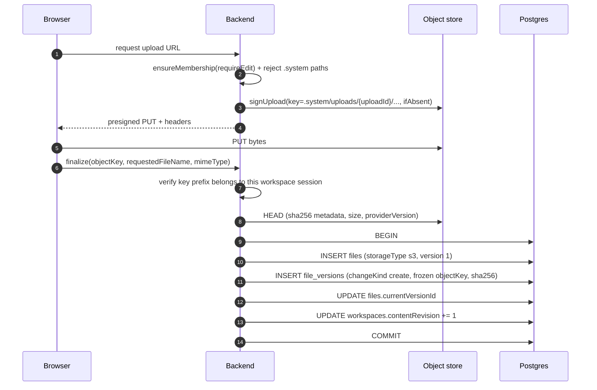

The `contentRevision` bump is inside the transaction so a concurrent proposal submit or apply sees the upload atomically. On failure the orphan `files` row is deleted in a `catch`.

**Versioning.** `file_versions` is append-only. Each new version writes a *new* immutable object rather than overwriting, so prior versions remain byte-exact. `changeKind` records even renames and deletes. Annotations pin `anchorVersionId`; proposals freeze `operations` with `baseVersionId`/`proposedVersionId`/`sha256`; publication freezes `manifest` and `baseWorkingManifest`. `workspace_file_revisions` additionally stores `bytea` content as a stale-overwrite recovery path.

**Retention and deletion.**

| Data | Mechanism | Retention |
|---|---|---|
| Files | Soft delete: `files.deletedAt` set under `SELECT ... FOR UPDATE`; all reads filter `whereNull('deletedAt')`. Objects are not deleted | Indefinite until workspace purge |
| Workspaces | Trash sets `status='trashed'`, `trashedAt`, `purgeAfter = now + 30 days` | 30 days, then purged |
| Workspace purge | `purgeExpiredTrashedWorkspaces(limit 25)` selects `purgeAfter <= now()`, deletes rows in a transaction, then cleans artifacts and published-version directories outside it | Scheduler ticks every 30s but the purge is interval-gated to at most hourly (`WORKSPACE_TRASH_PURGE_INTERVAL_MS`); the timestamp advances *before* the call so a failure cannot become a tight retry loop |
| Sharing | Reversible: `status='unshared'` with `unsharedAt`; legacy `archived` is rewritten to `unshared` at boot | Reversible via reshare |
| Knowledge upload sessions | `expiresAt`; configured TTL is clamped to 5–60 minutes, default 1800s; `cleanupExpiredUploadSessions()` fired opportunistically on each new session; late finalize marks `expired` and returns 409 | 30 minutes by default |
| Ingestion tasks | Self-recovery via lease expiry (`status='processing' AND leaseExpiresAt < now()`), `attempts`/`maxAttempts` (default 3) | No cleanup job needed |
| Run state | Redis TTL 86400; terminal runs explicitly `DEL` stream and meta | 24 hours |
| Run history | `agent_run_summaries` / `agent_run_tool_events` persist indefinitely | No purge implemented (**Gap**) |
| `idempotency_records` | `expiresAt` column exists | No sweeper found (**Gap**) |

**Archival.** There is no separate archive tier. Long-term retention is expressed as immutable snapshots: `workspace_published_versions.manifest` plus `published-versions/` objects, `knowledge_base_versions.memberSnapshot`, `knowledge_snapshots`, and `workspace_proposal_change_sets.operations`.

**Uncertainty is never replayed.** If a run's Redis state has been lost, the system cannot know whether the work already executed, so it reports `RUN_STATE_EXPIRED` and refuses to re-dispatch. This pairs with the `dispatchPhase` column on `workspace_team_thread_runs`: `reserved` means the runner was never invoked and is safe to dispatch; `dispatching` means it may have executed.

---

## 4. Low-level software design

### 4.1 Backend composition and layering

Layering is consistent: **route module → service → (DatabaseService | Redis | ObjectStore | agent HTTP client)**. There is no repository layer; services use the knex query builder directly via `DatabaseService.getDb()`. The closest thing to a repository split is `backend/src/services/governance/` (`skillPackageStore` + `skillGovernanceModel` + `skillGovernanceService`).

Dependency injection is **manual constructor injection composed in one place**, `backend/src/api/routes.ts`. There is no container:

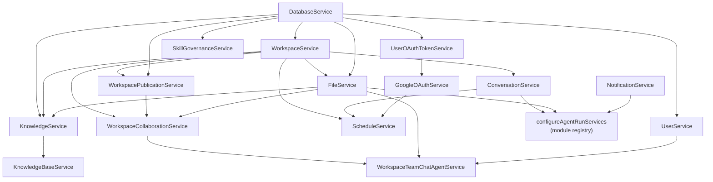

`configureAgentRunServices()` is a deliberate **service-locator escape hatch**: it is called twice (once in `index.ts` with telemetry/user-memory services, once in `routes.ts` with conversation/file/notification services) so that `services/agent-runs/lifecycle.ts` can reach request-scoped services without threading them through every call.

**Middleware order** (`backend/src/index.ts`) matters and is explicit:

1. `GET /api/health` — registered *before* all middleware so probes bypass session and CORS.
2. `helmet()`
3. `cors({ origin: true, credentials: true, methods: [GET, POST, PUT, PATCH, DELETE], allowedHeaders: [Content-Type, Authorization, X-User-Id, X-User-Name, X-User-Email, If-Match, Idempotency-Key] })`
4. `app.set('trust proxy', 1)`
5. `session()` with `RedisStore({ prefix: 'sess:' })`, `resave: false`, `rolling: true`, cookie `httpOnly`, `sameSite: 'lax'`
6. `loggingMiddleware`
7. `express.json({ limit: '50mb' })`, `express.urlencoded({ limit: '50mb' })`
8. `userContextMiddleware(userService)`
9. `app.use('/api', apiRoutes(...))`

`dotenv.config()` runs at the very top of the module *before* other import bodies execute, because several modules read `process.env` at module scope. Middleware and router factories exist partly to defer that reading until after dotenv has loaded.

**Gaps.** There is no global Express error handler — each router defines a local `handleError` mapping `ZodError` → 400, `HttpError` → its status, else 500 (`api/notifications.ts` is the exception and relies on Express 5's default handler). There is no rate limiting anywhere.

### 4.2 Agent-run engine class design

The run engine is the most intricate module. It is intentionally split so that decision logic is pure and testable, separate from I/O.

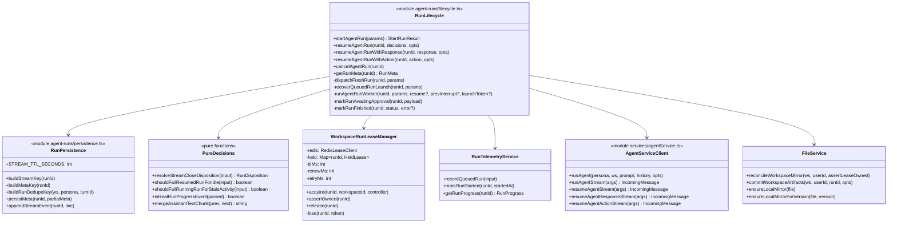

**Two independent leases, for two different failure modes.**

- *Launch lease* (`agent:run:{runId}:launch`) answers "is another process already launching this run?" It is granted by Lua only while `meta.status == 'queued'` — definitive proof no live worker exists, since a worker flips the status to `running` as it starts. A crashed launcher stops renewing, the lease lapses, and a retry can reclaim it for the **same** `runId`. Renewal continues through the slow queued phase (mirror reconciliation, telemetry) and stops only once `running` is durably persisted, because from then on the status itself guards against reclaim.
- *Workspace mutation lease* (`agent-run:workspace-mutation:{workspaceId}`) answers "may this run mutate workspace files right now?" Renewal is a Lua script that only extends the TTL if the token still matches **and** the run is still `queued|running`; losing the lease aborts the run's `AbortController`. `assertOwned()` is called again before committing artifacts so a lease lost mid-run cannot produce a partial commit.

**Deduplication.** With a `turnId`, `CLAIM_RUN_IDENTITY_LUA` sets the dedupe key *and* registers queued metadata atomically, so the key is never observable pointing at a metadata-less run. Outcomes:

| Observation | Action |
|---|---|
| `CLAIMED:` | Own a fresh identity, record telemetry, launch once |
| `EXISTS:` with no metadata | Throw `AgentRunDispatchRetryableError` — cannot know whether the work ran, so never mint a new identity |
| `EXISTS:` terminal, shared channel | Return the existing terminal result (one response per shared turn) |
| `EXISTS:` terminal, not shared | CAS-release the key and retry (bounded to 5 attempts) |
| `EXISTS:` `queued` without `startedAt` | Crash recovery: `recoverQueuedRunLaunch` for the same `runId` |
| `EXISTS:` `queued` with `startedAt` | Leave alone — this is a resumption owned by the resume path, not by `startAgentRun` |
| Retries exhausted | Throw retryable rather than falling back to a fresh run (which would double-execute) |

### 4.3 Run state machine

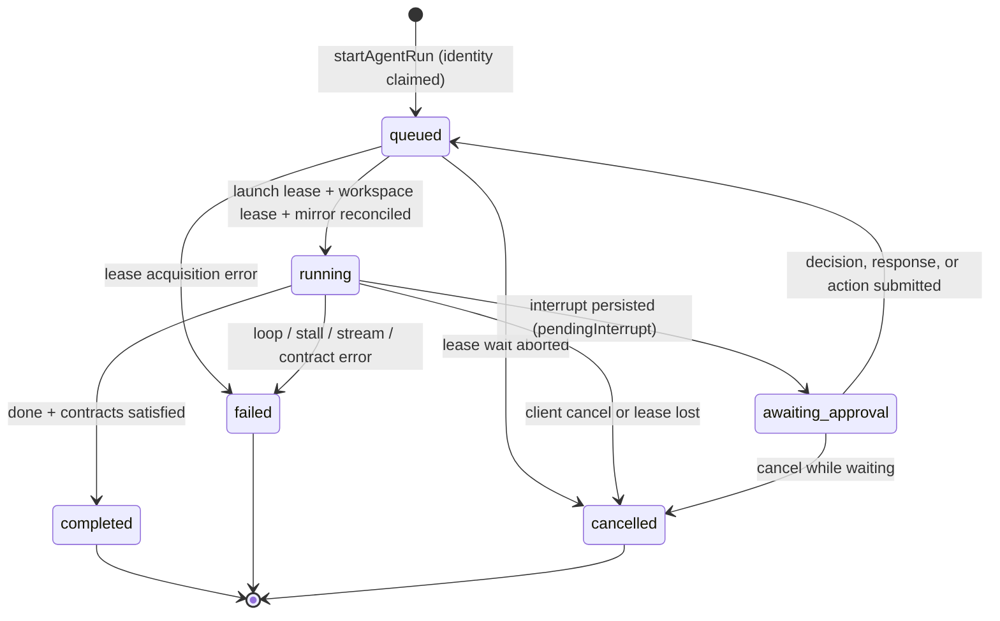

Terminal disposition is decided by the pure function `resolveStreamCloseDisposition`, with strict precedence: **interrupt → loop error → stall error → upstream stream error → client abort → contract error → completed**. Upstream errors deliberately outrank the transport abort that usually follows them, so run history records the original cause instead of `aborted`.

Two watchdogs use `isRealRunProgressEvent` (which excludes `keepalive`, `policy`, and `langfuse`) so heartbeat traffic never counts as progress:

- `RUNNING_RUN_STALE_TIMEOUT_MS` — default 15 minutes for a running run.
- `RESUMED_RUN_IDLE_TIMEOUT_MS` — default 2 minutes for a resumed run with no active tool calls.

A resumed run keeps its `startedAt`, which is precisely what stops `startAgentRun` from re-running the original prompt.

### 4.4 Agent runtime class design

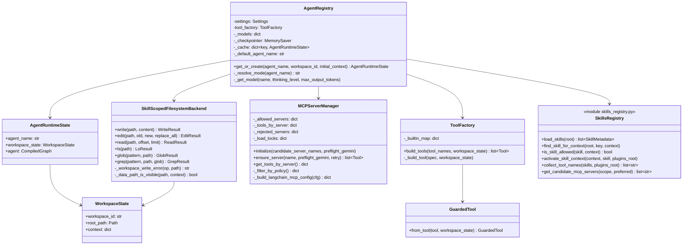

**Personas are modes, not separate graphs.** `_resolve_mode()` maps suffixes and aliases (`:pro`, `-pro`, `flash-lite`, `fast`, …) to `pro | lite | fast`, resolving to `general-assistant:{mode}`; mode selects model name, thinking level, and max output tokens. `skill-builder` is a context flag that replaces the system prompt and restricts the tool set rather than a distinct agent.

**Cache key** is `(resolved_name, workspace_id, "<userId>:<mcpPolicyJson>:<mcpAuthFingerprint>:<search on|off>:<sandbox on|off>:<skillAllow+pins+builder>")`. On a hit it also verifies that the desired MCP candidate list still matches `context["_bound_mcp_candidates"]`, rebuilding if not while preserving copyable context. Stale sibling keys under the same `user:policy:` prefix are evicted so rotating delegated credentials do not grow the cache without bound.

**Middleware stack** assembled in `get_or_create`, in order: `TodoListMiddleware`, `FilesystemMiddleware` (over a `CompositeBackend`: default `SkillScopedFilesystemBackend` on the workspace, `/memories/` → `UserScopedStoreBackend`, `/skills/` → read-only `FilesystemBackend`), `SummarizationMiddleware` (summarize above 170k tokens, keep 6 messages), `PatchToolCallsMiddleware`, then conditionally `MCPDiscoveryMiddleware`, `CodeInterpreterMiddleware`, `HumanInTheLoopMiddleware`, then always `InteractionContractMiddleware` and `SlideStylePreviewMiddleware`, and finally `ImplicitInputGuardMiddleware` when enabled. `recursion_limit` is 1000.

Two deliberate design decisions worth preserving:

- `request_plan_approval` is **removed** from `HumanInTheLoopMiddleware.interrupt_on` so it uses HelpUDoc's own interrupt tool and can coexist with clarification and action resume payloads in the same graph.
- MCP tools are **not** appended to the agent's `tools` list; they are registered by `MCPDiscoveryMiddleware`, because raw registration can shadow builtins or other MCP tools.

`SkillScopedFilesystemBackend` returns **error results rather than raising**, so the model can read and react to a policy denial. It blocks writes in published or read-only workspaces, blocks the research skill's final report when there are no verified search sources, and enforces Data-Analytics context hygiene (no raw structured files outside artifact directories, no prior-task sandbox outputs, no untagged prior artifacts).

### 4.5 Service boundaries and communication

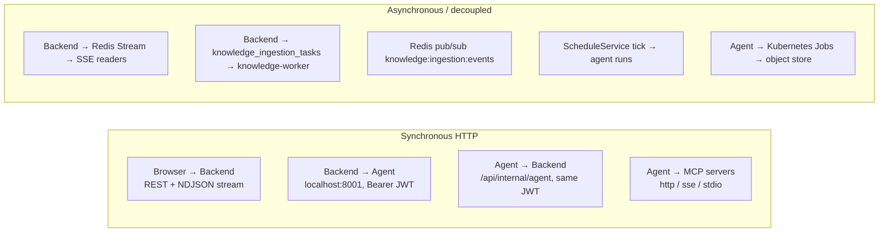

| Boundary | Transport | Contract | Notes |
|---|---|---|---|
| Browser ↔ Backend | HTTPS REST; `application/x-ndjson` for run streams | `@helpudoc/contracts` shared TypeScript types + zod schemas | Cookie session auth |
| Backend → Agent | HTTP over pod loopback | `application/jsonl` event stream | 5-minute HS256 context token per call |
| Agent → Backend | HTTP to `BACKEND_INTERNAL_URL` | JSON | Only the scope-bound thread-history reader |
| Agent → MCP | `http`, `sse`, or `stdio` via `langchain-mcp-adapters` | MCP tool schemas, Gemini-preflighted | Per-server RBAC and delegated headers |
| Backend → knowledge-worker | Postgres table with lease columns | `knowledge_ingestion_tasks` rows | Redis pub/sub is notification only |
| Agent → sandbox | Kubernetes `batch/v1` Jobs | Job manifest + object-store or PVC transfer | Admission-policy validated |

**No message broker.** There is no Kafka, RabbitMQ, or SQS. Asynchrony is achieved with Redis Streams for fan-out, Postgres lease tables for durable queues, and an in-process scheduler tick. This is a reasonable fit for the current single-replica topology, and it is also what would need to change first for multi-replica operation (§7).

### 4.6 Design patterns in use

| Pattern | Where | Purpose |
|---|---|---|
| Factory function modules | Every API module default-exports `(services) => Router`; `registerXRoutes(router, …)` for shared routers | Defers `process.env` reads past dotenv; makes services explicit |
| Composition root | `backend/src/api/routes.ts` | All wiring in one readable place, no container magic |
| Service locator (scoped escape hatch) | `configureAgentRunServices` | Lets the run lifecycle reach request-scoped services |
| Adapter + Factory + Singleton | `ObjectStore` interface, `S3Service` / `GcsObjectStore`, `objectStoreFactory` with `resetObjectStoreForTests()` | Provider portability and a test seam |
| Strategy / policy objects | `workspaceCollaborationPolicy`, `workspaceAudiencePolicy`, `governance/skillExecutionPolicy`, `governance/teamRoles` | Pure role→capability functions kept out of services |
| Pure-function extraction | `resolveStreamCloseDisposition`, `shouldFailResumedRunForIdle`, `resolveRuntimeMcpAccess`, `resolveRuntimeSkillAccess`, `buildWorkspaceOverview` | Decision logic unit-testable without I/O |
| Lease / fencing token | `WorkspaceRunLeaseManager`, launch lease, `workspaceMirrorLock`, `governanceLocks` | Safe mutual exclusion with crash recovery |
| Idempotency key | `CLAIM_RUN_IDENTITY_LUA`, `Idempotency-Key` header, `file_versions.operationId`, `clientMessageId` | Exactly-once effects under retries |
| Optimistic concurrency | `contentRevision`, `expectedSharedRevision`, `If-Match` | Conflict detection without long locks |
| Registry + cache | `AgentRegistry`, `_models`, `MCPServerManager._tools_by_server` | Reuse expensive graph and connection construction |
| Middleware pipeline | LangGraph middleware list; Express middleware chain | Composable cross-cutting behaviour |
| Decorator | `GuardedTool.from_tool(...)` | Uniform policy enforcement around every tool |
| Composite | `CompositeBackend` routing `/memories/`, `/skills/`, and default | One virtual filesystem over several stores |
| Barrel / facade | `services/agentRunService.ts` re-exporting `agent-runs/*` | Preserves import paths after the module split |
| Outbox-ish durable dispatch | `workspace_team_thread_runs` with `dispatchPhase` | Records intent before invoking the runner |

**CQRS is not used.** Reads and writes share the same knex-backed services and tables.

---

## 5. API and interface specifications

### 5.1 Route families and mount prefixes

Everything is mounted under `/api`. Two routers are mounted at `/` and therefore declare literal paths; registration order in `backend/src/api/routes.ts` decides resolution.

| Mounted prefix | Implementation | Access gate |
|---|---|---|
| `GET /api/health` | `index.ts` (pre-middleware) | none |
| `/api/notifications` | `api/notifications.ts` | session user |
| `/api/auth` | `api/auth.ts` | public start/callback, session for `/me` |
| `/api` (root) | `api/governance.ts` → `/api/skills/*`, `/api/skill-reviews/*`, `/api/teams/*`, `/api/workspaces/:workspaceId/skill-pins`, `/api/governance/audit-events` | role-checked in service |
| `/api` (root) | `registerSkillBuilderRoutes` → `/api/skill-builder/*` | session user |
| `/api/agent` | `api/agent/index.ts` → `slash.ts`, `runs.ts` | session user + workspace membership |
| `/api/settings` | `api/settings/*` | `requireSystemAdmin` |
| `/api/settings/reflections` | `api/settingsReflections.ts` | `requireSystemAdmin` |
| `/api/users` | `api/users.ts` | `requireSystemAdmin` |
| `/api/knowledge` | `api/knowledge.ts` (`{ global: true }`) | `requireSystemAdmin` |
| `/api/knowledge-catalog` | `api/knowledgeCatalog.ts` | session user |
| `/api/knowledge-bases` | `api/knowledgeBases.ts` | team-lead checks inside the service (deliberately not admin-gated) |
| `/api/workspaces` | `api/workspaces.ts` | membership per route |
| `/api/workspaces/:workspaceId/collaboration` | `api/workspaceCollaboration.ts` (`mergeParams`) | membership + capability matrix |
| `/api/internal/agent` | `api/internalAgent.ts` | **agent JWT only**, outside `userContext` |
| `/api/workspaces/:workspaceId/files` | `api/files.ts` (`mergeParams`) | membership, `requireEdit` for writes |
| `/api/workspaces/:workspaceId/knowledge` | `api/knowledge.ts` (workspace-scoped) | membership |
| `/api/workspaces/:workspaceId/schedules` | `api/schedules.ts` (`mergeParams`) | membership |
| `/api/me` | `api/meMemory.ts` | session user |
| `/api` (root, last) | `api/conversations.ts` → `/api/workspaces/:workspaceId/conversations`, `/api/conversations/:conversationId[/messages]` | membership |

### 5.2 Agent run API (the critical path)

```yaml
openapi: 3.1.0
info:
  title: HelpUDoc Agent Run API
  version: "1.0"
servers:
  - url: /api
components:
  securitySchemes:
    sessionCookie:
      type: apiKey
      in: cookie
      name: helpudoc.sid
  schemas:
    StartRunRequest:
      type: object
      required: [persona, prompt, workspaceId]
      properties:
        persona: { type: string, minLength: 1, description: "fast | pro | lite (mode aliases accepted)" }
        prompt: { type: string, minLength: 1 }
        workspaceId: { type: string, minLength: 1 }
        conversationId: { type: string }
        turnId: { type: string, description: "Dedupe key component; same turnId will not execute twice" }
        forceReset: { type: boolean }
        history:
          type: array
          items:
            type: object
            required: [role, content]
            properties:
              role: { type: string }
              content: { type: string }
        taggedFiles:
          type: array
          items: { type: string }
          description: "Legacy path-based references"
        taggedFileRefs:
          type: array
          maxItems: 50
          items:
            type: object
            required: [fileId]
            properties:
              fileId: { type: integer, minimum: 1 }
              version: { type: integer, minimum: 1 }
              name: { type: string }
        currentTurnFileIds:
          type: array
          items: { type: integer, minimum: 1 }
          description: "PDF/image ids inlined as multimodal blocks, capped by CURRENT_TURN_MULTIMODAL_MAX_BYTES (default 8 MiB)"
        knowledgeRefs:
          type: array
          maxItems: 20
          items:
            type: object
            required: [id]
            properties: { id: { type: integer, minimum: 1 } }
        knowledgeBaseIds:
          type: array
          maxItems: 20
          items: { type: string, format: uuid }
        internetSearchEnabled: { type: boolean }
    StartRunResponse:
      type: object
      required: [runId, status]
      properties:
        runId: { type: string }
        status: { type: string, enum: [queued, running, awaiting_approval, completed, failed, cancelled] }
    RunMeta:
      type: object
      required: [workspaceId, persona, status, createdAt]
      properties:
        workspaceId: { type: string }
        userId: { type: string }
        persona: { type: string }
        status: { type: string, enum: [queued, running, awaiting_approval, completed, failed, cancelled] }
        createdAt: { type: string, format: date-time }
        startedAt: { type: string, format: date-time }
        completedAt: { type: string, format: date-time }
        error: { type: string }
        turnId: { type: string }
        sharedTeamChannel: { type: boolean }
        pendingInterrupt: { $ref: "#/components/schemas/PendingInterrupt" }
    PendingInterrupt:
      type: object
      properties:
        kind: { type: string, enum: [approval, clarification] }
        interruptId: { type: string }
        title: { type: string }
        description: { type: string }
        stepIndex: { type: integer }
        stepCount: { type: integer }
        actions:
          type: array
          items:
            type: object
            required: [id, label]
            properties:
              id: { type: string }
              label: { type: string }
              style: { type: string, enum: [primary, secondary, danger] }
              inputMode: { type: string, enum: [none, text] }
              placeholder: { type: string }
              confirm: { type: boolean }
              value: { type: string }
              payload: { type: object, additionalProperties: true }
        responseSpec:
          type: object
          properties:
            inputMode: { type: string, enum: [none, text, choice, text_or_choice] }
            multiple: { type: boolean }
            submitLabel: { type: string }
            allowDismiss: { type: boolean }
            choices:
              type: array
              items:
                type: object
                properties:
                  id: { type: string }
                  label: { type: string }
                  description: { type: string }
                  value: { type: string }
            questions:
              type: array
              items:
                type: object
                properties:
                  id: { type: string }
                  header: { type: string }
                  question: { type: string }
                  options: { type: array, items: { type: object } }
        interactionRequest:
          type: object
          description: "contract helpudoc.interaction v1; presentation is questionnaire | plan_review | action_review | style_preview"
    DecisionRequest:
      type: object
      required: [decision]
      properties:
        decision: { type: string, enum: [approve, edit, reject] }
        message: { type: string }
        editedAction:
          type: object
          required: [name]
          properties:
            name: { type: string }
            args: { type: object, additionalProperties: true }
    RespondRequest:
      type: object
      description: "At least one of message, selectedChoiceIds, selectedValues, or answersByQuestionId is required"
      properties:
        message: { type: string }
        selectedChoiceIds: { type: array, items: { type: string } }
        selectedValues: { type: array, items: { type: string } }
        answersByQuestionId:
          type: object
          additionalProperties:
            oneOf:
              - { type: string }
              - { type: array, items: { type: string } }
    ActRequest:
      type: object
      required: [actionId]
      properties:
        actionId: { type: string }
        text: { type: string, description: "Required when the action declares inputMode: text" }
    Error:
      type: object
      properties:
        error: { type: string }
        details: {}
security:
  - sessionCookie: []
paths:
  /agent/runs:
    post:
      summary: Start a durable agent run
      requestBody:
        required: true
        content:
          application/json:
            schema: { $ref: "#/components/schemas/StartRunRequest" }
      responses:
        "200":
          description: Run queued, or the existing run for an already-seen turnId
          content:
            application/json:
              schema: { $ref: "#/components/schemas/StartRunResponse" }
        "400": { description: "Invalid input (zod)", content: { application/json: { schema: { $ref: "#/components/schemas/Error" } } } }
        "401": { description: Missing user context }
        "403": { description: "Workspace access denied, or Google delegation required for MCP tools" }
        "404": { description: "Workspace, conversation, or tagged file not found" }
        "409": { description: "Tagged file version conflict (details include expectedVersion, currentVersion)" }
        "500": { description: Failed to start agent run }
  /agent/runs/{runId}:
    get:
      summary: Fetch run metadata
      parameters:
        - { name: runId, in: path, required: true, schema: { type: string } }
      responses:
        "200": { description: OK, content: { application/json: { schema: { $ref: "#/components/schemas/RunMeta" } } } }
        "404": { description: "Run not found (also returned when the run belongs to another user, to prevent id enumeration)" }
  /agent/runs/{runId}/stream:
    get:
      summary: Stream run events as newline-delimited JSON
      parameters:
        - { name: runId, in: path, required: true, schema: { type: string } }
        - name: after
          in: query
          schema: { type: string, default: "0-0" }
          description: "Redis stream entry id of the last event received; enables exact resume after reconnect"
      responses:
        "200":
          description: "NDJSON event stream; Cache-Control no-cache, X-Accel-Buffering no, Connection keep-alive"
          content:
            application/x-ndjson:
              schema: { type: string }
        "401": { description: Missing user context }
        "404": { description: Run not found }
        "500": { description: Run stream failed }
  /agent/runs/{runId}/decision:
    post:
      summary: Approve, edit, or reject a pending plan approval
      parameters: [{ name: runId, in: path, required: true, schema: { type: string } }]
      requestBody:
        required: true
        content: { application/json: { schema: { $ref: "#/components/schemas/DecisionRequest" } } }
      responses:
        "200": { description: Resume accepted }
        "400": { description: Invalid input }
        "404": { description: Run not found }
        "409": { description: "Run is not awaiting approval, is awaiting a clarification instead, or belongs to a shared team channel" }
  /agent/runs/{runId}/respond:
    post:
      summary: Answer a pending clarification
      parameters: [{ name: runId, in: path, required: true, schema: { type: string } }]
      requestBody:
        required: true
        content: { application/json: { schema: { $ref: "#/components/schemas/RespondRequest" } } }
      responses:
        "200": { description: Resume accepted }
        "400": { description: "Requires a message or a selected choice" }
        "404": { description: Run not found }
        "409": { description: "Run is not awaiting input, or is awaiting an approval decision instead" }
  /agent/runs/{runId}/act:
    post:
      summary: Invoke a named interrupt action
      parameters: [{ name: runId, in: path, required: true, schema: { type: string } }]
      requestBody:
        required: true
        content: { application/json: { schema: { $ref: "#/components/schemas/ActRequest" } } }
      responses:
        "200": { description: Resume accepted }
        "400": { description: "Action requires text input" }
        "404": { description: "Run not found, or actionId not present on the pending interrupt" }
        "409": { description: Run is not awaiting human input }
  /agent/runs/{runId}/cancel:
    post:
      summary: Cancel a run
      parameters: [{ name: runId, in: path, required: true, schema: { type: string } }]
      responses:
        "200": { description: "{ status: cancelled }" }
        "404": { description: Run not found }
  /internal/agent/team-chat/thread-history:
    get:
      summary: Scope-bound thread history reader for the agent
      description: >
        Authenticated by the backend-signed agent JWT, not by the browser session.
        The query must match the token's signed threadHistoryScope exactly; the upper
        bound is clamped to the run's immutable cutoffSeq and current workspace access
        is re-checked so revocation is honoured mid-run.
      parameters:
        - { name: workspaceId, in: query, required: true, schema: { type: string } }
        - { name: threadId, in: query, required: true, schema: { type: string } }
        - { name: fromSeq, in: query, required: true, schema: { type: integer, minimum: 0 } }
        - { name: toSeq, in: query, required: true, schema: { type: integer, minimum: 0 } }
        - { name: limit, in: query, schema: { type: integer, minimum: 1, maximum: 100 } }
      responses:
        "200": { description: Messages within the authorized range }
        "401": { description: Missing, invalid, or expired agent context token }
        "403": { description: "Token is not scoped for thread history, or the request is outside the authorized scope" }
```

### 5.3 Collaboration and review API (selected)

| Method + path (under `/api/workspaces/:workspaceId/collaboration`) | Purpose | Notable codes |
|---|---|---|
| `GET /team-chat/threads?status=open\|resolved\|all&cursor=&limit=` | List threads | 200 |
| `POST /team-chat/threads` | Create thread; `references[]` is a discriminated union of `person \| agent \| skill \| file \| annotation`, at most one `skill` | 201 |
| `GET /team-chat/threads/:threadId/messages?beforeSeq=&afterSeq=&aroundMessageId=&limit=` | Sequence-based paging | 200 |
| `POST /team-chat/threads/:threadId/messages` | Post message; `@lumo` enqueues an agent run | 201 |
| `PATCH /team-chat/threads/:threadId` | Rename or resolve | 200 |
| `PUT /team-chat/threads/:threadId/read-state` \| `/follow-state` | Per-user state | 200 |
| `GET /team-chat/messages/:messageId` | Resolve owning thread (deep links) | 200 |
| `GET /team-chat/threads/:threadId/changes` | Attributed file changes | 200 |
| `GET /team-chat/threads/:threadId/changes/:versionId/content?side=before\|after` | Immutable version bytes, including for deleted files | 200 |
| `POST /objects` / `GET /objects` / `PATCH /objects/:id` | Annotations, sticky notes, tasks, change proposals | 201 / 200 |
| `POST /objects/:objectId/reattach-anchor` | Re-pin an annotation to a new version | 200 |
| `GET /objects/:objectId/submission-candidates?expectedSharedRevision=` | Server-derived diff, author only | 200 |
| `POST /objects/:objectId/submissions` | Freeze a selection of operations | 201 |
| `POST /objects/:objectId/submissions/:submissionId/reviews` | `approved` or `changes_requested` | 201 |
| `GET /objects/:objectId/private-navigation` | Author-only private workspace link | 200 / 403 |

Content-serving routes defend against stored-XSS: `text/html`, `image/svg+xml`, and `application/xhtml+xml` are forced to `application/octet-stream` with `Content-Disposition: attachment`, plus `X-Content-Type-Options: nosniff` and `Cache-Control: no-store`. Safe types may be inlined for preview and diff.

### 5.4 Agent service interface (backend → agent)

| Method + path | Purpose |
|---|---|
| `GET /agents` | Advertised modes (`fast`, `pro`, `skill-builder`), tool names, and secret-free MCP server metadata |
| `POST /agents/{agent_name}/workspace/{workspace_id}/chat` | Non-streaming single reply |
| `POST /agents/{agent_name}/workspace/{workspace_id}/chat/stream` | JSONL event stream |
| `POST .../chat/stream/resume` | Plan decision resume: `{ interruptId, decisions[], originalPrompt, langfuseTraceContext }` |
| `POST .../chat/stream/respond` | Clarification resume; body minus `interruptId`/`langfuseTraceContext` becomes the resume value |
| `POST .../chat/stream/act` | Named action resume |
| `POST /internal/analyze`, `GET/PUT/DELETE /internal/memories` | Backend-only analysis and per-user memory |
| `POST /documents/extract`, `/documents/preflight` | Document extraction |
| `POST /knowledge/ingestion/{map,reduce,embed,embed-media,graph-analysis}` | OKF ingestion stages |
| `POST /documents/office-preview`, `/documents/office-edit` | OfficeCLI preview and edit |
| `GET /skills/{skill_id}/contract` | Skill policy contract (tools, MCP servers, `requiresHitlPlan`, `prePlanSearchLimit`) |
| `GET /health`, `GET /ready` | Liveness with dependency diagnostics; readiness fails closed when OfficeCLI is unhealthy |

### 5.5 Stream event schema

The agent emits `application/jsonl`; the backend persists each line to the Redis stream and re-emits it with the stream entry id attached as `id`, which the client echoes back as `?after=`.

| `type` | Payload | Meaning |
|---|---|---|
| `policy` | active skill policy fields | First line of every stream |
| `progress` | `{ phase, label, detail?, status, timestamp }` | Phases include `preparing_context`, `planning`, `awaiting_input`, `completed`, `failed` |
| `model_start` / `model_end` | model metadata | Model step boundaries |
| `token` / `chunk` | `{ content, role }` | Assistant text delta; non-assistant roles and internal markers are filtered client-side |
| `thought` | `{ content }` | Reasoning summary |
| `tool_start` / `tool_end` | `{ name, args?, output?, outputFiles? }` | Tool activity for the UI timeline |
| `tool_error` | `{ name, message }` | A fatal tool failure cancels the run task |
| `dashboard_artifact` | `{ workspaceId, dashboardPath, … }` | Dashboard package produced |
| `interrupt` | normalized interrupt payload (§5.6) | Run pauses for a human |
| `interaction_consumed` | `{ interruptId }` | Confirms a resume payload was actually consumed |
| `contract_error` | `{ message, missing?, errorCode?, retryable? }` | Plan, source, or artifact contract not satisfied |
| `langfuse` | `{ traceId, traceUrl }` | Best-effort trace linkage |
| `keepalive` | `{}` | Emitted by the agent every 15s idle and by the backend stream on a 10s empty `XREAD` |
| `error` | `{ message }` | Stream-level failure |
| `done` | `{ status: completed \| failed \| interrupted, error? }` | Terminal event |

### 5.6 Interrupt payload contract

```json
{
  "type": "interrupt",
  "kind": "approval",
  "interruptId": "interrupt-9f2c1ab7e3d45c60b812",
  "title": "Review the execution plan",
  "description": "Approve, edit, or reject before any files are written.",
  "stepIndex": 1,
  "stepCount": 3,
  "actions": [
    { "id": "approve", "label": "Approve", "style": "primary", "inputMode": "none" },
    { "id": "edit", "label": "Request edits", "inputMode": "text", "placeholder": "What should change?" }
  ],
  "actionRequests": [{ "name": "request_plan_approval", "args": { "plan_file_path": "/plan.md" } }],
  "reviewConfigs": [{ "action_name": "request_plan_approval", "allowed_decisions": ["approve", "edit", "reject"] }],
  "responseSpec": { "inputMode": "none", "submitLabel": "Submit" },
  "displayPayload": { "planTitle": "Draft quarterly summary" },
  "interactionRequest": {
    "contract": "helpudoc.interaction",
    "version": "1",
    "presentation": "plan_review",
    "resumeAction": { "endpoint": "respond", "actionId": "submit" }
  }
}
```

Contract rules that the implementation enforces:

- `interruptId` is **deterministic**: `"interrupt-" + sha256(canonical payload without id fields)[:20]`. The same logical pause always yields the same id, which makes resume matching and client deduplication safe.
- When the tool does not supply an `interactionRequest`, one is synthesized. Presentation is chosen in order: `style_preview` → `questionnaire` (when `kind == "clarification"`) → `plan_review` (when `displayPayload.planTitle` is present) → `action_review`.
- On resume the agent enumerates pending interrupt ids from `aget_state(config, subgraphs=True)` including nested task states. A non-matching `interruptId` **fails the run with a contract error** rather than silently re-running, so an unapproved plan can never execute.
- Interrupt events discovered mid-stream are buffered until the graph event stream drains, because closing the generator on the first interrupt event can leave the checkpoint at the preceding model node, which would make a later decision never reach the interrupted tool.
- After a successful resume the runtime asserts `resume_interrupt_consumed` and emits `interaction_consumed`; otherwise it fails with a contract error.
- A machine-only marker (`__HELPUDOC_INTERRUPT_PAYLOAD__`) allows payloads to travel inside assistant text without being shown to users; it is stripped before display.

### 5.7 Agent context token claims

Signed HS256 by `backend/src/services/agentToken.ts`, 5-minute expiry, secret `AGENT_JWT_SECRET`.

```json
{
  "sub": "<userId>",
  "userId": "<userId>",
  "workspaceId": "<workspaceId>",
  "isAdmin": false,
  "workspaceMode": "private | shared_live | published_read_only",
  "workspaceRole": "viewer | commenter | contributor | editor | owner",
  "canWriteWorkspace": true,
  "skipPlanApprovals": false,
  "skillAllowIds": ["research", "data/dashboard"],
  "skillVersionPins": {
    "research": {
      "skillId": "<uuid>",
      "versionId": "<uuid>",
      "semanticVersion": "1.4.0",
      "manifestHash": "<64 hex>"
    }
  },
  "mcpServerAllowIds": ["toolbox-bq-demo"],
  "mcpServerDenyIds": [],
  "mcpAuth": { "toolbox-bq-demo": { "Authorization": "Bearer <delegated google token>" } },
  "mcpAuthFingerprint": "<sha256 over provider|servers|exp bucket|token hash>",
  "allowSkillSandbox": true,
  "threadHistoryScope": {
    "workspaceId": "<workspaceId>",
    "userId": "<userId>",
    "threadId": "<threadId>",
    "cutoffSeq": 42,
    "sourceMessageId": "<uuid>"
  },
  "iat": 0,
  "exp": 300
}
```

Security invariants:

- `isAdmin` is **forced to `false`** when the policy is resolved. Platform catalog administration never becomes a runtime capability bypass.
- `published_read_only` workspaces receive **only** the signed version pins as `skillAllowIds`, so a published workspace executes exactly the skill versions frozen into it.
- MCP resolution: an explicit workspace deny always wins; a server whose `default_access` is `deny` requires both a user assignment and a workspace allow.
- The agent-side claim reader defaults `skipPlanApprovals` to `false` rather than inferring it from a missing claim, and silently drops version pins whose `versionId` is not a UUID or whose `manifestHash` is not 64 hex characters.
- `mcpAuthFingerprint` participates in the agent cache key so rotated delegated credentials force a clean rebind.

### 5.8 Interface gaps

- **No published OpenAPI document.** §5.2 is authored for this design doc; the runtime source of truth is the zod schemas plus `packages/contracts`. Generating OpenAPI from the zod schemas would remove the drift risk.
- **No API versioning.** Paths are unversioned (`/api/...`); compatibility relies on the frontend and backend shipping together.
- **No pagination on some list endpoints**, notably `GET /objects` and workspace file listings.

---

## 6. Infrastructure and operations

### 6.1 Containerization

| Image | Base | Notes |
|---|---|---|
| `helpudoc-backend` (`backend/Dockerfile.gke`) | `node:20-bookworm-slim` | Copies `packages/contracts`, `npm ci --legacy-peer-deps` with a BuildKit npm cache mount, starts `npx ts-node --transpile-only src/index.ts`. **No compile step**, so TypeScript errors do not fail the image build (**Gap**) |
| `helpudoc-agent` (`agent/Dockerfile.gke`) | `python:3.12-slim-bookworm` | LibreOffice (writer/calc/impress), fonts, `libicu72`, `libseccomp2`, Node; OfficeCLI `v1.0.143` downloaded per `TARGETARCH` with pinned SHA-256 verification; `gcp-cost-mcp-server v0.8.0`; `uvicorn main:app --host 0.0.0.0 --port 8001`. Ships `skills/`, `plugins/`, and `runtime.yaml` twice — once live and once as `*-source/` trees used for PVC seeding — stamped with `GIT_COMMIT` |
| `helpudoc-frontend` (`frontend/Dockerfile.gke`) | 3-stage → `nginx:1.27-alpine` | Vite build with `VITE_API_URL=/api`, `VITE_GOOGLE_CLIENT_ID`, `VITE_AUTH_MODE=oidc`; explicitly does not copy `.env*` |
| `helpudoc-inline-sandbox` (`agent/Dockerfile.sandbox`) | `python:3.12-slim` | Hardened: uid 1000 `sandbox` user, pip/setuptools/wheel/ensurepip deleted, only `sandbox_supervisor.py` present, no cloud CLIs, no credentials, no service code |

Local development uses `infra/docker-compose.dependencies.yml` (Postgres, Redis, MinIO only) or the full `infra/docker-compose.yml` (adds ClickHouse, Langfuse web/worker, `google-workspace-mcp`, backend, knowledge-worker, agent, frontend). Dependencies are health-gated (`service_healthy`, `service_completed_successfully`) and `POSTGRES_PASSWORD` uses the fail-fast `${VAR:?message}` form.

### 6.2 Deployment plan

**Topology.** Namespaces `helpudoc` and `helpudoc-sandbox` (the latter labelled `helpudoc.io/purpose: inline-sandbox` with Pod Security Admission `restricted`).

PVCs, all `ReadWriteOnce` on the GKE default storage class: `postgres-pvc` 20Gi, `redis-pvc` 5Gi, `minio-pvc` 20Gi, `workspace-pvc` 20Gi, `skills-pvc` 5Gi, `plugins-pvc` 5Gi, `agent-config-pvc` 1Gi, `clickhouse-pvc` 20Gi.

`Deployment/helpudoc-app`: `replicas: 1`, `strategy: Recreate`, `serviceAccountName: helpudoc-agent`. Three init containers (`seed-skills`, `seed-plugins`, `seed-agent-config`) run the agent image and copy `/app/*-source/` into the PVCs **only when the PVC is empty**, guarded by marker files, so administrator edits on the PVC survive restarts.

| Container | Port | Requests | Limits | Probes |
|---|---|---|---|---|
| `backend` | 3000 | 200m / 384Mi | 1000m / 1Gi | startup `/api/health` 5s × 60; readiness 10s/2s/3; liveness 30s/2s/3 |
| `knowledge-worker` | — | 50m / 128Mi | 1000m / 1Gi | none (**Gap**) |
| `agent` | 8001 | 800m / 4Gi | 2 CPU / 9Gi | startup `/ready` 5s × 120 (10 min); readiness `/ready`; liveness `/health` |
| `google-workspace-mcp` | 8000 | 100m / 128Mi | 250m / 256Mi | none; pip-installs `workspace-mcp` at container start (**Gap**: unpinned supply chain) |

Data plane, each `replicas: 1` with `strategy: Recreate`: Postgres 16 (500m/1Gi → 1000m/2Gi), Redis 7 with `--appendonly yes` (100m/256Mi → 500m/512Mi), MinIO pinned **by digest** in Artifact Registry with an explicit comment that pod recreation must not depend on a mutable tag (200m/512Mi → 1000m/1Gi), ClickHouse for Langfuse. Plus `helpudoc-aws-pricing-mcp` and a `helpudoc-daily-reflection` CronJob at `15 0 * * *` with `concurrencyPolicy: Forbid`.

**Edge path.**

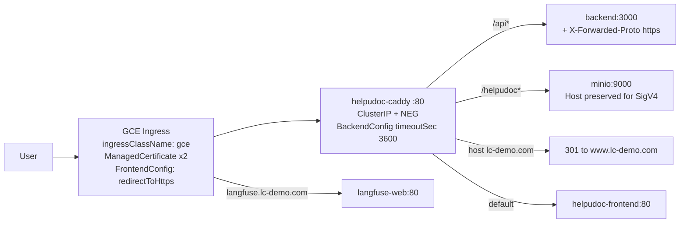

`timeoutSec: 3600` exists specifically because `/api/agent/runs/:id/stream` is a long-lived response. The Caddy Service is annotated for a container-native NEG with an explicit comment not to expose a second public L4 load balancer.

**CI (`.github/workflows/ci.yml`)** — triggers on pull requests and pushes to `master`/`main`. A `changes` job uses `dorny/paths-filter` to compute `backend`/`frontend`/`agent` flags; downstream jobs run on match or on a default-branch push.

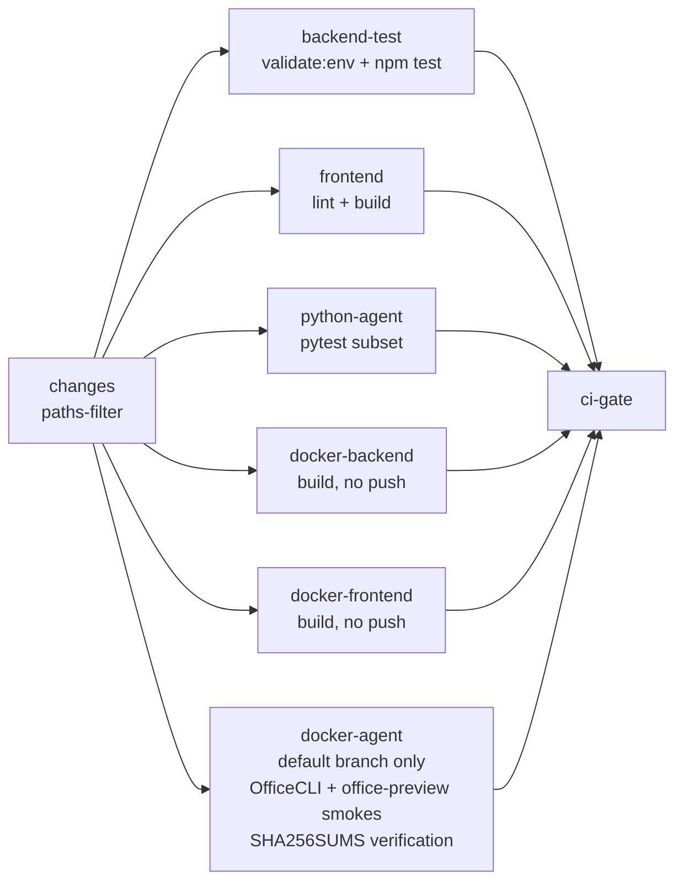

**Deploy (`.github/workflows/deploy-gke.yml`)** — `workflow_dispatch` only, with inputs `build_backend` / `build_frontend` / `build_agent` (default true), `deploy_infra` (default **false**), `sync_runtime_assets` (legacy), an operator `environment` label, and `image_tag_suffix`. Images are tagged `${github.sha}${suffix}` and pushed to `gcr.io/$PROJECT_ID/helpudoc-{backend,frontend,agent}` using buildx with a registry cache (`mode=max`). Authentication accepts **either** Workload Identity Federation **or** a service-account key and fails if both or neither are configured.

Deploy-job safety properties worth keeping:

- Captures currently deployed images first, so components that were not rebuilt keep their exact image instead of drifting to `:latest`.
- Requires `helpudoc-config` to exist when `deploy_infra=false`.
- Pre-checks `kubectl auth can-i` for Role/RoleBinding before applying the sandbox RBAC manifest.
- Applies `30-storage.yaml` only when **zero** of the eight expected PVCs exist, and aborts on a partial set rather than risk resizing live volumes.
- Applies the demo ConfigMap only when absent; patches Langfuse and OAuth config/secret keys idempotently.
- Waits on `rollout status` (app 20m, frontend 10m, Caddy 5m), then runs post-deploy smokes: an in-cluster `curl` pod against `backend:3000/api/health` and the frontend Service, an exec probe of `127.0.0.1:8001/ready`, and a **live Gemini call** (`get_lite_chat_model().invoke("Reply with exactly OK.")`).
- On failure, collects deployment, ReplicaSet, pod, and container-log diagnostics.

Per-component workflows (`deploy-backend-gke.yml`, `deploy-agent-gke.yml`, `deploy-frontend-gke.yml`, `deploy-langfuse-gke.yml`) exist for narrower rollouts; the agent one additionally gates direct OfficeCLI behaviour in the shared cgroup. `infra/cloudbuild.yaml` is an alternative path that ends with a **drift guard**: it greps the PVC-mounted `runtime.yaml` and `SKILL.md` for expected content and asserts `request_plan_approval` appears in `GET /agents`.

**Rollback.** Re-dispatch the deploy workflow with a previous commit SHA, or `kubectl rollout undo`. `infra/gke/rollback/office-sidecar-v1.0.143/` retains a manifest bundle for the removed Office HTTP sidecar.

### 6.3 Scalability and performance

**Current posture: vertical only.** This is a deliberate, documented constraint rather than an oversight, but it is the dominant architectural limitation.

| Constraint | Effect |
|---|---|
| No `HorizontalPodAutoscaler` anywhere | Every workload is fixed at `replicas: 1` |
| `workspace-pvc` and siblings are `ReadWriteOnce`, mounted read-write | A second `helpudoc-app` replica cannot schedule |
| `strategy: Recreate` + agent startup probe up to 10 minutes | Every deploy is a full outage window |
| `AGENT_URL=http://localhost:8001` | Backend and agent cannot scale or deploy independently |
| LangGraph `MemorySaver` is in-process | A pending interrupt can only be resumed by the pod that created it |
| `ScheduleService.startScheduler()` runs in-process with the API | Two API replicas would double-fire schedules unless the existing `lockedAt`/`lockedBy` claim is relied on |
| Postgres, Redis, MinIO, ClickHouse are single-replica Deployments on RWO PVCs | Each is a single point of failure |

**Concurrency is bounded by configuration, not replicas:** `KNOWLEDGE_WORKER_CONCURRENCY=2`, `KNOWLEDGE_OCR_CONCURRENCY=4`, `KNOWLEDGE_MAP_CONCURRENCY`, `SANDBOX_INLINE_MAX_GLOBAL_JOBS=4`, at most 2 sandbox executions per agent run, 1 active sandbox job per workspace, and a `ResourceQuota` in `helpudoc-sandbox` capping `pods: 4`, `count/jobs.batch: 20`, `requests.cpu: 400m`, `limits.cpu: 2`, `limits.memory: 2Gi`.

**Serialization by design.** The per-workspace mutation lease means concurrent agent runs in the *same* workspace queue rather than interleave. This is a correctness requirement (the local mirror is a shared mutable filesystem), so it should be understood as a throughput characteristic, not a bug: per-workspace agent throughput is 1.

**Traffic expectations.** No QPS targets, load tests, or benchmark results exist in the repository, so no measured capacity figures can be quoted. Qualitatively, the workload is not request-rate bound — it is dominated by long-lived streaming connections and multi-minute LLM/tool runs. The read/write mix skews heavily to reads (file listings, conversation history, thread paging) with comparatively few but expensive writes (version creation, publication, ingestion). Sizing is therefore governed by concurrent *runs* and memory headroom on the agent container, not by HTTP QPS.

**Performance measures that are implemented.**

- Streaming: NDJSON with `X-Accel-Buffering: no` and explicit `flushHeaders()`, plus keepalives, so output appears incrementally.
- Reconnect without replaying work: the `?after` cursor over a 24-hour Redis stream.
- Multimodal inlining capped at 8 MiB per turn to bound request size.
- Context hygiene: `SummarizationMiddleware` above 170k tokens; DuckDB-backed bounded queries instead of paging raw rows into context; blocked reads of raw structured files under the data skill.
- MCP discovery bounded at 30 seconds per server with per-name locks and no automatic retry of failed servers.
- Build performance: BuildKit registry cache with `mode=max`, plus GHA cache scopes per component.

**Path to horizontal scale** (not implemented, listed so the sequence is clear): move the workspace mirror to `ReadWriteMany` or make it strictly derived per-run; replace `MemorySaver` with a Postgres LangGraph checkpointer; split the agent into its own Deployment and Service; move the scheduler into a singleton workload or rely fully on the DB claim; convert stateful services to StatefulSets or managed offerings; then add HPAs and PodDisruptionBudgets.

### 6.4 Security and compliance

**Authentication.** Three coexisting mechanisms:

1. **Session cookies** — Redis-backed `express-session`, cookie `helpudoc.sid`, TTL 604800s, `rolling: true`, `httpOnly`, `sameSite: 'lax'`, `secure` automatically true in production.
2. **Google OAuth 2.0 / OIDC with PKCE** — `/api/auth/google/start` stores state and code challenge in the session; `/api/auth/google/callback` validates state, exchanges the code, and writes `req.session.userContext`. Delegated refresh tokens are encrypted at rest with `OAUTH_TOKEN_ENCRYPTION_KEY`.
3. **Header identity** (`X-User-Id`) — a local-development convenience. The code comments state it is not authentication; it is disabled in `hybrid` mode when `NODE_ENV=production`. In pure `AUTH_MODE=headers` it *is* the auth mechanism, meaning any caller can impersonate any user. **This mode must never be enabled on a network-exposed deployment.**

**Authorization.** Layered, all server-side:

- `workspaceService.ensureMembership(workspaceId, userId, { requireEdit, allowSystemAdmin })` is the kernel. Private workspaces are owner-only *before* any admin override; owners are never locked out; team access derives from `group_members` plus `workspace_team_grants` with `strongestWorkspaceRole` merging; `editingPolicy` (`direct` vs `review`) decides `canEdit`.
- A capability matrix in `workspaceCollaborationPolicy.ts` maps `viewer | commenter | contributor | editor | owner` to `{canView, canComment, canPropose, canPublish, canManageAccess}`.
- `requireSystemAdmin` re-reads the user row on every request so a revoked admin flag takes effect immediately.
- Run access uses `NotFoundError` (404) rather than 403 when a run belongs to another user, to avoid run-id enumeration.

**Service-to-service.** Hand-rolled HS256 JWT with a 5-minute expiry, verified with `crypto.timingSafeEqual`. If `AGENT_JWT_SECRET` is unset outside development, signing returns `null` — the call proceeds without a token rather than erroring, which degrades to an empty agent context (**Gap**: prefer failing closed). The reverse-direction callback validates that the request targets exactly the signed scope, re-checks live workspace access, and clamps the range to the run's immutable cutoff.

**Prompt-injection posture.** Tagged file metadata is labelled "backend-authorized metadata; document contents remain untrusted" in the prompt, tool scope is narrowed per skill, the filesystem backend denies out-of-policy writes, and the thread-history reader's scope comes from the signed token so the model cannot widen it.

**Encryption.** In transit: HTTPS at the ingress with Google-managed certificates and forced redirect; in-cluster traffic is plaintext HTTP (**Gap**: no mTLS or service mesh). At rest: GKE persistent disks are encrypted by the platform; delegated OAuth tokens are application-encrypted; object integrity is verified by SHA-256. Postgres `DATABASE_SSL` supports `strict`.

**Secrets.** `helpudoc-secrets` and `helpudoc-config` are created out-of-band with `kubectl create ... --from-env-file`. Tracked templates contain only `replace-me`. There is **no external secret manager** integration (no Secret Manager, External Secrets, or SealedSecrets), and secrets are consumed as environment variables, so values are visible in pod env (**Gap**). `.github/workflows/secret-scan.yml` runs gitleaks on every push and pull request with a custom Google API key rule.

**Sandbox isolation** — the strongest control set in the repository (`infra/gke/k8s/49-skill-sandbox.yaml`):

- `helpudoc-agent` service account limited to `batch/jobs` CRUD plus `pods`/`pods/log` read, in two namespaces.
- `helpudoc-sandbox-runner` service account with `automountServiceAccountToken: false`.
- NetworkPolicies: `default-deny-all` ingress and egress in `helpudoc-sandbox`; a narrow allow for MinIO:9000 and kube-dns:53 only; `egress: []` for declared-sandbox pods in `helpudoc`.
- `ResourceQuota` and `LimitRange` capacity caps.
- A `ValidatingAdmissionPolicy` with `validationActions: [Deny]` and `failurePolicy: Fail` that requires canonical labels, `backoffLimit == 0`, `activeDeadlineSeconds <= 330`, `ttlSecondsAfterFinished <= 300`, `runtimeClassName == 'gvisor'`, the tokenless service account, `automountServiceAccountToken == false`, `enableServiceLinks == false`, no host namespaces, emptyDir-only volumes, and exactly one container named `runner` from the approved image with `allowPrivilegeEscalation: false`, `readOnlyRootFilesystem: true`, `capabilities.drop: [ALL]`, and all six resource request/limit fields set.
- Application-side: only skill-declared, SHA-256-pinned scripts may run; paths are symlink-checked; `/workspace` is mounted read-only with a writable run-scoped `/sandbox`; source ≤ 64 KiB, ≤ 16 inputs / 256 MiB, ≤ 64 outputs / 100 MiB, default timeout 120s (max 300s).

**Content-handling defences.** Potentially active uploaded types are served as attachments with `nosniff`; `.system` and `sandbox-runs` are reserved paths; presigned uploads use `ifAbsent` so a replayed PUT cannot silently overwrite; finalize rejects object keys outside the caller's workspace upload prefix.

**Supply chain.** OfficeCLI is SHA-256 verified at build and re-verified in CI against `SHA256SUMS`; MinIO and Langfuse web are pinned by digest; application images are pinned to commit-SHA tags on deploy. Counter-example: `google-workspace-mcp` pip-installs at container start (**Gap**).

**Compliance.** No GDPR, HIPAA, or SOC 2 program artefacts exist in the repository — no data-processing records, retention policy document, DSAR/erasure workflow, or data-classification labels. What exists that *supports* such a program: an append-only `audit_events` table with actor, action, resource, before/after state hashes, policy version, request id, and `platformOverride`/`selfApproved` flags; 30-day workspace trash retention with automated purge; per-user encrypted credential storage; least-privilege sandbox execution; immutable version history. Anyone claiming regulatory compliance would need, at minimum: a documented retention and erasure policy including `agent_run_summaries` and `agent_run_tool_events`, hard-delete support for user data, an `idempotency_records` sweeper, a secret manager, in-cluster encryption in transit, and log-retention controls.

### 6.5 Observability

**Tracing — implemented.** Langfuse v3 is self-hosted in-cluster (`langfuse-web` with readiness `/api/public/ready` and liveness `/api/public/health`, `langfuse-worker`, ClickHouse, Postgres database `langfuse`, Redis DB 1, MinIO `events/` and `media/` prefixes), exposed at `langfuse.lc-demo.com` with its own managed certificate and deploy workflow. The agent creates callback handlers **per run**, gated by `LANGFUSE_ENABLED` (or legacy `LANGFUSE_TRACING_ENABLED`) plus public/secret keys and a base URL; a missing package or base URL degrades gracefully to no tracing. The resolved `traceId` and `traceUrl` are emitted as a `langfuse` stream event so the backend can attach them to run metadata, and `patch_current_trace_skill()` adds `metadata.helpudoc_skill_id` after a skill loads. Production config enables tracing; local compose disables it with `OTEL_SDK_DISABLED=true`.

**Logging.** stdout/stderr only, collected by GKE Cloud Logging; Cloud Build uses `CLOUD_LOGGING_ONLY`. Notable structured log points: MCP bind candidates and results, `Agent stream start`, `[AgentDecision]`, `[mcp-auth]` (user, workspace, server ids, token source, coarse expiry bucket — no token material), and `[agent-run-stream]` append/send tracing under `DEBUG_AGENT_RUN_STREAM=1`. `lib/safeError.ts` provides `safeErrorForLog` and `safeTelemetryForPersistence` for redaction. **Gap**: logs are unstructured text, there is no correlation id propagated through the browser → backend → agent chain (the `runId` is the closest available), and there is no log-based metric or retention policy.

**Application-level run telemetry — implemented.** `agent_run_summaries` and `agent_run_tool_events` persist per-run status, timings, interrupt counts, tool-call and tool-error counts, and per-event payloads. `agent_daily_reflections` aggregates outcome, reliability, and friction scores nightly via the `helpudoc-daily-reflection` CronJob. `knowledge_usage_events` records input/cached/output tokens, retries, latency, rate-card version, and estimated cost. This is the system's real analytics substrate.

**Health and readiness.** Backend `GET /api/health` returns `{status:'ok', service:'helpudoc-backend'}`. Agent `GET /health` always returns 200 with a dependency diagnostic (OfficeCLI version and binary SHA-256); `GET /ready` **fails closed with 503** when the pinned OfficeCLI is not ready. Both are wired to startup, readiness, and liveness probes. **Gap**: `knowledge-worker`, `google-workspace-mcp`, frontend, Caddy, Postgres, Redis, and MinIO have no probes in GKE.

**Metrics and alerting — not implemented.** No Prometheus, managed Prometheus, Grafana, `ServiceMonitor`, `PodMonitoring`, `/metrics` endpoint, or alert policy exists. Effective monitoring is GKE container/system metrics plus CI/CD failure signals (rollout timeouts, post-deploy smokes, the drift guard, diagnostics collection). Since no alerting exists, no thresholds can be documented as implemented. A first increment, in priority order, would be:

| Signal | Source available today | Suggested threshold |
|---|---|---|
| Pod restart / `CrashLoopBackOff` on `helpudoc-app` | GKE metrics | any restart in 15 min |
| Backend or agent probe failure | existing probes | readiness failing > 2 min |
| Run failure rate | `agent_run_summaries.status` | failed ÷ total > 10% over 30 min |
| Stalled runs | runs in `running` past `RUNNING_RUN_STALE_TIMEOUT_MS` | any |
| Ingestion task starvation | `knowledge_ingestion_tasks` where `attempts >= maxAttempts` | any |
| PVC utilisation | GKE metrics | `workspace-pvc` > 80% |
| Redis availability | GKE metrics | unavailable > 1 min (run state at risk) |
| Gemini error rate | agent logs / Langfuse | sustained non-2xx |

### 6.6 Environment configuration

Four environment files: `env/local/dev.env` (host-run services, ~65 keys), `env/local/stack.env` (docker compose), `env/prod/config.env` → `helpudoc-config`, `env/prod/secrets.env` → `helpudoc-secrets`. Only `.example` files are tracked.

The canonical catalog is **`infra/env/helpudoc.env.schema.yaml`** (`version: 1`), which documents every variable with `owner` (backend | agent | frontend | shared), `secret`, `local` and `prod` requirement levels, `default`, `description`, and `deprecated_aliases`. It is enforced in CI by `npm run validate:env` (`backend/scripts/validate-env.ts`) inside the `backend-test` job — the strongest configuration-governance control in the repository.

`scripts/bootstrap_local_env.sh` copies the example files only when missing and generates a 32-byte `OAUTH_TOKEN_ENCRYPTION_KEY` (node → python3 → openssl fallback chain), writing it only when blank.

---

## 7. Known gaps and risk register

Ordered by expected impact. None of these are speculative; each corresponds to something verified absent or explicitly constrained in the repository.

| # | Gap | Risk | Suggested direction |
|---|---|---|---|
| 1 | Single replica, RWO PVCs, `Recreate` strategy | No availability during deploys; no capacity headroom; node loss is an outage | Detach the workspace mirror from RWO storage, split the agent Deployment, then introduce replicas |
| 2 | No metrics or alerting | Failures are discovered by users or by the next deploy | Add managed Prometheus scraping plus the eight signals in §6.5 |
| 3 | In-process `MemorySaver` checkpoints | Blocks multi-replica agents; a pod restart loses resumability of pending interrupts | Adopt a Postgres LangGraph checkpointer |
| 4 | Schema created at boot, no migration files | No reviewable, reversible, dry-runnable schema change path | Introduce knex migrations; freeze `initialize()` as a baseline |
| 5 | No rate limiting on any endpoint | Run-start and stream endpoints are abusable; LLM spend is unbounded per user | Per-user and per-workspace limits on run creation, plus a concurrent-stream cap |
| 6 | Secrets only as env vars, no secret manager | Broad blast radius on pod compromise; manual rotation | External Secrets Operator or Secret Manager with CSI |
| 7 | `AUTH_MODE=headers` allows impersonation | Catastrophic if ever enabled with network exposure | Refuse to start in `headers` mode when `NODE_ENV=production` |
| 8 | Agent token signing fails open when the secret is missing | Runs proceed with an empty, unauthorized agent context | Fail closed outside development |
| 9 | No `securityContext` or NetworkPolicy on the app pod | Container runs as root with unrestricted in-namespace egress, unlike the well-hardened sandbox | Apply `runAsNonRoot`, `readOnlyRootFilesystem`, and namespace NetworkPolicies |
| 10 | Backend runs TypeScript via `ts-node` with no compile gate | Type errors reach runtime; slower cold start | Add `tsc --noEmit` to CI and a compiled production image |
| 11 | No global Express error handler | Inconsistent error shapes; a missed try/catch can leak a stack trace | Add a terminal error middleware normalizing `HttpError`/`ZodError` |
| 12 | `google-workspace-mcp` pip-installs at start | Unpinned dependency in the request path; slow, failure-prone startup | Bake a pinned image |
| 13 | No retention for run history or `idempotency_records` | Unbounded growth; complicates any erasure obligation | Scheduled pruning jobs with documented retention |
| 14 | No correlation id across services | Cross-service debugging relies on `runId` alone | Propagate a request id through backend → agent → logs |
| 15 | No published OpenAPI spec or API versioning | Client/server drift is caught only at runtime | Generate OpenAPI from the zod schemas in CI |
| 16 | In-process scheduler co-located with the API | Becomes a correctness issue the moment the API is replicated | Extract to a singleton workload |
| 17 | `arxiv_search` configured in `runtime.yaml` with no implementing module | Silently skipped; misleading capability listing | Remove the entry or implement the builder |
| 18 | Skills and runtime config live on PVCs seeded only when empty | Image content is not authoritative; drift is possible | Keep the existing drift guard and consider making the image authoritative with an explicit override path |
