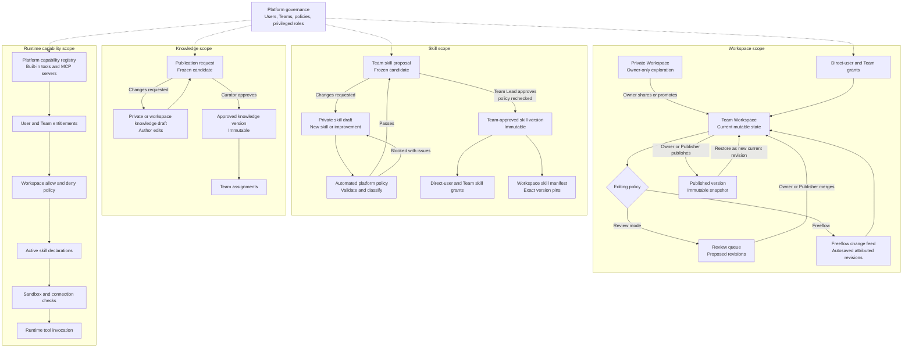
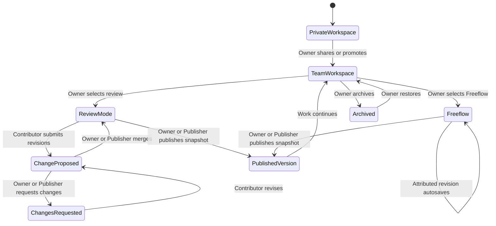
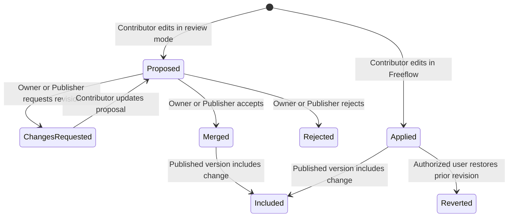
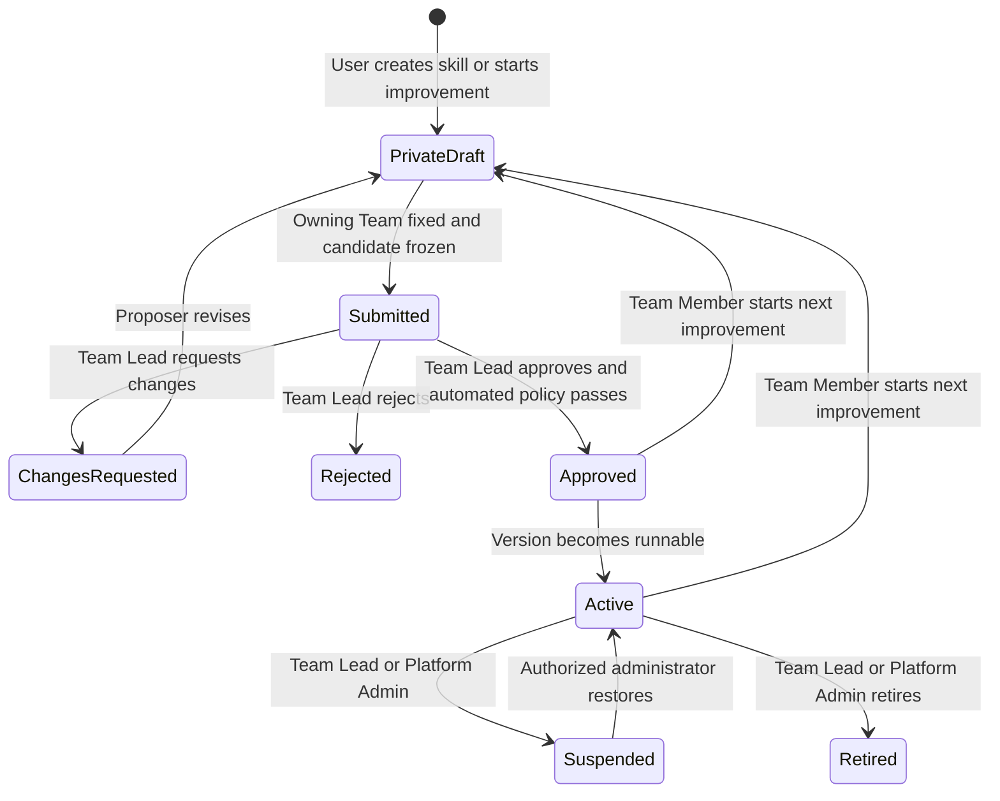
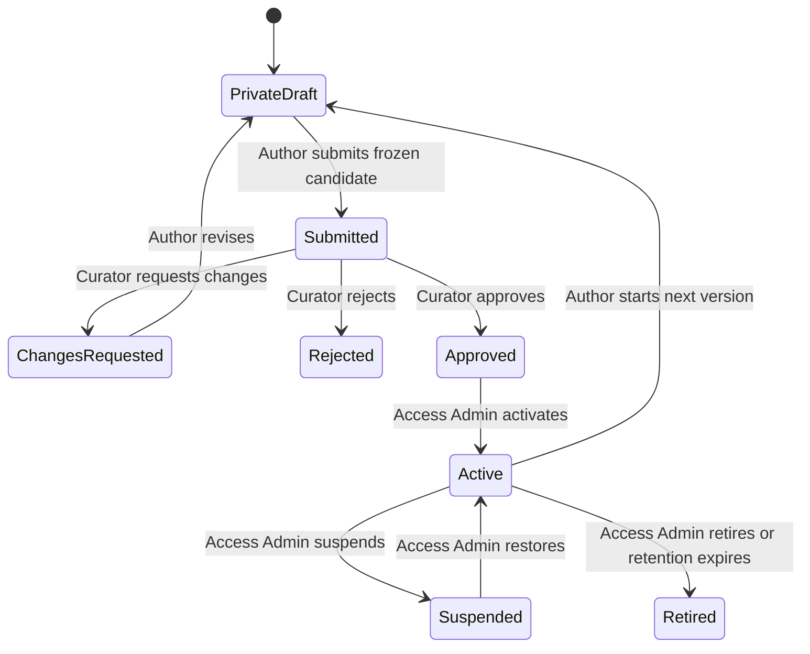
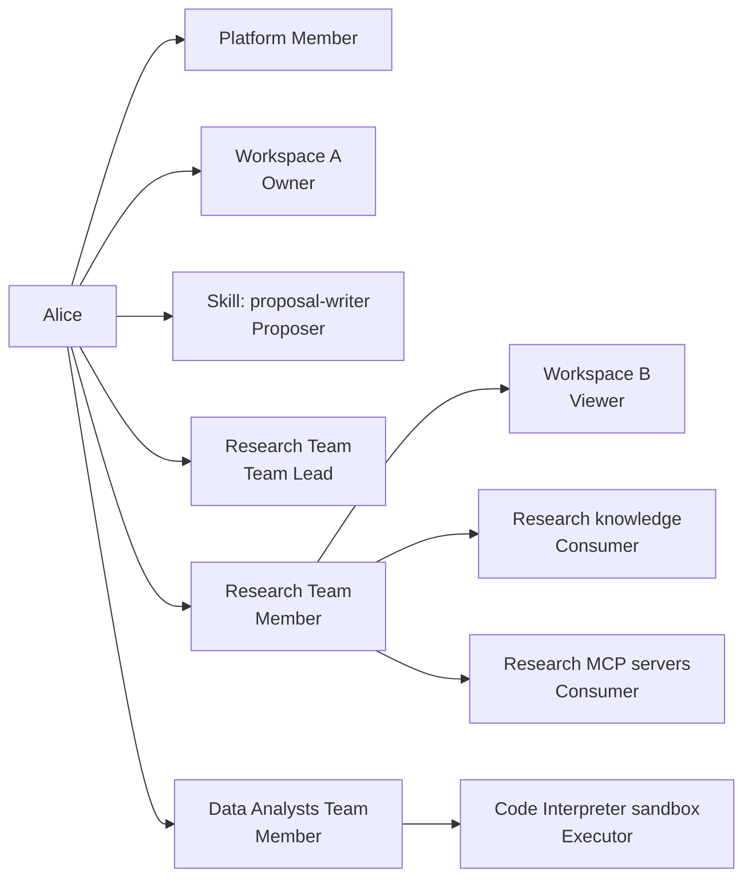

# Unified Governance and Role Model

Status: Approved for staged implementation

Last updated: 2026-07-31

Audience: Product, design, engineering, security, and platform administrators

Applies to: Platform administration, workspaces, skills, knowledge, users, and Teams

## 1. Summary

HelpUDoc needs one understandable governance model across six authorization scopes:

1. **Platform** — who can administer the HelpUDoc installation and its governance settings.
2. **Team** — which registered users share access and governance responsibilities.
3. **Workspace** — who can view, contribute to, publish, and manage a Team Workspace.
4. **Skill** — which Team governs a skill, who can create a new skill or propose an improvement, which exact version a workspace pins, and who may invoke it.
5. **Knowledge** — who can privately create knowledge, curate it for platform use, assign it, and consume it.
6. **Runtime capability** — who can configure or use built-in tools, MCP servers, delegated connections, and the Code Interpreter sandbox.

The governing rule is:

> A Team Workspace is the mutable collaboration surface. Every published workspace version is an immutable snapshot of that surface.

The gate depends on the artifact:

- A **Workspace Owner** chooses whether contributors use review mode or Freeflow editing.
- A **Workspace Owner or Publisher** creates immutable published workspace versions.
- A **Team Lead** reviews new-skill and skill-improvement proposals submitted to their Team and manages approved skill access for that Team.
- A **Platform Admin** defines automated skill admission policy and manages approved-skill access, suspension, ownership transfer, and emergency controls, but does not review or approve skill proposals.
- A **knowledge curator** governs platform knowledge.
- A **runtime capability administrator** governs the available tool, MCP-server, connection, and sandbox policies.
- A **platform administrator** governs users, teams, privileged role assignments, platform policy, and emergency controls.

A single person can hold different roles at the same time. Roles are evaluated within their own scope and resource. Being powerful in one scope does not automatically grant power in another.

For example, a person may simultaneously be:

- a normal Platform Member;
- a member of the Research Team;
- Owner of Workspace A;
- Viewer of Workspace B through a team grant;
- proposer of a new Research Team skill or an improvement to an existing skill;
- Team Lead for a different team; and
- Consumer of knowledge assigned to the Research Team.

## 2. Problem

HelpUDoc currently has several useful authorization mechanisms, but they are expressed differently:

- `users.isAdmin` provides broad system-administration authority.
- Teams grant access to skills, MCP servers, global knowledge, and Team Workspaces.
- Private workspaces are owner-only.
- Existing shared workspaces use inconsistent Owner, Editor, and Viewer semantics.
- Published workspace versions are stable, but the old model requires private copies, synchronization, and submission for every content change.
- Skill creation and editing are currently administrator functions operating directly on the shared skill registry.
- Global knowledge is currently administered centrally and assigned to legacy groups.

As Team Workspaces, direct sharing, user-created skills, skill-improvement proposals, and governed knowledge contribution are introduced, the product needs to answer clearly:

- Who may create privately?
- When should work remain in a Private Workspace, and when should it move into a Team Workspace?
- May contributors edit the Team Workspace directly, or must their changes be reviewed?
- Who may publish an immutable snapshot without waiting for the Workspace Owner?
- How are concurrent edits attributed, queued, reviewed, and recovered?
- How does a workspace pin one approved skill version without bypassing Team ownership, skill entitlement, or platform policy?
- What happens when a workspace is shared with multiple teams or a registered user outside those teams?
- Who may activate or suspend a published artifact?
- Who may assign it to users or teams?
- What happens when one user holds several roles?
- Which safety rules remain in force even for privileged users?

Without a unified model, role names can become misleading and broad roles can accidentally cross privacy or security boundaries.

## 3. Goals

- Give registered users freedom to create private workspaces, skills, and knowledge.
- Preserve private drafts as owner-only by default.
- Provide one clearly named Team Workspace for ongoing collaboration.
- Make Team Workspaces shareable with multiple teams and registered users outside those teams.
- Let Workspace Owners choose review mode or Freeflow editing without creating another workspace type.
- Preserve immutable published workspace, skill, and knowledge versions.
- Retain attribution and a complete change feed even when per-change approval is disabled.
- Allow named Publishers to publish without requiring the Workspace Owner to approve every release.
- Introduce governed submission, review, approval, activation, assignment, suspension, and rollback.
- Reuse Teams as the primary audience mechanism for skills, knowledge, runtime capabilities, and Team Workspaces, while allowing Platform Admin to assign an approved skill directly to an individual when needed.
- Require every workspace skill reference to pin an exact approved version.
- Keep workspace access and skill entitlement independent.
- Govern built-in tools, MCP servers, delegated credentials, and sandbox execution independently from skill assignment.
- Make a user's effective access explainable.
- Support users holding multiple roles without merging those roles into one global rank.
- Enforce separation of duties for executable or platform-wide artifacts.
- Maintain an audit trail for privileged and publication actions.

## 4. Non-goals for the First Release

- Anonymous or public sharing links.
- Sharing a live Private Workspace with collaborators; sharing converts or publishes it into a Team Workspace.
- Character-by-character collaborative editing; Freeflow initially means autosaved, attributed file-level revisions with conflict handling.
- Custom role builders or arbitrary permission sets.
- Explicit deny rules.
- Nested Teams.
- Approval workflows with more than one required approver.
- Per-document permissions inside one Team Workspace.
- Per-conversation sharing.
- Arbitrary unsandboxed shell or code execution.
- A skill automatically granting access to a tool, MCP server, credential, or sandbox.
- Recalling information that a user already viewed, downloaded, or copied.

## 5. Product Principles

### 5.1 Private by default

New workspaces, skill drafts, and knowledge drafts are visible only to their creator unless explicitly submitted or published.

### 5.2 Team work is mutable; published versions are immutable

Authorized users edit the current Team Workspace according to its editing policy. No actor edits a published version in place. Publishing creates a new immutable snapshot and leaves the Team Workspace open for subsequent work.

### 5.3 Creation authority and publication authority are separate

The ability to create a private artifact does not imply the ability to publish it for others.

### 5.4 Access and ownership are separate

Owning an artifact, governing its publication, and consuming it are separate capabilities.

### 5.5 Roles are scoped

A role applies only within its declared scope:

- platform-wide;
- a particular workspace;
- the skill catalog or a particular skill;
- the knowledge catalog or a particular knowledge source.

### 5.6 Teams distribute access, not ownership

Teams are the primary audience, entitlement, and skill-governance unit. Team membership may grant consumption or contribution access, but must not silently create Workspace Owner, Publisher, or platform-administration authority.

### 5.7 Privilege does not erase privacy

Platform Admin does not silently gain routine access to private workspaces, private skill drafts, or private knowledge drafts. Private content becomes visible to a reviewer only when its owner submits a frozen candidate for review.

### 5.8 Runtime authority cannot be granted by an artifact

A skill can guide the agent, but it cannot grant its user additional tools, MCP servers, credentials, data, filesystem access, or network access.

### 5.9 Connections prove identity; they do not grant authorization

A connected OAuth account or other MCP credential proves that the user can authenticate to an external service. The connection does not make the MCP server available unless platform, Team, workspace, and skill policy also permit it.

### 5.10 Code runs only inside an explicit execution envelope

Code Interpreter and skill scripts run only when the platform enables the sandbox, the user is entitled to execute code, the active skill declares the script or capability, and the workspace policy permits it. The sandbox enforces resource, filesystem, network, timeout, and output boundaries.

### 5.11 Collaboration happens in the Team Workspace

The Team Workspace contains files, conversations, annotations, discussions, tasks, and its attributed change feed. It is the only shared mutable workspace layer.

Published versions remain immutable snapshots. Discussions and annotations may reference a published version, but content changes occur in the Team Workspace under review mode or Freeflow—not in a second “shared workspace” or mandatory private working copy.

### 5.12 Editing policy and publication authority are independent

Review mode versus Freeflow controls how contributor changes enter the current Team Workspace. Owner versus Publisher controls who may create a published version. Enabling Freeflow does not let Contributors publish, and requiring review does not prevent a Publisher from publishing merged work.

### 5.13 Workspace access does not merge skill catalogs

Sharing a workspace with a Team or a registered user grants only the assigned workspace role. It does not grant skills from another Team. The workspace pins exact approved skill versions, and each invocation separately verifies that the current user is entitled through one of their Teams.

## 6. Governance Map



## 7. Role Model

### 7.1 Role categories

HelpUDoc uses four kinds of role:

| Kind | Purpose | Typical assignment |
|---|---|---|
| Baseline role | Capabilities every active registered user receives | Implicit |
| Ownership role | Accountability for a specific private or published resource | Created with or transferred with the resource |
| Governance role | Review, approval, activation, rollback, access administration | Direct grant by an authorized administrator |
| Audience role | View, use, or contribute to an artifact | Direct grant or Team membership |

### 7.2 Platform roles

| Role | Scope | Capabilities |
|---|---|---|
| Platform Member | Platform | Sign in; create permitted private artifacts; use resources granted directly or through Teams |
| Platform Admin | Platform | Manage users, Teams, platform policy, privileged domain roles, global audit, catalog emergency controls, and break-glass requests |
| Platform Auditor | Platform | Read governance configuration, review history, access explanations, and audit events without changing state |

`Platform Auditor` may be deferred from the MVP, but the permission boundary should be preserved so audit access does not require full administration authority.

#### Platform Admin privacy boundary

Platform Admin may:

- see resource metadata needed for administration;
- manage published catalogs and assignments;
- assign Team Leads and curators;
- suspend a published skill or knowledge source;
- inspect approved skill-version metadata and validation summaries without joining the skill proposal queue; and
- initiate an audited break-glass process when required.

Platform Admin does not automatically:

- open a user's private workspace;
- inspect an unsubmitted private skill draft;
- inspect an unsubmitted private knowledge draft;
- edit a private artifact; or
- impersonate a resource owner.

### 7.3 Team roles

| Role | Scope | Capabilities |
|---|---|---|
| Team Member | One Team | Receive Team-based workspace, skill, knowledge, tool, MCP, and sandbox grants; submit new-skill proposals to the Team and propose improvements to Team-owned skills |
| Team Lead | One Team | Govern Team membership when delegated; review Team skill proposals; approve immutable Team skill versions; manage Team skill assignments within platform policy |

Rules:

- `Team` is the user-facing name for the existing reusable user-group concept.
- A Team may be granted workspace, skill, knowledge, and runtime access.
- Team Lead authority applies only to the Team and its Team-owned skills.
- Team Lead does not imply Workspace Owner, Workspace Publisher, or Platform Admin.
- The owning Team Lead is the only human approver in a skill proposal lifecycle.
- Platform Admin configures automated admission policy and administers approved skills, but cannot approve, reject, request changes, or otherwise decide a skill proposal.

### 7.4 Workspace roles

| Role | View and chat | Notes, discussions, and tasks | Propose revisions in review mode | Edit current Team Workspace in Freeflow | Publish immutable version | Manage access and policy |
|---|---:|---:|---:|---:|---:|---:|
| Workspace Viewer | Yes | Private notes only | No | No | No | No |
| Workspace Commenter | Yes | Yes | No | No | No | No |
| Workspace Contributor | Yes | Yes | Yes | Yes | No | No |
| Workspace Publisher | Yes | Yes | Yes | Yes | Yes | No |
| Workspace Owner | Yes | Yes | Yes | Yes | Yes | Yes |

Rules:

- A Private Workspace has exactly one owner and no collaborators.
- Sharing or promoting a Private Workspace creates a Team Workspace; the Private Workspace is not turned into a hidden synchronization branch.
- A Team Workspace is the single mutable collaboration surface.
- A Team Workspace can be shared with multiple Teams and with individual registered users from any Team.
- Workspace access does not change a person's Team affiliations and does not merge the skill catalogs available through those affiliations.
- A published version is an immutable snapshot of the Team Workspace and is read-only for every role, including Workspace Owner.
- Every published workspace has a shared **Team Chat** and a separate per-user **Private with Lumo** mode.
- Workspace Viewers may read Team Chat. Workspace Commenters and higher roles may post, reply, tag existing members, and invoke Lumo by explicitly mentioning `@Lumo`.
- Untagged Team Chat messages are human-only; Lumo does not monitor or answer them.
- A Team Chat `@Lumo` response is visible to the workspace audience, identifies its source published version, and cannot mutate published content.
- Private with Lumo remains visible only to the invoking user. It may read the published version and authorized knowledge, but it cannot mutate the published content.
- Publishing does not close, fork, or reset the Team Workspace. Subsequent edits accumulate toward the next version.
- The owner can transfer ownership, but the system must always retain one active accountable owner.
- Team grants may provide Viewer, Commenter, or Contributor access.
- Publisher and Owner are privileged roles assigned directly to named registered users in the first release.
- A mention or task assignment may target only a registered principal that already has workspace access. A mention never grants access.

#### Team Workspace editing policy

Every Team Workspace has exactly one editing policy:

| Policy | Contributor behaviour | Authoritative state |
|---|---|---|
| Review mode | Contributor revisions enter a proposal queue. An Owner or Publisher reviews and merges them. | The current Team Workspace changes only when a proposal is merged. |
| Freeflow | Contributor revisions autosave directly with actor, timestamp, source, and skill-version attribution. | The current Team Workspace changes immediately; published versions remain unchanged. |

The Owner may toggle the policy. The transition is audited and must not discard pending proposals or unreviewed Freeflow revisions.

Recommended default:

- new or sensitive Team Workspace: Review mode;
- established team with trusted Contributors: Freeflow;
- externally shared or regulated Team Workspace: Review mode unless the Owner explicitly accepts Freeflow.

Freeflow requirements:

- an append-only change feed;
- per-file revision history and deterministic restore;
- optimistic concurrency checks and explicit conflict states;
- attribution for manual edits, agent edits, uploads, and automated changes;
- the exact active skill version on any skill-assisted change;
- Owner and Publisher ability to inspect all changes since the last published version; and
- no implication that a Contributor may publish.

#### Workspace publication

- Workspace Owner and Workspace Publisher may publish the current Team Workspace as the next immutable version.
- Publisher exists so routine publication does not require the Owner to approve every release.
- The publication screen shows all changes since the previous published version, unresolved conflicts, validation results, and the exact workspace skill manifest.
- Publication is atomic. A failure leaves both the current Team Workspace and the previous published version unchanged.
- Restoring an older version creates a new current revision or a new published version; it never mutates historical snapshots.

#### Workspace collaboration objects

Notes, annotations, discussions, tasks, mentions, and change proposals are records within the Team Workspace. When anchored to a published version, they retain the origin version and content fingerprint so the UI can show whether the anchor still matches.

Detailed authorization traces are not permanent workspace content. The workspace shows a compact skill-availability state and a clear remediation message. Full policy checks appear only in an optional authorization-details view or an administrator access inspector.

#### Published workspace Team Chat

Team Chat is the default right-hand collaboration surface for a published workspace.

- A workspace has one shared default channel in the first release: `#team-chat`.
- Messages may be roots or threaded replies.
- Structured mentions store registered user identifiers; displayed `@name` text is not itself an authorization grant.
- Only users who already have workspace access may be mentioned.
- An explicit structured `@Lumo` mention invokes one read-only response. Retrying the same source message does not create duplicate Lumo replies.
- Lumo receives recent shared-channel context and published workspace context, but not private conversations, private notes, personal OAuth credentials, or private MCP connections.
- Shared-channel Lumo runs set `published_read_only`, `canWriteWorkspace = false`, disable delegated MCP credentials, deny configured MCP servers, and do not grant Code Interpreter or skill-sandbox execution.
- Lumo may inspect published files and approved knowledge with read-only built-in retrieval. It may suggest changes in prose but may not create, edit, resolve, assign, or publish collaboration or content records.
- A human member must explicitly convert a message or Lumo response into a private note, shared note, task, annotation, or change proposal.
- Derived collaboration objects retain the source Team Chat message identifier and origin published-version identifier.
- Viewer access is read-only in Team Chat. Commenter is the minimum role for posting, replying, mentioning users, or invoking Lumo. Contributor remains the minimum role for creating change proposals.

The UI presents Team Chat and Private with Lumo as an exclusive Astryx ToggleButtonGroup. Human conversion actions use an Astryx ButtonGroup, and Lumo read-only context activity is presented with Astryx ChatToolCalls.

### 7.5 Skill roles

| Role | Scope | Capabilities |
|---|---|---|
| Skill Proposer | One private proposal | Create and test a new private skill or an improvement to a Team-owned skill; submit a frozen candidate; respond to Team Lead feedback |
| Team Lead | Skills owned by one Team | Review submitted candidates; approve, reject, or request changes; publish an immutable Team skill version within platform policy |
| Skill Consumer | Skills granted directly or through an affiliated Team | Discover and invoke an approved version within the consumer's workspace and runtime permissions |

Rules:

- Every submitted or governed skill has exactly one owning Team.
- Any Platform Member may create a new private skill draft when platform policy permits.
- Any Team Member may propose an improvement to a skill owned by that Team unless Team policy restricts proposal creation.
- A new private draft may remain unassigned while the proposer is editing. Before submission, the proposer must select one owning Team from their active Team memberships. If only one Team is eligible, the interface may preselect it.
- A user with no eligible Team may continue editing privately but cannot submit; the interface must explain that Team membership is required.
- Submitting a new-skill proposal locks the owning Team for that candidate. Changing ownership after submission is a separate, authorized, audited transfer; it is not an edit to the candidate.
- An improvement proposal inherits the existing skill's owning Team and cannot select a different Team.
- The proposer owns the private proposal draft, not the Team skill identity.
- A Team Lead sees the submitted immutable candidate, not the proposer's ongoing private draft.
- A proposer cannot approve their own candidate by default, including when they are also a Team Lead.
- An approved skill version is immutable. A later improvement creates a new candidate and semantic version.
- Automated platform validation applies before submission and is rechecked before Team Lead approval can activate a version.
- A candidate outside platform policy is blocked with validation errors. It is not routed to a Platform Admin approval queue.
- Platform Admin changes policy independently of any proposal and cannot waive policy by approving an individual candidate.
- A workspace skill manifest may reference only approved active versions and must pin an exact version, not `latest`.
- Publishing a workspace copies the exact skill manifest into the published workspace version.
- A Private Workspace may use a private skill proposal for testing, but a Team Workspace or published workspace cannot inherit or invoke that private proposal.
- Sharing a workspace with another Team does not grant the owning Team's skill. Each user must receive the skill through a Team affiliation or a direct Platform Admin grant.
- Skill assignment does not grant any underlying tool, MCP server, credential, knowledge, or workspace access.

### 7.6 Knowledge roles

HelpUDoc distinguishes two knowledge scopes:

1. **Workspace knowledge** belongs to a private workspace and follows that private workspace's ownership and publication lifecycle.
2. **Platform knowledge** is an approved catalog source that can be assigned to Teams and used across authorized workspaces.

| Role | Scope | Capabilities |
|---|---|---|
| Knowledge Author | One knowledge source | Create and edit a private or workspace source, maintain provenance, submit a candidate |
| Knowledge Curator | Knowledge catalog or selected collection | Review content, provenance, classification, quality, freshness, and approve, reject, or request changes |
| Knowledge Access Admin | Knowledge catalog | Activate, suspend, retire, restore, and assign approved knowledge to Teams |
| Knowledge Consumer | Assigned sources | Search and use approved assigned knowledge in authorized workspaces |

Rules:

- Workspace knowledge is accessible only inside its authorized workspace context.
- Publishing a workspace copies only allowlisted knowledge artifacts into that published version.
- Platform knowledge requires curator approval before Team assignment.
- An approved platform knowledge version cannot be edited in place.
- The source author creates a new candidate to update published knowledge.
- A Knowledge Consumer receives query/use access, not edit authority.
- Source classification, provenance, retention, and expiry policies constrain all roles.

For the MVP, Platform Admin performs skill catalog administration, Knowledge Curator, and Knowledge Access Admin duties. Team Leads are the sole human approvers for their Team-owned skills.

### 7.7 Runtime capability roles

| Role | Scope | Capabilities |
|---|---|---|
| Runtime Capability Admin | Platform capability registry | Register, enable, disable, classify, and configure built-in tools, MCP servers, connection types, and sandbox policy |
| Tool Consumer | Assigned built-in tools | Invoke an enabled tool when all user, workspace, skill, and runtime checks pass |
| MCP Consumer | Assigned MCP servers | Discover and invoke an enabled MCP server when entitlement, workspace policy, skill declaration, and authentication all pass |
| MCP Connection Owner | One user's connection | Create, refresh, inspect, and revoke their own delegated credential without granting it to other users |
| Sandbox Executor | Code Interpreter or declared skill scripts | Submit permitted code or a declared script to the sandbox and read only authorized outputs |

Rules:

- Runtime roles do not make a published artifact editable.
- Skill Consumer and Tool or MCP Consumer are separate roles.
- Assigning a skill does not automatically assign its required tools or MCP servers.
- Assigning an MCP server does not create or share a user's OAuth connection.
- A personal connection cannot be used by another user.
- Sandbox Executor is an entitlement to request execution, not permission to bypass the sandbox.
- Platform Admin or Runtime Capability Admin may disable a capability globally without editing every skill or Team grant.
- High-risk tools may additionally require per-action human approval.

## 8. Role Assignment Authority

| Role being assigned | Who may assign it | Assignment constraints |
|---|---|---|
| Platform Member | Provisioning or sign-in flow | User must be active and registered |
| Platform Admin | Another Platform Admin | Cannot remove or demote the final active Platform Admin |
| Platform Auditor | Platform Admin | Read-only |
| Team Member | Platform Admin, provisioning, or delegated Team Lead | Active registered user |
| Team Lead | Platform Admin | Direct named-user assignment; scope is one Team |
| Workspace Owner | Creation flow or current Workspace Owner through transfer | Must be a direct registered user; cannot be Team-derived |
| Workspace Publisher | Workspace Owner | Direct named-user assignment recommended |
| Workspace Contributor | Workspace Owner | Direct or Team grant |
| Workspace Viewer | Workspace Owner | Direct or Team grant |
| Skill Proposer | New-skill or skill-improvement creation flow | Private draft; owning Team is selected or inherited before submission |
| Skill Consumer | Team Lead for their own Team; Platform Admin for any Team or direct user | Stable skill identities with at least one approved active version |
| Knowledge Author | Knowledge creation flow | Bound to the created source |
| Knowledge Curator | Platform Admin | Must not approve own submitted candidate by default |
| Knowledge Access Admin | Platform Admin | Privileged direct assignment |
| Knowledge Consumer | Knowledge Access Admin through Team assignment | Approved active sources only |
| Runtime Capability Admin | Platform Admin | Privileged direct assignment |
| Tool Consumer | Runtime Capability Admin through Team assignment or platform default | Enabled tools only |
| MCP Consumer | Runtime Capability Admin through Team assignment | Enabled registered servers only |
| MCP Connection Owner | Connection authorization flow | Personal credential only |
| Sandbox Executor | Runtime Capability Admin through Team assignment or approved platform policy | Sandbox must be healthy and enabled |

## 9. Artifact Lifecycles

### 9.1 Workspace lifecycle



Each publication creates an immutable version containing:

- version identifier and sequence number;
- publisher or approving user;
- source Team Workspace identifier and revision boundary;
- publication note;
- content manifest;
- exact approved workspace skill manifest;
- included change identifiers since the previous publication;
- creation timestamp; and
- validation results.

The Team Workspace retains:

- the current editable content state;
- editing-policy history;
- pending review proposals, if any;
- an append-only attributed change feed;
- per-file revision and conflict history;
- notes, discussions, tasks, and annotations; and
- links to every published version.

#### 9.1.1 Team Workspace change lifecycle



Every proposed or applied content change contains:

- stable change identifier and workspace identifier;
- actor, timestamp, source, and editing policy;
- base revision and resulting revision;
- affected file or artifact identifiers;
- change type: manual edit, agent edit, upload, automation, merge, restore, or policy transition;
- optional originating discussion or task;
- exact skill version for skill-assisted work;
- validation and conflict status; and
- optional published-version identifier that first included the change.

#### 9.1.2 Version-anchored collaboration objects

An annotation or discussion may be anchored to an immutable published version while remaining a Team Workspace record.

Version behaviour:

- An annotation always retains the version and content selection where it originated.
- When a new version is published, HelpUDoc attempts deterministic re-anchoring using the stored content fingerprint.
- Successfully matched open objects may be shown on the new version with their origin version visible.
- Ambiguous, changed, or deleted anchors are marked `Anchor changed` and require manual re-anchoring or closure.
- Resolved objects remain available in history and are not silently copied into the active discussion view.
- Workspace-level sticky notes and tasks are not text-anchored, but still record their origin version.

### 9.2 Skill lifecycle



Status meanings:

| Status | Meaning |
|---|---|
| Private Draft | Proposer-only editable files for a new skill or an improvement; a new skill may not yet have an owning Team |
| Submitted | Frozen candidate in the owning Team's review queue; owning Team is locked |
| Changes Requested | Review completed with required changes |
| Rejected | Candidate will not proceed |
| Approved | Immutable version approved by the owning Team Lead and permitted by automated platform policy |
| Active | Approved version is runnable. Multiple immutable versions may remain active; the skill's default-version pointer identifies the recommended version for new pins. |
| Suspended | Invocation blocked immediately; history and assignments retained |
| Retired | No longer available for new use; history retained |

### 9.3 Knowledge lifecycle



Knowledge approval must record:

- source and provenance;
- owner or responsible steward;
- data classification;
- permitted audience;
- ingestion and extraction status;
- freshness or review date;
- retention policy where applicable; and
- curator decision and notes.

## 10. User Journeys by Role

### 10.1 Platform Member

1. The user signs in and becomes an active Platform Member.
2. HelpUDoc resolves the user's direct roles and Team memberships.
3. The user sees only Private Workspaces they own and Team Workspaces, published versions, active skills, and active knowledge authorized for them.
4. The user may create Private Workspaces, private skill-improvement proposals, and knowledge drafts if platform policy permits.
5. The user may submit artifacts for review but cannot approve or broadly assign them without another role.
6. The interface can explain why each shared resource is available, such as `Direct access` or `via Research Team`.

### 10.2 Platform Admin

1. The admin opens the governance area.
2. The admin manages users, Teams, platform policies, Team Leads, curators, and other privileged administrators.
3. The admin monitors skill and knowledge governance and published-catalog health.
4. The admin may suspend unsafe published artifacts immediately.
5. The admin reviews audit events and access explanations.
6. If private content must be inspected, the admin initiates a reasoned, time-bounded, audited break-glass request.
7. The admin cannot silently modify a user's private draft.

### 10.3 Platform Auditor

1. The auditor opens a read-only governance view.
2. The auditor examines role assignments, review decisions, publication history, access changes, and break-glass events.
3. The auditor exports or records findings without being able to approve, assign, suspend, or edit.

### 10.4 Workspace Owner

1. The user creates a private workspace and is its private owner.
2. When collaboration is needed, the user promotes it into a Team Workspace.
3. The user grants Viewer or Contributor access to one or more Teams or registered users.
4. The user assigns Publisher only to trusted named users.
5. The user chooses Review mode or Freeflow and may change the policy later without creating another workspace layer.
6. The user selects exact approved skill versions for the workspace skill manifest.
7. The user reviews proposals in Review mode or monitors the attributed change feed in Freeflow.
8. The user publishes the current Team Workspace as an immutable version.
9. The user may restore a prior version as a new revision, archive the Team Workspace, or transfer accountable ownership.

### 10.5 Workspace Publisher

1. The user receives direct Publisher access.
2. The user works in the current Team Workspace.
3. In Review mode, the user reviews and merges Contributor proposals.
4. In Freeflow, the user reviews the changes since the last published version and resolves conflicts or reverts changes where authorized.
5. The user verifies validation results and the exact pinned skill manifest.
6. The user publishes the next immutable version without waiting for the Workspace Owner.
7. The user may moderate collaboration objects but cannot manage access, change the editing policy, transfer ownership, or archive the workspace.

### 10.6 Workspace Contributor

1. The user receives Contributor access directly or through a Team.
2. The user opens the current Team Workspace and participates in chat, annotations, discussions, and tasks.
3. In Review mode, revisions remain proposed until an Owner or Publisher merges them.
4. The user responds to requested changes in the same proposal flow.
5. In Freeflow, revisions autosave directly and appear in the change feed with complete attribution.
6. Agent-assisted changes record the exact skill version used.
7. The user may inspect their own revisions and recover from detected conflicts.
8. The user cannot publish, change the editing policy, or grant access.

### 10.7 Workspace Viewer

1. The user receives Viewer access directly or through a Team.
2. The user browses the current Team Workspace or a selected immutable published version.
3. The user may use the chat agent against authorized workspace content and knowledge.
4. The user may create private notes that remain visible only to them.
5. If workspace policy permits, the user copies selected content into a separate Private Workspace for personal exploration.
6. The user cannot create shared collaboration objects, edit, submit a proposal, or publish unless upgraded.
7. Revocation blocks future source access but cannot recall material the user already copied or downloaded.

### 10.8 Skill Proposer

1. The user opens `My Skills` and chooses `Create skill`, or chooses `Improve` on an approved skill owned by one of their Teams.
2. HelpUDoc creates a private draft from scratch or from the selected approved version.
3. The proposer edits instructions and permitted supporting files.
4. The proposer tests privately within a governed sandbox and their existing entitlements.
5. For a new skill, the proposer selects one owning Team from their active memberships before submission. An improvement inherits its existing owning Team.
6. The proposer sees validation errors, declared capabilities, test results, and the proposed semantic version.
7. The proposer submits a frozen immutable candidate to the owning Team's review queue. The owning Team is locked at this point.
8. The proposer responds to requested changes in their private draft and resubmits, or sees approval and activation status.
9. The private draft never becomes available to a Team Workspace or runtime catalog until a submitted version is approved and active.

### 10.9 Team Lead skill review

1. The Team Lead opens their Team's skill-review queue.
2. The Team Lead sees the frozen candidate, proposer, version diff, validation results, test evidence, scripts, dependencies, and requested capabilities.
3. The Team Lead verifies that the skill does not attempt to bypass runtime authorization.
4. The Team Lead approves, rejects, or requests changes with notes.
5. Approval creates and activates a new immutable version when automated platform checks pass.
6. The Team Lead cannot silently edit the proposer's draft or self-approve their own proposal by default.

### 10.10 Platform Admin skill administration

1. The admin defines automated validation, risk classification, runtime-declaration, and sharing policy.
2. The admin does not receive, review, approve, reject, or request changes on skill proposals.
3. The admin monitors approved versions, assignments, usage, and incident reports across Teams.
4. The admin may suspend an unsafe approved version immediately, restore it, retire it, roll back the default pointer, or transfer skill ownership.
5. The admin may grant or revoke approved active skill access for any Team or individual registered user and inspect effective assignments.
6. Access assignment does not approve a candidate, activate an unapproved version, or grant any declared tool, MCP server, knowledge source, credential, or sandbox entitlement.
7. Team Lead approval, activation, access assignment, and suspension remain separate audit events.

### 10.11 Skill Consumer

1. The user may receive skill access through one or more Teams or a direct Platform Admin grant.
2. Active skills from the union of those grants appear in discovery.
3. A Team Workspace pins an exact approved version in its skill manifest.
4. The user invokes the pinned skill.
5. Runtime authorization verifies workspace access, exact-version status, the user's direct-or-Team skill entitlement, declared dependencies, tools, MCP servers, knowledge, connections, sandbox policy, and platform policy.
6. The user cannot invoke a suspended, retired, unapproved, unassigned, or differently versioned skill.
7. If blocked, the workspace shows a concise reason and request-access action; the full authorization trace remains optional diagnostic detail.

### 10.12 Knowledge Author

1. The user creates knowledge inside a private workspace or a private platform-knowledge draft.
2. The author supplies content, provenance, classification, ownership, and freshness information.
3. The author tests ingestion or extraction privately.
4. The author submits an immutable candidate for platform publication.
5. The author responds to curator feedback.
6. The author creates a new draft version when published knowledge needs updating.

### 10.13 Knowledge Curator

1. The curator opens the knowledge review queue.
2. The curator inspects provenance, licensing, classification, sensitive information, extraction quality, freshness, and intended audience.
3. The curator approves, rejects, or requests changes.
4. The curator does not edit the author's private draft in place.
5. The curator cannot self-approve by default when they are also the author.

### 10.14 Knowledge Access Admin

1. The access admin activates an approved knowledge version.
2. The admin assigns the knowledge source to Teams.
3. The admin sets review or expiry dates where required.
4. The admin may suspend, restore, retire, or roll back the source.
5. The admin can explain which users currently receive access through which Teams.

### 10.15 Knowledge Consumer

1. The user receives knowledge access through one or more Teams.
2. The knowledge appears in search or agent retrieval only in an authorized workspace context.
3. The user may consume the source but cannot alter it.
4. Removing the user from every granting Team blocks future retrieval.

### 10.16 Runtime Capability Admin

1. The administrator opens the runtime-capability registry.
2. The administrator enables or disables built-in tools and registers approved MCP servers.
3. The administrator classifies capabilities by risk and defines whether human approval is required.
4. The administrator assigns Tool Consumer, MCP Consumer, and Sandbox Executor entitlements to Teams.
5. The administrator configures sandbox limits, allowed execution images, network policy, timeouts, and output retention.
6. The administrator monitors failures, revokes unsafe capabilities, and reviews audit events.

### 10.17 Tool Consumer

1. A built-in tool is assigned to one of the user's Teams or enabled by platform default.
2. The user starts work in an authorized workspace.
3. The active skill declares the tool when a skill is active.
4. Workspace and platform policy permit the requested action.
5. HelpUDoc executes the tool or presents a required human-approval gate.
6. The user cannot use a disabled, undeclared, or unassigned restricted tool.

### 10.18 MCP Consumer and Connection Owner

1. The user receives MCP Consumer access through a Team.
2. If the server requires delegated authentication, the user connects their own external account.
3. HelpUDoc stores the credential as a personal connection and never shares it with the Team.
4. The user invokes an approved skill or workflow.
5. The runtime verifies server entitlement, workspace policy, skill declaration, connection validity, and server availability.
6. The user may revoke their connection at any time without changing Team entitlement.
7. Entitlement without a valid connection produces `Connection required`; a connection without entitlement remains unavailable.

### 10.19 Sandbox Executor

1. The user invokes Code Interpreter or a skill that declares a sandbox script.
2. HelpUDoc verifies the user's Sandbox Executor entitlement and the active skill version.
3. Only declared scripts and explicitly selected workspace inputs are staged.
4. Execution runs with configured CPU, memory, storage, timeout, filesystem, identity, and network restrictions.
5. The workspace is mounted read-only; only the current run's output area is writable.
6. Only current-run outputs approved for handoff become visible to the user or agent.
7. The run is terminated and audited when a limit or policy is violated.

## 11. Multiple Roles for One User

### 11.1 Roles do not collapse into a global rank

HelpUDoc must not calculate a single role such as `highestRole = Admin`. Instead, it resolves capabilities for the requested action and resource.

Example:

| Scope or resource | Alice's role | Result |
|---|---|---|
| Platform | Platform Member | No general administration |
| Workspace A | Workspace Owner | Manages access and versions for Workspace A |
| Workspace B | Workspace Viewer via Research Team | Views Workspace B only |
| Skill `proposal-writer` | Skill Proposer | Edits a private improvement proposal and submits it to the owning Team |
| Research Team | Team Lead | Reviews Team-owned skill proposals except her own |
| Knowledge catalog | Knowledge Consumer via Research Team | Uses assigned Research knowledge |
| Runtime | MCP Consumer via Research Team | May use assigned MCP servers with Alice's own valid connection |
| Runtime | Sandbox Executor via Data Analysts Team | May request governed code execution |

Alice's Workspace Owner role does not let her approve skills. Her Team Lead role does not let her manage Workspace B. Her Team-based knowledge access does not let her curate knowledge.



Each edge is an independent role binding or Team-derived grant. It contributes only the capabilities defined for that scope.

### 11.2 Effective authorization

For every protected operation, HelpUDoc computes:

```text
candidate capabilities =
    ownership capabilities
    UNION direct role grants
    UNION Team-derived audience grants
    UNION permitted platform override

effective capabilities =
    candidate capabilities
    INTERSECT artifact-state rules
    INTERSECT platform safety policy
    INTERSECT runtime entitlements
```

Examples:

- Workspace Publisher plus Workspace Viewer yields Publisher capabilities for that workspace.
- Skill Consumer through two Teams still produces one effective consume grant.
- Team Lead cannot edit an approved skill version because artifact-state rules make it immutable.
- A skill requesting an MCP server remains unable to use it if the invoking user is not entitled to that server.
- A user with an OAuth connection remains unable to use its MCP server without an MCP Consumer entitlement.
- A Sandbox Executor remains unable to run an undeclared skill script or escape sandbox policy.
- Platform Admin cannot routinely open a private workspace because the private-workspace policy excludes silent platform override.

### 11.3 Grant union

The first release uses allow-only grants:

- direct and Team grants are combined;
- duplicate grants are deduplicated;
- the strongest applicable resource role determines candidate capabilities;
- no explicit deny grant exists;
- platform and artifact policies may still prohibit an action.

Removing a direct grant does not remove access that remains available through a Team. The UI must state this before removal:

> Removing direct access will not remove Alice's Viewer access through the Research Team.

### 11.4 Privileged-role composition

When one person is both a skill proposer and a Team Lead:

- they may create and submit;
- they may review other Team Members' submissions;
- they may not approve their own candidate by default.

When one person is both Team Lead and Platform Admin:

- they approve a Team candidate only through their Team Lead role;
- Platform Admin authority adds no second approval or candidate override; and
- any later catalog-control or access-assignment action is separate and explicitly audited.

When one person is both Platform Admin and Workspace Owner:

- normal Workspace Owner actions use the workspace role;
- platform-admin authority does not need to be invoked;
- any administrative override is explicit and separately audited.

### 11.5 Separation of duties

| Action | Default separation rule |
|---|---|
| Publish current Team Workspace | Allowed for Workspace Owner and Publisher |
| Contributor publish directly | Not allowed |
| Approve own skill proposal | Not allowed |
| Approve own platform knowledge | Not allowed |
| Assign approved skill access | Team Lead for their own Team; Platform Admin for any Team or individual |
| Assign approved knowledge to Teams | Knowledge Access Admin within policy |
| Inspect unsubmitted private artifact | Not allowed |
| Break-glass private access | Reason, time limit, and audit required |

For a single-lead Team, an explicit deployment setting may permit skill self-approval. Knowledge self-approval is controlled separately for single-curator installations. When either exception is enabled:

- the UI shows a warning;
- the event is marked `selfApproved`;
- all validation checks remain mandatory; and
- the action is highlighted in the audit log.

## 12. Team Governance

Teams are reusable collections of registered users and replace `Group` in the user-facing model. Existing group records may remain an implementation detail during migration.

Teams may grant:

- Workspace Viewer;
- Workspace Contributor;
- Skill Consumer;
- Knowledge Consumer;
- Tool Consumer;
- MCP Consumer; and
- Sandbox Executor.

Teams must not grant in the first release:

- Platform Admin;
- Workspace Owner;
- Workspace Publisher;
- Team Lead;
- Skill Proposer;
- Knowledge Author;
- Knowledge Curator;
- Knowledge Access Admin; or
- Runtime Capability Admin.

These privileged or accountable roles are direct assignments to named users.

Effective Team access is the union of all active Team memberships.

Removing a user from a Team:

- immediately removes future access derived only from that Team;
- does not remove access available through another Team or direct grant;
- does not delete the user's Private Workspaces or private proposal drafts;
- does not remove Team Workspace edits already incorporated into revision history;
- blocks future publication if the removed grant was the user's only publication authority; and
- is recorded in the audit log.

Workspace and skill boundaries remain independent:

- granting a Team Workspace to Team B does not assign Team A's skills to Team B;
- a workspace skill pin expresses the version the workspace expects, not the user's entitlement;
- a Team B member may invoke that version only if Team B receives an approved cross-Team assignment or the member receives a direct skill grant; and
- users receive the union of active direct-user and Team skill grants, subject to workspace and platform policy.

Skill access administration follows these boundaries:

- a Team Lead may grant or revoke approved active skills for their own Team within platform policy;
- a Platform Admin may grant or revoke approved active skills for any Team or individual registered user, manage assignment policy, and inspect effective assignments;
- assigning access never substitutes for Team Lead approval of a new skill version;
- approving a skill never assigns it automatically to a Team; and
- no administrator may assign an unsubmitted private draft or an unapproved candidate.

## 13. Review Requirements

### 13.1 Workspace publication

Before creating a published workspace version, HelpUDoc must:

- verify the publisher or approver at request time;
- verify that the actor is the Workspace Owner or a named Workspace Publisher;
- identify the Team Workspace revision boundary;
- show all proposed, merged, applied, reverted, and conflicted changes since the previous publication;
- block publication on unresolved conflicts or failed mandatory validation;
- freeze a complete version manifest;
- freeze the exact approved workspace skill manifest;
- exclude conversations, agent activity, schedules, credentials, connections, and personal settings;
- validate that referenced content is included and readable;
- detect a newer Team Workspace revision before the atomic commit; and
- publish atomically.

### 13.2 Skill review

A skill review request must provide:

- proposal type: new skill or improvement;
- skill name, description, owning Team, proposer, and intended Team audience;
- source skill and previous approved version when the proposal is an improvement;
- immutable version and file manifest;
- diff from the previous approved version, if any;
- declared tools, MCP servers, scripts, dependencies, network needs, and storage needs;
- automated structural validation;
- static safety scan results;
- sandbox test results;
- known limitations; and
- proposer publication note.

The owning Team Lead is the only human reviewer. Automated platform policy must pass before submission and is rechecked before activation. A policy failure blocks the candidate with actionable validation errors; it does not create a Platform Admin review step. Approval must not grant the skill's consumers any declared dependency automatically.

For a new skill, approval creates the governed skill identity and its first immutable version. For an improvement, approval creates a new immutable version under the existing skill identity. Approval and direct or Team access assignment are separate actions.

### 13.3 Knowledge review

A platform-knowledge publication request must provide:

- title, type, description, tags, and source;
- creator and accountable owner;
- provenance and licensing information;
- classification and sensitive-data assessment;
- ingestion or extraction status;
- intended Team audience;
- freshness or next-review date; and
- diff from the previous approved version, if any.

### 13.4 Runtime capability review

Before enabling a built-in tool, MCP server, or sandbox execution mode, the reviewer must record:

- owner and operational contact;
- purpose and supported actions;
- data read, write, delete, message, or external-side-effect capabilities;
- authentication and credential model;
- network destinations;
- workspace-file and knowledge access;
- human-approval requirements;
- sandbox compatibility and resource limits where applicable;
- logging, retention, and incident response;
- default-access policy; and
- Teams eligible for assignment.

Code Interpreter and skill-script execution must additionally enforce:

- non-root execution;
- no privilege escalation;
- dropped operating-system capabilities;
- read-only runtime filesystem except designated temporary and output areas;
- read-only workspace inputs;
- CPU, memory, ephemeral-storage, and wall-clock limits;
- network deny by default unless explicitly approved;
- no ambient user or service credentials;
- current-run output isolation; and
- cleanup after completion.

## 14. Access Revocation and Artifact Retention

### 14.1 Workspace and catalog access

Revocation blocks:

- future Team Workspace and published-version reads;
- future skill invocation;
- future knowledge retrieval;
- creation of new personal copies from the Team Workspace; and
- future publication or review actions derived from the removed role.

### 14.2 Existing personal copies

Revocation does not automatically delete information a user already copied into a separate Private Workspace. Instead:

- the personal copy remains detached from the source Team Workspace;
- the user cannot refresh from or publish back to the former source;
- source version and grant details are hidden where necessary; and
- the owner is warned during sharing that access cannot function as digital-rights recall.

### 14.3 Suspension

Suspending a skill or knowledge source:

- blocks new runtime use immediately;
- retains review, assignment, and version history;
- does not delete prior generated outputs; and
- creates a high-priority audit event.

## 15. Audit Requirements

The platform records immutable audit events for:

- platform-role assignment and removal;
- Team creation, deletion, membership, Team Lead assignment, and access changes;
- direct workspace access grants and revocations;
- workspace editing-policy changes, proposals, merges, Freeflow edits, conflicts, restores, publication, ownership transfer, and archive;
- skill proposal submission, Team Lead decision, automated policy result, activation, direct or Team assignment, suspension, rollback, and retirement;
- knowledge submission, review decision, activation, assignment, suspension, rollback, and retirement;
- tool and MCP registration, enablement, assignment, invocation approval, disablement, and connection revocation;
- sandbox entitlement, execution request, selected inputs, policy decision, completion, limit violation, and output publication;
- self-approval exceptions;
- platform-policy changes; and
- break-glass requests, access, expiry, and closure.

Every event contains:

- actor;
- action;
- resource type and identifier;
- previous and new state where applicable;
- reason or review note;
- timestamp;
- originating request or correlation identifier; and
- whether platform override or self-approval was used.

## 16. Access Explanation

Every shared-resource surface should support `Why do I have access?`.

Examples:

- `You are the Workspace Owner.`
- `You have Contributor access through the Research Team.`
- `You have Publisher access directly and Viewer access through Product.`
- `This workspace pins research-synthesis@3.2.0. You may run it through the Policy Team.`
- `You can edit this workspace, but Research Analysis is not assigned to you directly or through any of your Teams.`
- `This knowledge source is assigned through the Compliance Team.`
- `This MCP server is assigned through the Research Team; your Google connection supplies authentication.`
- `Code Interpreter is allowed through the Data Analysts Team and runs under the Restricted Python sandbox policy.`
- `Platform Admin override is active until 16:00 UTC under request BRK-1042.`

The default workspace UI shows only the decision, its main reason, and an action such as `Request skill access`. It must not permanently display the full runtime-policy matrix.

An optional authorization-details view and the administrator effective-access inspector show:

- direct grants;
- Team-derived grants;
- ownership;
- role-to-capability expansion;
- exact workspace skill pin;
- skill-owning Team and granting Team;
- artifact-state restrictions;
- platform-policy restrictions; and
- the final allow or deny decision.

## 17. Proposed Data Model

Domain-specific grant tables are preferred over one unconstrained generic ACL table. This keeps invariants enforceable and queries understandable.

The delivery-level relational design, constraints, indexes, transaction boundaries, and current-schema migration are defined in [Unified Governance Database Design](./unified-governance-database-design.md).

### 17.1 Identity and platform governance

- `users`
- `teams`
- `team_members`
- `team_role_bindings`
  - `teamId`
  - `userId`
  - `role`: `member` or `lead`
- existing `groups` and `group_members` may map to these tables during migration
- `platform_role_bindings`
  - `userId`
  - `role`
  - `assignedBy`
  - `createdAt`
- `audit_events`

The existing `users.isAdmin` may remain during migration but should eventually map to a `platform_admin` binding.

### 17.2 Workspace governance

- `workspaces`
  - `workspaceType`: `private` or `team`
  - `ownerId`
  - `editingPolicy`: `review` or `freeflow` for Team Workspaces
  - `currentRevisionId`
  - `currentPublishedVersionId`
- `workspace_user_grants`
  - `workspaceId`
  - `userId`
  - `role`: `viewer`, `contributor`, or `publisher`
  - `grantedBy`
- `workspace_team_grants`
  - `workspaceId`
  - `teamId`
  - `role`: `viewer` or `contributor`
  - `grantedBy`
- optional `workspace_access_grants` read view over both physical grant tables
- `workspace_revisions`
  - immutable revision identifier, parent revision, actor, source, timestamp, and content-manifest reference
- `workspace_changes`
  - editing policy, base and result revisions, actor, source, affected artifacts, skill version, conflict state, and published-version inclusion
- `workspace_change_proposals`
  - proposal revision set, author, reviewer, decision, notes, and merge revision
- `workspace_published_versions`
  - immutable content manifest, source revision boundary, publisher, publication note, validation results, and workspace skill manifest
- `workspace_skill_pins`
  - `workspaceId`
  - `skillId`
  - exact `skillVersionId`
  - `pinnedBy`
  - validation status
- `private_workspace_skill_draft_pins`
  - owner-matched Private Workspace and private skill draft
  - exact private draft revision for reproducible testing
  - prohibited from Team Workspace and published-version manifests
- `workspace_collaboration_objects`
  - `workspaceId`
  - `originVersionId`
  - `type`: `annotation`, `sticky_note`, `task`, or `change_proposal`
  - optional `fileId`, `blockId`, `textRange`, and `anchorFingerprint`
  - `authorId`
  - `visibility`: `private`, `selected_principals`, or `workspace_audience`
  - `status`: `open`, `discussing`, `proposed`, `resolved`, `addressed`, or `anchor_changed`
  - optional `assigneeId`, `dueAt`, `linkedChangeProposalId`, `linkedChangeId`, and `resolvedByVersionId`
- `workspace_collaboration_audiences`
  - collaboration object to user or Team audience bindings
- `workspace_collaboration_messages`
  - immutable message history with author and timestamp
- `workspace_collaboration_mentions`
  - mentioned user or Team, notification status, and access-check result
- `workspace_collaboration_events`
  - edits, status changes, assignments, re-anchors, moderation, proposal conversion, and resolution

Workspace Owner remains an accountable direct membership or ownership field, not a Team grant.

### 17.3 Skill governance

- `private_skill_drafts`
  - draft identifier and optimistic-concurrency revision
  - proposer
  - proposal type: `new` or `improvement`
  - optional source skill and source version
  - proposed owning Team, optional until submission for a new skill
  - proposer-only editable content and test evidence
- `skills`
  - stable skill identity
  - owning Team
  - original creator attribution
  - default active version identifier
  - lifecycle status
- `skill_versions`
  - immutable version identifier, semantic version, manifest hash, and content reference
  - optional base version identifier
  - status
  - creator
  - validation summary
- `skill_review_requests`
  - submitted candidate manifest and proposed version
  - owning Team
  - proposal type: `new` or `improvement`
  - optional source skill and source version
  - Team Lead reviewer and decision
  - notes
- `skill_candidate_policy_results`
  - candidate identifier and platform-policy version
  - automated `pass` or `block` outcome
  - risk classification and actionable issue summary
- `team_skill_grants`
  - Team-to-stable-skill-identity consumption grants
- `user_skill_grants`
  - direct user and stable skill identity
  - granted by Platform Admin

Private proposals must be stored separately from the shared runtime registry. Only an activated approved version is materialized into the runtime skill catalog. Workspace skill pins must reference immutable approved versions.

### 17.4 Knowledge governance

- `knowledge_sources`
  - stable source identity
  - scope: workspace or platform
  - author and steward
  - active version
  - lifecycle status
- `knowledge_versions`
  - immutable content or file reference
  - provenance and classification metadata
- `knowledge_review_requests`
- `knowledge_role_bindings`
- existing or evolved `knowledge_source_team_grants`

### 17.5 Runtime capability governance

- `tool_registry`
  - tool identifier, risk class, status, and approval mode
- `tool_team_grants`
- existing or evolved `mcp_server_registry`
- existing or evolved `mcp_server_team_grants`
- `user_connections`
  - encrypted personal credential reference and expiry
- `sandbox_policies`
  - execution image, resource, filesystem, network, timeout, and retention limits
- `sandbox_team_grants`
- `sandbox_runs`
  - requester, skill version, selected inputs, policy snapshot, status, and output manifest

## 18. Interface Requirements

### 18.1 Member navigation

- **Private workspaces**
- **Team workspaces**
  - Owned by you
  - Shared directly
  - Available through Teams
  - Editing policy and unpublished-change count
  - Current published version
- **Team Workspace collaboration**
  - `Edit`, `Preview`, and `History` modes according to role
  - Review proposal queue or Freeflow change feed
  - content-anchored annotation rail
  - workspace-level `Notes & Tasks` panel
  - audience selector for registered users and Teams with existing access
  - mentions, assignees, due dates, replies, resolve and reopen actions
  - link a discussion to a proposed or applied change
  - visible origin-version, re-anchor, and resolution status
- **Published versions**
  - immutable snapshot history
  - publication note, publisher, validation status, and exact skill manifest
  - restore as a new current revision
- **My skills**
  - Create skill
  - Private drafts for new skills and improvements
  - Submitted to Team Lead
  - Changes requested
  - Team-approved versions
  - Available directly or through Teams
- **My knowledge**
  - Private drafts
  - In review
  - Published

### 18.2 Governance navigation

- **Users and Teams**
- **Workspace governance**
- **Team skill reviews**
- **Skill catalog**
  - Versions
  - Team and individual access
- **Knowledge reviews**
- **Knowledge catalog**
- **Runtime capabilities**
  - Built-in tools
  - MCP servers
  - Code Interpreter sandbox
  - Risk and approval policy
- **Audit**
- **Platform policies**

### 18.3 Role labels

Use user-facing terms:

- `Team Workspace`, not `Shared Workspace` or `Published Workspace`, for the mutable collaboration surface;
- `Published version` for an immutable workspace snapshot;
- `Publisher`, not `Editor`, for publication authority;
- `Contributor` for a user who may propose or Freeflow-edit but not publish;
- `Skill Proposer`, `Team Lead`, `Platform Admin`, and `Skill Consumer` for skills;
- `Author`, `Curator`, `Access Admin`, and `Consumer` for knowledge.

Do not label anyone as an editor of a published version. `Edit` applies only to the current Team Workspace.

Do not use `Skill Evolution` as a separate user-facing feature, navigation item, permission, or lifecycle. Use `Create skill`, `Improve`, `Submit to Team Lead`, `Changes requested`, and `Versions`. The underlying proposal, review, immutable-version, assignment, and audit records remain part of skill governance.

The Team Workspace header must display:

- the editing policy;
- autosave or proposal status;
- the number of changes since the current published version; and
- whether the user is viewing the current Team Workspace or an immutable published version.

The workspace skill surface shows a compact summary such as:

> research-synthesis@3.2.0 · Available through Policy Team

When blocked:

> You can edit this workspace, but Research Analysis is not assigned to you directly or through any of your Teams. Request access.

The complete six-check authorization trace is available through `View authorization details` or the administrator access inspector. It is not displayed as primary workspace content.

Notifications for annotations, mentions, and tasks must not include protected content excerpts unless the recipient is authorized to access the Team Workspace at delivery time. If a mentioned principal lacks access, HelpUDoc must block the mention and offer an access-request workflow rather than silently granting access.

## 19. Runtime Enforcement

Authorization must be enforced server-side and in the agent runtime where applicable.

For skill invocation:

```text
allowed =
    skill is approved and active
    AND Team Workspace pins the exact approved skill version, when invoked in a Team Workspace
    AND user is entitled through an affiliated Team or a direct user grant
    AND requested capability is declared by the skill
    AND user is entitled to that capability
    AND workspace policy permits that capability
    AND platform policy permits that capability
```

For a concrete tool, MCP, or sandbox invocation:

```text
allowed =
    capability is registered and enabled
    AND user has direct or Team entitlement
    AND workspace policy allows it
    AND active skill declares it, when a skill is active
    AND required personal connection is valid
    AND sandbox policy is healthy and satisfied, when code executes
    AND required human approval is present
```

For chat or agent activity in a Team Workspace:

```text
allowed =
    user can view the Team Workspace
    AND requested knowledge and runtime capabilities are independently authorized
    AND any active skill matches the exact workspace pin and the user is entitled to it
    AND the agent reads only authorized workspace and collaboration context
    AND any generated content mutation follows Review mode or Freeflow
    AND every generated change records actor, source, and exact skill version
    AND every published version remains unchanged
```

Client-side filtering is for usability only and is never sufficient authorization.

Publication, approval, assignment, restoration, suspension, and deletion permissions must be rechecked when the server performs the action, not only when the interface renders a button.

## 20. Migration from the Current Model

### 20.1 Platform

- Existing `isAdmin = true` users become Platform Admins.
- All other active users become Platform Members.

### 20.2 Workspaces

- Existing private workspaces remain private and owner-only.
- Existing `owner` memberships become Workspace Owner.
- Existing `editor` memberships become Workspace Publisher.
- Existing `viewer` memberships remain Workspace Viewer.
- Existing Team membership continues as an audience grant.
- Existing shared workspaces become Team Workspaces.
- Existing released workspace states migrate into immutable published-version history.
- Existing editable state becomes the current Team Workspace revision.
- Existing workspaces default to Review mode unless current collaborative editing can be migrated with reliable attribution.
- Direct registered-user grants become valid even when the user is not in the owning team.
- Existing workspace comments migrate into Team Workspace collaboration records with their source version recorded.

### 20.3 Skills

- Existing global skills become approved active catalog skills.
- Every existing skill receives an accountable owning Team or a temporary platform migration holding Team.
- Existing Skill Builder and direct registry-editing routes remain Platform Admin-only.
- Existing group skill grants become Team-based Skill Consumer assignments, and valid direct-user grants remain direct assignments.
- Existing skill reviewers map to Team Lead according to owning-Team scope; catalog administrators map to Platform Admin without proposal-decision authority.
- User-created private new-skill and improvement proposals use new draft storage and never write directly to the active shared registry.
- The existing `Skill Evolution` navigation is retired. Existing suggestions and decisions remain read-only for retention, are not moved into Team skill reviews, and pending suggestions are archived without being applied.
- Existing workspaces that reference `latest` are resolved to their current approved exact skill version and then pinned.

### 20.4 Knowledge

- Existing global knowledge becomes approved active platform knowledge.
- Existing knowledge group grants become Team-based Knowledge Consumer assignments.
- Existing workspace-local knowledge remains governed by the owning private workspace.

### 20.5 Runtime capabilities

- Existing runtime-configured built-in tools become enabled registry tools with documented default access.
- Existing MCP servers become registered servers.
- Existing `mcp_server_group_grants` become Team-based MCP Consumer assignments.
- Existing personal delegated OAuth tokens become MCP Connection Owner records.
- Existing skill sandbox enablement becomes an explicit sandbox policy and Sandbox Executor entitlement.
- Existing skills must declare required built-in tools, MCP servers, and sandbox scripts before stricter enforcement is enabled.

## 21. MVP Scope

The first governed release should include:

1. Platform Member and Platform Admin.
2. Team Member, Team Lead, and the user-facing migration from Group to Team.
3. Workspace Owner, Publisher, Contributor, and Viewer.
4. One Team Workspace mutable collaboration layer.
5. Direct and multi-Team workspace sharing, including registered users outside the owner's Team.
6. Review mode and Freeflow editing with policy-toggle audit.
7. Attributed change feed, proposal queue, per-file history, conflict states, and restore.
8. Immutable workspace publication by Owner or Publisher.
9. Team Workspace chat, private notes, shared annotations, discussions, mentions, assignments, and tasks.
10. Private user-created new-skill and skill-improvement proposals.
11. Team Lead review, automated platform validation, activation, suspension, rollback, and Team or direct-user assignment.
12. Exact approved skill-version pins in the Team Workspace and every published version.
13. Cross-Team skill grants without workspace-driven catalog inheritance.
14. Knowledge Author, Curator, Access Admin, and Consumer roles, with admin fulfilling curator and access-admin duties initially.
15. Team-based consumption grants plus Platform-Admin-managed direct skill grants.
16. Skill self-approval prevention with a single-lead exception setting.
17. Immutable versions and audit events.
18. Tool, MCP-server, personal-connection, and Code Interpreter sandbox governance.
19. Compact in-workspace access explanations plus an optional detailed authorization inspector.

Deferred:

- Platform Auditor UI;
- time-limited grants;
- multiple required approvers;
- custom roles;
- explicit deny rules;
- delegated Team administrators beyond Team Lead;
- Publisher grants through Teams;
- direct skill grants created by roles other than Platform Admin;
- character-by-character simultaneous co-editing;
- formal break-glass automation beyond an audited administrative procedure.

## 22. Acceptance Criteria

### Role composition

- One user can hold roles in several scopes simultaneously.
- An action is authorized against the relevant resource, not a global highest role.
- The interface explains every effective shared-resource grant.
- Removing one grant preserves access obtained through another grant.

### Workspace

- A Private Workspace remains owner-only.
- Sharing or promotion creates one Team Workspace, not a second shared or synchronization layer.
- A Team Workspace can be granted to multiple Teams and direct registered users.
- No role edits an immutable published version in place.
- Authorized users can use chat against a Team Workspace or published version without mutating historical versions.
- A Viewer can create private notes without exposing them to other users.
- A Contributor can create shared annotations, discussions, and tasks and can propose or make content changes according to the workspace editing policy, but cannot publish.
- Mentions and assignments do not grant access and cannot expose content to unauthorized recipients.
- Shared annotations retain the originating published version and content anchor.
- New publications re-anchor unchanged content and mark ambiguous or missing anchors for review.
- In Review mode, Contributor revisions do not change the current Team Workspace until Owner or Publisher merge.
- In Freeflow, Contributor revisions autosave directly with actor, timestamp, source, and exact skill-version attribution.
- Switching editing policy does not discard pending proposals or revision history.
- Resolving or moderating a discussion does not modify the published version.
- A Contributor cannot publish under either editing policy.
- A Publisher can publish the current Team Workspace without waiting for the Owner.
- Publication freezes the exact workspace content and skill manifests atomically.
- An external registered user can receive direct access without joining the owning team.
- Publishing leaves the Team Workspace open for subsequent work.

### Skill

- Every governed skill has one owning Team.
- A Platform Member can create and test a new private skill draft without changing the shared catalog.
- A Team Member can create and test a private improvement to a skill owned by their Team.
- A new-skill proposer selects one eligible owning Team before submission; submission locks that Team for the candidate.
- Submission freezes an immutable candidate in the owning Team's queue.
- A proposer cannot approve their own candidate by default.
- A Team Lead is the only human approver for new-skill and skill-improvement proposals owned by their Team.
- Automated platform policy blocks non-compliant candidates instead of routing them to a second reviewer.
- Platform Admin can suspend unsafe versions but does not participate in proposal decisions.
- Only a skill with at least one approved active version can be assigned; only an approved active exact version can be invoked.
- A Team Lead can manage approved skill access for their own Team; Platform Admin can manage approved skill access for any Team or individual.
- Platform Admin role alone does not grant skill consumption; the admin also needs a direct or Team grant to invoke a skill.
- Approval and skill access assignment remain separate actions.
- Every Team Workspace and published version pins an exact approved skill version.
- Workspace access alone does not grant the pinned skill.
- A user may invoke the pinned version through an affiliated Team grant or a direct Platform Admin grant.
- A skill cannot extend the invoking user's runtime authority.
- Suspension blocks new invocation immediately.

### Knowledge

- Private Workspace knowledge remains owner-only; Team Workspace knowledge follows Team Workspace access and publication boundaries.
- Platform knowledge requires approval before assignment.
- Only assigned active knowledge is available to a non-admin user.
- Published knowledge updates create new immutable versions.

### Runtime capabilities

- Skill assignment alone does not grant a built-in tool, MCP server, connection, or sandbox.
- MCP entitlement and personal authentication are checked independently.
- Disabled capabilities disappear from discovery and fail closed at invocation.
- Code Interpreter and skill scripts run only in the governed sandbox.
- Sandbox runs receive only declared code, selected inputs, bounded resources, and isolated current-run outputs.
- Runtime authorization is rechecked when an invocation occurs.

### Administration and privacy

- Platform Admin can govern published catalogs without silently accessing private drafts.
- Privileged actions and override use are audited.
- The final active Platform Admin cannot be removed or demoted.

## 23. Recommended Product Decision

Adopt the following model as the product baseline:

1. **A Private Workspace is for owner-only exploration; a Team Workspace is the single mutable collaboration surface.**
2. **Review mode and Freeflow are editing policies, not separate workspace types.**
3. **Every content revision is attributed, recoverable, and visible in a proposal queue or change feed.**
4. **Nobody edits an immutable published artifact in place.**
5. **Workspace Owner and named Publishers create immutable versions from the current Team Workspace.**
6. **Contributors never gain publication authority merely because Freeflow is enabled.**
7. **Teams are the user-facing identity, access, and skill-governance unit.**
8. **Every governed skill has an owning Team, and users submit new skills or improvements to that Team's Lead.**
9. **Platform Admin supplies automated policy, access administration, and emergency control but never becomes a skill-proposal reviewer.**
10. **Every Team Workspace pins exact approved skill versions, and publication freezes those pins.**
11. **Workspace access never merges Team skill catalogs or bypasses skill entitlement.**
12. **A workspace user may invoke a pinned skill only through an affiliated Team grant or a direct Platform Admin grant.**
13. **The workspace shows concise access status; full authorization traces are optional diagnostics.**
14. **Platform-knowledge publication is governed by Knowledge Curators and the Knowledge Access Admin.**
15. **Tools, MCP servers, personal connections, and sandbox execution are independent governed capabilities.**
16. **A person's permissions are the explainable composition of scoped roles, direct and Team grants, artifact state, exact skill pins, runtime entitlements, and platform policy.**
17. **Platform administration does not silently invalidate private-work boundaries.**

## 24. Delivery Contract

This section is the implementation baseline for the first governed-skill delivery. It resolves the remaining storage, versioning, authorization, API, migration, and test decisions needed for engineering estimation and execution.

### 24.1 Existing implementation to reuse

The delivery must evolve the existing paths rather than create a parallel skill platform:

- The current Skill Builder remains the editing experience, but its writes target an owner-scoped private draft instead of the shared runtime registry.
- Existing `groups`, `group_members`, and group-based grant tables may remain physical persistence names during the MVP. Product labels and new APIs use `Team`.
- Existing `skill_grants` remain the migration basis for direct-user and Team access, but each governed grant targets a stable skill identity rather than a mutable directory or one version.
- Existing effective-access calculation, slash-command filtering, agent-token propagation, and runtime skill allowlisting remain the authorization chain, but effective access must add direct-user grants and remove implicit skill-consumption access based only on `isAdmin`.
- Existing skill frontmatter, declared tools, MCP servers, plugin linkage, sandbox scripts, interaction contracts, and package validation remain part of candidate validation.
- Existing content-hash conflict checks may be reused for optimistic concurrency and stale-candidate detection.
- Existing `SKILLS_ROOT` discovery may remain as a compatibility adapter and runtime cache during migration, but it is not the governed source of truth.

The current admin-only direct-write routes must not be exposed to Team Members. Once governed skills are enabled, user and administrator edits use the same draft, review, version, and activation services.

### 24.2 Canonical identity, versions, grants, and pins

The implementation must distinguish four identifiers:

| Identifier | Meaning | Mutability |
|---|---|---|
| `skillId` | Stable platform-wide skill identity | Immutable after first approval |
| `versionId` | Internal immutable version identifier | Immutable |
| `semanticVersion` | Human-readable version within one skill | Immutable and unique per skill |
| `manifestHash` | Content hash of the complete frozen package | Immutable |

Rules:

- A display name need not be unique. `skillId` is globally unique.
- New user-created skill IDs are lowercase, use the existing safe path pattern, and are limited to 128 characters. Existing valid IDs are retained during migration.
- A new skill defaults to semantic version `1.0.0`.
- An improvement must propose a semantic version greater than every existing version for that skill under Semantic Versioning precedence.
- Pre-release and build-metadata versions are deferred from the MVP.
- A submitted candidate retains a separate monotonically increasing candidate revision. Changes-requested resubmission does not mutate the previous frozen candidate.
- A direct-user or Team skill grant targets `skillId`, not `versionId`. The grant therefore survives later approved versions.
- A Team Workspace manifest pins `skillId` plus exact `versionId`, `semanticVersion`, and `manifestHash`.
- A skill may have several active immutable versions so existing workspace pins remain runnable.
- `skills.defaultVersionId` identifies the version offered for new workspace pins and discovery. Activating a newer default never silently upgrades an existing workspace.
- Rolling back a skill changes `defaultVersionId` to a prior active version. It does not delete or rewrite any version.
- Version suspension blocks that exact version. Skill-level suspension blocks every version. Both fail closed at the next invocation.
- Retirement prevents new pins while preserving historical manifests. A version already pinned to a published workspace remains inspectable but is not runnable after retirement unless restored.

### 24.3 Source of truth and runtime materialization

Governed skill metadata and state are stored transactionally in the database. Skill package content is stored as immutable manifests and blobs through the existing artifact-storage abstraction; local filesystem storage is acceptable only as the development implementation of that abstraction.

The storage boundary is:

```text
Private draft files
    -> validation snapshot
    -> frozen candidate manifest + immutable blobs
    -> owning Team Lead decision
    -> automated platform-policy recheck
    -> active immutable version
    -> content-addressed runtime materialization
    -> exact-version invocation
```

Requirements:

- Private draft files use an owner-scoped prefix and are never placed under the shared runtime skill root.
- Submission calculates file hashes, package `manifestHash`, validation inputs, and declared capabilities in one frozen candidate.
- Approved package blobs are immutable and deduplicated by content hash where supported.
- Runtime materialization is keyed by `skillId`, `versionId`, and `manifestHash`.
- The runtime resolver must load the exact requested version. It must not resolve a workspace pin through `latest` or the default pointer.
- A materialized runtime cache is reconstructable and contains no unique governance state.
- Cache population writes into a temporary directory and uses an atomic rename or equivalent atomic object-store promotion.
- A failed materialization leaves the previous cache and catalog state unchanged.
- Direct writes to active package files are prohibited after migration.
- Database state becomes active only after immutable content is readable. If activation fails, the candidate remains approved but unavailable, with an actionable error and audit event.

### 24.4 Authorization contract

Authorization is evaluated by the server at action time.

| Action | Platform Member / Proposer | Team Lead | Platform Admin |
|---|---|---|---|
| Create private draft | Own drafts | Own drafts | Own drafts |
| Read or edit unsubmitted draft | Draft owner only | No automatic access | No automatic access |
| Submit new skill | To an active Team they belong to | Same rule | Same rule unless acting through a Team membership |
| Submit improvement | Skill must be owned by one of their Teams | Same rule | Same rule unless acting through a Team membership |
| View frozen candidate | Own submission | Candidate owned by their Team | No proposal-content access through admin role |
| Request changes, reject, or approve | No | Own Team, excluding own candidate | No |
| Assign approved skill access | No | Own Team | Any Team or individual user |
| Set default version | No | Skill's owning Team after approval | Any skill under platform policy |
| Suspend or restore version | No | Own Team when platform policy permits | Any skill |
| Transfer skill ownership | No | No in MVP | Platform Admin only |

Additional rules:

- Team membership is rechecked on submission. A user with no eligible Team may continue editing privately but cannot submit.
- Team Lead authority is rechecked when the decision is committed.
- If the proposer leaves the Team after submission, the frozen candidate may still be reviewed. If changes are requested, the proposer may edit privately but cannot resubmit until membership is restored. A new-skill proposer may instead withdraw and select another eligible Team; an improvement remains tied to the existing skill's owning Team.
- A Team cannot be deleted while it owns an active skill or an open skill-review request. Skills must first be transferred, retired, or otherwise resolved.
- Skill ownership transfer is blocked while review requests are open.
- Platform Admin access covers catalog metadata, approved-version validation summaries, assignments, and audit records. It does not grant access to private drafts or submitted candidate content.
- An unauthorized request for another user's private draft returns `404` to avoid disclosing its existence.

### 24.5 API surface

New governed endpoints use `Team` terminology. Existing `/groups` endpoints may remain as one-release compatibility aliases but must not be used by new clients.

Member and proposer APIs:

- `GET /skills/mine` — list owned drafts, submitted requests, requested changes, and approved versions created by the user.
- `POST /skills/drafts` — create `{ proposalType: "new" | "improvement", sourceSkillId?, sourceVersionId? }`.
- `GET /skills/drafts/:draftId` — return metadata, current draft revision, files, validation summary, and eligible Teams.
- `PATCH /skills/drafts/:draftId` — update draft metadata or file manifest using `If-Match`.
- `POST /skills/drafts/:draftId/actions` — apply validated Skill Builder file actions inside the draft boundary.
- `POST /skills/drafts/:draftId/validate` — run structural, dependency, policy, and sandbox validation without submission.
- `POST /skills/drafts/:draftId/submit` — submit `{ owningTeamId?, semanticVersion, submissionNote, expectedDraftRevision }`.

Review APIs:

- `GET /teams/:teamId/skill-reviews` — paginated Team queue with status filters.
- `GET /skill-reviews/:requestId` — frozen candidate, diff, validation evidence, risk classification, and review history.
- `POST /skill-reviews/:requestId/decision` — submit `{ decision: "approve" | "request_changes" | "reject", comment, expectedRequestRevision }`.
- `GET /skill-reviews/:requestId/events` — immutable review timeline.

Catalog and access APIs:

- `GET /skills/catalog` — paginated governed catalog filtered by caller scope.
- `GET /skills/:skillId/versions` — immutable version history and statuses.
- `PUT /teams/:teamId/skill-grants/:skillId` — grant stable skill access.
- `DELETE /teams/:teamId/skill-grants/:skillId` — revoke stable skill access.
- `PUT /users/:userId/skill-grants/:skillId` — Platform Admin grants direct stable skill access.
- `DELETE /users/:userId/skill-grants/:skillId` — Platform Admin revokes direct stable skill access.
- `PUT /skills/:skillId/default-version` — select an active version as default.
- `POST /skills/:skillId/versions/:versionId/suspend` — block exact-version invocation.
- `POST /skills/:skillId/versions/:versionId/restore` — restore an eligible suspended version.
- `POST /skills/:skillId/transfer` — Platform Admin ownership transfer when invariants permit.

API rules:

- State-changing `POST` requests accept an `Idempotency-Key`.
- Mutable draft and review resources return an `ETag`; updates and decisions require `If-Match` or the equivalent expected revision.
- Every state-changing response includes the resulting resource state and `auditEventId`.
- List endpoints are paginated and deterministically ordered.
- File paths are server-normalized and constrained to the draft root. Existing traversal and allowlisted-path checks remain mandatory.
- Server responses use stable machine-readable error codes in addition to user-facing messages.

### 24.6 State transitions and concurrency

Only the following transitions are valid:

```text
PrivateDraft --submit--> Submitted
Submitted --request changes--> ChangesRequested
ChangesRequested --edit--> PrivateDraft
Submitted --reject--> Rejected
Submitted --approve, policy passes--> Approved --automatic activation--> Active
Active --suspend--> Suspended
Suspended --restore--> Active
Active --retire--> Retired
```

Rules:

- Submission never mutates a previously submitted candidate.
- `request_changes` creates or reopens an editable draft revision linked to the frozen candidate.
- Review decisions are append-only. A second decision with the same idempotency key returns the first result.
- A stale `If-Match`, draft revision, request revision, base version, or manifest hash returns `409`.
- If another candidate claims the same new `skillId` or semantic version first, the later submission returns `409` and remains editable.
- An improvement may be submitted from an older active base version. The review UI must show that it is not based on the current default; approval is still allowed when validation and semantic-version rules pass.
- Approval, activation, default-version selection, and access assignment are separate audit events even when approval and activation occur in one transaction.

### 24.7 Validation, risk, activation, and rollback

Mandatory validation before submission:

- `SKILL.md` exists and frontmatter parses;
- skill ID, display name, description, and semantic version are valid;
- all files are inside the package boundary and pass size and type limits;
- plugin references and interaction contracts are valid;
- declared tools and MCP servers exist;
- sandbox script names, paths, hashes, timeouts, and output declarations are valid;
- dependency, static-safety, and secret scans pass; and
- a sandbox test result exists when the skill declares executable scripts.

Platform policy classifies risk automatically. A candidate is blocked rather than escalated when it:

- declares a tool or MCP action prohibited for governed skills;
- requests network-enabled sandbox execution outside the approved policy;
- introduces executable dependencies outside the approved allowlist;
- handles credentials or regulated/sensitive data in a prohibited way; or
- otherwise fails a mandatory structural, safety, secret, dependency, or sandbox check.

An allowed high-risk declaration remains visible to the Team Lead, but it does not create a second reviewer. Runtime actions that require human confirmation retain their per-action approval gates.

Activation rules:

- Team Lead approval automatically activates the immutable version after automated platform validation is rechecked.
- The first active version becomes the skill's default.
- A newly activated improvement becomes the default version for new pins unless the reviewer explicitly leaves the previous default in place.
- Existing workspaces remain pinned to their exact versions.
- Rollback changes the default pointer to a prior active version. Suspended or retired versions must first be restored.

### 24.8 Direct and Team grants and runtime authorization

The authorization chain is:

```text
User
  -> direct user grant for stable skillId
     OR active Team memberships -> Team grant for stable skillId
  -> workspace exact version pin
  -> version is active and manifest hash matches
  -> declared tool, MCP, knowledge, connection, and sandbox checks
  -> invocation
```

Requirements:

- Effective access is the union of active direct-user and Team-derived grants and returns stable skill IDs.
- Agent authorization tokens carry allowed stable skill IDs and the selected exact skill-version identity where a workspace pin applies.
- The agent runtime records `skillId`, `versionId`, `semanticVersion`, and `manifestHash` on every skill-assisted run and content mutation.
- Platform Admin assignment authority does not imply Skill Consumer access. An admin must also receive a direct or Team grant to invoke a skill.
- Existing `isAdmin` allowlist bypasses in skill discovery, plugin filtering, slash commands, agent tokens, and invocation must be removed or narrowed to catalog administration only.
- A direct or Team skill grant does not grant the skill's required tool, MCP server, knowledge source, credential, network access, or sandbox entitlement.
- Revoking the final effective direct-or-Team grant blocks new invocation immediately but does not delete prior outputs or audit history.

### 24.9 Error contract

The API uses the following status and error semantics:

| HTTP status | Example machine code | Meaning |
|---|---|---|
| `400` | `INVALID_SKILL_MANIFEST` | Malformed ID, path, payload, or manifest |
| `401` | `AUTHENTICATION_REQUIRED` | No active user context |
| `403` | `SKILL_ACTION_FORBIDDEN` | Authenticated caller lacks the scoped role |
| `404` | `SKILL_RESOURCE_NOT_FOUND` | Resource absent or private resource intentionally concealed |
| `409` | `SKILL_REVISION_CONFLICT` | Stale revision, duplicate ID/version, invalid transition, or ownership conflict |
| `422` | `SKILL_VALIDATION_FAILED` | Candidate is well-formed but fails mandatory checks |
| `503` | `SKILL_MATERIALIZATION_UNAVAILABLE` | Immutable package cannot currently be made available to runtime |

Validation responses contain field or file-level issues. A partial multi-file action never silently succeeds: either the complete action batch commits, or the response identifies the failed action and leaves the draft at its previous revision.

### 24.10 Notifications and audit

The MVP provides in-app notifications and queue badges for:

- submission to a Team;
- changes requested;
- approval or rejection;
- activation or materialization failure;
- direct or Team access grant or revocation affecting the current user; and
- suspension or retirement of a pinned version.

Email, chat, and external webhook notifications are deferred. Notification-delivery failure does not roll back the governance transaction; it is retried and the authoritative state remains visible in `My Skills` or the review queue.

Audit events include:

- draft creation metadata without private content;
- validation attempt and summary;
- candidate submission and manifest hash;
- Team Lead decision and automated policy result;
- activation and default-version changes;
- direct-user and Team grant or revocation;
- version and skill suspension, restoration, retirement, and rollback;
- ownership transfer;
- migration and compatibility-override use; and
- blocked or failed privileged operations.

Audit records contain actor, scoped role used, resource identifiers, prior and resulting states, reason or review comment, request or idempotency identifier, timestamp, and policy version. Private draft content is not copied into the audit log.

### 24.11 Skill Evolution retirement

The existing `Skill Evolution` feature is an automated operational-learning flow, not the governed user skill-version workflow. It proposes changes to routing memory or `HELPUDOC_LEARNINGS.md` from agent-run evidence and therefore must not be migrated into Team skill-review requests.

At governed-skill rollout:

- remove the `Skill Evolution` navigation and stop manual or scheduled generation of new suggestions;
- retain existing suggestion rows and decisions read-only for the configured audit-retention period;
- preserve already accepted content changes as part of the migrated skill package;
- do not expose pending suggestions to Team Leads or convert them into private user drafts;
- mark remaining pending suggestions `archived` or store an equivalent archival state without applying them; and
- remove direct learning-file writes from the active governed path.

A future operational-learning feature may reintroduce these suggestions as `Skill Insights`, but it requires its own ownership, privacy, review, and version-proposal design.

### 24.12 Migration and rollout

Migration is incremental and reversible:

1. Create governed-skill metadata, draft, version, Team review, direct and Team grant, notification, idempotency, and audit structures.
2. Backfill every existing registry skill as one stable skill identity with an immutable `1.0.0` version, its current package hash, and an accountable owning Team or temporary platform migration holding Team.
3. Mark the migrated version active and set it as the default without moving workspace pins yet.
4. Convert existing group skill grants into Team-to-skill-identity grants without changing effective access.
5. Preserve physical `groups` storage while exposing `Team` in the new API and UI.
6. Keep legacy `/groups` APIs as compatibility aliases for one release; new clients use `/teams`.
7. Resolve every workspace `latest` reference to the then-current default version and store its exact version and manifest hash.
8. Validate and backfill legacy direct-user skill grants into governed `user_skill_grants`, preserving effective access.
9. Report Platform Admin accounts that currently rely on the implicit skill-consumption bypass; do not create grants silently. Administrators may assign an explicit direct or Team grant before enforcement.
10. Disable legacy direct registry writes and Skill Evolution generation only after backfill validation succeeds.
11. Enable governed writes behind a rollout flag, then remove the legacy write path after the rollback window.

Migration validation must compare:

- skill count and package hashes;
- Team membership and effective skill access before and after;
- workspace skill resolution before and after exact pinning;
- plugin and runtime dependency declarations;
- active default versions;
- pending review and archived Skill Evolution counts; and
- failed or unmapped ownership and grant records.

Rollback may restore the prior read path while governed writes remain disabled. It must not discard drafts or submitted candidates created after migration began.

### 24.13 Test contract

Delivery is incomplete without automated coverage for the following matrix.

Unit tests:

- role and scope authorization for every action;
- state-transition allow and deny cases;
- semantic-version ordering and duplicate handling;
- manifest hashing, path normalization, and traversal rejection;
- risk classification;
- direct-user and Team-grant union and revocation;
- exact-version and manifest-hash authorization; and
- idempotency and optimistic-concurrency handling.

Integration tests:

- create new private skill, validate, submit, approve, activate, assign, pin, and invoke;
- improve from current and older active versions;
- request changes, edit, resubmit, and approve;
- self-approval denial and single-lead exception;
- policy-blocked candidates and allowed high-risk candidates without a second review queue;
- Platform Admin cannot make a proposal decision but can grant or revoke an approved skill for a Team or individual;
- proposer or Team Lead removal during review;
- Team deletion and ownership-transfer guards;
- concurrent ID, semantic-version, draft, and decision conflicts;
- runtime materialization failure and retry;
- version suspension, skill suspension, restoration, retirement, and rollback;
- direct-user and Team grant revocation while a workspace remains pinned;
- workspace publication freezing exact skill metadata;
- migration parity for skills, direct-user and Team grants, workspace pins, and runtime discovery; and
- Skill Evolution archival without applying pending suggestions.

Security tests:

- another user, Team Lead, or Platform Admin cannot read an unsubmitted private draft;
- submitted-candidate access is limited to the proposer and owning Team review scope;
- no draft or candidate path escapes its storage boundary;
- Platform Admin assignment authority does not create implicit Skill Consumer access or bypass runtime and version-status checks;
- undeclared tools, MCP servers, scripts, network access, and credentials fail closed; and
- audit and notification payloads do not leak private draft content or secrets.

Frontend tests:

- `My Skills` loading, empty, error, draft, submitted, changes-requested, approved, and materialization-failed states;
- Team review queue filters and decision outcomes;
- stale revision and duplicate version recovery;
- access-management grant and revocation explanations;
- removal of Skill Evolution navigation; and
- keyboard, focus, status-announcement, and narrow-screen behaviour for new surfaces.

Runtime and migration tests must use immutable fixtures and verify both the selected version and `manifestHash`, not only `skillId`.

### 24.14 Performance and operational requirements

- Review, catalog, and audit queries are paginated and indexed by owning Team, proposer, skill, status, and creation time.
- Effective direct-or-Team skill access is calculated without scanning the filesystem.
- Runtime package resolution uses a content-addressed cache and avoids reading every version on each request.
- Cache entries are safe to evict and reconstruct.
- Validation and materialization expose duration, outcome, and failure reason metrics.
- Alerts cover repeated activation failures, unauthorized decision attempts, stale-candidate conflicts, migration mismatches, and invocation of suspended versions.
- Structured logs include resource identifiers and audit-event IDs but exclude draft content, credentials, and secrets.

### 24.15 Delivery slices and definition of done

Recommended delivery order:

1. **Foundation** — schema, immutable package storage, Team aliases, catalog read model, migration dry run, and compatibility reporting.
2. **Private authoring** — member `My Skills`, owner-scoped draft APIs, Skill Builder adaptation, validation, and draft tests.
3. **Review and activation** — Team queues, frozen candidates, one Team Lead decision, automated policy checks, notifications, and audit.
4. **Access and runtime** — direct and Team grants, exact workspace pins, exact-version agent loading, suspension, rollback, and authorization tests.
5. **Migration and cleanup** — production backfill, legacy direct-write disablement, Skill Evolution archival, compatibility window, and operational dashboards.

The governed-skill delivery is done when:

- no non-test path edits an active skill package in place;
- all user and administrator edits create private drafts and immutable candidates;
- Team Lead decisions and automated policy checks enforce scoped authorization and separation of duties;
- direct and Team grants, workspace pins, runtime selection, and audit records resolve the same stable skill and exact version;
- old workspace pins remain deterministic after a newer default activates;
- migration parity checks pass with no unexplained access loss;
- the full test contract passes; and
- rollback and materialization-failure procedures are documented and exercised.

### 24.16 Explicitly not in scope

- Multiple mandatory Team approvers.
- Platform Admin participation in skill proposal review or approval.
- Team Lead authority to transfer skill ownership across Teams.
- Automatic workspace upgrades to a newer default skill version.
- Editing or republishing an immutable version in place.
- Email, chat, or webhook notifications.
- A replacement `Skill Insights` or automated evolution feature.
- A redesign of plugin governance beyond validating and preserving existing plugin relationships.
- A new runtime tool, MCP, credential, network, or sandbox entitlement model.
## 25. Published-Workspace Collaboration Implementation Checkpoint

The first implementation slice covers the published-workspace collaboration path:

- Workspace Viewer, Commenter, Contributor, Publisher, and Owner are enforced as distinct roles.
- Owners can grant direct access to registered users outside the owning team.
- Published content remains read-only for every role.
- Viewers can keep private notes.
- Commenters and above can create shared annotations, sticky notes, tasks, discussions, and replies.
- Contributors and above can convert a shared item into a proposal linked to their private working copy.
- Publishers and Owners remain the only roles that can publish a new immutable version.
- Collaboration items store the originating published-version identifier and optional file/content anchor metadata.
- Published-workspace chat is enabled, with conversations scoped to the individual user.
- Agent authorization carries `published_read_only`, workspace role, and `canWriteWorkspace = false` claims into
  governed runtime and sandbox execution.
- The agent runtime enforces that claim at both its filesystem backend and workspace-mutating built-in tools, while
  run status, stream, approval, and cancellation endpoints remain scoped to the user who created the run.
- Skill and MCP discovery continue to use independent platform, group, and workspace grants.

The following parts of the MVP remain subsequent implementation slices:

- mention and assignment pickers, notifications, and inbox views;
- automatic anchor fingerprinting and re-anchoring after publication;
- proposal review, acceptance, and publication-request workflow screens;
- collaboration audit-event and moderation-history views;
- governed private skill drafting, submission, review, approval, activation, and assignment;
- governed platform-knowledge authoring, curation, versioning, and assignment;
- dedicated tool, MCP-server, delegated-connection, and Code Interpreter policy administration screens;
- the effective-access explanation view across all scopes.
