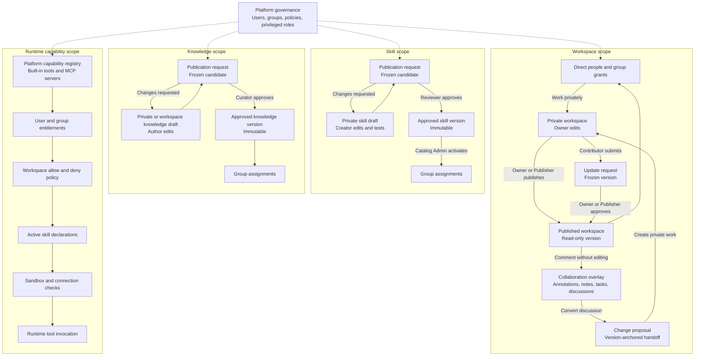
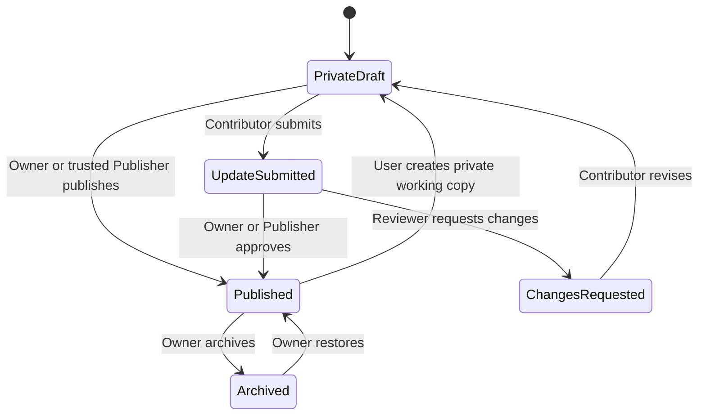
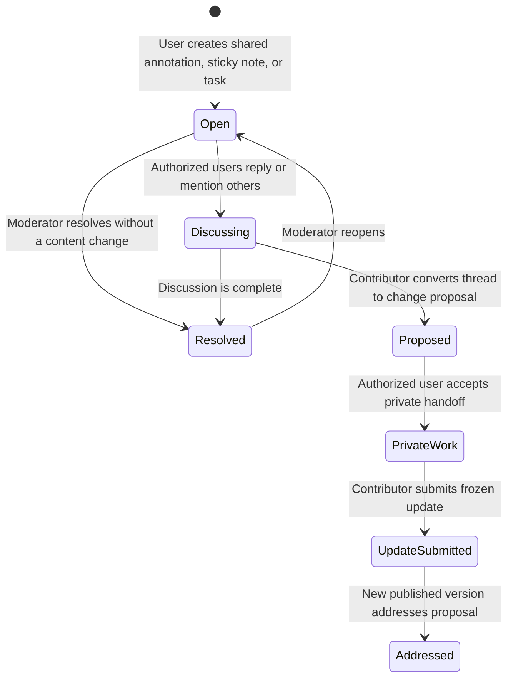
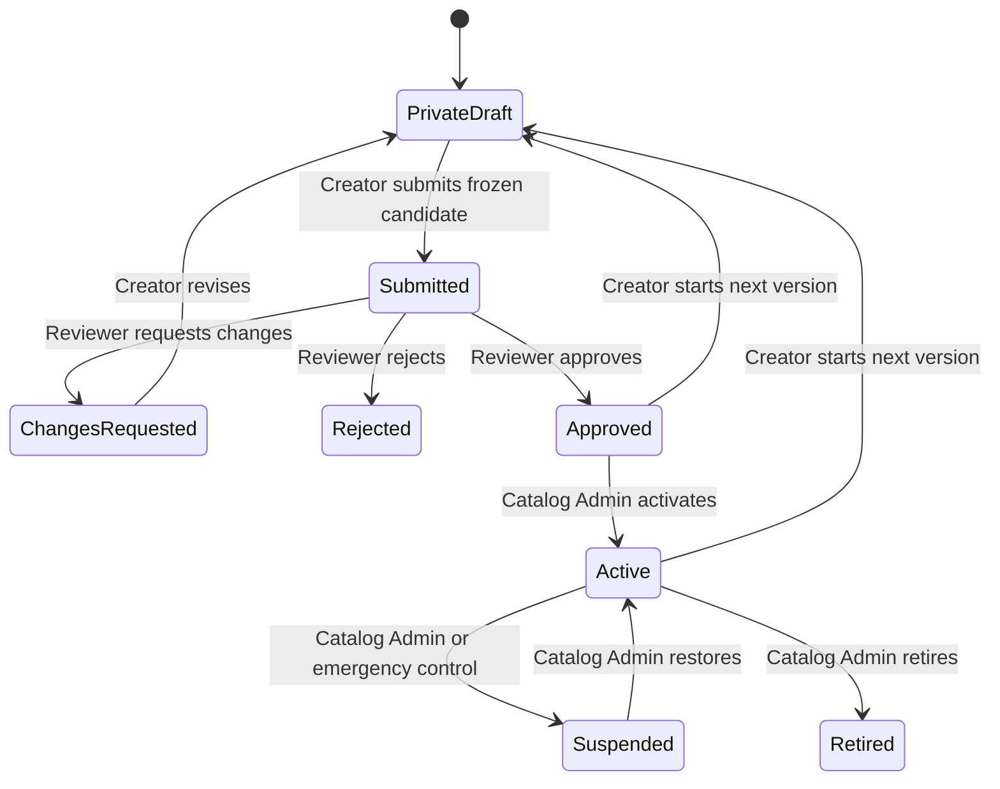
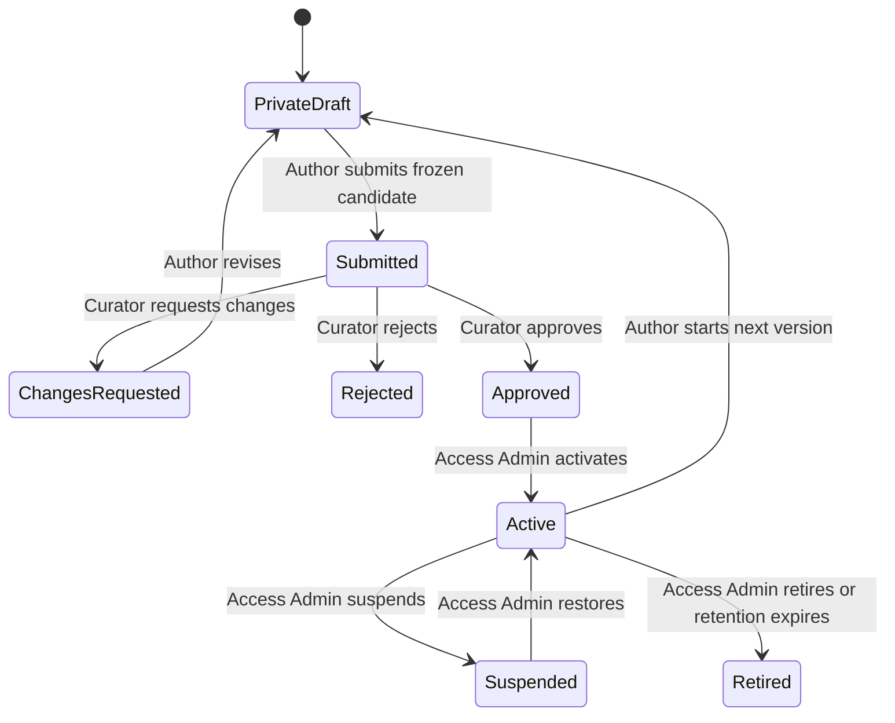
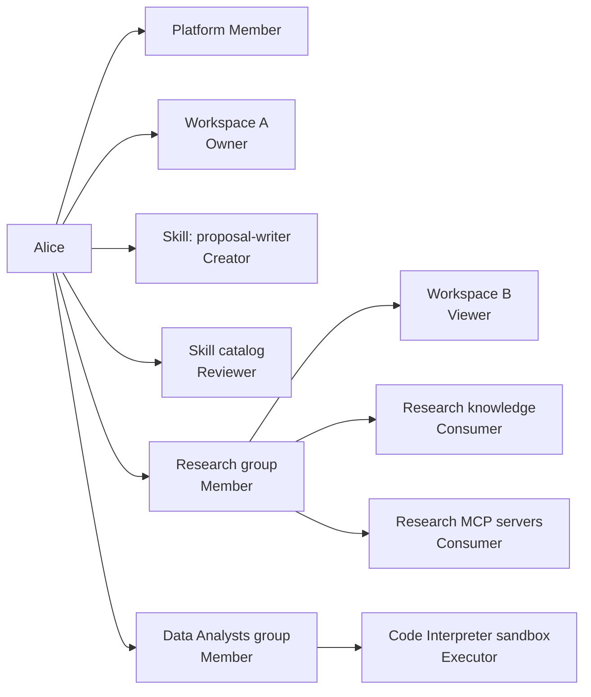

# Unified Governance and Role Model

Status: Proposed

Audience: Product, design, engineering, security, and platform administrators

Applies to: Platform administration, workspaces, skills, knowledge, users, and groups

## 1. Summary

HelpUDoc needs one understandable governance model across five authorization scopes:

1. **Platform** — who can administer the HelpUDoc installation and its governance settings.
2. **Workspace** — who can view, contribute to, publish, and manage a published workspace.
3. **Skill** — who can privately create a skill, review it, publish it to the catalog, and use it.
4. **Knowledge** — who can privately create knowledge, curate it for platform use, assign it, and consume it.
5. **Runtime capability** — who can configure or use built-in tools, MCP servers, delegated connections, and the Code Interpreter sandbox.

The governing rule is:

> Published artifacts are immutable versions. People edit private drafts or private working copies, then promote a new version through an appropriate publication gate.

The gate depends on the artifact:

- A **workspace owner or trusted publisher** governs published workspace versions.
- A **skill reviewer and catalog administrator** govern published skills.
- A **knowledge curator** governs platform knowledge.
- A **runtime capability administrator** governs the available tool, MCP-server, connection, and sandbox policies.
- A **platform administrator** governs users, groups, privileged role assignments, platform policy, and emergency controls.

A single person can hold different roles at the same time. Roles are evaluated within their own scope and resource. Being powerful in one scope does not automatically grant power in another.

For example, a person may simultaneously be:

- a normal Platform Member;
- Owner of Workspace A;
- Viewer of Workspace B through a group;
- Creator of a private skill;
- Reviewer of skills created by other users; and
- Consumer of knowledge assigned to the Research group.

## 2. Problem

HelpUDoc currently has several useful authorization mechanisms, but they are expressed differently:

- `users.isAdmin` provides broad system-administration authority.
- Groups grant access to skills, MCP servers, and global knowledge.
- Private workspaces are owner-only.
- Published team workspaces use Owner, Editor, and Viewer memberships.
- Skill creation and editing are currently administrator functions operating directly on the shared skill registry.
- Global knowledge is currently administered centrally and assigned to groups.

As user-created skills, direct workspace sharing, and governed knowledge contribution are introduced, the product needs to answer clearly:

- Who may create privately?
- Who may see a draft?
- Who may submit a publication request?
- Who may approve it?
- Who may activate or suspend a published artifact?
- Who may assign it to users or groups?
- What happens when one user holds several roles?
- Which safety rules remain in force even for privileged users?

Without a unified model, role names can become misleading and broad roles can accidentally cross privacy or security boundaries.

## 3. Goals

- Give registered users freedom to create private workspaces, skills, and knowledge.
- Preserve private drafts as owner-only by default.
- Make published workspaces shareable with registered users outside the owner's team.
- Prevent direct in-place editing of published workspaces, skills, and knowledge versions.
- Introduce governed submission, review, approval, activation, assignment, suspension, and rollback.
- Reuse groups for audience access to skills, knowledge, and published workspaces.
- Govern built-in tools, MCP servers, delegated credentials, and sandbox execution independently from skill assignment.
- Make a user's effective access explainable.
- Support users holding multiple roles without merging those roles into one global rank.
- Enforce separation of duties for executable or platform-wide artifacts.
- Maintain an audit trail for privileged and publication actions.

## 4. Non-goals for the First Release

- Anonymous or public sharing links.
- Sharing a live private workspace with collaborators.
- Real-time co-editing of workspace or skill drafts.
- Custom role builders or arbitrary permission sets.
- Explicit deny rules.
- Nested groups.
- Approval workflows with more than one required approver.
- Per-document permissions inside one published workspace.
- Per-conversation sharing.
- Arbitrary unsandboxed shell or code execution.
- A skill automatically granting access to a tool, MCP server, credential, or sandbox.
- Recalling information that a user already viewed, downloaded, or copied.

## 5. Product Principles

### 5.1 Private by default

New workspaces, skill drafts, and knowledge drafts are visible only to their creator unless explicitly submitted or published.

### 5.2 Published means versioned, not editable

No actor edits an active published version in place. An update creates a new version.

### 5.3 Creation authority and publication authority are separate

The ability to create a private artifact does not imply the ability to publish it for others.

### 5.4 Access and ownership are separate

Owning an artifact, governing its publication, and consuming it are separate capabilities.

### 5.5 Roles are scoped

A role applies only within its declared scope:

- platform-wide;
- a particular workspace;
- the skill catalog or a particular skill;
- the knowledge catalog or a particular knowledge source.

### 5.6 Groups distribute access, not ownership

Groups are primarily an audience and entitlement mechanism. Group membership may grant consumption or contribution access, but must not silently create ownership or platform-administration authority.

### 5.7 Privilege does not erase privacy

Platform Admin does not silently gain routine access to private workspaces, private skill drafts, or private knowledge drafts. Private content becomes visible to a reviewer only when its owner submits a frozen candidate for review.

### 5.8 Runtime authority cannot be granted by an artifact

A skill can guide the agent, but it cannot grant its user additional tools, MCP servers, credentials, data, filesystem access, or network access.

### 5.9 Connections prove identity; they do not grant authorization

A connected OAuth account or other MCP credential proves that the user can authenticate to an external service. The connection does not make the MCP server available unless platform, group, workspace, and skill policy also permit it.

### 5.10 Code runs only inside an explicit execution envelope

Code Interpreter and skill scripts run only when the platform enables the sandbox, the user is entitled to execute code, the active skill declares the script or capability, and the workspace policy permits it. The sandbox enforces resource, filesystem, network, timeout, and output boundaries.

### 5.11 Published content is stable; collaboration around it is active

A published workspace remains immutable, but authorized users may collaborate through a separate mutable overlay containing private notes, shared annotations, discussion threads, sticky notes, tasks, mentions, and change proposals.

Collaboration objects never modify the published content manifest. They retain their own authorship, audience, lifecycle, and version anchors. Any content change still requires private work, submission when applicable, approval, and publication of a new workspace version.

## 6. Governance Map



## 7. Role Model

### 7.1 Role categories

HelpUDoc uses four kinds of role:

| Kind | Purpose | Typical assignment |
|---|---|---|
| Baseline role | Capabilities every active registered user receives | Implicit |
| Ownership role | Accountability for a specific private or published resource | Created with or transferred with the resource |
| Governance role | Review, approval, activation, rollback, access administration | Direct grant by an authorized administrator |
| Audience role | View, use, or contribute to an artifact | Direct grant or group membership |

### 7.2 Platform roles

| Role | Scope | Capabilities |
|---|---|---|
| Platform Member | Platform | Sign in; create permitted private artifacts; use resources granted directly or through groups |
| Platform Admin | Platform | Manage users, groups, platform policy, privileged domain roles, global audit, catalog emergency controls, and break-glass requests |
| Platform Auditor | Platform | Read governance configuration, review history, access explanations, and audit events without changing state |

`Platform Auditor` may be deferred from the MVP, but the permission boundary should be preserved so audit access does not require full administration authority.

#### Platform Admin privacy boundary

Platform Admin may:

- see resource metadata needed for administration;
- manage published catalogs and assignments;
- assign reviewers and curators;
- suspend a published skill or knowledge source;
- inspect submitted review candidates; and
- initiate an audited break-glass process when required.

Platform Admin does not automatically:

- open a user's private workspace;
- inspect an unsubmitted private skill draft;
- inspect an unsubmitted private knowledge draft;
- edit a private artifact; or
- impersonate a resource owner.

### 7.3 Workspace roles

| Role | View and chat | Private notes | Shared annotations, sticky notes, and tasks | Create private copy | Submit update | Publish directly | Govern access and discussions |
|---|---:|---:|---:|---:|---:|---:|---:|
| Workspace Viewer | Yes | Yes | No | Policy-controlled | No | No | No |
| Workspace Commenter | Yes | Yes | Yes | Policy-controlled | No | No | No |
| Workspace Contributor | Yes | Yes | Yes | Yes | Yes | No | No |
| Workspace Publisher | Yes | Yes | Yes | Yes | Yes | Yes, subject to policy | Moderate discussions and review updates |
| Workspace Owner | Yes | Yes | Yes | Yes | Yes | Yes | Yes |

Rules:

- A private workspace has exactly one owner and no collaborators.
- Every private working copy is editable only by its owner.
- A published workspace is read-only for every role, including Workspace Owner.
- Chat remains available in a published workspace when workspace and runtime policy permit it. Chat may read the published version and authorized knowledge, but it cannot mutate the published content.
- Private notes are visible only to their author.
- Shared annotations, sticky notes, discussions, and tasks belong to the collaboration overlay, not the published content manifest.
- Mentions and assignments may target only registered users or groups that already have access to the published workspace. A mention never grants workspace access.
- Workspace Commenter grants collaboration authority without granting private-copy submission or publication authority.
- A published workspace may be personally owned or group-owned, but at least one active registered user must hold the direct accountable Workspace Owner role.
- Group ownership provides continuity; it does not make every group member a Workspace Owner.
- `Publish directly` means promoting a private working-copy snapshot as the next published version.
- The owner can transfer ownership, but the system must always retain at least one active accountable owner.
- Group grants may provide Viewer, Commenter, or Contributor access.
- Publisher and Owner are privileged roles and should be assigned directly to named users in the first release.

#### Workspace publication policy

Each published workspace has one of two policies:

| Policy | Behaviour |
|---|---|
| Trusted publishing | Workspace Owner and Workspace Publishers may publish directly |
| Approval required | Workspace Owner may publish directly; all other users submit an update request |

Recommended default:

- personally owned workspace: Trusted publishing;
- group-owned or externally shared workspace: Approval required.

#### Workspace collaboration policy

Each published workspace also has an independent collaboration policy:

| Policy | Behaviour |
|---|---|
| Closed | Users may chat and keep private notes, but cannot create shared collaboration objects |
| Comments enabled | Workspace Commenters and higher roles may create shared annotations, sticky notes, discussions, mentions, and tasks |
| Proposals enabled | Workspace Contributors and higher roles may additionally convert discussions into governed change proposals and private working copies |

Recommended default:

- personally owned workspace: Comments enabled;
- group-owned or externally shared workspace: Comments enabled with Proposals enabled for Contributors;
- sensitive or regulated workspace: Closed unless explicitly enabled.

Workspace Owner and Workspace Publisher may resolve, reopen, move, re-anchor, or moderate shared discussions. This moderation authority does not permit editing the underlying published content.

### 7.4 Skill roles

| Role | Scope | Capabilities |
|---|---|---|
| Skill Creator | One skill | Create and edit private drafts, run permitted private tests, submit versions, respond to review feedback |
| Skill Reviewer | Skill catalog or selected skill family | Inspect submitted candidates, diffs, test results, declared capabilities, and approve, reject, or request changes |
| Skill Catalog Admin | Skill catalog | Activate approved versions, suspend, retire, restore, roll back, and assign approved skills to groups |
| Skill Consumer | Assigned skills | Discover and invoke approved assigned skills within the consumer's own runtime permissions |

Rules:

- The creator owns the private draft, not the platform catalog entry.
- Once approved, the catalog entry is platform-governed while retaining creator attribution.
- A reviewer sees only the submitted immutable candidate, not the creator's ongoing draft.
- An approved skill version cannot be edited.
- A creator updates a published skill by creating a new draft from an approved version and submitting it again.
- A Skill Consumer cannot inspect private drafts or change published skill files.
- Skill assignment does not grant any underlying tool, MCP server, credential, knowledge, or workspace access.

### 7.5 Knowledge roles

HelpUDoc distinguishes two knowledge scopes:

1. **Workspace knowledge** belongs to a private workspace and follows that private workspace's ownership and publication lifecycle.
2. **Platform knowledge** is an approved catalog source that can be assigned to groups and used across authorized workspaces.

| Role | Scope | Capabilities |
|---|---|---|
| Knowledge Author | One knowledge source | Create and edit a private or workspace source, maintain provenance, submit a candidate |
| Knowledge Curator | Knowledge catalog or selected collection | Review content, provenance, classification, quality, freshness, and approve, reject, or request changes |
| Knowledge Access Admin | Knowledge catalog | Activate, suspend, retire, restore, and assign approved knowledge to groups |
| Knowledge Consumer | Assigned sources | Search and use approved assigned knowledge in authorized workspaces |

Rules:

- Workspace knowledge is accessible only inside its authorized workspace context.
- Publishing a workspace copies only allowlisted knowledge artifacts into that published version.
- Platform knowledge requires curator approval before group assignment.
- An approved platform knowledge version cannot be edited in place.
- The source author creates a new candidate to update published knowledge.
- A Knowledge Consumer receives query/use access, not edit authority.
- Source classification, provenance, retention, and expiry policies constrain all roles.

For the MVP, Platform Admin may perform Skill Reviewer, Skill Catalog Admin, Knowledge Curator, and Knowledge Access Admin duties. The roles remain logically distinct so they can be delegated later.

### 7.6 Runtime capability roles

| Role | Scope | Capabilities |
|---|---|---|
| Runtime Capability Admin | Platform capability registry | Register, enable, disable, classify, and configure built-in tools, MCP servers, connection types, and sandbox policy |
| Tool Consumer | Assigned built-in tools | Invoke an enabled tool when all user, workspace, skill, and runtime checks pass |
| MCP Consumer | Assigned MCP servers | Discover and invoke an enabled MCP server when entitlement, workspace policy, skill declaration, and authentication all pass |
| MCP Connection Owner | One user's connection | Create, refresh, inspect, and revoke their own delegated credential without granting it to other users |
| Sandbox Executor | Code Interpreter or declared skill scripts | Submit permitted code or a declared script to the sandbox and read only authorized outputs |

Rules:

- Runtime roles do not make a published artifact editable.
- Skill Consumer and Tool or MCP Consumer are separate roles.
- Assigning a skill does not automatically assign its required tools or MCP servers.
- Assigning an MCP server does not create or share a user's OAuth connection.
- A personal connection cannot be used by another user.
- Sandbox Executor is an entitlement to request execution, not permission to bypass the sandbox.
- Platform Admin or Runtime Capability Admin may disable a capability globally without editing every skill or group grant.
- High-risk tools may additionally require per-action human approval.

## 8. Role Assignment Authority

| Role being assigned | Who may assign it | Assignment constraints |
|---|---|---|
| Platform Member | Provisioning or sign-in flow | User must be active and registered |
| Platform Admin | Another Platform Admin | Cannot remove or demote the final active Platform Admin |
| Platform Auditor | Platform Admin | Read-only |
| Workspace Owner | Creation flow or current Workspace Owner through transfer | Must be a direct registered user; cannot be group-derived |
| Workspace Publisher | Workspace Owner | Direct named-user assignment recommended |
| Workspace Contributor | Workspace Owner | Direct or group grant |
| Workspace Commenter | Workspace Owner | Direct or group grant; does not grant submission authority |
| Workspace Viewer | Workspace Owner | Direct or group grant |
| Skill Creator | Skill creation flow | Bound to the created skill |
| Skill Reviewer | Platform Admin | Must not approve own submitted candidate by default |
| Skill Catalog Admin | Platform Admin | Privileged direct assignment |
| Skill Consumer | Skill Catalog Admin through group assignment | Approved active skills only |
| Knowledge Author | Knowledge creation flow | Bound to the created source |
| Knowledge Curator | Platform Admin | Must not approve own submitted candidate by default |
| Knowledge Access Admin | Platform Admin | Privileged direct assignment |
| Knowledge Consumer | Knowledge Access Admin through group assignment | Approved active sources only |
| Runtime Capability Admin | Platform Admin | Privileged direct assignment |
| Tool Consumer | Runtime Capability Admin through group assignment or platform default | Enabled tools only |
| MCP Consumer | Runtime Capability Admin through group assignment | Enabled registered servers only |
| MCP Connection Owner | Connection authorization flow | Personal credential only |
| Sandbox Executor | Runtime Capability Admin through group assignment or approved platform policy | Sandbox must be healthy and enabled |

## 9. Artifact Lifecycles

### 9.1 Workspace lifecycle



Each publication creates an immutable version containing:

- version identifier and sequence number;
- publisher or approving user;
- source private-workspace identifier;
- publication note;
- content manifest;
- creation timestamp; and
- validation results.

#### 9.1.1 Published-workspace collaboration lifecycle

Collaboration objects are mutable records anchored to, but stored separately from, an immutable published version.



Every shared collaboration object contains:

- stable collaboration-object identifier and type;
- source published-workspace identifier and version identifier;
- optional content anchor containing file, block, text range, and anchor fingerprint;
- author and creation timestamp;
- visibility and explicit audience;
- thread participants, mentions, optional assignee, and optional due date;
- lifecycle status;
- optional linked change proposal, private working copy, update request, and resolving published version; and
- complete moderation and edit history.

Version behaviour:

- An annotation always retains the version and content selection where it originated.
- When a new version is published, HelpUDoc attempts deterministic re-anchoring using the stored content fingerprint.
- Successfully matched open objects may be shown on the new version with their origin version visible.
- Ambiguous, changed, or deleted anchors are marked `Anchor changed` and require manual re-anchoring or closure.
- Resolved objects remain available in history and are not silently copied into the active discussion view.
- Workspace-level sticky notes and tasks are not text-anchored, but still record their origin version.

### 9.2 Skill lifecycle



Status meanings:

| Status | Meaning |
|---|---|
| Private Draft | Creator-only editable files |
| Submitted | Frozen candidate under review |
| Changes Requested | Review completed with required changes |
| Rejected | Candidate will not proceed |
| Approved | Immutable version permitted in the catalog |
| Active | Approved version is the current runnable version |
| Suspended | Invocation blocked immediately; history and assignments retained |
| Retired | No longer available for new use; history retained |

### 9.3 Knowledge lifecycle



Knowledge approval must record:

- source and provenance;
- owner or responsible steward;
- data classification;
- permitted audience;
- ingestion and extraction status;
- freshness or review date;
- retention policy where applicable; and
- curator decision and notes.

## 10. User Journeys by Role

### 10.1 Platform Member

1. The user signs in and becomes an active Platform Member.
2. HelpUDoc resolves the user's direct roles and group memberships.
3. The user sees only published workspaces, active skills, and active knowledge authorized for them.
4. The user may create private workspaces, skill drafts, and knowledge drafts if platform policy permits.
5. The user may submit artifacts for review but cannot approve or broadly assign them without another role.
6. The interface can explain why each shared resource is available, such as `Direct access` or `via Research group`.

### 10.2 Platform Admin

1. The admin opens the governance area.
2. The admin manages users, groups, platform policies, reviewers, curators, and catalog administrators.
3. The admin monitors skill and knowledge review queues and published-catalog health.
4. The admin may suspend unsafe published artifacts immediately.
5. The admin reviews audit events and access explanations.
6. If private content must be inspected, the admin initiates a reasoned, time-bounded, audited break-glass request.
7. The admin cannot silently modify a user's private draft.

### 10.3 Platform Auditor

1. The auditor opens a read-only governance view.
2. The auditor examines role assignments, review decisions, publication history, access changes, and break-glass events.
3. The auditor exports or records findings without being able to approve, assign, suspend, or edit.

### 10.4 Workspace Owner

1. The user creates a private workspace and is its private owner.
2. The user publishes an immutable version.
3. The user chooses personal or group ownership context and a publication policy.
4. The user selects the collaboration policy.
5. The user grants Viewer, Commenter, Contributor, or Publisher access to registered users and Viewer, Commenter, or Contributor access to groups.
6. The user moderates shared discussions and may convert a discussion into a governed change proposal.
7. The user continues editing only in a private working copy.
8. The user publishes directly or reviews Contributor update requests.
9. The user may restore a previous version, archive the published workspace, or transfer accountable ownership.

### 10.5 Workspace Publisher

1. The user receives direct Publisher access.
2. The user browses the current published version.
3. The user creates a private working copy.
4. The user edits privately without exposing unfinished work.
5. Under Trusted publishing, the user publishes a new version.
6. Under Approval required, the user submits the version to the Workspace Owner.
7. The user may moderate collaboration objects and review Contributor requests if workspace policy permits, but cannot manage access or ownership.

### 10.6 Workspace Contributor

1. The user receives Contributor access directly or through a group.
2. The user chats against the published version and participates in shared annotations, sticky notes, discussions, and tasks.
3. The user may convert a discussion into a change proposal.
4. The user creates a private working copy of the published workspace.
5. The user makes changes privately.
6. The user submits a frozen update request with a note and links it to the originating discussion when applicable.
7. The owner or publisher approves it or requests changes.
8. The user revises their private copy and resubmits when necessary.
9. The user cannot make their content changes visible without approval.

### 10.7 Workspace Viewer

1. The user receives Viewer access directly or through a group.
2. The user browses the stable published content.
3. The user may use the chat agent against the published version and authorized knowledge.
4. The user may create private notes that remain visible only to them.
5. If workspace policy permits, the user creates a detached or linked private copy for personal work.
6. The user cannot create shared collaboration objects, submit, or publish unless upgraded.
7. Revocation blocks future source access but cannot recall material the user already copied or downloaded.

### 10.7a Workspace Commenter

1. The user receives Commenter access directly or through a group.
2. The user browses and chats against the stable published content.
3. The user selects content and creates a shared annotation, or creates a workspace-level sticky note or task.
4. The user mentions or assigns registered users and groups that already have workspace access.
5. Recipients open the exact anchored content and participate in the discussion.
6. The user may resolve their own discussion when policy permits but cannot modify published content, submit an update, or publish.
7. A Contributor, Publisher, or Owner may convert the discussion into a governed change proposal.

### 10.8 Skill Creator

1. The user chooses `Create skill`.
2. HelpUDoc creates a private skill draft owned by the user.
3. The creator uses Skill Creator assistance to edit instructions and permitted supporting files.
4. The creator tests privately within a governed sandbox and their existing entitlements.
5. The creator sees validation errors, declared capabilities, and test results.
6. The creator submits an immutable candidate and publication note.
7. The creator responds to requested changes or sees the approval and active-version status.
8. To update an approved skill, the creator starts a new private version.

### 10.9 Skill Reviewer

1. The reviewer opens the skill review queue.
2. The reviewer sees the frozen candidate, author, version diff, validation results, test evidence, scripts, dependencies, and requested capabilities.
3. The reviewer verifies that the skill does not attempt to bypass runtime authorization.
4. The reviewer approves, rejects, or requests changes with notes.
5. The reviewer cannot silently edit the creator's draft.
6. If the reviewer is also the creator, self-approval is blocked unless an explicit single-admin exception applies.

### 10.10 Skill Catalog Admin

1. The catalog admin sees approved skill versions.
2. The admin activates a selected approved version.
3. The admin assigns the skill to one or more groups.
4. The admin monitors usage and incident reports.
5. The admin may suspend the skill immediately, restore it, retire it, or roll back to a previously approved version.
6. Assignment and activation remain separate audit events.

### 10.11 Skill Consumer

1. The user joins one or more groups.
2. Active skills assigned to those groups appear in discovery and slash commands.
3. The user invokes a skill.
4. Runtime authorization intersects the skill's declared needs with the user's allowed tools, MCP servers, knowledge, workspace access, and platform policy.
5. The user cannot invoke suspended, retired, unapproved, or unassigned skills.

### 10.12 Knowledge Author

1. The user creates knowledge inside a private workspace or a private platform-knowledge draft.
2. The author supplies content, provenance, classification, ownership, and freshness information.
3. The author tests ingestion or extraction privately.
4. The author submits an immutable candidate for platform publication.
5. The author responds to curator feedback.
6. The author creates a new draft version when published knowledge needs updating.

### 10.13 Knowledge Curator

1. The curator opens the knowledge review queue.
2. The curator inspects provenance, licensing, classification, sensitive information, extraction quality, freshness, and intended audience.
3. The curator approves, rejects, or requests changes.
4. The curator does not edit the author's private draft in place.
5. The curator cannot self-approve by default when they are also the author.

### 10.14 Knowledge Access Admin

1. The access admin activates an approved knowledge version.
2. The admin assigns the knowledge source to groups.
3. The admin sets review or expiry dates where required.
4. The admin may suspend, restore, retire, or roll back the source.
5. The admin can explain which users currently receive access through which groups.

### 10.15 Knowledge Consumer

1. The user receives knowledge access through one or more groups.
2. The knowledge appears in search or agent retrieval only in an authorized workspace context.
3. The user may consume the source but cannot alter it.
4. Removing the user from every granting group blocks future retrieval.

### 10.16 Runtime Capability Admin

1. The administrator opens the runtime-capability registry.
2. The administrator enables or disables built-in tools and registers approved MCP servers.
3. The administrator classifies capabilities by risk and defines whether human approval is required.
4. The administrator assigns Tool Consumer, MCP Consumer, and Sandbox Executor entitlements to groups.
5. The administrator configures sandbox limits, allowed execution images, network policy, timeouts, and output retention.
6. The administrator monitors failures, revokes unsafe capabilities, and reviews audit events.

### 10.17 Tool Consumer

1. A built-in tool is assigned to one of the user's groups or enabled by platform default.
2. The user starts work in an authorized workspace.
3. The active skill declares the tool when a skill is active.
4. Workspace and platform policy permit the requested action.
5. HelpUDoc executes the tool or presents a required human-approval gate.
6. The user cannot use a disabled, undeclared, or unassigned restricted tool.

### 10.18 MCP Consumer and Connection Owner

1. The user receives MCP Consumer access through a group.
2. If the server requires delegated authentication, the user connects their own external account.
3. HelpUDoc stores the credential as a personal connection and never shares it with the group.
4. The user invokes an approved skill or workflow.
5. The runtime verifies server entitlement, workspace policy, skill declaration, connection validity, and server availability.
6. The user may revoke their connection at any time without changing group entitlement.
7. Entitlement without a valid connection produces `Connection required`; a connection without entitlement remains unavailable.

### 10.19 Sandbox Executor

1. The user invokes Code Interpreter or a skill that declares a sandbox script.
2. HelpUDoc verifies the user's Sandbox Executor entitlement and the active skill version.
3. Only declared scripts and explicitly selected workspace inputs are staged.
4. Execution runs with configured CPU, memory, storage, timeout, filesystem, identity, and network restrictions.
5. The workspace is mounted read-only; only the current run's output area is writable.
6. Only current-run outputs approved for handoff become visible to the user or agent.
7. The run is terminated and audited when a limit or policy is violated.

## 11. Multiple Roles for One User

### 11.1 Roles do not collapse into a global rank

HelpUDoc must not calculate a single role such as `highestRole = Admin`. Instead, it resolves capabilities for the requested action and resource.

Example:

| Scope or resource | Alice's role | Result |
|---|---|---|
| Platform | Platform Member | No general administration |
| Workspace A | Workspace Owner | Manages access and versions for Workspace A |
| Workspace B | Workspace Viewer via Research group | Views Workspace B only |
| Skill `proposal-writer` | Skill Creator | Edits private drafts and submits versions |
| Skill catalog | Skill Reviewer | Reviews other creators' submissions |
| Knowledge catalog | Knowledge Consumer via Research group | Uses assigned Research knowledge |
| Runtime | MCP Consumer via Research group | May use assigned MCP servers with Alice's own valid connection |
| Runtime | Sandbox Executor via Data Analysts group | May request governed code execution |

Alice's Workspace Owner role does not let her approve skills. Her Skill Reviewer role does not let her manage Workspace B. Her group-based knowledge access does not let her curate knowledge.



Each edge is an independent role binding or group-derived grant. It contributes only the capabilities defined for that scope.

### 11.2 Effective authorization

For every protected operation, HelpUDoc computes:

```text
candidate capabilities =
    ownership capabilities
    UNION direct role grants
    UNION group-derived audience grants
    UNION permitted platform override

effective capabilities =
    candidate capabilities
    INTERSECT artifact-state rules
    INTERSECT platform safety policy
    INTERSECT runtime entitlements
```

Examples:

- Workspace Publisher plus Workspace Viewer yields Publisher capabilities for that workspace.
- Skill Consumer through two groups still produces one effective consume grant.
- Skill Reviewer cannot edit an approved version because artifact-state rules make it immutable.
- A skill requesting an MCP server remains unable to use it if the invoking user is not entitled to that server.
- A user with an OAuth connection remains unable to use its MCP server without an MCP Consumer entitlement.
- A Sandbox Executor remains unable to run an undeclared skill script or escape sandbox policy.
- Platform Admin cannot routinely open a private workspace because the private-workspace policy excludes silent platform override.

### 11.3 Grant union

The first release uses allow-only grants:

- direct and group grants are combined;
- duplicate grants are deduplicated;
- the strongest applicable resource role determines candidate capabilities;
- no explicit deny grant exists;
- platform and artifact policies may still prohibit an action.

Removing a direct grant does not remove access that remains available through a group. The UI must state this before removal:

> Removing direct access will not remove Alice's Viewer access through the Research group.

### 11.4 Privileged-role composition

When one person holds both creator and reviewer roles:

- they may create and submit;
- they may review other users' submissions;
- they may not approve their own candidate by default.

When one person holds both Reviewer and Catalog Admin:

- they may approve a candidate and later activate it;
- these remain separate recorded decisions;
- a stricter deployment may require different users for each action.

When one person is both Platform Admin and Workspace Owner:

- normal Workspace Owner actions use the workspace role;
- platform-admin authority does not need to be invoked;
- any administrative override is explicit and separately audited.

### 11.5 Separation of duties

| Action | Default separation rule |
|---|---|
| Publish own private workspace | Allowed for Workspace Owner |
| Contributor publish directly | Not allowed |
| Approve own skill | Not allowed |
| Activate skill after reviewing it | Allowed in MVP, separately audited |
| Approve own platform knowledge | Not allowed |
| Assign approved skill or knowledge to groups | Catalog or Access Admin only |
| Inspect unsubmitted private artifact | Not allowed |
| Break-glass private access | Reason, time limit, and audit required |

For a single-administrator installation, an explicit platform setting may permit self-approval of skill or knowledge candidates. When enabled:

- the UI shows a warning;
- the event is marked `selfApproved`;
- all validation checks remain mandatory; and
- the action is highlighted in the audit log.

## 12. Group Governance

Groups are reusable collections of registered users.

Groups may grant:

- Workspace Viewer;
- Workspace Contributor;
- Skill Consumer;
- Knowledge Consumer;
- Tool Consumer;
- MCP Consumer; and
- Sandbox Executor.

Groups must not grant in the first release:

- Platform Admin;
- Workspace Owner;
- Skill Creator;
- Skill Reviewer;
- Skill Catalog Admin;
- Knowledge Author;
- Knowledge Curator;
- Knowledge Access Admin; or
- Runtime Capability Admin.

These privileged or accountable roles are direct assignments to named users.

Effective group access is the union of all active group memberships.

Removing a user from a group:

- immediately removes future access derived only from that group;
- does not remove access available through another group or direct grant;
- does not delete the user's private workspace copies or drafts;
- blocks future publication if the removed grant was the user's only publication authority; and
- is recorded in the audit log.

## 13. Review Requirements

### 13.1 Workspace publication

Before creating a published workspace version, HelpUDoc must:

- verify the publisher or approver at request time;
- verify the publication policy;
- freeze a complete version manifest;
- exclude conversations, agent activity, schedules, credentials, connections, and personal settings;
- validate that referenced content is included and readable;
- detect conflicts with a newer published version; and
- publish atomically.

### 13.2 Skill review

A skill publication request must provide:

- skill name, description, owner, and intended audience;
- immutable version and file manifest;
- diff from the previous approved version, if any;
- declared tools, MCP servers, scripts, dependencies, network needs, and storage needs;
- automated structural validation;
- static safety scan results;
- sandbox test results;
- known limitations; and
- creator publication note.

Approval must not grant the skill's consumers any declared dependency automatically.

### 13.3 Knowledge review

A platform-knowledge publication request must provide:

- title, type, description, tags, and source;
- creator and accountable owner;
- provenance and licensing information;
- classification and sensitive-data assessment;
- ingestion or extraction status;
- intended group audience;
- freshness or next-review date; and
- diff from the previous approved version, if any.

### 13.4 Runtime capability review

Before enabling a built-in tool, MCP server, or sandbox execution mode, the reviewer must record:

- owner and operational contact;
- purpose and supported actions;
- data read, write, delete, message, or external-side-effect capabilities;
- authentication and credential model;
- network destinations;
- workspace-file and knowledge access;
- human-approval requirements;
- sandbox compatibility and resource limits where applicable;
- logging, retention, and incident response;
- default-access policy; and
- groups eligible for assignment.

Code Interpreter and skill-script execution must additionally enforce:

- non-root execution;
- no privilege escalation;
- dropped operating-system capabilities;
- read-only runtime filesystem except designated temporary and output areas;
- read-only workspace inputs;
- CPU, memory, ephemeral-storage, and wall-clock limits;
- network deny by default unless explicitly approved;
- no ambient user or service credentials;
- current-run output isolation; and
- cleanup after completion.

## 14. Access Revocation and Artifact Retention

### 14.1 Published access

Revocation blocks:

- future published-workspace reads;
- future skill invocation;
- future knowledge retrieval;
- creation of new linked private copies; and
- future publication or review actions derived from the removed role.

### 14.2 Existing private copies

Revocation does not automatically delete a user's private working copy or information already copied from an artifact. Instead:

- the private copy becomes detached;
- the user cannot sync from or publish back to the former source;
- source version and grant details are hidden where necessary; and
- the owner is warned during sharing that access cannot function as digital-rights recall.

### 14.3 Suspension

Suspending a skill or knowledge source:

- blocks new runtime use immediately;
- retains review, assignment, and version history;
- does not delete prior generated outputs; and
- creates a high-priority audit event.

## 15. Audit Requirements

The platform records immutable audit events for:

- platform-role assignment and removal;
- group creation, deletion, membership, and access changes;
- direct workspace access grants and revocations;
- workspace publication, approval, restoration, ownership transfer, and archive;
- skill submission, review decision, activation, assignment, suspension, rollback, and retirement;
- knowledge submission, review decision, activation, assignment, suspension, rollback, and retirement;
- tool and MCP registration, enablement, assignment, invocation approval, disablement, and connection revocation;
- sandbox entitlement, execution request, selected inputs, policy decision, completion, limit violation, and output publication;
- self-approval exceptions;
- platform-policy changes; and
- break-glass requests, access, expiry, and closure.

Every event contains:

- actor;
- action;
- resource type and identifier;
- previous and new state where applicable;
- reason or review note;
- timestamp;
- originating request or correlation identifier; and
- whether platform override or self-approval was used.

## 16. Access Explanation

Every shared-resource surface should support `Why do I have access?`.

Examples:

- `You are the Workspace Owner.`
- `You have Contributor access through the Research group.`
- `You have Publisher access directly and Viewer access through Product.`
- `This skill is assigned through the Sales and Proposal Operations groups.`
- `This knowledge source is assigned through the Compliance group.`
- `This MCP server is assigned through the Research group; your Google connection supplies authentication.`
- `Code Interpreter is allowed through the Data Analysts group and runs under the Restricted Python sandbox policy.`
- `Platform Admin override is active until 16:00 UTC under request BRK-1042.`

Administrators need an effective-access inspector that shows:

- direct grants;
- group-derived grants;
- ownership;
- role-to-capability expansion;
- artifact-state restrictions;
- platform-policy restrictions; and
- the final allow or deny decision.

## 17. Proposed Data Model

Domain-specific grant tables are preferred over one unconstrained generic ACL table. This keeps invariants enforceable and queries understandable.

### 17.1 Identity and platform governance

- `users`
- `groups`
- `group_members`
- `platform_role_bindings`
  - `userId`
  - `role`
  - `assignedBy`
  - `createdAt`
- `audit_events`

The existing `users.isAdmin` may remain during migration but should eventually map to a `platform_admin` binding.

### 17.2 Workspace governance

- `workspaces`
  - `visibility`: `private` or `published`
  - `ownerId`
  - optional ownership group or team context
  - `publicationPolicy`
  - `currentPublishedVersionId`
- `workspace_access_grants`
  - `workspaceId`
  - `principalType`: `user` or `group`
  - `principalId`
  - `role`: `viewer`, `commenter`, `contributor`, or `publisher`
  - `grantedBy`
- `workspace_publication_links`
- `workspace_publication_requests`
- `workspace_published_versions`
- `workspace_collaboration_objects`
  - `workspaceId`
  - `originVersionId`
  - `type`: `annotation`, `sticky_note`, `task`, or `change_proposal`
  - optional `fileId`, `blockId`, `textRange`, and `anchorFingerprint`
  - `authorId`
  - `visibility`: `private`, `selected_principals`, or `workspace_audience`
  - `status`: `open`, `discussing`, `proposed`, `resolved`, `addressed`, or `anchor_changed`
  - optional `assigneeId`, `dueAt`, `linkedPrivateWorkspaceId`, `linkedPublicationRequestId`, and `resolvedByVersionId`
- `workspace_collaboration_audiences`
  - collaboration object to user or group audience bindings
- `workspace_collaboration_messages`
  - immutable message history with author and timestamp
- `workspace_collaboration_mentions`
  - mentioned user or group, notification status, and access-check result
- `workspace_collaboration_events`
  - edits, status changes, assignments, re-anchors, moderation, proposal conversion, and resolution

Workspace Owner remains an accountable direct membership or ownership field, not a group grant.

### 17.3 Skill governance

- `skills`
  - stable skill identity
  - creator attribution
  - active version
  - lifecycle status
- `skill_versions`
  - immutable version manifest and content reference
  - status
  - creator
  - validation summary
- `skill_review_requests`
  - submitted version
  - reviewer
  - decision
  - notes
- `skill_role_bindings`
  - reviewers and catalog admins
- existing or evolved `skill_grants`
  - group-to-approved-skill consumption grants

Private drafts must be stored separately from the shared runtime registry. Only an activated approved version is materialized into the runtime skill catalog.

### 17.4 Knowledge governance

- `knowledge_sources`
  - stable source identity
  - scope: workspace or platform
  - author and steward
  - active version
  - lifecycle status
- `knowledge_versions`
  - immutable content or file reference
  - provenance and classification metadata
- `knowledge_review_requests`
- `knowledge_role_bindings`
- existing or evolved `knowledge_source_group_grants`

### 17.5 Runtime capability governance

- `tool_registry`
  - tool identifier, risk class, status, and approval mode
- `tool_group_grants`
- existing or evolved `mcp_server_registry`
- existing or evolved `mcp_server_group_grants`
- `user_connections`
  - encrypted personal credential reference and expiry
- `sandbox_policies`
  - execution image, resource, filesystem, network, timeout, and retention limits
- `sandbox_group_grants`
- `sandbox_runs`
  - requester, skill version, selected inputs, policy snapshot, status, and output manifest

## 18. Interface Requirements

### 18.1 Member navigation

- **Private workspaces**
- **Published workspaces**
  - Owned by you
  - Shared directly
  - Available through groups
  - Open discussions
  - Assigned notes and tasks
- **Published workspace collaboration**
  - `Preview` and `Annotate` modes
  - content-anchored annotation rail
  - workspace-level `Notes & Tasks` panel
  - audience selector for registered users and groups with existing access
  - mentions, assignees, due dates, replies, resolve and reopen actions
  - `Convert to change proposal` action for authorized roles
  - visible origin-version, re-anchor, and resolution status
- **My skills**
  - Private drafts
  - In review
  - Changes requested
  - Published
- **My knowledge**
  - Private drafts
  - In review
  - Published

### 18.2 Governance navigation

- **Users and groups**
- **Workspace governance**
- **Skill reviews**
- **Skill catalog**
- **Knowledge reviews**
- **Knowledge catalog**
- **Runtime capabilities**
  - Built-in tools
  - MCP servers
  - Code Interpreter sandbox
  - Risk and approval policy
- **Audit**
- **Platform policies**

### 18.3 Role labels

Use user-facing terms:

- `Publisher`, not `Editor`, for a published workspace;
- `Contributor` for a user who may submit but not publish;
- `Creator`, `Reviewer`, `Catalog Admin`, and `Consumer` for skills;
- `Author`, `Curator`, `Access Admin`, and `Consumer` for knowledge.

Do not label anyone as an editor of a published artifact.

Published workspace chat must display a persistent boundary message such as:

> You are working from published version v3. Chat and annotations cannot change this version. Generated changes will be saved privately.

Notifications for annotations, mentions, and tasks must not include protected content excerpts unless the recipient is authorized to access the underlying published workspace at delivery time. If a mentioned principal lacks access, HelpUDoc must block the mention and offer an access-request workflow rather than silently granting access.

## 19. Runtime Enforcement

Authorization must be enforced server-side and in the agent runtime where applicable.

For skill invocation:

```text
allowed =
    skill is approved and active
    AND user is an assigned consumer or platform-authorized administrator
    AND requested capability is declared by the skill
    AND user is entitled to that capability
    AND workspace policy permits that capability
    AND platform policy permits that capability
```

For a concrete tool, MCP, or sandbox invocation:

```text
allowed =
    capability is registered and enabled
    AND user has direct or group entitlement
    AND workspace policy allows it
    AND active skill declares it, when a skill is active
    AND required personal connection is valid
    AND sandbox policy is healthy and satisfied, when code executes
    AND required human approval is present
```

For chat or agent activity in a published workspace:

```text
allowed =
    user can view the published workspace
    AND requested knowledge and runtime capabilities are independently authorized
    AND the agent reads only the selected published version and authorized collaboration context
    AND any generated content mutation targets a private workspace, draft, or change proposal
    AND the published content manifest remains unchanged
```

Client-side filtering is for usability only and is never sufficient authorization.

Publication, approval, assignment, restoration, suspension, and deletion permissions must be rechecked when the server performs the action, not only when the interface renders a button.

## 20. Migration from the Current Model

### 20.1 Platform

- Existing `isAdmin = true` users become Platform Admins.
- All other active users become Platform Members.

### 20.2 Workspaces

- Existing private workspaces remain private and owner-only.
- Existing `owner` memberships become Workspace Owner.
- Existing `editor` memberships become Workspace Publisher.
- Existing `viewer` memberships remain Workspace Viewer.
- Existing team membership continues as an audience grant.
- The UI term `Team workspaces` becomes `Published workspaces`.
- Direct registered-user grants become valid even when the user is not in the owning team.
- Existing workspace comments, if any, migrate into the collaboration overlay with their source version recorded.
- Workspace Commenter is introduced as a non-editing role between Viewer and Contributor.

### 20.3 Skills

- Existing global skills become approved active catalog skills.
- Existing Skill Builder and direct registry-editing routes remain Platform Admin-only.
- Existing group skill grants become Skill Consumer assignments.
- User-created private drafts use new draft storage and never write directly to the active shared registry.

### 20.4 Knowledge

- Existing global knowledge becomes approved active platform knowledge.
- Existing knowledge group grants become Knowledge Consumer assignments.
- Existing workspace-local knowledge remains governed by the owning private workspace.

### 20.5 Runtime capabilities

- Existing runtime-configured built-in tools become enabled registry tools with documented default access.
- Existing MCP servers become registered servers.
- Existing `mcp_server_group_grants` become MCP Consumer assignments.
- Existing personal delegated OAuth tokens become MCP Connection Owner records.
- Existing skill sandbox enablement becomes an explicit sandbox policy and Sandbox Executor entitlement.
- Existing skills must declare required built-in tools, MCP servers, and sandbox scripts before stricter enforcement is enabled.

## 21. MVP Scope

The first governed release should include:

1. Platform Member and Platform Admin.
2. Workspace Owner, Publisher, Contributor, Commenter, and Viewer.
3. Direct published-workspace sharing with registered users outside a team.
4. Published-workspace chat, private notes, shared annotations, sticky notes, discussions, mentions, assignments, and tasks.
5. Version anchors, re-anchor status, moderation, and conversion of discussions into change proposals and private work.
6. Private user-created skill drafts.
7. Skill submission, one-reviewer approval, activation, suspension, rollback, and group assignment.
8. Knowledge Author, Curator, Access Admin, and Consumer roles, with admin fulfilling curator and access-admin duties initially.
9. Group-based consumption grants.
10. Self-approval prevention with a single-admin exception setting.
11. Immutable versions and audit events.
12. Tool, MCP-server, personal-connection, and Code Interpreter sandbox governance.
13. An access-explanation view.

Deferred:

- Platform Auditor UI;
- time-limited grants;
- multiple required approvers;
- custom roles;
- explicit deny rules;
- delegated group administrators;
- Publisher grants through groups;
- formal break-glass automation beyond an audited administrative procedure.

## 22. Acceptance Criteria

### Role composition

- One user can hold roles in several scopes simultaneously.
- An action is authorized against the relevant resource, not a global highest role.
- The interface explains every effective shared-resource grant.
- Removing one grant preserves access obtained through another grant.

### Workspace

- No role edits a published workspace in place.
- Authorized users can use chat against a published workspace without mutating its content.
- A Viewer can create private notes without exposing them to other users.
- A Commenter can create shared annotations, sticky notes, discussions, and tasks but cannot submit or publish content changes.
- Mentions and assignments do not grant access and cannot expose content to unauthorized recipients.
- Shared annotations retain the originating published version and content anchor.
- New publications re-anchor unchanged content and mark ambiguous or missing anchors for review.
- A Contributor can convert a discussion into a change proposal and private working copy.
- Resolving or moderating a discussion does not modify the published version.
- A Contributor can submit but cannot publish.
- A Publisher can publish only when workspace policy permits.
- An external registered user can receive direct access without joining the owning team.
- Private working copies remain owner-only.

### Skill

- A member can create and test a private skill without changing the shared catalog.
- Submission freezes an immutable candidate.
- A creator cannot approve their own candidate by default.
- Only approved active versions can be assigned or invoked.
- A skill cannot extend the invoking user's runtime authority.
- Suspension blocks new invocation immediately.

### Knowledge

- Workspace knowledge follows private-workspace access.
- Platform knowledge requires approval before assignment.
- Only assigned active knowledge is available to a non-admin user.
- Published knowledge updates create new immutable versions.

### Runtime capabilities

- Skill assignment alone does not grant a built-in tool, MCP server, connection, or sandbox.
- MCP entitlement and personal authentication are checked independently.
- Disabled capabilities disappear from discovery and fail closed at invocation.
- Code Interpreter and skill scripts run only in the governed sandbox.
- Sandbox runs receive only declared code, selected inputs, bounded resources, and isolated current-run outputs.
- Runtime authorization is rechecked when an invocation occurs.

### Administration and privacy

- Platform Admin can govern published catalogs without silently accessing private drafts.
- Privileged actions and override use are audited.
- The final active Platform Admin cannot be removed or demoted.

## 23. Recommended Product Decision

Adopt the following model as the product baseline:

1. **Nobody edits a published artifact in place.**
2. **Published content is stable while its version-aware collaboration layer remains active.**
3. **Chat, private notes, shared annotations, sticky notes, tasks, and discussions do not modify the published content manifest.**
4. **Every user may create privately within platform policy.**
5. **Shared discussions become content changes only through a governed proposal, private-work, review, and publication flow.**
6. **Workspace publication is governed by the Workspace Owner and trusted Publishers.**
7. **Skill publication is governed by Skill Reviewers and the Skill Catalog Admin.**
8. **Platform-knowledge publication is governed by Knowledge Curators and the Knowledge Access Admin.**
9. **Groups grant consumption, commenting, or contribution access, not ownership or privileged governance.**
10. **Tools, MCP servers, personal connections, and sandbox execution are independent governed capabilities.**
11. **A person's permissions are the explainable composition of their scoped roles, artifact state, group grants, runtime entitlements, and platform policy.**
12. **Platform administration does not silently invalidate private-work boundaries.**
