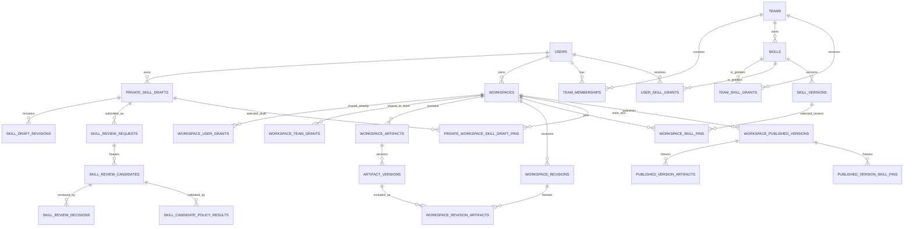

# Unified Governance Database Design

**Status:** Delivery target
**Version:** 1.1
**Last updated:** 2026-07-31
**Companion specification:** [Unified Governance and Role Model](./unified-governance-and-role-model-spec.md)

## 1. Purpose

This document is the canonical target database design for user-owned private skill drafts, Team-owned governed skills, mutable workspace artifacts, immutable workspace publications, and the two workspace classes.

It refines the logical model in the governance specification into tables, relationships, constraints, and an incremental migration from the current schema.

Physical naming examples follow the existing convention of `snake_case` table names and `camelCase` columns. Existing `groups` and `group_members` may remain as physical table names during the migration, but the product and API term is **Team**.

## 2. Canonical ownership decisions

| Resource | Accountable owner | Important distinction |
|---|---|---|
| Private Workspace | One user | Owner-only; it has no collaborators or Team grants |
| Team Workspace | One user | It may be shared with multiple Teams and direct users |
| Workspace artifact | Its workspace | Users create versions but do not personally own workspace artifacts |
| Published workspace version | Its Team Workspace | Immutable snapshot; it is not another workspace class |
| Private skill draft | One user | Team Leads and Platform Admins cannot inspect an unsubmitted draft |
| Governed skill identity | One Team | Created by a user, but Team-owned after approval |
| Governed skill version | Its skill identity | Immutable and attributed to the creator and approvers |
| Team skill access | Recipient Team | A grant to consume a skill; it does not transfer skill ownership |
| Direct skill access | Recipient user | Platform-Admin-managed consumption grant; it does not transfer skill ownership |

The phrase “a user owns their skill” therefore means:

1. the user owns and edits the **private draft**;
2. the user remains the recorded creator of approved versions; and
3. after approval, the stable governed skill is owned by the selected **Team**, not by the user.

This is necessary so a governed skill survives staff movement and can be reviewed, suspended, assigned, and maintained by the Team.

## 3. High-level entity model



## 4. Workspace classes

Use one `workspaces` table with a discriminator. Private and Team Workspaces share identity, storage, revision, conversation, and artifact behavior, so separate parent tables would duplicate most of the model.

| Concept | Stored as | Mutable? | Access model |
|---|---|---:|---|
| Private Workspace | `workspaces.workspaceType = private` | Yes | `ownerUserId` only |
| Team Workspace | `workspaces.workspaceType = team` | Yes | Owner plus direct-user and Team grants |
| Review mode | `workspaces.editingPolicy = review` | Owner may change it | Contributor changes enter proposals |
| Freeflow mode | `workspaces.editingPolicy = freeflow` | Owner may change it | Contributor changes create current revisions directly |
| Published version | `workspace_published_versions` | No | Inherits read eligibility from its Team Workspace |

There is deliberately no `published` workspace type and no separate “shared workspace” table.

### 4.1 `workspaces`

| Column | Type | Rule |
|---|---|---|
| `id` | UUID PK | Stable workspace identity |
| `name` | text | Required |
| `slug` | text unique | Stable URL key |
| `workspaceType` | enum/text | `private` or `team` |
| `ownerUserId` | UUID FK `users` | Required direct user; never Team-derived |
| `editingPolicy` | enum/text nullable | `review` or `freeflow`; required only for Team Workspaces |
| `status` | enum/text | `active` or `archived` |
| `currentRevisionId` | UUID nullable | Exact mutable-head revision |
| `currentPublishedVersionId` | UUID nullable | Latest publication selected for display |
| `contentRevision` | bigint | Monotonic optimistic-concurrency token |
| `lastModifiedByUserId` | UUID nullable | Attribution only |
| `createdAt`, `updatedAt` | timestamptz | Required |

Required checks:

- private: `editingPolicy IS NULL`;
- team: `editingPolicy IN ('review', 'freeflow')`;
- a Private Workspace must have no rows in either workspace grant table;
- `currentRevisionId` and `currentPublishedVersionId` must belong to the same workspace;
- owner deletion is restricted until ownership is transferred or the workspace is explicitly deleted or archived.

There is no authoritative `teamId` on a Team Workspace. A Team Workspace can be shared with multiple Teams, and the accountable owner remains a named user. The current `workspaces.teamId` becomes a Team grant during migration.

### 4.2 Workspace access grants

Use two physical tables instead of a polymorphic `principalType` column. This preserves foreign keys and makes the named-user-only Publisher rule enforceable.

#### `workspace_user_grants`

| Column | Type | Rule |
|---|---|---|
| `workspaceId` | UUID FK | Team Workspace only |
| `userId` | UUID FK | Active registered user |
| `role` | enum/text | `publisher`, `contributor`, or `viewer` |
| `grantedByUserId` | UUID FK | Owner who granted access |
| `createdAt`, `updatedAt` | timestamptz | Required |

Primary key: (`workspaceId`, `userId`).

#### `workspace_team_grants`

| Column | Type | Rule |
|---|---|---|
| `workspaceId` | UUID FK | Team Workspace only |
| `teamId` | UUID FK | Active Team |
| `role` | enum/text | `contributor` or `viewer` |
| `grantedByUserId` | UUID FK | Owner who granted access |
| `createdAt`, `updatedAt` | timestamptz | Required |

Primary key: (`workspaceId`, `teamId`).

Effective workspace role uses the strongest eligible grant:

```text
owner > publisher > contributor > viewer
```

The owner is stored only on `workspaces.ownerUserId`; it is not duplicated as a grant.

## 5. Workspace artifacts and immutable history

### 5.1 Shared content-addressed blobs

#### `content_blobs`

| Column | Type | Rule |
|---|---|---|
| `contentHash` | char(64) PK | SHA-256 of exact bytes |
| `storageProvider` | text | `local`, `gcs`, or another configured provider |
| `storageKey` | text unique | Opaque object location |
| `sizeBytes` | bigint | Non-negative |
| `mimeType` | text nullable | Detected or declared media type |
| `encryptionKeyVersion` | text nullable | Storage encryption metadata |
| `createdAt` | timestamptz | Required |

This table may be reused for workspace artifact versions, skill package files, and immutable validation evidence. Database rows contain metadata; large content remains in object storage.

### 5.2 `workspace_artifacts`

This is the stable logical identity of a file, folder, document, dashboard, report, or another visible workspace object.

| Column | Type | Rule |
|---|---|---|
| `id` | UUID PK | Stable artifact identity |
| `workspaceId` | UUID FK | Owning workspace |
| `artifactType` | enum/text | `file`, `folder`, `document`, `dashboard`, `report`, or registered type |
| `logicalPath` | text | Normalized workspace-relative path |
| `displayName` | text | Required |
| `currentVersionId` | UUID nullable | Current artifact version |
| `status` | enum/text | `active` or `deleted` |
| `createdByUserId`, `updatedByUserId` | UUID FK nullable | Attribution |
| `createdAt`, `updatedAt` | timestamptz | Required |

Use a partial unique index on (`workspaceId`, `logicalPath`) where `status = 'active'`.

### 5.3 `artifact_versions`

Artifact versions are immutable.

| Column | Type | Rule |
|---|---|---|
| `id` | UUID PK | Immutable version identity |
| `artifactId` | UUID FK | Stable artifact |
| `versionNumber` | bigint | Monotonic within artifact |
| `contentHash` | char(64) FK nullable | Exact blob; null only for a folder version |
| `metadata` | jsonb | Bounded type-specific metadata |
| `sourceProvider` | text nullable | Imported-source provenance |
| `sourceExternalId` | text nullable | Imported-source identifier |
| `sourceVersionFingerprint` | text nullable | Imported-source version |
| `createdByUserId` | UUID FK nullable | Actor |
| `createdAt` | timestamptz | Required |

Unique key: (`artifactId`, `versionNumber`).

A check requires `contentHash` for every non-folder artifact version. Folder versions freeze path and metadata without requiring a content blob.

### 5.4 Workspace revisions

#### `workspace_revisions`

| Column | Type | Rule |
|---|---|---|
| `id` | UUID PK | Immutable revision |
| `workspaceId` | UUID FK | Owning workspace |
| `revisionNumber` | bigint | Monotonic within workspace |
| `parentRevisionId` | UUID nullable | Previous revision |
| `actorUserId` | UUID FK nullable | User responsible |
| `source` | enum/text | `manual`, `agent`, `upload`, `merge`, `restore`, or `migration` |
| `editingPolicy` | enum/text nullable | Policy under which change entered |
| `skillVersionId` | UUID nullable | Exact skill version responsible, if any |
| `manifestHash` | char(64) | Hash of the complete artifact manifest |
| `createdAt` | timestamptz | Required |

Unique key: (`workspaceId`, `revisionNumber`).

#### `workspace_revision_artifacts`

| Column | Type | Rule |
|---|---|---|
| `workspaceRevisionId` | UUID FK | Frozen revision |
| `artifactId` | UUID FK | Stable artifact |
| `artifactVersionId` | UUID FK | Exact immutable content |
| `logicalPath` | text | Path at this revision |

Primary key: (`workspaceRevisionId`, `artifactId`).

The row set is the authoritative revision manifest. `manifestHash` provides a fast integrity check.

### 5.5 Changes and review mode

#### `workspace_changes`

Records every logical mutation, whether it entered through Review mode or Freeflow.

Key columns:

- `id`, `workspaceId`;
- `baseRevisionId`, `resultRevisionId`;
- `actorUserId`;
- `source` and `editingPolicy`;
- optional exact `skillVersionId`;
- `status`: `proposed`, `applied`, `reverted`, or `conflicted`;
- `createdAt`.

#### `workspace_change_artifacts`

Stores each affected artifact, old version, new version, operation, and path for a change.

#### `workspace_change_proposals`

Key columns:

- `id`, `workspaceId`, `authorUserId`;
- optional `sourcePrivateWorkspaceId` for users who deliberately work privately;
- `baseRevisionId`;
- `status`: `open`, `changes_requested`, `merged`, `rejected`, or `withdrawn`;
- `mergedRevisionId`, `reviewedByUserId`, `reviewedAt`;
- `requestRevision` for optimistic concurrency.

#### `workspace_change_proposal_items`

Links one proposal to one or more `workspace_changes` in deterministic order.

Freeflow applies a change and advances `workspaces.currentRevisionId` in one transaction. Review mode creates a proposal without changing the current revision; merge creates a new immutable revision.

### 5.6 Published versions

#### `workspace_published_versions`

| Column | Type | Rule |
|---|---|---|
| `id` | UUID PK | Immutable publication |
| `workspaceId` | UUID FK | Must be a Team Workspace |
| `versionNumber` | bigint | Monotonic within workspace |
| `sourceRevisionId` | UUID FK | Exact revision boundary |
| `publisherUserId` | UUID FK nullable | `SET NULL` preserves history |
| `publicationNote` | text nullable | User-entered note |
| `contentManifestHash` | char(64) | Frozen artifact manifest hash |
| `skillManifestHash` | char(64) | Frozen skill-pin manifest hash |
| `validationSummary` | jsonb | Bounded publication checks |
| `createdAt` | timestamptz | Required |

Unique key: (`workspaceId`, `versionNumber`).

#### `published_version_artifacts`

Materializes the publication manifest:

- `publishedVersionId`;
- `artifactId`;
- exact `artifactVersionId`;
- `logicalPath`;
- `contentHash`.

Primary key: (`publishedVersionId`, `artifactId`).

The publication owns an immutable manifest of references. It does not clone artifacts into a second mutable workspace.

#### `published_version_changes`

Links the publication to all `workspace_changes` included since the previous published version.

## 6. Skill governance

### 6.1 User-owned private drafts

#### `private_skill_drafts`

| Column | Type | Rule |
|---|---|---|
| `id` | UUID PK | Private draft identity |
| `ownerUserId` | UUID FK | Sole draft owner |
| `proposalType` | enum/text | `new` or `improvement` |
| `sourceSkillId` | UUID nullable | Required for improvement |
| `sourceVersionId` | UUID nullable | Exact improvement base |
| `proposedOwnerTeamId` | UUID nullable | Selected for new skill before submission |
| `proposedSkillKey` | text nullable | Stable external ID requested for a new skill |
| `currentDraftRevisionId` | UUID nullable | Current editable revision |
| `draftRevision` | bigint | Optimistic-concurrency token |
| `status` | enum/text | `private`, `submitted`, or `archived` |
| `createdAt`, `updatedAt` | timestamptz | Required |

An improvement inherits `sourceSkillId.ownerTeamId`; the user cannot select a different Team.

#### `skill_draft_revisions`

Immutable snapshot of one draft state:

- `id`, `draftId`, `revisionNumber`;
- `parentRevisionId`;
- `manifestHash`;
- `validationSummary`;
- `createdByUserId`, `createdAt`.

#### `skill_draft_revision_files`

Primary key (`draftRevisionId`, `path`) with `contentHash` FK to `content_blobs`, mode, size, and media type.

Only the owner can read these tables before submission. Platform Admin metadata access must not expose file rows or blob content.

### 6.2 Team-owned governed skills

#### `skills`

| Column | Type | Rule |
|---|---|---|
| `id` | UUID PK | Internal stable identity |
| `skillKey` | text unique | Immutable external `skillId` |
| `displayName` | text | Need not be unique |
| `ownerTeamId` | UUID FK | Accountable governing Team |
| `originalCreatorUserId` | UUID FK nullable | Attribution retained |
| `defaultVersionId` | UUID nullable | Active version offered for new pins |
| `status` | enum/text | `active`, `suspended`, or `retired` |
| `createdAt`, `updatedAt` | timestamptz | Required |

Team deletion is restricted while it owns an active skill or open review request.

#### `skill_versions`

| Column | Type | Rule |
|---|---|---|
| `id` | UUID PK | Immutable version |
| `skillId` | UUID FK | Stable skill |
| `semanticVersion` | text | Valid SemVer without pre-release/build metadata in MVP |
| `manifestHash` | char(64) | Exact complete package hash |
| `baseVersionId` | UUID nullable | Improvement base |
| `status` | enum/text | `active`, `suspended`, or `retired` |
| `createdByUserId` | UUID FK nullable | Creator attribution |
| `approvedCandidateId` | UUID FK | Provenance to approved candidate |
| `validationSummary` | jsonb | Frozen validation result |
| `activatedAt`, `createdAt` | timestamptz | Required as applicable |

Unique keys:

- (`skillId`, `semanticVersion`);
- (`skillId`, `id`, `semanticVersion`, `manifestHash`) to support exact composite pin validation.

#### `skill_version_files`

Primary key (`skillVersionId`, `path`) with `contentHash` FK to `content_blobs`, executable flag, mode, size, and media type.

No application role receives `UPDATE` or `DELETE` permission on active version rows or files.

### 6.3 Review requests and frozen candidates

#### `skill_review_requests`

One proposal lifecycle:

- `id`, `draftId`, `proposalType`;
- `ownerTeamId`;
- optional `targetSkillId`;
- `proposerUserId`;
- `status`: `submitted`, `changes_requested`, `approved`, `rejected`, or `withdrawn`;
- `currentCandidateId`;
- `requestRevision`;
- `createdAt`, `updatedAt`.

#### `skill_review_candidates`

One immutable row per submission or resubmission:

- `id`, `requestId`, `candidateNumber`;
- `sourceDraftRevisionId`;
- proposed `skillKey` and `semanticVersion`;
- optional `sourceSkillId` and `sourceVersionId`;
- `manifestHash`;
- frozen validation and risk summaries;
- `submittedByUserId`, `submittedAt`.

Unique key: (`requestId`, `candidateNumber`).

#### `skill_review_candidate_files`

Primary key (`candidateId`, `path`) with exact `contentHash`. Reviewers see these frozen files, never the live private draft.

#### `skill_review_decisions`

Append-only decisions:

- `id`, `requestId`, `candidateId`;
- `decision`: `approve`, `request_changes`, or `reject`;
- `reviewerUserId`, `reviewerRole`;
- `comment`, `policyVersion`, `createdAt`.

Only an eligible Team Lead for the owning Team may create a decision. Platform Admin has no proposal-decision permission.

#### `skill_candidate_policy_results`

Immutable automated policy evidence:

- `id`, `candidateId`;
- `policyVersion`;
- `outcome`: `pass` or `block`;
- `riskClass`;
- bounded issue and validation summaries;
- `evaluatedAt`.

Approval requires a current passing result. A blocked candidate returns to the proposer with actionable validation errors; it is not escalated to another reviewer. Team Lead approval creates a new immutable `skill_versions` row from the approved candidate and never changes the candidate or private draft.

### 6.4 Skill ownership and consumption access

#### `team_skill_grants`

| Column | Type | Rule |
|---|---|---|
| `teamId` | UUID FK | Team receiving consumption access |
| `skillId` | UUID FK | Stable governed skill identity |
| `effect` | enum/text | `allow`; explicit deny may be added only with defined precedence |
| `grantedByUserId` | UUID FK | Team Lead or authorized admin |
| `createdAt`, `updatedAt` | timestamptz | Required |

Primary key: (`teamId`, `skillId`).

Approval and activation do not create a consumption grant. The owning Team Lead may grant the stable skill to their own Team in a separate audited action; Platform Admin may grant it to any Team. Other-Team grants never change `skills.ownerTeamId`.

#### `user_skill_grants`

| Column | Type | Rule |
|---|---|---|
| `userId` | UUID FK | Registered user receiving direct consumption access |
| `skillId` | UUID FK | Stable governed skill identity |
| `effect` | enum/text | `allow`; explicit deny may be added only with defined precedence |
| `grantedByUserId` | UUID FK | Platform Admin |
| `createdAt`, `updatedAt` | timestamptz | Required |

Primary key: (`userId`, `skillId`).

Direct grants are scoped access assignments, not ownership or approval. Platform Admin authority alone does not imply Skill Consumer access; an administrator must also receive a direct or Team grant to invoke the skill.

### 6.5 Exact workspace skill pins

#### `workspace_skill_pins`

Current approved-version selection for a mutable Private or Team Workspace:

- `workspaceId`, `skillId`;
- exact `skillVersionId`, `semanticVersion`, `manifestHash`;
- `pinnedByUserId`, `validationStatus`, `createdAt`, `updatedAt`.

Primary key: (`workspaceId`, `skillId`).

The four-part version tuple must match one `skill_versions` row through a composite foreign key or equivalent transactionally enforced constraint.

#### `private_workspace_skill_draft_pins`

Private testing binding:

- `workspaceId` — must be a Private Workspace;
- `draftId` — must be owned by the same user as the workspace;
- exact `draftRevisionId`;
- `pinnedAt`.

Primary key: (`workspaceId`, `draftId`).

This binding is intentionally separate from governed `workspace_skill_pins`. It can never be copied to a Team Workspace or a published version. Promotion must fail until every private-draft binding is removed or replaced by an approved active `skillVersionId`.

#### `published_version_skill_pins`

Immutable copy of the exact four-part pin:

- `publishedVersionId`, `skillId`;
- `skillVersionId`, `semanticVersion`, `manifestHash`.

Primary key: (`publishedVersionId`, `skillId`).

A Team Workspace or published version can invoke a pin only when:

1. the user currently receives the stable `skillId` through a direct user grant or at least one active Team membership and Team grant;
2. the exact version is active;
3. the stored manifest hash matches; and
4. all required tool, MCP, knowledge, connection, and sandbox checks also pass.

Workspace sharing alone never satisfies condition 1.

## 7. Supporting governance tables

The following cross-cutting tables complete the design:

- `platform_role_bindings` — named Platform Admin and Platform Auditor assignments;
- `team_role_bindings` — named Team Lead assignments; Team membership remains separate;
- `audit_events` — append-only actor, scope, resource, action, before/after state hashes, reason, policy version, request ID, and timestamp;
- `idempotency_records` — actor, route/action, key, request hash, response reference, and expiry;
- `notifications` — recipient, event type, resource reference, delivery/read state, and timestamps;
- `workspace_collaboration_objects`, `workspace_collaboration_messages`, `workspace_collaboration_mentions`, and `workspace_collaboration_events` — annotations, discussions, tasks, mentions, moderation, and anchors;
- existing domain-specific Team grants for knowledge, tools, MCP servers, and sandbox policies.

Private draft content must not be copied into `audit_events` or `notifications`.

## 8. Critical database constraints

The delivery must enforce these in the database where practical and repeat them in the service layer for clear errors:

1. A Private Workspace has exactly one owner and no access grants.
2. Only Team Workspaces have `editingPolicy`, access grants, change proposals, and published versions.
3. Publisher is a direct user grant, never a Team-derived role.
4. All workspace, artifact, revision, and publication cross-references belong to the same workspace.
5. Artifact versions, workspace revisions, published manifests, skill candidates, review decisions, and skill versions are append-only.
6. A skill has exactly one owning Team; a direct-user or Team grant does not alter ownership.
7. A draft has exactly one user owner; reviewers receive only frozen candidates.
8. A private skill draft can be tested only in a Private Workspace owned by the same user and can never appear in a publication manifest.
9. Only an eligible owning-Team Lead can decide a skill proposal; Platform Admin cannot create proposal decisions.
10. Team Lead approval requires a current passing automated policy result.
11. A new skill key and every semantic version are unique under concurrent approval.
12. Exact workspace pins match an existing immutable skill-version tuple.
13. A suspended or retired version cannot become a new workspace pin.
14. A Team cannot be deleted while it owns an active skill or open review request.
15. User and Team records referenced by audit history use suspension or soft deletion; destructive deletion must preserve attribution through nullable actor references or tombstone identities.

## 9. Required indexes

At minimum:

```text
team_memberships(userId, teamId)
team_role_bindings(teamId, userId, role)
workspace_user_grants(userId, workspaceId, role)
workspace_team_grants(teamId, workspaceId, role)
workspaces(ownerUserId, workspaceType, status)
workspace_artifacts(workspaceId, logicalPath) WHERE status = 'active'
artifact_versions(artifactId, versionNumber DESC)
workspace_revisions(workspaceId, revisionNumber DESC)
workspace_changes(workspaceId, createdAt DESC)
workspace_change_proposals(workspaceId, status, createdAt)
workspace_published_versions(workspaceId, versionNumber DESC)
private_skill_drafts(ownerUserId, status, updatedAt DESC)
skills(ownerTeamId, status)
skill_versions(skillId, status, semanticVersion)
skill_review_requests(ownerTeamId, status, updatedAt)
skill_review_requests(proposerUserId, status, updatedAt)
skill_candidate_policy_results(candidateId, evaluatedAt DESC)
team_skill_grants(teamId, skillId)
user_skill_grants(userId, skillId)
workspace_skill_pins(workspaceId, skillId)
private_workspace_skill_draft_pins(workspaceId, draftId)
audit_events(resourceType, resourceId, createdAt DESC)
```

## 10. Atomic transaction boundaries

### Freeflow edit

One transaction:

1. verify expected workspace revision;
2. create blobs and immutable artifact-version metadata;
3. insert the workspace change and change-artifact rows;
4. create the new workspace revision and manifest rows;
5. advance artifact current pointers and `workspaces.currentRevisionId`;
6. append the audit event.

Object content must be durable before the database points to it.

### Review-mode merge

One transaction verifies the proposal and base revision, creates the merge revision, marks the proposal merged, advances the workspace head, and records the audit event. A stale base returns `409`.

### Workspace publication

After all blobs and validation evidence are readable, one transaction:

1. locks the Team Workspace head;
2. verifies the expected `sourceRevisionId`;
3. inserts the published version;
4. freezes artifact and skill-pin manifests;
5. links included changes;
6. advances `currentPublishedVersionId`; and
7. appends the audit event.

The mutable Team Workspace remains open and unchanged.

### Skill approval and activation

Team Lead approval freezes a decision first. Activation rechecks automated platform policy and immutable package readability and then, in one transaction, creates the skill/version if needed, activates the version, selects the default when required, updates the review request, and records separate audit events. It does not create a direct-user or Team consumption grant. Platform Admin does not participate in this transaction as a reviewer.

## 11. Migration from the current schema

| Current structure | Target action |
|---|---|
| `groups` | Keep physically for MVP or rename to `teams`; expose only Team terminology |
| `group_members` | Treat as `team_memberships`; add status and role bindings separately |
| `users.isAdmin` | Backfill `platform_role_bindings`; retain compatibility read for one release |
| `workspaces.visibility` | Map to `workspaceType` |
| `workspaces.teamId` | Insert `workspace_team_grants`; then deprecate the single-Team column |
| `workspace_members.role = owner` | Use `workspaces.ownerId`; remove duplicate owner membership after verification |
| `workspace_members.role = editor` | Map to `workspace_user_grants.publisher` to preserve current publish authority, unless product owners explicitly choose least-privilege remapping |
| `workspace_members.role = viewer` | Map to `workspace_user_grants.viewer` |
| `files` | Create one `workspace_artifacts` row and immutable version 1 per file; store bytes through `content_blobs` |
| Current workspace content | Create one migration `workspace_revisions` head and manifest |
| `workspace_published_versions.manifest` | Backfill normalized published artifact rows; retain JSON as a compatibility checksum during transition |
| `workspace_publication_links` | Stop creating new links; detach existing private copies and optionally create proposal lineage without mandatory sync |
| Runtime skill directories | Backfill stable `skills`, immutable `skill_versions`, version files, owning Team, and manifest hashes |
| `skill_grants` for groups | Convert to `team_skill_grants` targeting stable skill identities |
| Direct-user skill grants | Validate and backfill into `user_skill_grants`, preserving effective access |
| `skill_evolution_suggestions` | Archive read-only; do not convert into governed skill reviews |

Migration should use dual reads and compatibility views before switching writes. Every backfill must be idempotent and produce counts for source rows, target rows, skipped rows, and unresolved ownership or grant exceptions.

## 12. Current-code gaps to close

The current codebase is a useful starting point, but it does not yet implement this target model:

- `groups` and one `workspaces.teamId` currently assume a single Team relationship;
- `workspace_members` has `owner`, `editor`, and `viewer`, while the target separates Owner, Publisher, Contributor, and Viewer;
- current `files` rows carry only a mutable integer version rather than immutable artifact-version and workspace-revision manifests;
- current publishing stores a JSON manifest and relies on linked private copies and synchronization;
- there is no governed `skills` / `skill_versions` persistence layer yet;
- current `skill_grants` can store user or group principals but use an unconstrained principal type and string skill ID;
- current effective prompt access queries only group skill grants, while administrator status bypasses skill allowlisting; the target must union `user_skill_grants` and remove implicit admin consumption;
- runtime skill loading still discovers mutable filesystem packages;
- current `skill_evolution_suggestions` are operational-learning suggestions, not user draft and Team approval records.

These are migration gaps, not reasons to change the ownership model above.

## 13. Delivery sequence

1. Identity and Team aliases; role bindings and audit.
2. Workspace class and split user/Team grants.
3. Content blobs, workspace artifacts, immutable artifact versions, and initial revision backfill.
4. Team Workspace Review/Freeflow change history and proposal queue.
5. Normalized immutable publication manifests.
6. Private skill drafts and immutable draft revisions.
7. Frozen review candidates, decisions, governed skills, and immutable versions.
8. Direct-user and Team skill grants, exact workspace pins, and exact-version runtime resolution.
9. Retire mandatory private-copy synchronization and archive Skill Evolution.
