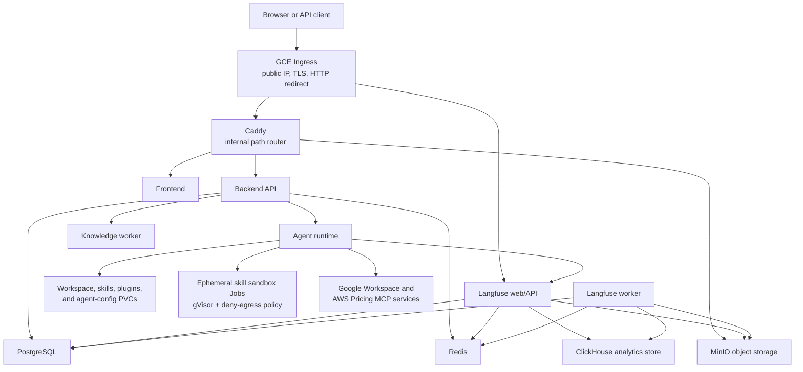

# HelpUDoc infrastructure

This directory contains the local Docker Compose stack, GKE manifests, deployment pipelines, and database bootstrap assets for HelpUDoc.

## Purpose and design goals

The infrastructure is designed to keep the application straightforward to operate at low-to-moderate scale while preserving clear boundaries between:

- the public web/API edge;
- the HelpUDoc application runtime;
- durable application data;
- isolated skill execution; and
- Langfuse observability data.

The current GKE topology favors operational simplicity over high availability. Most workloads run as one replica, stateful services use zonal `ReadWriteOnce` persistent disks, and deployments that mount those disks use a `Recreate` strategy. This is appropriate for the current footprint, but it means a node, zone, or stateful-pod failure can cause downtime. See [Availability and scaling](#availability-and-scaling) for the implications.

## Architecture overview



## Component model

### Edge and presentation

| Component | Responsibility | Exposure | Why it exists |
| --- | --- | --- | --- |
| GCE Ingress | Public IP, Google-managed certificates, TLS termination, and HTTP-to-HTTPS redirect | Public | Keeps cloud load balancing and certificate lifecycle outside the pods. |
| Caddy | Routes the main hostname by path, redirects the apex hostname to `www`, preserves the MinIO signing host, and compresses responses | Internal `ClusterIP` through a GKE NEG | Centralizes behavior that is awkward to express safely in the GKE Ingress manifest. |
| Frontend | Serves the HelpUDoc browser application | Internal | Only Caddy should expose it publicly. |

### Application runtime

| Component | Responsibility | Design notes |
| --- | --- | --- |
| Backend | Authentication, API endpoints, workspace/user state, and orchestration of agent runs | Exposed internally as `backend:3000`; long-running streams rely on the one-hour GCE backend timeout. |
| Knowledge worker | Performs asynchronous knowledge processing | Runs beside the backend so both use the same backend image and workspace data. |
| Agent | Executes chat, search, document, skill, and tool workflows | Exposed internally as `backend:8001`; includes OfficeCLI and mounts the workspace/skill/plugin/config PVCs. |
| Google Workspace MCP | Makes Google Workspace tools available to the agent | Runs as a sidecar in the application pod. |
| AWS Pricing MCP | Provides the AWS pricing MCP endpoint | Separate deployment because it has its own Python runtime, AWS credentials, and lifecycle. |
| Daily reflection CronJob | Produces the scheduled daily-reflection output | Calls the in-cluster backend/agent and reuses the backend image. |

The backend, knowledge worker, agent, and Google Workspace MCP currently share the `helpudoc-app` pod. This keeps their versions aligned and lets them mount the same RWO workspace data without introducing a shared network filesystem. The tradeoff is that they share scheduling, restart, scaling, and service-account boundaries. If one container needs substantially different scaling or isolation, split it into its own Deployment and revisit the shared-storage design.

### Data services

| Component | Owns | Persistence model |
| --- | --- | --- |
| PostgreSQL | HelpUDoc relational data plus a separate `langfuse` database for Langfuse metadata | `postgres-pvc`; the Langfuse database is created idempotently by `gke/scripts/bootstrap-langfuse-db.sh`. |
| Redis | Runtime coordination/cache data and Langfuse queues/cache | `redis-pvc` with append-only persistence enabled. |
| MinIO | HelpUDoc objects plus Langfuse event/media blobs | `minio-pvc`; setup jobs create buckets and remove anonymous access. |
| ClickHouse | Langfuse trace and analytics events | `clickhouse-pvc`; used only by the observability plane. |
| Workspace PVC | User/workspace files operated on by the backend and agent | Shared RWO disk mounted into the combined application pod. |
| Skills, plugins, and agent-config PVCs | Runtime-editable skills, plugins, and agent configuration | Seeded from the agent image, then preserved across application rollouts. |

PostgreSQL is the transactional source of truth. MinIO holds larger object payloads, Redis handles short-lived coordination, and ClickHouse handles high-volume analytical trace data. Keeping these roles separate prevents large trace/event scans from competing directly with transactional application queries.

### Observability plane

Langfuse is split into a web/API container and a background worker. Both use PostgreSQL, Redis, MinIO, and ClickHouse, but Langfuse is not on the critical request path for a successful HelpUDoc search or agent response. Trace export should degrade independently if Langfuse is unavailable.

The manifests deploy Langfuse itself but do not create Cloud Monitoring alert policies or notification channels. Operators should separately alert on container restarts, readiness, memory saturation, PVC capacity, HTTP errors, latency, and trace-ingestion failures.

### Skill isolation

The agent ServiceAccount has namespace-scoped permission to create and observe sandbox Jobs. Sandbox pods are labeled `app=helpudoc-skill-sandbox`, run with the configured gVisor runtime class, and match a deny-all egress NetworkPolicy. This boundary is intended for skills that should not inherit unrestricted application-network access.

## Main data flows

### Browser and API requests

1. The GCE Ingress terminates TLS.
2. Main-site traffic reaches the Caddy NEG on port 80.
3. Caddy sends `/api/*` to the backend, `/helpudoc/*` to MinIO, and other paths to the frontend.
4. The backend uses PostgreSQL and Redis and calls the agent on the internal service when a run requires agent execution.

### Workspace and object access

Small transactional metadata stays in PostgreSQL. Workspace files use the workspace PVC when containers need filesystem semantics. Browser-facing object transfers use MinIO URLs through Caddy; Caddy preserves the original public host because it is part of S3 SigV4 validation.

### Trace export

The agent emits Langfuse traces to the internal `langfuse-web` Service. Langfuse persists metadata in PostgreSQL, analytical events in ClickHouse, queue/cache state in Redis, and event/media blobs in MinIO. The worker processes asynchronous ingestion and maintenance tasks.

## Networking and trust boundaries

Only the GCE Ingress should be publicly reachable for application HTTP traffic. Application and data Services are `ClusterIP` resources addressed through Kubernetes DNS.

| Public host or internal name | Destination | Purpose |
| --- | --- | --- |
| `lc-demo.com`, `www.lc-demo.com` | GCE Ingress -> Caddy | Main application entrypoint. |
| `langfuse.lc-demo.com` | GCE Ingress -> `langfuse-web` | Langfuse console and API. |
| `backend:3000` | Backend container | Internal application API. |
| `backend:8001` | Agent container | Internal agent API. |
| `postgres:5432` | PostgreSQL | Relational storage. |
| `redis:6379` | Redis | Coordination, caching, and queues. |
| `minio:9000` | MinIO | S3-compatible object API. |
| `clickhouse:8123`, `clickhouse:9000` | ClickHouse | HTTP and native database protocols. |

Non-secret configuration is read from `helpudoc-config`; credentials and cryptographic material are read from `helpudoc-secrets`. Files under `gke/templates/` and `gke/bootstrap/` are examples/bootstrap inputs rather than production secret sources.

## Deployment model

There are two supported operating modes:

- `docker-compose.yml` runs the integrated local stack. `docker-compose.dependencies.yml` runs only supporting data services for developers who start application processes directly.
- `gke/k8s/` contains the production-style Kubernetes manifests. Cloud Build and GitHub Actions build application images, push immutable build/SHA tags, apply or patch the relevant workloads, and wait for rollouts.

Routine component workflows patch image references without reapplying every shared manifest. Infrastructure deployment is a separate, explicit operation because reapplying storage, databases, ingress, and observability components has a larger blast radius.

## Resource and rollout logic

Kubernetes resource requests express the capacity that must exist before a pod can be scheduled; limits bound the amount a container may consume. Requests should follow sustained workload usage with enough operating margin, while memory limits must also leave room for language-runtime and native allocations. A high limit does not create node capacity: a container can still cause node pressure if its limit is larger than the memory available on its node.

Stateless workloads can use rolling updates because old and new pods may overlap. Workloads attached to the current RWO state disks use `Recreate` so Kubernetes stops the previous pod before starting its replacement. Init containers wait for dependencies or seed PVC data before the main containers start, and readiness probes keep unavailable pods out of Service endpoints.

Application deployment workflows replace mutable manifest image placeholders with build- or commit-specific tags. Third-party infrastructure images should likewise be pinned to deliberate versions or digests so an infrastructure reapply cannot introduce an unreviewed upgrade.

## Data protection

A PVC protects data across pod restarts; it is not a backup. The manifests provision storage but do not declare an application-consistent backup schedule. A production environment should provide:

- PostgreSQL dumps or managed backups with tested point-in-time recovery;
- MinIO bucket replication or object-level backup;
- ClickHouse backups appropriate to the trace-retention requirement;
- persistent-disk or GKE backups as an additional recovery layer; and
- capacity alerts before PVCs approach exhaustion.

Restore procedures should be tested. Increasing a PVC is supported, but shrinking one is not, and deleting a claim backed by a `Delete` reclaim policy can also delete its disk.

## Availability and scaling

Current design characteristics:

- the cluster can run multiple nodes, but the checked-in workloads are generally single replica;
- stateful workloads use zonal RWO disks and `Recreate` rollouts to avoid simultaneous writers;
- the combined application pod cannot scale its containers independently;
- Caddy and the frontend are stateless and can be replicated once readiness probes and disruption budgets are in place;
- Langfuse web is stateless with respect to pod-local storage and can be replicated independently from its worker; and
- persistent storage expansion is supported by the GKE `standard-rwo` storage class, but shrinking a PVC is not supported.

For higher availability, move stateless entrypoints to at least two replicas with rolling updates and PodDisruptionBudgets, enable node-pool autoscaling, separate independently scaled application containers, and use regional or managed data services. Backups remain necessary regardless of replica count.

## GKE request path

Production traffic follows this path:

```text
Internet
  -> GCE Ingress (public IP, managed TLS, HTTP-to-HTTPS redirect)
     -> helpudoc-caddy:80 (ClusterIP through a GKE NEG)
        -> /api/*       -> backend:3000
        -> /helpudoc/*  -> minio:9000
        -> all else     -> helpudoc-frontend:80

  -> langfuse.lc-demo.com
     -> langfuse-web:80
```

The GCE Ingress is the only public load balancer for application HTTP traffic. Caddy remains an internal path router because it also:

- redirects the apex host to `www`;
- preserves the public host header for MinIO SigV4 requests; and
- applies gzip/zstd response compression.

`helpudoc-caddy` must remain a `ClusterIP` Service with `cloud.google.com/neg: '{"ingress":true}'`. Changing it to `LoadBalancer` creates a second public IP that bypasses the intended GCE Ingress path and adds unnecessary cost.

TLS terminates at the GCE Ingress. Caddy has `auto_https off` and listens only on port 80 inside the cluster.

## Repository layout

| Path | Purpose |
| --- | --- |
| `docker-compose.yml` | Integrated local stack. |
| `docker-compose.dependencies.yml` | PostgreSQL, Redis, and MinIO dependencies for host-run development. |
| `env/helpudoc.env.schema.yaml` | Environment-variable schema and ownership metadata. |
| `cloudbuild.yaml` | Full application build and GKE deployment pipeline. |
| `cloudbuild-frontend.yaml` | Frontend-only Cloud Build pipeline. |
| `gke/k8s/` | Deployable Kubernetes resources. |
| `gke/bootstrap/` | First-install demo/bootstrap configuration. |
| `gke/templates/` | Secret and ConfigMap examples. |
| `gke/scripts/` | Idempotent operational/bootstrap scripts. |
| `gke/rollback/` | Targeted rollback artifacts retained for documented compatibility events. |
| `gke/README.md` | Detailed GKE installation and deployment runbook. |
| `postgres-init/` | Local PostgreSQL initialization helpers. |

The numbered GKE filenames express their dependency order: namespace and storage first, data services next, application workloads after that, and edge/Ingress resources last.

## Deploy the Caddy service change

Preview the change first:

```bash
kubectl diff -f infra/gke/k8s/70-caddy.yaml
```

Apply and wait for the deployment:

```bash
kubectl apply -f infra/gke/k8s/70-caddy.yaml
kubectl -n helpudoc rollout status deployment/helpudoc-caddy
```

The existing GCE Ingress controller should retain a healthy NEG backend while deleting the redundant L4 forwarding rule and external IP associated with the old `LoadBalancer` Service.

Verify the result:

```bash
kubectl -n helpudoc get service helpudoc-caddy
kubectl -n helpudoc describe ingress helpudoc-ingress

curl -fsSI https://lc-demo.com
curl -fsS https://www.lc-demo.com/api/health
curl -fsSI https://langfuse.lc-demo.com/api/public/health
```

Expected state:

- `helpudoc-caddy` has type `ClusterIP` and no external IP;
- the Ingress reports the Caddy and Langfuse backends as healthy;
- the apex domain redirects to `www`;
- frontend and API requests remain available; and
- signed MinIO upload/download flows still succeed.

## Rollback

If the GCE Ingress backend does not become healthy, restore the previous exposure temporarily:

```bash
kubectl -n helpudoc patch service helpudoc-caddy --type merge \
  -p '{"spec":{"type":"LoadBalancer"}}'
```

Keep the Ingress as the preferred public entrypoint and diagnose the NEG before making the rollback permanent.

## Removing Caddy later

Caddy can be removed after its behavior is moved elsewhere. The migration must provide direct Ingress routes for `/api/*`, `/helpudoc/*`, and the frontend; preserve the host used by MinIO signatures; replace the apex-to-`www` redirect; and decide where response compression belongs. Validate signed MinIO operations before deleting the Caddy Deployment or Service.
