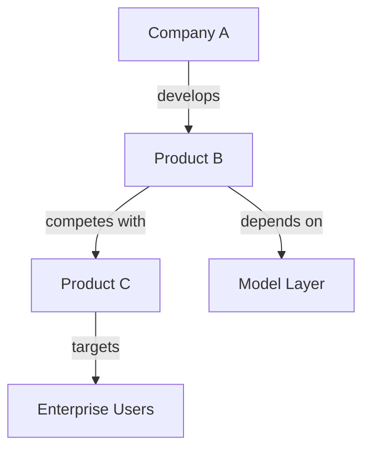

# research

## Overview

Use this skill to research a topic and deliver a structured, well-sourced report in the same language as the user.

This skill emphasizes:

- Evidence grounding before writing
- Entity disambiguation before comparison
- Source-quality ranking
- Claim-level verification
- Contradiction and uncertainty tracking
- Cross-source synthesis
- Clear separation between verified facts, interpretation, and speculation
- Professional, non-hype writing

The goal is not merely to produce a long report. The goal is to produce a report whose major claims have earned the right to appear.

## Core Principles

1. Do not write before evidence is gathered.
2. Do not merge ambiguous entities without disambiguation.
3. Do not include unsupported numbers, dates, benchmarks, legal claims, pricing, funding details, CVEs, architecture claims, or adoption claims.
4. Prefer primary sources over secondary sources.
5. Actively search for contradictory evidence.
6. State uncertainty clearly when evidence is incomplete.
7. Match research depth to the question.
8. Make final synthesis analytical, not stitched notes.

## Research Depth Modes

Before full research begins, classify the request into one of these modes and record it in `/research_mode.md`.

### Quick Research

Use when the user asks for a narrow factual answer or a short explanation.

- Final length: 800-1,500 words
- Minimum credible sources: 4
- Minimum primary sources: 1 where available
- Use only essential artifacts when the topic is narrow

### Standard Research

Use for normal explanatory or comparative research.

- Final length: 2,500-4,500 words
- Minimum credible sources: 10
- Minimum primary sources: 3 where available

### Deep Research

Use when the query involves:

- Comparing 3 or more entities
- Technical architecture
- Market or strategic positioning
- Emerging AI tools, models, frameworks, companies, or platforms
- Complex policy, scientific, business, or economic analysis
- Prompts containing "vs", "compare", "evaluate", "landscape", "benchmark", "strategy", "architecture", "best", or "trade-off"

Requirements:

- Final length: 6,000-10,000 words
- Minimum credible sources: 18
- Minimum primary sources: 8 where available
- One standalone dossier per major entity
- Comparison matrix
- Claim-evidence matrix
- Contradiction and uncertainty log
- Limits of evidence section
- Strategic implications section

### Exhaustive Research

Use when the user explicitly asks for an exhaustive landscape, investment memo, policy review, academic-style report, or due-diligence report.

- Final length: 10,000-18,000 words
- Minimum credible sources: 30
- Minimum primary sources: 12 where available
- Multiple synthesis passes required
- Include alternative interpretations and falsification criteria

If the user does not specify a depth, choose the appropriate mode automatically and explain the choice briefly in the research plan.

## Output Rules

- Write all report content to Markdown files in the workspace.
- Do not paste the full report in chat unless explicitly requested.
- In chat, provide only:
  - The proposed research mode
  - The research plan
  - Short progress updates
  - Final confirmation with file path(s)
- Each major section must be written as a separate Markdown file before consolidation.
- Generate a Mermaid knowledge graph before final stitching.
- The final report must include:
  - Clear Markdown headings
  - Inline numeric citations
  - A Sources section
  - A Limits of Evidence section when evidence is incomplete
  - Word count at the bottom, not shown in chat

## Workflow

### 1. Record the Question

Write the original user question to `/question.txt`.

Do not reinterpret the question silently.

### 2. Classify Research Mode

Create `/research_mode.md`.

Include:

- Selected mode: Quick / Standard / Deep / Exhaustive
- Reason for selection
- Expected word count
- Expected source count
- Expected primary-source count
- Whether entity dossiers are required
- Whether comparison matrices are required

Example:

```markdown
# Research Mode

Selected mode: Deep Research

Reason:
The user is comparing multiple entities and asks for technical and strategic evaluation.

Expected final length:
6,000-10,000 words

Minimum sources:
18 credible sources

Minimum primary sources:
8 where available
```

### 3. Entity Disambiguation

Create `/entity_disambiguation.md`.

For every named entity, product, company, model, framework, law, or technical term in the user question:

- List possible meanings
- Identify the most likely meaning
- Identify alternative meanings that may affect the answer
- State whether clarification is required
- If clarification is not required, define the interpretation used in the report

Rules:

- Do not silently merge similarly named entities.
- Do not assume that similarly named projects are related.
- If an entity cannot be verified, mark it as uncertain.
- If ambiguity materially affects the report, call `request_clarification`.

Example:

```markdown
# Entity Disambiguation

## Entity: Pi Agent

Possible meanings:
1. Inflection AI's Pi assistant
2. A coding-agent project using the name Pi
3. A component inside another framework

Decision:
The report will distinguish these meanings unless primary sources prove they are the same.

Clarification needed:
No, because the ambiguity itself is relevant to the research.
```

### 4. Preliminary Search

Run 2-3 lightweight searches before plan approval.

Purpose:

- Confirm the topic is real and current
- Identify major entities
- Identify obvious ambiguity
- Improve the plan

Record findings in `/preliminary_search_notes.md`.

Include:

- Search queries used
- Sources found
- Early findings
- Early uncertainties
- Possible source-quality issues
- Current timeline anchor

Do not perform full evidence gathering yet.

### 5. Draft Research Plan

Create `/research_plan.md`.

The plan must include:

- Scope definition
- Out-of-scope items
- Research mode
- Key research questions
- Topic classification:
  - Descriptive
  - Comparative
  - Technical
  - Historical
  - Policy
  - Market
  - Strategic
  - Predictive
- Source strategy
- Expected source types
- Proposed section outline
- Required artifacts
- Known uncertainties
- Risks of hallucination or ambiguity

Then call `request_plan_approval` with:

- `plan_title`
- `plan_summary`
- `execution_checklist`
- `risky_actions` when relevant
- `reviewer_feedback` when editing a previously proposed plan

A limited pre-plan search of 2-3 calls is allowed before approval, but the main evidence gathering must wait for approval.

If the user edits the plan, update `/research_plan.md` and request approval again.

If the user rejects the plan, stop.

### 6. Source Gathering

Use `google_search` to collect sources.

Prioritize primary sources first.

#### Source Priority

Tier A - Primary Sources:

- Official documentation
- GitHub repositories
- Release notes
- Model cards
- Company blogs
- API docs
- Regulatory text
- Court filings
- SEC filings
- Government databases
- NVD / CVE records
- Academic papers
- Standards bodies

Tier B - Reputable Secondary Sources:

- Reuters
- Associated Press
- Bloomberg
- Financial Times
- The Verge
- Wired
- TechCrunch
- IEEE Spectrum
- Major security vendors
- Recognized industry analysts

Tier C - Low-Confidence Sources:

- SEO blogs
- Content farms
- Unsourced newsletters
- Medium posts
- AI-generated-looking articles
- Aggregator pages
- Vendor comparison pages without primary citations

Rules:

- Architecture claims require Tier A evidence.
- Pricing claims require Tier A evidence.
- Benchmark claims require Tier A evidence.
- Security claims require Tier A evidence, preferably NVD, CVE, official advisories, or vendor disclosures.
- Legal status claims require Tier A evidence.
- Funding or acquisition claims require Tier A or strong Tier B evidence.
- Adoption claims such as star counts, user counts, revenue, downloads, or market share require direct evidence.

### 7. Source Register

Create `/source_register.md`.

For every source, include:

```markdown
## Source [1]

Title:
URL:
Publisher / author:
Date:
Access date:
Source tier: A / B / C
Primary or secondary:
Key claims:
Useful for:
Limitations:
Reliability notes:
```

The final report may cite only sources that appear in the source register.

### 8. Research Notes

Create `/research_notes.md`.

Include:

- Key claims per source
- Important statistics
- Important dates
- Important definitions
- Technical details
- Relevant quotes or paraphrases
- Conflicting claims
- Open questions
- Evidence gaps

No report prose should begin before this file exists.

### 9. Claim-Evidence Matrix

Create `/claim_evidence_matrix.md`.

Every major factual claim must be recorded before appearing in the final report.

Use this structure:

```markdown
| Claim | Source(s) | Source tier | Evidence summary | Confidence | Include? |
|---|---|---|---|---|---|
| Claim text | [1], [2] | A / B | Short evidence note | High / Medium / Low / Exclude | Yes / No |
```

Confidence rules:

- High: directly supported by a primary source and no credible contradiction found.
- Medium: supported by reputable secondary sources or indirectly by multiple independent sources, with no strong contradiction found.
- Low: supported only by weak sources, unclear wording, dated evidence, or inference.
- Exclude: unsupported, contradicted, speculative, unreliable, or too specific for available evidence.

Rules:

- Only High and Medium claims may appear in the main report.
- Low-confidence claims may appear only in a clearly labeled uncertainty section.
- Excluded claims must not appear in the final report.
- Do not cite a source if it does not directly support the claim.

### 10. Contradiction Search

Create `/contradictions_and_uncertainties.md`.

For each major claim, perform contradiction-oriented searches where appropriate.

Useful search patterns:

```text
[claim keywords] official
[claim keywords] GitHub
[claim keywords] documentation
[claim keywords] benchmark
[claim keywords] pricing
[claim keywords] CVE
[claim keywords] controversy
[claim keywords] fake
[claim keywords] not true
[claim keywords] acquisition
[claim keywords] release notes
```

Record:

- Claims checked
- Search queries used
- Contradictory evidence found
- Missing primary evidence
- Whether the claim should be downgraded, excluded, or reframed

### 11. Red Flags and Exclusions

Create `/red_flags_and_exclusions.md`.

Use this file to track claims that were tempting but should not be included.

Include:

```markdown
| Excluded claim | Reason excluded | Source issue | Safer wording |
|---|---|---|---|
```

Claims that require caution include:

- Exact user counts
- GitHub stars
- Revenue numbers
- Legal status
- Acquisition rumors
- Benchmark scores
- Model parameter counts
- Security vulnerability impact
- "Industry standard"
- "Best"
- "Dominant"
- "First"
- "Revolutionary"
- "Uncensored"
- "Zero risk"
- "Guaranteed"

### 12. Entity Dossiers

For Standard, Deep, and Exhaustive comparative reports, create one standalone dossier per major entity.

Use filenames such as:

```text
/01_entity_openclaw.md
/02_entity_hermes.md
/03_entity_pi.md
```

Each dossier should include:

- What it is
- What it is not
- Developer / organization
- Timeline
- Open-source or proprietary status
- Architecture
- Model layer vs agent layer
- Memory or state mechanism
- Tool-use mechanism
- Deployment model
- Integrations
- Pricing or cost model, only if verified
- Benchmarks, only if verified
- Security posture
- Known limitations
- Ecosystem maturity
- Evidence quality
- Open questions

For Deep Research mode, each dossier should be 800-1,500 words.

For Exhaustive Research mode, dossiers may be longer.

### 13. Section Writing

Write each major section as a separate Markdown file using zero-padded filenames:

```text
/01_tldr.md
/02_scope.md
/03_methodology.md
/04_background.md
/05_findings.md
/06_comparative_analysis.md
/07_implications.md
/08_recommendations.md
/09_conclusion.md
```

Rules:

- Each major section must include citations.
- Each section must be based on the research notes and claim-evidence matrix.
- Do not introduce new claims during section writing unless they are added to the claim-evidence matrix.
- If a section file exists, edit it rather than overwrite it.
- For Deep Research mode, major sections should generally be 700-1,200 words.
- For Standard Research mode, major sections should generally be 300-700 words.

### 14. Knowledge Graph

Create `/knowledge_graph.md`.

Use Mermaid.

The graph must include:

- At least 5 entities
- At least 5 labeled relationships
- Meaningful edges
- Structural, causal, competitive, or dependency relationships

Example:



The knowledge graph should reflect the actual evidence, not generic grouping.

### 15. Comparative Matrix

For comparative research, create `/comparison_matrix.md` before final synthesis.

Use dimensions relevant to the topic.

For technical or product comparisons, include:

- Category
- Developer / organization
- What it is
- Open-source / proprietary status
- Architecture
- Deployment model
- Memory / state model
- Tool-use model
- Integrations
- Context limits, if verified
- Pricing, if verified
- Benchmarks, if verified
- Security posture
- Strengths
- Weaknesses
- Best-fit use cases
- Evidence confidence

### 16. Cross-Source Synthesis

Create `/synthesis.md`.

This file must exist before the final report.

Include:

- Patterns across sources
- Agreements
- Disagreements
- Evidence gaps
- What is well supported
- What is weakly supported
- What remains unknown
- Alternative interpretations
- What evidence would change the conclusion
- Practical implications

The synthesis must go beyond summarizing sources. Explain what the evidence means.

### 17. Final Report Consolidation

Create `/final-research-report.md`, unless the user specifies another filename.

The final report must be based on the section files, synthesis file, comparison matrix when present, and claim-evidence matrix.

Do not merely stitch sections mechanically.

The final consolidation must:

- Remove duplicate claims
- Preserve important details
- Add transitions
- Explain causal relationships
- Separate facts from interpretation
- Clearly mark uncertainty
- Include comparison tables where useful
- Include practical recommendations where appropriate
- Avoid unsupported superlatives
- Use simple, professional language

### 18. Final Report Required Structure

Adapt as needed, but default to:

```markdown
# Title

## TL;DR

## Scope and Research Questions

## Methodology and Evidence Quality

## Entity Disambiguation

## Background

## Findings

## Comparative Analysis

## Risks and Limitations

## Strategic or Practical Implications

## Recommendations

## Limits of Evidence

## Conclusion

## Sources

## Word Count
```

For technical comparisons, include:

```markdown
## Model Layer vs Agent Layer

## Architecture and Runtime

## Memory and State

## Tool Use and Integrations

## Deployment and Operations

## Security Posture

## Use-Case Fit
```

For policy topics, include:

```markdown
## Regulatory Context

## Stakeholders

## Compliance Implications

## Enforcement Risks

## Alternative Interpretations
```

For market topics, include:

```markdown
## Market Structure

## Competitive Landscape

## Business Model

## Adoption Signals

## Risks to the Thesis
```

### 19. Citation Rules

Use numeric citations:

```markdown
This is a factual claim [1].
```

Rules:

- Every factual claim involving numbers, dates, benchmarks, pricing, legal status, funding, security, or architecture must include a citation.
- Do not cite the same source more than 3 times unless essential.
- Prefer primary sources.
- Use secondary sources mainly for commentary and context.
- Do not cite sources that were not read or recorded.
- Do not use fake citations.
- Do not cite a source if it does not directly support the claim.
- If evidence is weak, say so.

End with:

```markdown
## Sources

[1] Source Title: URL
[2] Source Title: URL
```

### 20. Writing Style Rules

Use a clear, professional tone.

Avoid hype.

Do not use these unless directly supported by strong evidence:

- revolutionary
- dominant
- unprecedented
- world-class
- best
- definitive
- industry standard
- absolute
- massive
- game-changing
- state-of-the-art
- zero-risk
- fully autonomous
- uncensored
- guaranteed

Prefer:

- "available evidence suggests"
- "reported by"
- "according to"
- "appears to"
- "is positioned as"
- "is designed to"
- "is claimed to"
- "could indicate"
- "the evidence is insufficient to confirm"

### 21. Failure Handling

If evidence is limited, include a **Limits of Evidence** section.

If sources conflict, include a **Conflicting Evidence** subsection.

If primary sources cannot be found, say so clearly.

If the topic is speculative or emerging, state that clearly.

Never fabricate missing data to meet word count.

Never fill gaps with confident-sounding assumptions.

### 22. Quality Gate Before Final Report

Before finalizing, run a self-check and record it in `/final_quality_check.md`.

Check:

```markdown
# Final Quality Check

- [ ] Research mode matches query complexity
- [ ] Entity disambiguation completed
- [ ] Source register completed
- [ ] Claim-evidence matrix completed
- [ ] Contradiction search completed
- [ ] Red flags and exclusions recorded
- [ ] Knowledge graph completed
- [ ] Synthesis completed
- [ ] Final report cites only registered sources
- [ ] Unsupported claims removed
- [ ] Uncertainty clearly marked
- [ ] No fake citations
- [ ] No unsupported numbers
- [ ] No unsupported superlatives
- [ ] Report length matches selected mode
```

Do not finalize the report until this check is complete.
